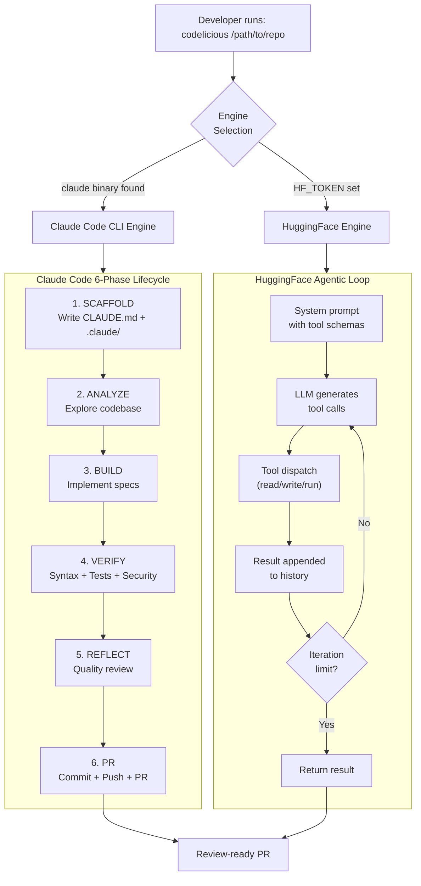
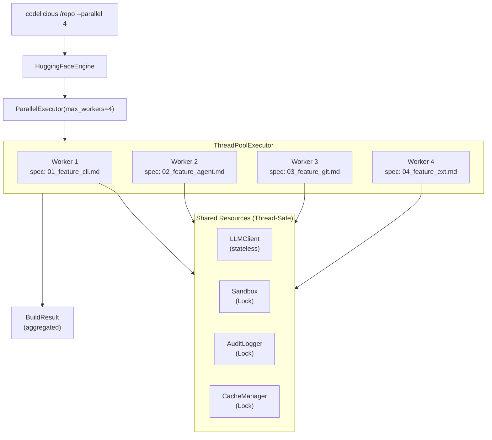
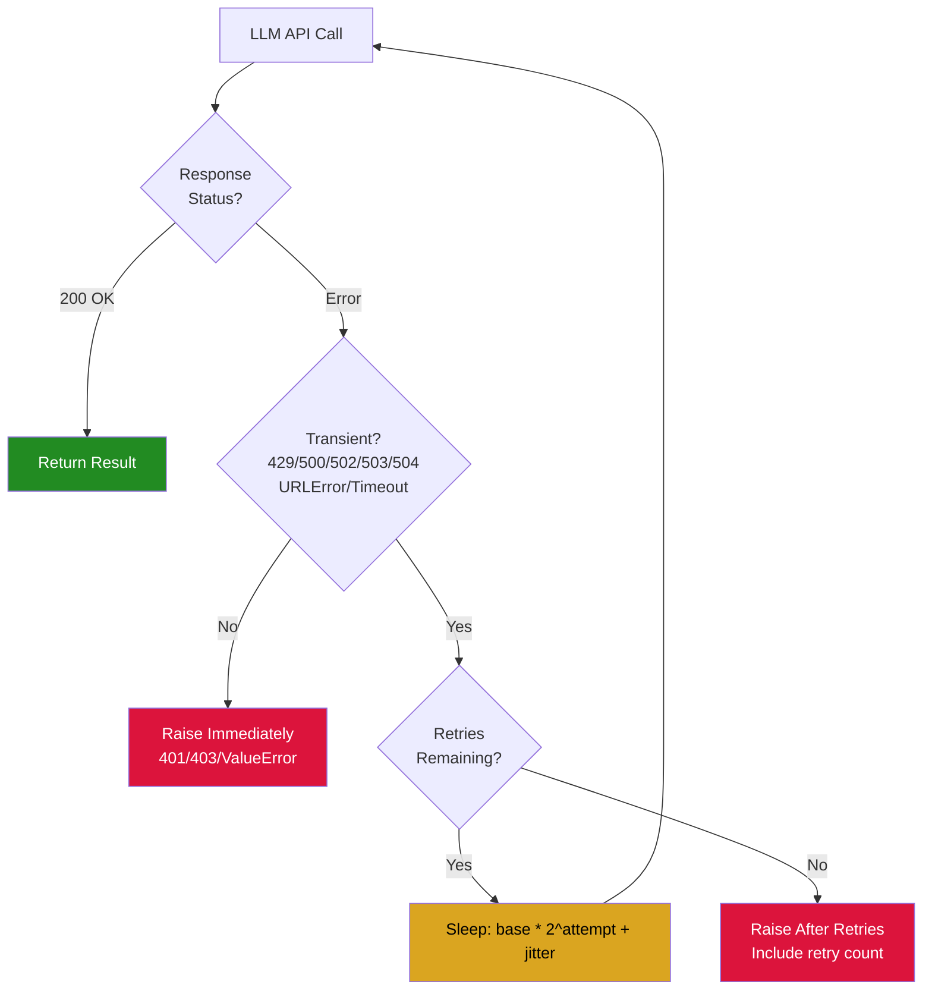
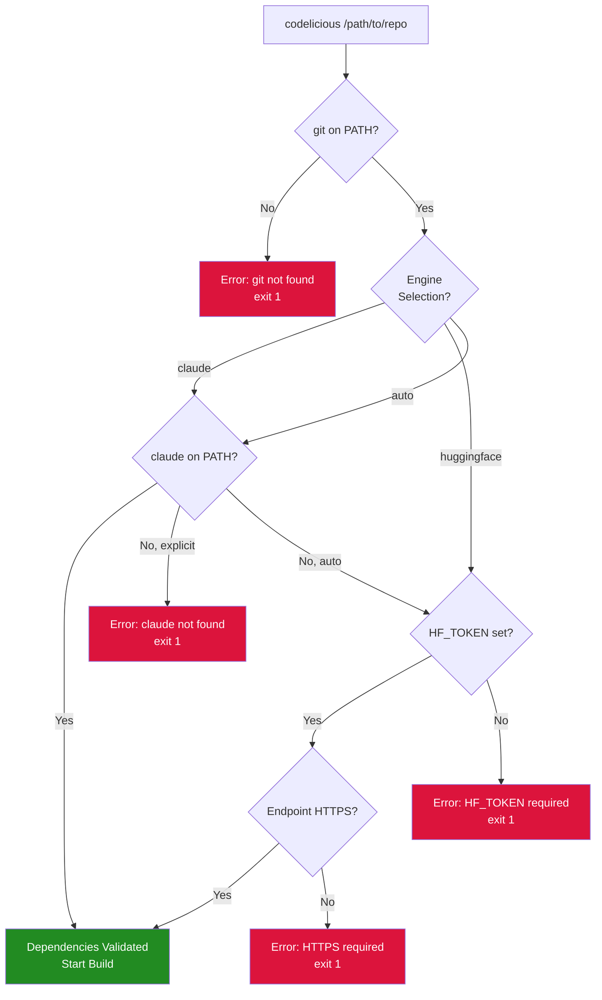
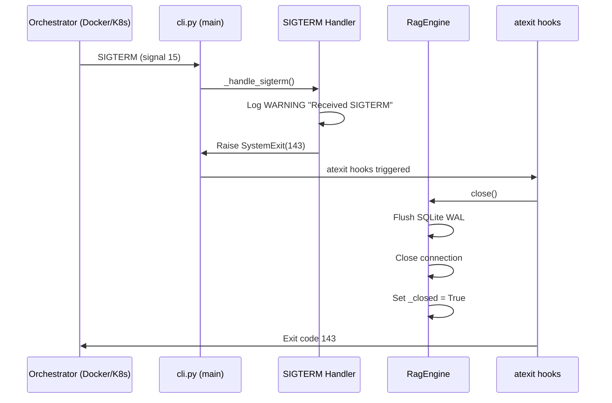
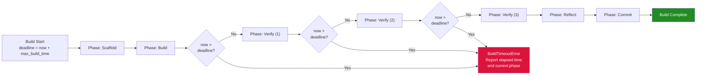

# Codelicious

[](https://github.com/clay-good/codelicious/actions/workflows/ci.yml)
[](https://www.python.org/downloads/)
[](LICENSE)

**Outcome as a Service.** Write specs. Run `codelicious /path/to/repo`. Get a green, review-ready Pull Request.

Codelicious is a headless, autonomous developer CLI that transforms markdown specifications into production-ready Pull Requests with zero human intervention. It orchestrates a dual-engine architecture powered by Claude Code and HuggingFace (DeepSeek for reasoning, Qwen for coding).

```
Spec -> Code -> Test -> Commit -> PR
```

---

## Quick Start

```bash
# 1. Clone and install
git clone https://github.com/clay-good/codelicious.git
cd codelicious
pip install -e ".[dev]"

# 2. Run against your repo
codelicious /path/to/your/repo
```

### Engine Options

```bash
# Claude Code CLI (requires `claude` binary installed + API credits)
codelicious /path/to/your/repo

# HuggingFace engine (free, no API costs)
export HF_TOKEN=hf_your_token_here  # https://huggingface.co/settings/tokens
codelicious /path/to/your/repo --engine huggingface
```

### Development Setup

```bash
pip install -e ".[dev]"    # Install with dev dependencies (pytest, ruff, bandit, pip-audit, pre-commit)
pre-commit install          # Set up pre-commit hooks (ruff lint, ruff format, bandit)
pytest                      # Run tests (~1,900 tests)
ruff check src/ tests/      # Lint
bandit -r src/              # Security scan
pip-audit                   # Dependency vulnerability check
```

---

## How Git, Commits, and PRs Work

Codelicious works **inside a git repo you provide**. Here's the full workflow:

### Prerequisites

Your target repo must:
1. **Be a git repository** (has a `.git/` folder)
2. **Have a remote named `origin`** pointing to GitHub or GitLab
3. **Have `gh` CLI installed and authenticated** (for GitHub PRs) or `glab` for GitLab MRs

### Step-by-Step Workflow

```bash
# 1. Navigate to your project repo
cd /path/to/your/repo

# 2. Make sure you're on main and up to date
git checkout main
git pull origin main

# 3. Run codelicious to get the full pipeline
codelicious /path/to/your/repo
```

**What happens automatically:**

1. Codelicious creates a deterministic feature branch per spec: `codelicious/spec-{N}`
2. It reads your specs from `docs/specs/*.md`
3. It implements the code, runs tests, verifies
4. It commits changes with a `[spec-{N}]` prefix in the commit message
5. It pushes and creates exactly **one Draft PR** per spec
6. When all verification passes, the PR is marked **Ready for Review**

### Spec-as-PR Lifecycle

Each spec maps to exactly one branch and one PR:

- **Branch naming:** `codelicious/spec-{N}` (derived from spec filename)
- **PR naming:** `[spec-{N}] <summary>`
- **Re-runs:** Append commits to the same branch and PR
- **Idempotent:** Safe to run multiple times

| Step | Command | When |
|------|---------|------|
| Install | `pip install -e .` | Once |
| Build + PR | `codelicious /path/to/repo` | Each build cycle |
| Dry run | `codelicious /path/to/repo --dry-run` | Preview what would be built |

---

## Dual Engine Architecture

Codelicious auto-detects the best available engine at startup:

| Engine | Backend | How It Works |
|--------|---------|--------------|
| **Claude Code CLI** | `claude` binary | Spawns Claude Code as subprocess. 6-phase lifecycle: scaffold, build, verify, reflect, commit, PR. |
| **HuggingFace** | DeepSeek-V3 + Qwen3-235B | Free HTTP API via SambaNova. DeepSeek plans, Qwen codes. 50-iteration agentic loop. No API costs. |

Auto-detection priority: Claude Code CLI > HuggingFace > error with setup instructions.

> **Note:** If you hit Claude token limits, re-run with `--engine huggingface` to use the free HuggingFace backend. The HuggingFace engine is a fully independent code path, not a degraded mode.

---

## CLI Reference

```
codelicious <repo_path> [options]

Options:
  --engine ENGINE          Force engine: claude, huggingface, auto (default: auto)
  --model MODEL            Model name (e.g. claude-sonnet-4-20250514)
  --agent-timeout SECS     Max seconds per agent run (default: 1800)
  --spec PATH              Build a single spec file (skip discovery)
  --dry-run                Discover specs and print plan, no execution
  --max-commits-per-pr N   PR commit cap (default: 50, max: 100)
  --platform PLATFORM      github, gitlab, or auto (default: auto)
  --parallel N             Concurrent agentic loops, HF engine only (default: 1)
  --skip-auth-check        Skip gh/glab auth validation (for CI with GITHUB_TOKEN)
  --resume SESSION_ID      Resume a previous Claude session (Claude engine only)

Environment variables:
  CODELICIOUS_ENGINE       Same as --engine (CLI flag takes precedence)
  GITHUB_TOKEN             Auto-skips auth check when set (for CI)
  HF_TOKEN                 HuggingFace API token (required for HF engine)
  ANTHROPIC_API_KEY        Anthropic API key (used by Claude engine)
```

---

## Claude Code Engine Phases

When using the Claude Code engine, codelicious runs a 6-phase lifecycle:

1. **SCAFFOLD** -- writes `CLAUDE.md` and `.claude/` directory into the target project
2. **BUILD** -- spawns Claude Code CLI with an autonomous build prompt
3. **VERIFY** -- runs deterministic verification: syntax check, test suite, security scan
4. **REFLECT** -- optional read-only quality review
5. **GIT** -- commits all changes to the feature branch
6. **PR** -- pushes and creates/updates a draft PR

---

## Writing Specs

Place markdown specs in `docs/specs/` in your target repo. Codelicious finds and builds them in order.

```markdown
# Feature: User Authentication

## Requirements
- [ ] Add login endpoint at POST /api/auth/login
- [ ] Add JWT token generation
- [ ] Add middleware for protected routes
- [ ] Write tests for all auth flows

## Acceptance Criteria
- All tests pass
- No hardcoded secrets
- Rate limiting on login endpoint
```

Use `- [ ]` checkboxes. Codelicious marks them `- [x]` as it completes each task.

---

## Security Model

Codelicious enforces defense-in-depth security, all hardcoded in Python (not configurable by the LLM):

- **Command denylist** -- 96 dangerous commands blocked (`rm`, `sudo`, `dd`, `kill`, `curl`, `git`, `docker`, etc.)
- **Shell injection prevention** -- `shell=False` + metacharacter blocking (`|`, `&`, `;`, `$`, etc.)
- **File write protection** -- LLM cannot modify its own tool source code or security config
- **File extension allowlist** -- 31 safe file types can be written
- **Path traversal defense** -- null byte detection, `..` rejection, symlink resolution
- **Security scanning** -- pre-commit scan for `eval()`, `exec()`, `shell=True`, hardcoded secrets
- **Credential redaction** -- 30+ regex patterns redact secrets from logs (AWS, OpenAI, GitHub, SSH keys, JWT, etc.)
- **SSRF protection** -- LLM endpoint URLs validated for HTTPS and non-private IPs
- **Prompt injection detection** -- 6 injection patterns blocked in spec text

---

## Project Structure

```
src/codelicious/
  cli.py                    # Entry point with engine selection
  orchestrator.py           # 4-phase orchestration (BUILD -> MERGE -> REVIEW -> FIX)
  engines/
    base.py                 # BuildEngine ABC + BuildResult
    claude_engine.py        # Claude Code CLI 6-phase engine
    huggingface_engine.py   # HuggingFace tool-dispatch engine
  agent_runner.py           # Claude subprocess management
  scaffolder.py             # CLAUDE.md + .claude/ generation
  prompts.py                # All agent prompt templates
  verifier.py               # Deterministic verification pipeline
  tools/
    registry.py             # Tool name -> function dispatch
    fs_tools.py             # Sandboxed file operations
    command_runner.py        # Denylist command execution
    audit_logger.py         # Security event logging
  git/
    git_orchestrator.py     # Branch safety + PR management
  context/
    cache_engine.py         # State persistence
    rag_engine.py           # SQLite vector search (zero-dep RAG)
  sandbox.py                # Filesystem isolation (TOCTOU-safe)
  security_constants.py     # Frozen denylist (cannot be overridden)
  errors.py                 # 40+ typed exceptions
  config.py                 # Environment + file config loading
  logger.py                 # Credential sanitization
  llm_client.py             # HTTP LLM client
  loop_controller.py        # Iteration and deadline management
  planner.py                # Task planning with injection detection
  chunker.py                # Spec decomposition into WorkChunks
  spec_discovery.py         # Spec file discovery engine
  context_manager.py        # Prompt budget and token management
  _env.py                   # Environment variable parsing
  _io.py                    # Atomic file I/O utilities
```

### Runtime Files

Codelicious creates a `.codelicious/` directory in the target repo (gitignored):

| File | Purpose |
|------|---------|
| `config.json` | Build configuration |
| `db.sqlite3` | Vector embeddings for RAG |
| `audit.log` | Full agent interaction log |
| `security.log` | Security events only |
| `build.log` | Structured JSON Lines build log |

---

## Architecture

### Build Lifecycle



### Security Architecture


### Parallel Execution

When using `--parallel N` with the HuggingFace engine, codelicious distributes specs across N concurrent agentic loops:



| Resource | Protection | Granularity |
|----------|-----------|-------------|
| LLMClient | Stateless after init | No lock needed |
| Sandbox | `_write_lock` | Per-operation |
| AuditLogger | `_write_lock` | Per-write |
| CacheManager | Three locks | Per-operation |
| ToolRegistry | Per-loop instance | N/A |

---

## Zero Dependencies

The core engine uses only Python standard library (`urllib`, `json`, `sqlite3`, `subprocess`). No pip packages required at runtime.

Dev dependencies: `pytest`, `ruff`, `bandit`, `pip-audit`, `pre-commit`.

---

## Contributing

```bash
# Setup
git clone https://github.com/clay-good/codelicious.git
cd codelicious
pip install -e ".[dev]"
pre-commit install

# Run tests
pytest

# Lint and format
ruff check src/ tests/
ruff format src/ tests/

# Security scan
bandit -r src/
```

---

## Operational Resilience

### Retry Logic



### Startup Validation



### Graceful Shutdown



### Cumulative Timeout Enforcement



---

## License

MIT
