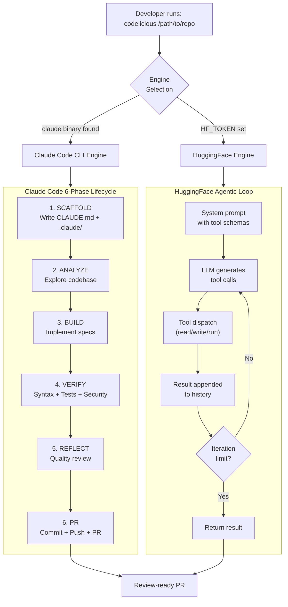
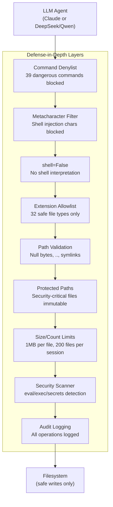

# Codelicious

**Outcome as a Service.** Write specs. Run `codelicious /path/to/repo`. Get a green, review-ready Pull Request.

Codelicious is a headless, autonomous developer CLI that transforms markdown specifications into production-ready Pull Requests with zero human intervention. It orchestrates a dual-engine architecture powered by Claude Code and HuggingFace (DeepSeek for reasoning, Qwen for coding).

```
Spec -> Code -> Test -> Commit -> PR
```

---

## Quick Start

```bash
# 1. Clone and install
git clone https://github.com/clay-good/codelicious.git
cd codelicious
pip install -e .

# 2. Run against your repo
codelicious /path/to/your/repo
```

### Engine Options

```bash
# Claude Code CLI (requires `claude` binary installed + API credits)
codelicious /path/to/your/repo

# HuggingFace engine (free, no API costs)
export HF_TOKEN=hf_your_token_here  # https://huggingface.co/settings/tokens
codelicious /path/to/your/repo --engine huggingface
```

### Development Setup

```bash
pip install -e ".[dev]"    # Install with dev dependencies (pytest, ruff)
pytest                      # Run tests
ruff check src/ tests/      # Lint
```

---

## How Git, Commits, and PRs Work

This is the part you need to understand. Codelicious works **inside a git repo you provide**. Here's the full workflow:

### Prerequisites

Your target repo must:
1. **Be a git repository** (has a `.git/` folder)
2. **Have a remote named `origin`** pointing to GitHub or GitLab
3. **Have `gh` CLI installed and authenticated** (for GitHub PRs) or `glab` for GitLab MRs

### Step-by-Step Workflow

```bash
# 1. Navigate to your project repo
cd /path/to/your/repo

# 2. Make sure you're on main and up to date
git checkout main
git pull origin main

# 3. Run codelicious with --push-pr to get the full pipeline
codelicious /path/to/your/repo --push-pr
```

**What happens automatically:**

1. Codelicious detects you're on `main` and creates a feature branch: `codelicious/auto-build`
2. It reads your specs from `docs/specs/*.md`
3. It implements the code, runs tests, verifies
4. It commits changes to the feature branch
5. With `--push-pr`, it pushes the branch and creates a **Draft PR** via `gh pr create --draft`
6. When all verification passes, it marks the PR as **Ready for Review**

### Manual Git Push (if you skip --push-pr)

If you run without `--push-pr`, codelicious still commits locally but does NOT push. You handle it:

```bash
# After codelicious finishes:
cd /path/to/your/repo
git log --oneline -5           # See what codelicious committed
git push -u origin HEAD        # Push the feature branch

# Create the PR yourself:
gh pr create --title "feat: autonomous implementation" --body "Built by Codelicious"
# Or for GitLab:
glab mr create --title "feat: autonomous implementation" --description "Built by Codelicious"
```

### Recommended Workflow for Iterative Builds

```bash
# First run — builds and creates draft PR
codelicious /path/to/your/repo --push-pr

# Subsequent runs — appends commits to the same branch/PR
codelicious /path/to/your/repo --push-pr

# When you're happy, the PR is already open — just review and merge
```

### Summary of Commands

| Step | Command | When |
|------|---------|------|
| Install | `pip install -e .` | Once |
| Build + auto PR | `codelicious /path/to/repo --push-pr` | Each build cycle |
| Build only (no push) | `codelicious /path/to/repo` | When you want to review locally first |
| Push manually | `git push -u origin HEAD` | After a no-push build |
| Create PR (GitHub) | `gh pr create --draft` | After manual push |
| Create MR (GitLab) | `glab mr create` | After manual push |

---

## Dual Engine Architecture

Codelicious auto-detects the best available engine at startup:

| Engine | Backend | How It Works |
|--------|---------|--------------|
| **Claude Code CLI** | `claude` binary | Spawns Claude Code as subprocess. 6-phase lifecycle: scaffold, build, verify, reflect, commit, PR. |
| **HuggingFace** | DeepSeek-V3 + Qwen3-235B | Free HTTP API via SambaNova. DeepSeek plans, Qwen codes. 50-iteration agentic loop. No API costs. |

Auto-detection priority: Claude Code CLI > HuggingFace > error with setup instructions.

> **Note:** Engine selection happens at startup, not mid-build. If you hit Claude token limits, re-run with `--engine huggingface` to use the free HuggingFace backend. The HuggingFace engine is a fully independent code path — not a degraded mode.

---

## CLI Reference

```
codelicious <repo_path> [options]

Options:
  --engine {auto,claude,huggingface}  Build engine (default: auto)
  --model MODEL                       Model override (e.g. claude-sonnet-4-6)
  --agent-timeout SECONDS             Claude engine timeout (default: 1800)
  --resume SESSION_ID                 Resume a previous Claude session
  --verify-passes N                   Verification passes (default: 3)
  --no-reflect                        Skip quality review phase
  --push-pr                           Push and create/update PR
  --max-iterations N                  HF engine max iterations (default: 50)
  --dry-run                           Log phases without executing
  --spec PATH                         Target a specific spec file
```

## Claude Code Engine Phases

When using the Claude Code engine, codelicious runs a 6-phase lifecycle:

1. **SCAFFOLD** — writes `CLAUDE.md` and `.claude/` directory (agents, skills, rules, settings) into the target project
2. **BUILD** — spawns Claude Code CLI with an autonomous build prompt. Claude reads specs, implements code, runs tests, commits.
3. **VERIFY** — runs deterministic verification: Python syntax check, test suite, security pattern scan
4. **REFLECT** — optional read-only quality review by Claude (can skip with `--no-reflect`)
5. **GIT** — commits all changes to the feature branch
6. **PR** — pushes and creates/updates a draft PR (requires `--push-pr`)

---

## Writing Specs

Place markdown specs in `docs/specs/` in your target repo. Codelicious will find and build them in order.

```markdown
# Feature: User Authentication

## Requirements
- [ ] Add login endpoint at POST /api/auth/login
- [ ] Add JWT token generation
- [ ] Add middleware for protected routes
- [ ] Write tests for all auth flows

## Acceptance Criteria
- All tests pass
- No hardcoded secrets
- Rate limiting on login endpoint
```

---

## Security Model

Codelicious enforces defense-in-depth security, all hardcoded in Python (not configurable by the LLM):

- **Command denylist** — 39 dangerous commands blocked (`rm`, `sudo`, `dd`, `kill`, `curl`, etc.)
- **Shell injection prevention** — `shell=False` + metacharacter blocking (`|`, `&`, `;`, `$`, etc.)
- **File write protection** — LLM cannot modify its own tool source code or security config
- **File extension allowlist** — only safe file types can be written
- **Path traversal defense** — null byte detection, `..` rejection, symlink resolution
- **Security scanning** — pre-commit scan for `eval()`, `exec()`, `shell=True`, hardcoded secrets

---

## Project Structure

```
src/codelicious/
  cli.py                    # Entry point with engine selection
  engines/
    __init__.py             # select_engine() auto-detection
    base.py                 # BuildEngine ABC + BuildResult
    claude_engine.py        # Claude Code CLI 6-phase engine
    huggingface_engine.py   # HuggingFace tool-dispatch engine
  agent_runner.py           # Claude subprocess management
  scaffolder.py             # CLAUDE.md + .claude/ generation
  prompts.py                # All agent prompt templates
  verifier.py               # Deterministic verification pipeline
  tools/
    registry.py             # Tool name -> function dispatch
    fs_tools.py             # Sandboxed file operations
    command_runner.py        # Denylist command execution
    audit_logger.py         # Security event logging
  git/
    git_orchestrator.py     # Branch safety + PR management
  context/
    cache_engine.py         # State persistence
    rag_engine.py           # SQLite vector search
  errors.py                 # Typed exceptions
  config.py                 # Environment + file config loading
```

## Runtime Files

Codelicious creates a `.codelicious/` directory in the target repo (gitignored):

| File | Purpose |
|------|---------|
| `state.json` | Task progress and memory |
| `cache.json` | File hash index |
| `db.sqlite3` | Vector embeddings for RAG |
| `audit.log` | Full agent interaction log |
| `security.log` | Security events only |
| `STATE.md` | Human-readable build status |
| `BUILD_COMPLETE` | Sentinel file (contains "DONE" when finished) |

---

## Architecture

### Build Lifecycle



### Security Architecture



---

## Zero Dependencies

The core engine uses only Python standard library (`urllib`, `json`, `sqlite3`, `subprocess`). No pip packages required at runtime.

## License

MIT
