# Codelicious

**Outcome as a Service.** Write specs. Run `codelicious /path/to/repo`. Get a green, review-ready Pull Request.

Codelicious is a headless, autonomous developer CLI. It reads your markdown specifications, builds the code, runs tests, and delivers a working PR — no human in the loop.

## How It Works

```
You write specs (docs/specs/*.md)
        |
codelicious /path/to/repo
        |
   +-----------+
   |  Engine   |  Claude Code CLI (primary)
   |  Select   |  HuggingFace API (fallback)
   +-----------+
        |
  Scaffold CLAUDE.md + .claude/
        |
  BUILD: implement specs autonomously
        |
  VERIFY: syntax + tests + security scan
        |
  REFLECT: quality review (optional)
        |
  GIT: commit + push + create PR
        |
  Done. Review-ready PR on GitHub.
```

## Quick Start

```bash
# Clone and install (includes dev tools: pytest, ruff, bandit, pip-audit)
git clone https://github.com/clay-good/codelicious.git
cd codelicious
pip install -e ".[dev]"
# Or minimal install without dev tools: pip install -e .

# Option 1: Claude Code CLI (requires claude CLI + API credits)
codelicious /path/to/your/repo

# Option 2: HuggingFace engine (free, no API costs)
export HF_TOKEN=hf_your_token_here  # Get one at https://huggingface.co/settings/tokens
codelicious /path/to/your/repo --engine huggingface
```

### Development Setup

```bash
pip install -e ".[dev]"    # Install with dev dependencies (pytest, ruff, bandit, pip-audit)
pytest                      # Run tests
ruff check src/ tests/      # Lint
bandit -r src/              # Security scan
pip-audit                   # Dependency vulnerability check
```

## Dual Engine Architecture

Codelicious auto-detects the best available engine at startup:

| Engine | Backend | How It Works |
|--------|---------|--------------|
| **Claude Code CLI** | `claude` binary | Spawns Claude Code as subprocess. Claude handles its own tools (Read, Write, Bash, etc). 6-phase lifecycle with scaffolding, verification, and reflection. |
| **HuggingFace** | DeepSeek-V3 + Qwen3-235B | Free HTTP API via SambaNova. DeepSeek plans, Qwen codes. 50-iteration agentic loop. No API costs. |

Auto-detection priority: Claude Code CLI > HuggingFace > error with setup instructions.

> **Note:** Engine selection happens at startup, not mid-build. If you hit Claude token limits, re-run with `--engine huggingface` to use the free HuggingFace backend. The HuggingFace engine is a fully independent code path — not a degraded mode.

## CLI Reference

```
codelicious <repo_path> [options]

Options:
  --engine {auto,claude,huggingface}  Build engine (default: auto)
  --model MODEL                       Model override (e.g. claude-sonnet-4-6)
  --agent-timeout SECONDS             Claude engine timeout (default: 1800)
  --resume SESSION_ID                  Resume a previous Claude session
  --verify-passes N                    Verification passes (default: 3)
  --no-reflect                         Skip quality review phase
  --push-pr                            Push and create/update PR
  --max-iterations N                   HF engine max iterations (default: 50)
  --dry-run                            Log phases without executing
  --spec PATH                          Target a specific spec file
```

## Claude Code Engine Phases

When using the Claude Code engine, codelicious runs a 6-phase lifecycle:

1. **SCAFFOLD** — writes `CLAUDE.md` and `.claude/` directory (agents, skills, rules, settings) into the target project
2. **BUILD** — spawns Claude Code CLI with an autonomous build prompt. Claude reads specs, implements code, runs tests, commits.
3. **VERIFY** — runs deterministic verification: Python syntax check, test suite, security pattern scan
4. **REFLECT** — optional read-only quality review by Claude (can skip with `--no-reflect`)
5. **GIT** — commits all changes to the feature branch
6. **PR** — pushes and creates/updates a draft PR (requires `--push-pr`)

## Security Model

Codelicious enforces defense-in-depth security, all hardcoded in Python (not configurable by the LLM):

- **Command denylist** — 39 dangerous commands blocked (`rm`, `sudo`, `dd`, `kill`, `curl`, etc.)
- **Shell injection prevention** — `shell=False` + metacharacter blocking (`|`, `&`, `;`, `$`, etc.)
- **File write protection** — LLM cannot modify its own tool source code or security config
- **File extension allowlist** — only safe file types can be written
- **Path traversal defense** — null byte detection, `..` rejection, symlink resolution
- **Security scanning** — pre-commit scan for `eval()`, `exec()`, `shell=True`, hardcoded secrets

## Project Structure

```
src/codelicious/
  cli.py                    # Entry point with engine selection
  engines/
    __init__.py             # select_engine() auto-detection
    base.py                 # BuildEngine ABC + BuildResult
    claude_engine.py        # Claude Code CLI 6-phase engine
    huggingface_engine.py   # HuggingFace tool-dispatch engine
  agent_runner.py           # Claude subprocess management
  scaffolder.py             # CLAUDE.md + .claude/ generation
  prompts.py                # All agent prompt templates
  verifier.py               # Deterministic verification pipeline
  tools/
    registry.py             # Tool name -> function dispatch
    fs_tools.py             # Sandboxed file operations
    command_runner.py        # Denylist command execution
    audit_logger.py         # Security event logging
  git/
    git_orchestrator.py     # Branch safety + PR management
  context/
    cache_engine.py         # State persistence
    rag_engine.py           # SQLite vector search
  errors.py                 # 48 typed exceptions
  config.py                 # Environment + file config loading
```

## Runtime Files

Codelicious creates a `.codelicious/` directory in the target repo:

| File | Purpose |
|------|---------|
| `state.json` | Task progress and memory |
| `cache.json` | File hash index |
| `db.sqlite3` | Vector embeddings for RAG |
| `audit.log` | Full agent interaction log |
| `security.log` | Security events only |
| `STATE.md` | Human-readable build status |
| `BUILD_COMPLETE` | Sentinel file (contains "DONE" when finished) |

## Writing Specs

Place markdown specs in `docs/specs/` in your target repo. Codelicious will find and build them in order.

```markdown
# Feature: User Authentication

## Requirements
- [ ] Add login endpoint at POST /api/auth/login
- [ ] Add JWT token generation
- [ ] Add middleware for protected routes
- [ ] Write tests for all auth flows

## Acceptance Criteria
- All tests pass
- No hardcoded secrets
- Rate limiting on login endpoint
```

## Zero Dependencies

The core engine uses only Python standard library (`urllib`, `json`, `sqlite3`, `subprocess`). No pip packages required for runtime.

## Architecture Diagrams

### Build Lifecycle

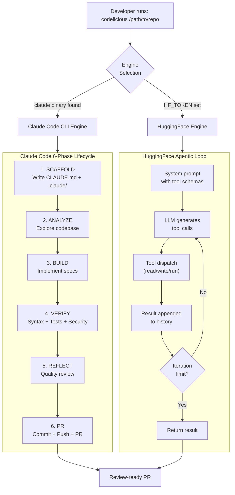

### Security Architecture (Defense in Depth)

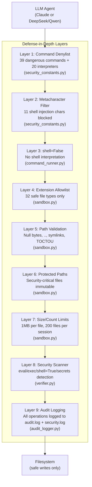

### Data Flow and State Management

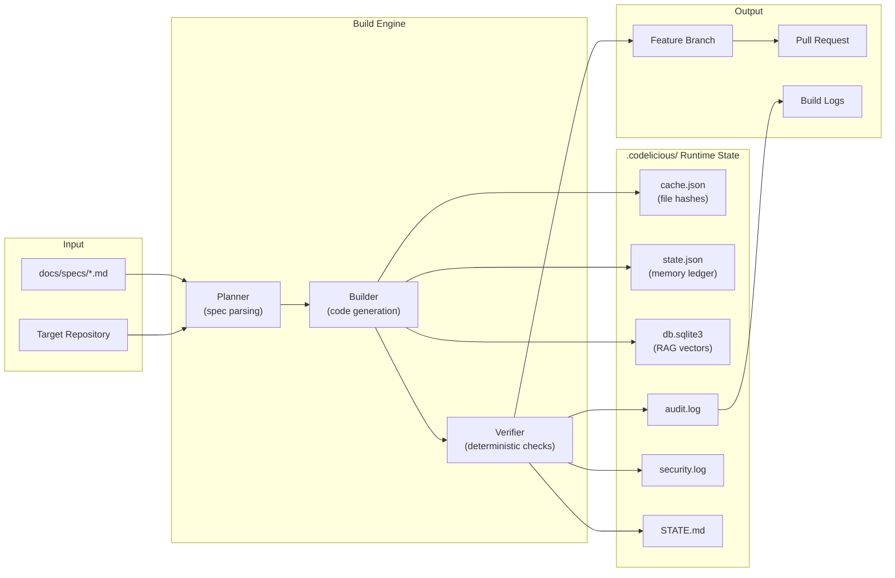

### Module Dependency Graph

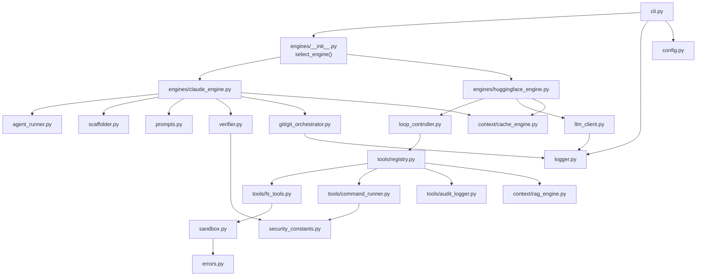

### Threat Model: Where Security Controls Apply

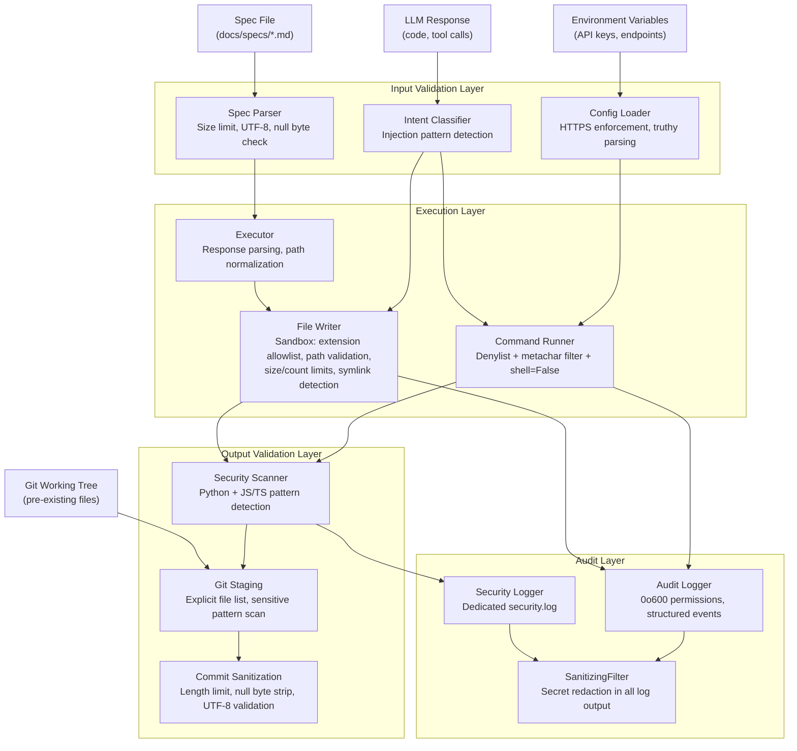

### Data Flow: API Key Lifecycle

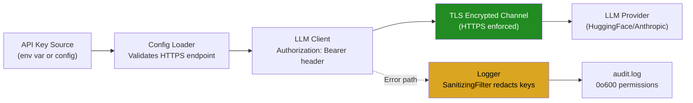

### Test Infrastructure

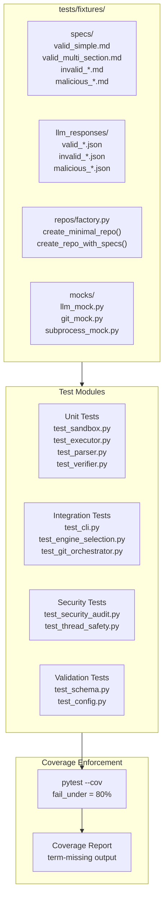

### Error Recovery and Retry Flow

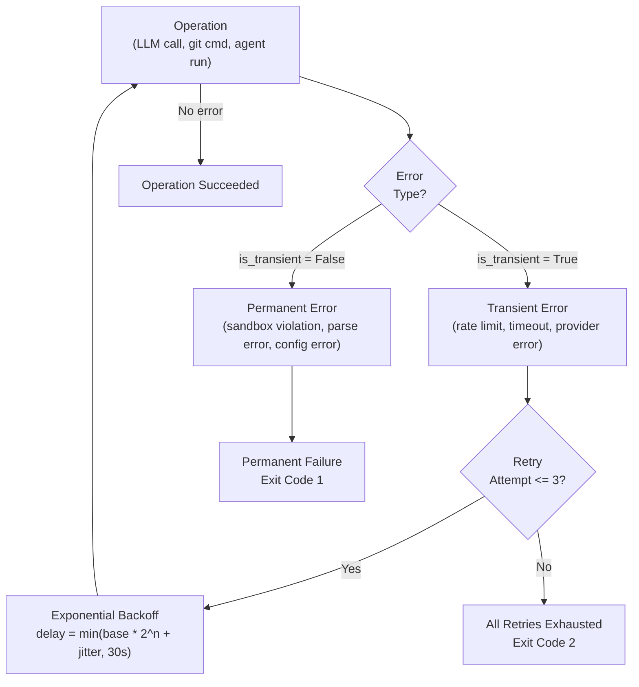

### Spec-11 Hardening Phase Dependencies

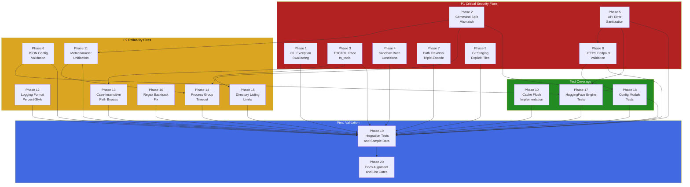

### Codebase Logic Composition

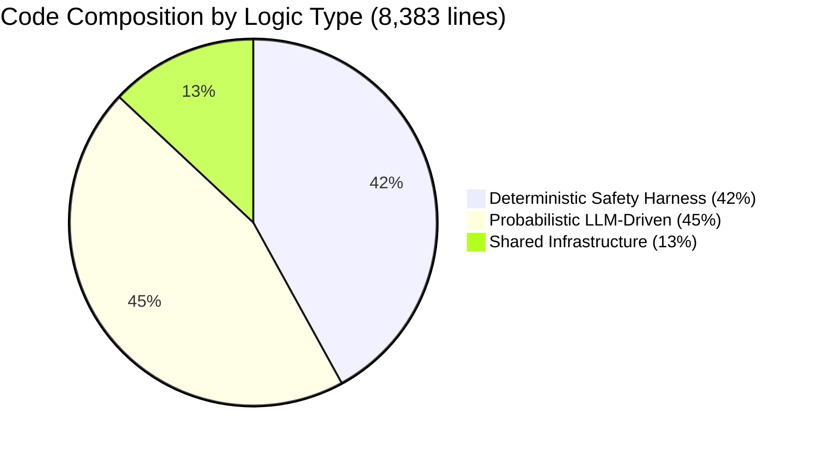

### Spec-12 MVP Closure Phase Dependencies

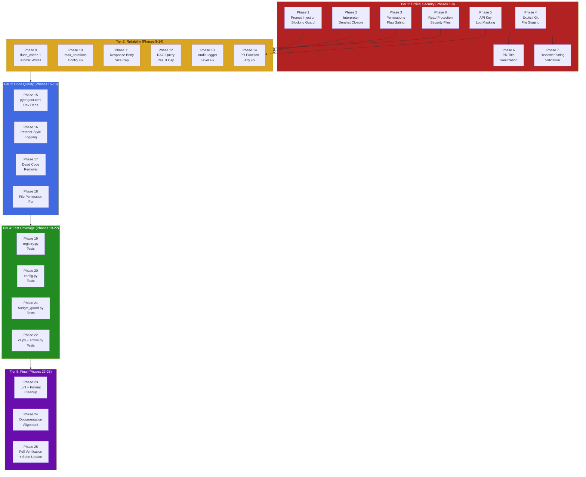

### Test Coverage Gap Analysis

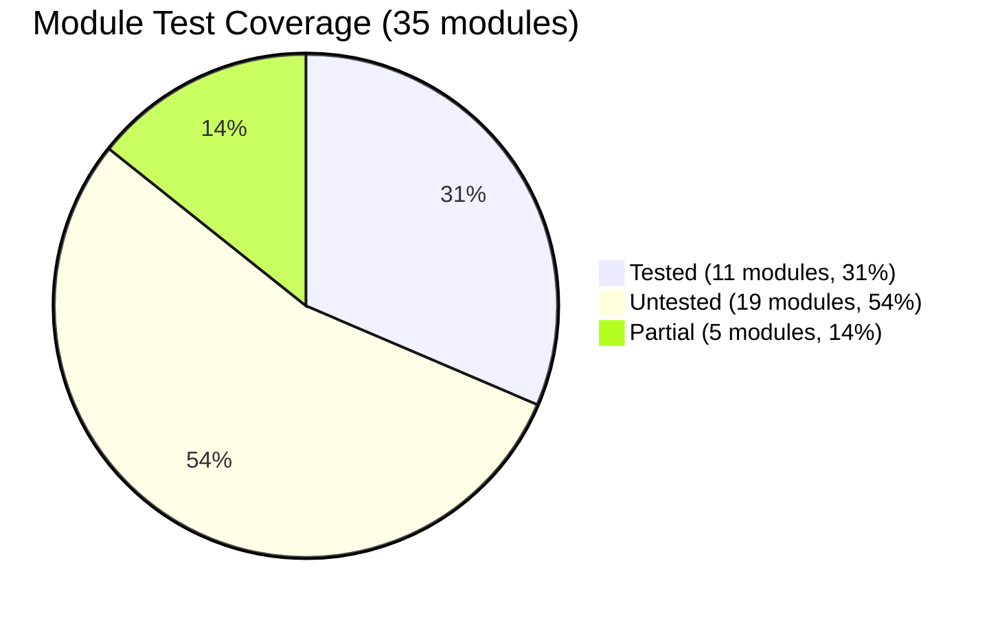

### Spec-13 Bulletproof MVP Phase Dependencies

```mermaid
flowchart TB
    subgraph Tier1["Tier 1: Critical Security Fixes (Phases 1-8)"]
        P1["Phase 1\nPrompt Injection\nBlocking Guard"]
        P2["Phase 2\nInterpreter\nDenylist Closure"]
        P3["Phase 3\nTOCTOU Race\nfs_tools Fix"]
        P4["Phase 4\nCommand Split\nShlex Unification"]
        P5["Phase 5\nAPI Error Body\nSanitization"]
        P6["Phase 6\nVerifier Multiline\nString Bypass"]
        P7["Phase 7\nCLI Exception\nSwallowing Fix"]
        P8["Phase 8\nJSON Deser\nValidation"]
    end

    subgraph Tier2["Tier 2: Reliability Fixes (Phases 9-15)"]
        P9["Phase 9\nMetacharacter\nUnification"]
        P10["Phase 10\nDeprecated rmtree\nAPI Fix"]
        P11["Phase 11\nRead-Path Denied\nFilter"]
        P12["Phase 12\nExplicit Git\nFile Staging"]
        P13["Phase 13\nProcess Group\nTimeout"]
        P14["Phase 14\nSecret Redaction\nCompletion"]
        P15["Phase 15\nHistory Bounding\nHF Engine"]
    end

    subgraph Tier3["Tier 3: Code Quality (Phases 16-19)"]
        P16["Phase 16\nDead Code\nRemoval"]
        P17["Phase 17\nPercent-Style\nLogging"]
        P18["Phase 18\nAudit Logger\nLevel Fix"]
        P19["Phase 19\nAtomic Plan\nFile Writes"]
    end

    subgraph Tier4["Tier 4: Test Coverage (Phases 20-23)"]
        P20["Phase 20\nconfig.py\nTests"]
        P21["Phase 21\nregistry.py\nTests"]
        P22["Phase 22\nerrors.py Tests\n+ Dedup"]
        P23["Phase 23\nRAG + Progress\nTests"]
    end

    subgraph Tier5["Tier 5: Final (Phases 24-25)"]
        P24["Phase 24\npyproject.toml\n+ .gitignore"]
        P25["Phase 25\nFull Verify\n+ Docs Align"]
    end

    Tier1 --> Tier2
    Tier2 --> Tier3
    P9 --> P13
    P16 --> P17
    Tier3 --> Tier4
    Tier4 --> Tier5
    P24 --> P25

    style Tier1 fill:#B22222,color:#fff
    style Tier2 fill:#DAA520,color:#000
    style Tier3 fill:#4169E1,color:#fff
    style Tier4 fill:#228B22,color:#fff
    style Tier5 fill:#6A0DAD,color:#fff
```

### Spec-13 Target State

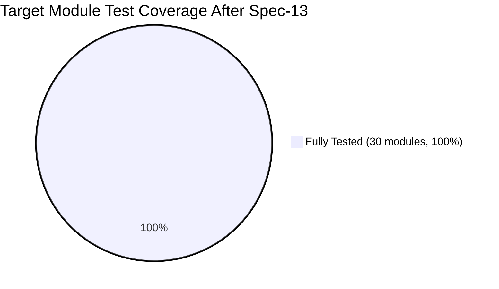

### Spec-14 Hardening v2 Phase Dependencies

```mermaid
flowchart TB
    subgraph Tier1["Tier 1: Critical Security & Permission Fixes (Phases 1-5)"]
        P1["Phase 1\nGate\n--skip-permissions"]
        P2["Phase 2\nClose env/xargs\nDenylist Gap"]
        P3["Phase 3\nFix Protected\nPath Bypass"]
        P4["Phase 4\nUTF-8 Encoding\nfs_tools Fix"]
        P5["Phase 5\nAudit Logger\nThread Safety"]
    end

    subgraph Tier2["Tier 2: Reliability & Correctness (Phases 6-10)"]
        P6["Phase 6\nCleanup Case\nSensitivity Bug"]
        P7["Phase 7\nRead Size\nLimit"]
        P8["Phase 8\nGit Message\nSanitization"]
        P9["Phase 9\nRAG Response\nSize Cap"]
        P10["Phase 10\nAPI Key\nRepr Safety"]
    end

    subgraph Tier3["Tier 3: Code Quality & Stale Refs (Phases 11-14)"]
        P11["Phase 11\nSanitizingFilter\nRoot Logger"]
        P12["Phase 12\nMarkdown Pipe\nEscaping"]
        P13["Phase 13\nFix proxilion\nReferences"]
        P14["Phase 14\nf-string Logger\nVerification"]
    end

    subgraph Tier4["Tier 4: Test Coverage (Phases 15-18)"]
        P15["Phase 15\nagent_runner\nTests"]
        P16["Phase 16\nscaffolder +\nprompts Tests"]
        P17["Phase 17\n_io + budget\nguard Tests"]
        P18["Phase 18\nSample Dummy\nData Fixtures"]
    end

    subgraph Tier5["Tier 5: Final (Phases 19-20)"]
        P19["Phase 19\nREADME Mermaid\n+ Metrics"]
        P20["Phase 20\nFull Verify\n+ State Update"]
    end

    Tier1 --> Tier2
    Tier2 --> Tier3
    P11 --> P14
    P12 --> P14
    P13 --> P14
    Tier3 --> Tier4
    Tier4 --> Tier5
    P19 --> P20

    style Tier1 fill:#B22222,color:#fff
    style Tier2 fill:#DAA520,color:#000
    style Tier3 fill:#4169E1,color:#fff
    style Tier4 fill:#228B22,color:#fff
    style Tier5 fill:#6A0DAD,color:#fff
```

### Spec-14 Target State

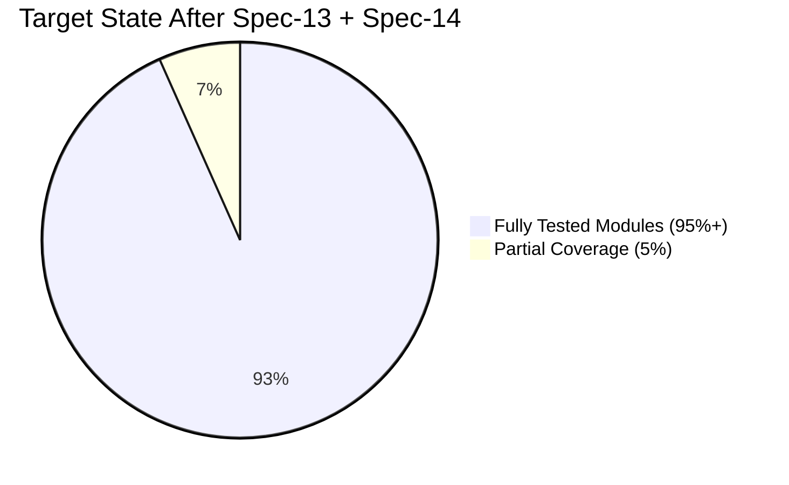

### Combined Hardening Coverage

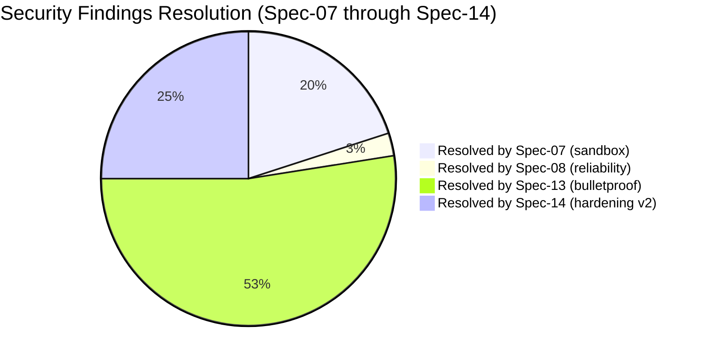
### Spec-15 Parallel Execution Architecture

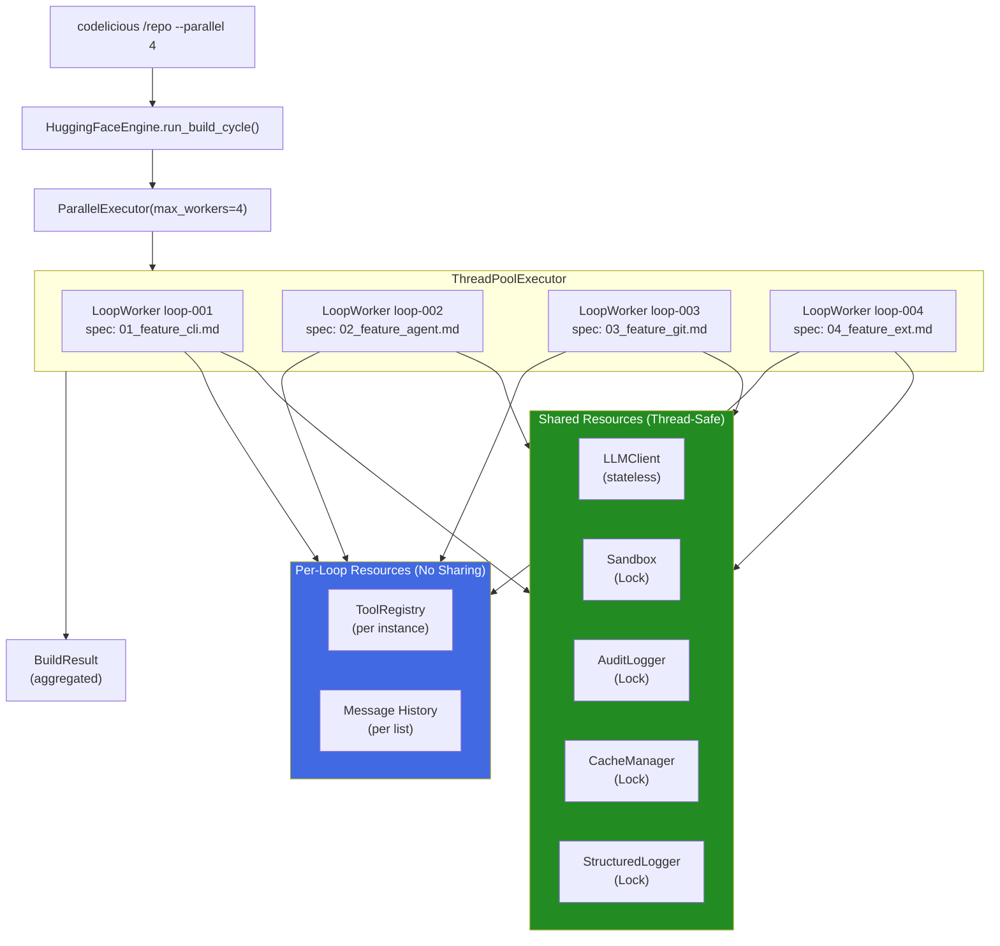

### Structured Logging Flow (Spec-15)

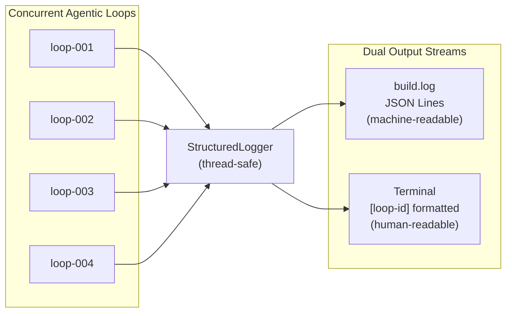

### Thread Safety Model (Spec-15)

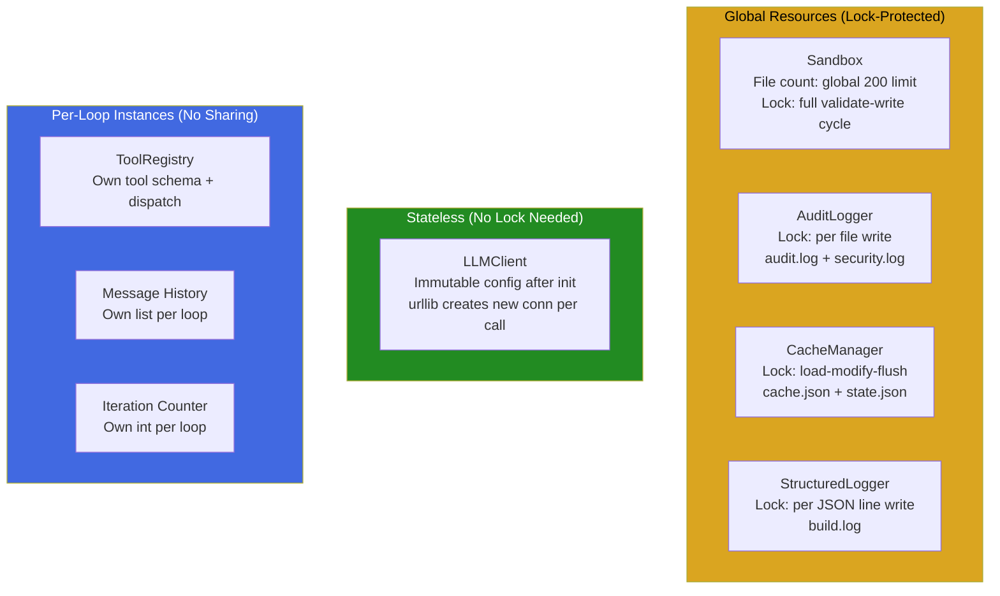

### Spec-15 Throughput Scaling Projection

```mermaid
xychart-beta
    title "Estimated Tokens Per Second by Parallelism Level"
    x-axis ["1 loop", "2 loops", "4 loops", "8 loops"]
    y-axis "Tokens/Second (SambaNova via HF Router)" 0 --> 1800
    bar [125, 250, 500, 1000]
```

## License

MIT
