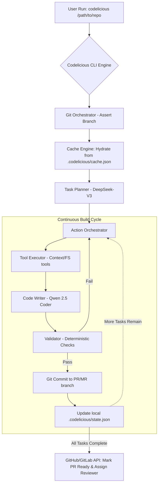

# Codelicious Master Spec

## Intent
As a user, when I run `codelicious /path/to/repo` in my terminal, the system should operate as a completely autonomous, open-source replacement for Claude Code CLI and Google Antigravity. It reads my specifications, plans the actionable tasks using self-hosted DeepSeek-V3, and autonomously generates code using Qwen 2.5 Coder in an Agentic Loop. 

It must never write directly to the `main` or `master` branch. It orchestrates GitHub/GitLab PRs/MRs completely automatically. At the end of the full build cycle, it must transition the Draft PR to an Active review state.

## The Paradigm: 90% Probabilistic / 10% Deterministic
To completely eclipse Claude Code CLI, Codelicious relies on open-weight inference for almost all orchestration (90%). Python is purely a thin 10% deterministic safety harness.

If:
- The user runs the CLI, the Python core merely spins up a DeepSeek-V3 "Spec Finder Sub-Agent". The Sub-Agent explores the repo using the `list_directory` tool, identifies the markdown specs, and autonomously plans the actionable steps dynamically.
- Execution occurs, the Qwen 2.5 Coder determines which files to touch (probabilistic). The Python core merely validates the bounds (deterministic check against path traversal).
- Verification fails, Qwen receives the deterministic `stdout` and figures out *why* and *how* to fix the code probablistically. 
- ALL tasks for a cycle are complete and 100% green, the core engine explicitly marks the Draft PR/MR to "Active" via API.

## Gaps, Logging & Gated Security
- **Branch Protection:** The CLI structurally blocks checkouts or commits to `main`/`master`. All operations execute on a newly created deterministic feature branch.
- **Audit Logging:** Because 90% of the orchestration is controlled dynamically by the models, visibility is paramount. ALL LLM request payloads, responses, tool validations, and Git diffs MUST be verbosely logged to stdout and continuously written to `.codelicious/audit.log`.
- **Continuous Local Caching:** To avoid massive token costs, state (`memory.md`, context embeddings) is saved to `.codelicious/cache.json` and `.codelicious/state.json`. Tools read from this cache first.
- **Cost Reduction:** Relying on open-weight inference (HF/Impala) paired with local caching reduces average build costs from dollars to pennies.

## Repository Architecture and Explicit File Paths
To easily reference limits and logic, Codelicious maintains a rigid, simplified directory structure:

| Component | Absolute Path within Repo | Purpose |
| :--- | :--- | :--- |
| **CLI Entrypoint** | `src/codelicious/cli.py` | Command line parser, cache hydration, loops initialize. |
| **Agentic Loop** | `src/codelicious/loop_controller.py` | The main `while` loop that calls the LLM iteratively. |
| **Git Orchestrator** | `src/codelicious/git/git_orchestrator.py` | PR/MR management and branch isolation enforcer. |
| **Tool Registry** | `src/codelicious/tools/registry.py` | Maps LLM JSON tool payloads to Python functions. |
| **FS Sandbox Tools** | `src/codelicious/tools/fs_tools.py` | High-security `read_file` and `write_file` implementations. |
| **Shell Runner** | `src/codelicious/tools/command_runner.py` | Executes shell commands restricted strictly by config. |
| **Audit Logger** | `src/codelicious/tools/audit_logger.py` | Dumps all payloads to console and `audit.log`. |
| **Cache Engine** | `src/codelicious/context/cache_engine.py` | Serializes LLM state to the local repo's JSON ledgers. |
| **Persistent Ledger** | `[Target Repo]/.codelicious/state.json` | Stores long-term memory of tasks and resolutions. |
| **Runtime Index** | `[Target Repo]/.codelicious/cache.json` | Stores file tree hashes to limit context bloat. |
| **Audit Log** | `[Target Repo]/.codelicious/audit.log` | Verbosely stores every agent interaction. |
| **Configuration** | `[Target Repo]/.codelicious/config.json` | Defines LLM endpoints, secrets, and shell allowlists. |

## System Design

## The "Claude Code" Bridge
**Sequential Implementation Prompt for Claude Code:**
"You are tasked with implementing the Codelicious Master Engine based on `00_master_spec.md`. Your goal is to orchestrate the main entrypoint `src/codelicious/cli.py` and the `loop_controller.py`. 
1. Initialize the run by parsing target repo CLI arguments.
2. Invoke `GitManager` to assert we are off `main` and on a feature branch.
3. Hydrate the session by invoking the `CacheManager` to read `.codelicious/cache.json`.
4. Fire the Plan creation prompt to the DeepSeek provider client.
5. Enter the continuous `while tasks_remaining:` loop. In each iteration, call the Qwen provider client, execute sandboxed file writes, and run the `Verifier`.
6. Upon a successful task loop, trigger a git commit. Update `.codelicious/state.json` with the new completion status.
7. Break the loop when all tasks are complete. Finally, invoke the `GitManager`'s `mark_pr_ready_for_review()` method. 
Ensure code adheres to standard logging practices and exits cleanly. Output no explanatory text; only provide the required file modifications using your write_file tool."
