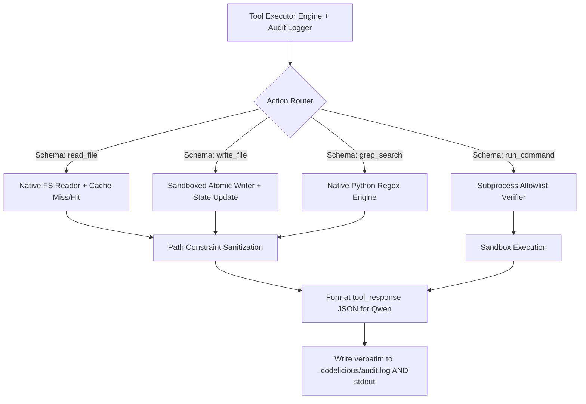

# Feature Spec: Custom CLI Tooling (The Claude Code Replacement)

## Intent
As a user, when I execute `codelicious /path/to/repo`, the system should operate as a headless agentic workflow delivering Outcome as a Service. The CLI tooling must natively replicate Claude Code CLI's abilities—reading files, listing directories, executing grep searches, running verified tests, and securely modifying code within a sandbox. Crucially, these tools must interact efficiently with a local cache directory to prevent expensive token re-computation on every execution.

## Deterministic Logic
The execution schema is 80% deterministic / 20% probabilistic.
- **If** the agent calls a tool (e.g., `list_directory`), the python core first checks `.codelicious/cache.json` for hot tree paths. If invalid, it deterministically scans the disk, filters ignored files, and caches the result before injecting it into the LLM context.
- **If** a `write_file` operation is initiated, it must trigger the atomic file writer (Python `os.replace`), verify syntax, and immediately update `.codelicious/state.json` to reflect modified timestamps, preventing redundant AST parsing.
- **If** the verification fails, the standard error (stderr) and output (stdout) are deterministically fed back to Qwen for up to 3 retries, ensuring the model knows exactly *why* a tool failed.

## Gaps & Gated Security
- **Vulnerability:** Blind command execution (`eval`), unrestricted reads, and high latency on massive repositories. 
- **Solution:** Bridge the gap by sandboxing all `run_command` tools to a strict allowlist defined in `.codelicious/config.json`. We implement our own native python tools instead of bash subprocesses for `ls` or `cat`. All intensive file reads are chunked and cached automatically.

## System Design

## The "Claude Code" Bridge
**Sequential Implementation Prompt for Claude Code:**
"You are tasked with implementing the custom tooling engine for Codelicious in `src/codelicious/tools/`. Reference `01_feature_cli_tooling.md`.
1. First, create `audit_logger.py` that intercepts all tool executions, prints them verbosely to the console, and identically appends to `.codelicious/audit.log`.
2. Create `fs_tools.py`. Implement functions `native_ls`, `native_read_file`, and `native_write_file`. All paths must strictly resolve against a `repo_root` argument, throwing a `SandboxViolation` if they escape (e.g., catching `../`).
3. Integrate a caching layer. In `native_read_file`, check the file's SHA256; if it matches an entry in `.codelicious/cache.json`, return the text from the cache dictionary instead of performing a disk read. Update the cache on `native_write_file`.
4. Create `command_runner.py`. Implement `safe_run(command)`. It must load `.codelicious/config.json`, extract the `allowlisted_commands` array, and reject execution if the command binary is not explicitly approved.
5. In your tooling prompt definitions, inject an initial 'Spec Finder Sub-Agent' instruction where DeepSeek actively tools into `native_ls` and `grep_search` to find specs rather than the python core doing it deterministically.
Output no conversational text. Write the code, write Pytest tests that mock `cache.json`, run them, ensure they pass, and commit the diffs."
