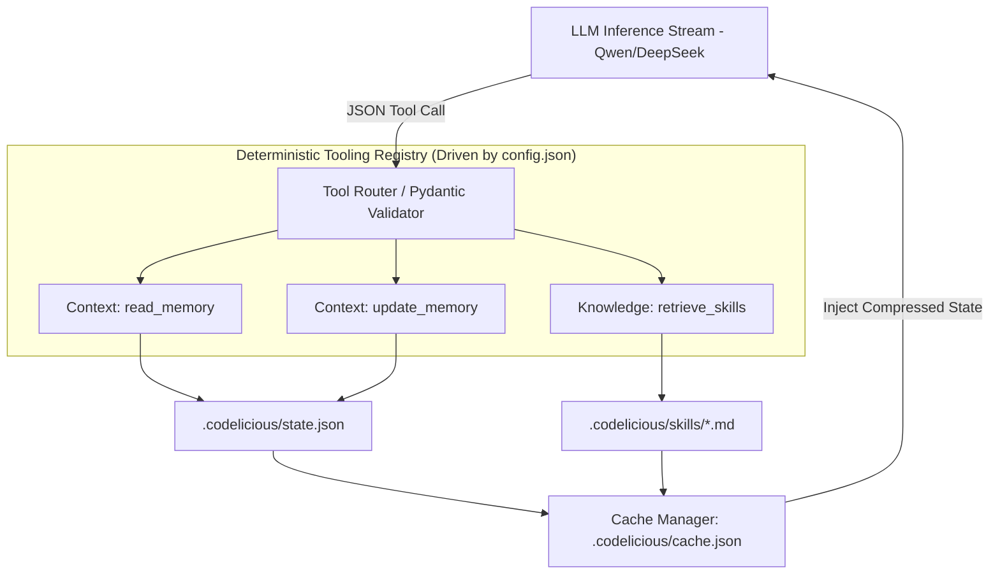

# Feature Spec: Advanced Agent Tooling & Context (Centralized State)

## Intent
As a user, when I use Codelicious, the Qwen/DeepSeek models must feel as natively capable, sentient, and context-aware as the Claude Code CLI or Google Antigravity. The system must provide a suite of centralized, highly configurable custom contextual tools defined in ONE central location (`.codelicious/config.json`). The tools must manage specific state files in a structured JSON ledger (`.codelicious/state.json`) rather than sprawling text files, ensuring the models autonomously explore the workspace, learn from past mistakes across execution runs, and execute complex refactors with reliable historical context. Memory and heuristics are efficiently cached in `.codelicious/cache.json`.

## Deterministic Logic
The execution model strictly relies on an 80% deterministic / 20% probabilistic split constraint.
- **If** the LLM requests a tool call (JSON format), the `tool_router` deterministically validates the arguments using Pydantic schemas before execution.
- **If** the tool invoked is `update_memory`, the runtime deterministically reads the payload explicitly, and appends the JSON dictionary to the `"memory_ledger"` array in `.codelicious/state.json` to ensure state is preserved permanently across runs and PR updates.
- **If** the tool invoked is `read_skills`, the runtime deterministically iterates through `.codelicious/skills/*.md`, aggregates the files, and compiles them into the System Prompt for the next inference call, writing the compressed token result to `.codelicious/cache.json`.
- **If** the central `.codelicious/config.json` has `allow_memory_mutations: false`, the `update_memory` tool is deterministically hidden from the LLM tool schema entirely.

## Gaps & Gated Security
- **Gap:** In Claude Code CLI, tracking "what the agent learned" or "how to approach this repo" is scattered across numerous `.md` files. This blows up context size un-deterministically.
- **Solution:** We explicitly surface state tracking to structurally enforced JSON files in a `.codelicious/` folder at the root of the repo.
  - `.codelicious/state.json`: A unified JSON object capturing the running ledger of decisions, errors, and solved problems.
  - `.codelicious/cache.json`: Token embeddings, AST hashes, and filesystem layouts. Not meant for human editing but saves thousands of API tokens per run.
  - `.codelicious/config.json`: The single source of truth defining tool access, provider URLs, and token limits.

## System Design

## The "Claude Code" Bridge
**Sequential Implementation Prompt for Claude Code:**
"Load `.codelicious/config.json` configuration structures and `02_feature_agent_tools.md`. Design and implement the contextual memory modules in `src/codelicious/context/`: `memory_manager.py`, `skills_loader.py`, and `cache_engine.py`. Consolidate the tool expose logic into a central `registry.py` that parses `config.json`. Create robust Pydantic schemas bounding the allowed input payloads for the LLM state updates. Implement `update_memory_state` that safely transacts against `.codelicious/state.json`. Implement test suites mocking `.codelicious/` interactions where LLM payloads successfully insert standard dicts to the ledger. Format using ruff, assert passing criteria via pytest, and commit."
