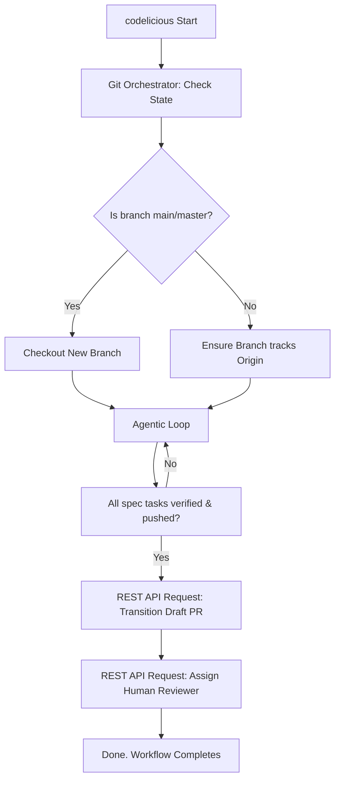

# Feature Spec: Git PR/MR Orchestration Pipeline

## Intent
As a user, when I execute `codelicious /path/to/repo`, I expect "Outcome as a Service". Codelicious must never write directly to my `main`, `master`, or `production` branches. Instead, the runtime must deterministically manage the Git state: If this is a fresh build run, it creates a new branch and automatically opens a Draft Pull Request/Merge Request. If a Draft PR already exists, it checks out that branch and appends subsequent generated code as commits. 

Crucially, upon **successful completion of all spec tasks and a 100% green verification cycle**, Codelicious must flip the PR/MR from "Draft" status to "Ready for Review" (Active) and automatically request a human review.

## Deterministic Logic
The execution schema is 100% deterministic with zero LLM intervention permitted for Branch selection, Force Pushing, or API State Transitions.
- **If** Codelicious initializes, it deterministically runs `git branch --show-current`.
- **If** the current branch is `main` or `master`, Codelicious automatically generates a branch name (e.g., `codelicious/feature-auth`) and executes `git checkout -b <branch>`.
- **If** the branch `codelicious/feature-auth` already exists remotely, Codelicious executes `git fetch` and `git checkout` to append to it.
- **If** the Qwen execution loop passes all verification checks, Codelicious deterministically executes:
  1. `git add .`
  2. Ask DeepSeek Planner for a standard conventional commit message based on the `git diff`.
  3. `git commit -m "<message>"`
  4. `git push origin HEAD`
- **If** a Draft PR/MR does not exist on GitHub/GitLab, Codelicious uses the host generic CLI (`gh` / `glab` or REST API) to open a Draft PR, injecting the Markdown spec and `memory_ledger` summary as the description.
- **If** the global orchestrator marks ALL tasks from all specs as DONE, Codelicious issues the REST API calls to mark the Draft PR as "Ready for Review" and optionally ping configured human reviewers (defined in `.codelicious/config.json`).

## Gaps & Gated Security
- **Catastrophic Failure:** An LLM hallucinates a `git push --force origin main`.
- **Solution:** The LLM does NOT have access to arbitrary `git` commands via the `run_command` tool. Git orchestration is handled entirely outside the LLM's control flow in a dedicated `git_orchestrator.py` module. 

## System Design

## The "Claude Code" Bridge
**Sequential Implementation Prompt for Claude Code:**
"Load `00_master_spec.md` and `03_feature_git_orchestration.md`. Implement the `git_orchestrator.py` module in `src/codelicious/git/`. Expose a `GitManager` class responsible for: `assert_safe_branch`, `checkout_or_create_feature_branch`, `commit_verified_changes`, `ensure_draft_pr_exists`, and `transition_pr_to_review`. 

Ensure `transition_pr_to_review` utilizes the `requests` library to interact with both GitHub and GitLab APIs (using env vars `GITHUB_TOKEN` or `GITLAB_TOKEN`), automatically stripping the 'Draft' flag and adding requested reviewers sourced from `.codelicious/config.json`. Ensure `pytest` instances mock the `requests.post` API calls exactly. Do not output anything other than the source modifications generated."
