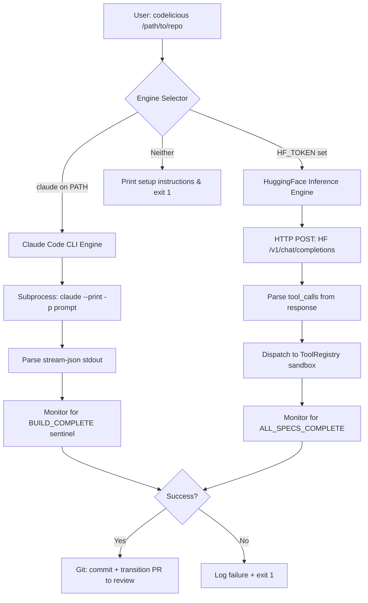

# Feature Spec: Dual Engine — Claude Code CLI Primary, HuggingFace Fallback

## 1. Intent

As a user, when I run `codelicious /path/to/repo`, the system should automatically
detect whether Claude Code CLI is installed and authenticated, and use it as the
primary build engine. If Claude Code CLI is not available, the system should
gracefully fall back to HuggingFace Inference API using self-hosted open-weight
models (DeepSeek-V3, Qwen 2.5 Coder). If neither engine is available, the CLI
must print clear, actionable setup instructions and exit cleanly.

This gives users the best of both worlds:
- **Claude Code CLI**: Production-grade agentic coding with Anthropic's tool use,
  context management, and authentication — zero config needed beyond `claude` auth.
- **HuggingFace Inference**: Free/cheap self-hosted alternative using open-weight
  models for users who want full control or can't use Claude Code.

## 2. Architecture: Engine Abstraction

### 2.1 Engine Detection Priority

```
1. Check: Is `claude` binary on PATH?
   ├── YES → Use Claude Code CLI engine (preferred)
   └── NO  → Continue to step 2

2. Check: Is HF_TOKEN or LLM_API_KEY set?
   ├── YES → Use HuggingFace Inference engine (fallback)
   └── NO  → Continue to step 3

3. Print setup instructions and exit with code 1:
   "No build engine detected. Choose one:

    Option A — Claude Code CLI (recommended):
      Install: https://docs.anthropic.com/en/docs/claude-code
      Auth:    Run `claude` once to authenticate
      Then:    codelicious /path/to/repo

    Option B — HuggingFace Inference (self-hosted):
      Get token: https://huggingface.co/settings/tokens
      Export:    export HF_TOKEN='hf_your_token_here'
      Then:     codelicious /path/to/repo"
```

### 2.2 Override via CLI Flag

Users can force a specific engine:

```bash
# Force Claude Code CLI (error if not installed)
codelicious /path/to/repo --engine claude

# Force HuggingFace (error if no token)
codelicious /path/to/repo --engine huggingface

# Auto-detect (default)
codelicious /path/to/repo
```

### 2.3 Override via Environment Variable

```bash
export CODELICIOUS_ENGINE=claude      # or "huggingface"
```

CLI flag takes precedence over env var. Env var takes precedence over auto-detect.

## 3. Engine Interface

### 3.1 Abstract Base

Create `src/codelicious/engines/base.py`:

```python
class BuildEngine:
    """Abstract base for all build engines."""

    name: str  # "claude" or "huggingface"

    def detect(self) -> bool:
        """Return True if this engine is available and configured."""
        raise NotImplementedError

    def setup_instructions(self) -> str:
        """Return human-readable setup instructions for this engine."""
        raise NotImplementedError

    def run_build_cycle(self, repo_path, system_prompt, tool_registry, **kwargs) -> bool:
        """Execute the full agentic build loop. Return True on success."""
        raise NotImplementedError
```

### 3.2 Claude Code Engine

Create `src/codelicious/engines/claude_engine.py`:

This engine wraps the Claude Code CLI binary (`claude`) as a subprocess, similar to
proxilion-build's `agent_runner.py`. Key behaviors:

- **Detection**: `shutil.which("claude")` returns a path.
- **Invocation**: Spawns `claude --print --output-format stream-json
  --dangerously-skip-permissions -p <prompt>` as a subprocess.
- **Prompt injection**: The system prompt is passed via `-p` flag. It instructs
  Claude to find specs in the repo, implement them, run tests, and signal
  completion.
- **Tool use**: Claude Code CLI has its own built-in tools (Read, Write, Edit,
  Bash, Glob, Grep, Agent). We do NOT pass our custom tool_registry — Claude
  Code handles tool use internally.
- **Output parsing**: Parse `stream-json` events from stdout. Extract session_id
  from `system.init` events. Display assistant text in real-time.
- **Timeout**: Configurable via `--agent-timeout` flag (default 1800s / 30 min).
- **Error handling**:
  - Auth failure (exit code + "auth" in stderr) → `ClaudeAuthError` with
    re-auth instructions.
  - Rate limit (429, "rate limit", "too many requests" in output) →
    `ClaudeRateLimitError` with retry-after.
  - Non-zero exit → `BuildEngineError` with stderr.
- **Session resume**: Support `--resume <session_id>` for continuing interrupted
  builds.
- **Completion signal**: The prompt instructs Claude to write a sentinel file
  `.codelicious/BUILD_COMPLETE` containing "DONE" when all specs are implemented.

Reference implementation to adapt from:
`proxilion-build-v1/proxilion_build/agent_runner.py`

### 3.3 HuggingFace Engine

Create `src/codelicious/engines/huggingface_engine.py`:

This is the current `llm_client.py` + `loop_controller.py` approach, refactored
into the engine interface. Key behaviors:

- **Detection**: `HF_TOKEN` or `LLM_API_KEY` environment variable is set and
  non-empty.
- **Invocation**: HTTP POST to HuggingFace Inference API (OpenAI-compatible
  chat/completions endpoint).
- **Tool use**: Passes our custom `tool_registry.generate_schema()` as OpenAI
  function-calling tools. Parses `tool_calls` from response. Dispatches to
  our Python tool implementations.
- **Models**: Configurable via `MODEL_PLANNER` env var (default:
  `deepseek-ai/DeepSeek-V3`).
- **Endpoint**: Configurable via `LLM_ENDPOINT` env var (default:
  `https://router.huggingface.co/hf-inference/v1/chat/completions`).
- **Completion signal**: LLM returns "ALL_SPECS_COMPLETE" in its response text.

This is essentially the current code in `llm_client.py` and `loop_controller.py`,
extracted into the engine pattern.

## 4. Changes to CLI (`cli.py`)

### 4.1 New Arguments

```python
parser.add_argument(
    "--engine",
    choices=["auto", "claude", "huggingface"],
    default="auto",
    help="Build engine to use. Default: auto-detect."
)
parser.add_argument(
    "--agent-timeout",
    type=int,
    default=1800,
    help="Timeout in seconds for Claude Code agent mode (default: 1800)."
)
parser.add_argument(
    "--model",
    type=str,
    default=None,
    help="Model override. For Claude: claude-sonnet-4-6, claude-opus-4-6. "
         "For HuggingFace: deepseek-ai/DeepSeek-V3, Qwen/Qwen2.5-Coder-32B-Instruct."
)
parser.add_argument(
    "--resume",
    type=str,
    default=None,
    help="Resume a previous Claude Code session by session ID."
)
```

### 4.2 Engine Selection in `main()`

```python
def select_engine(args) -> BuildEngine:
    """Select the build engine based on args, env, and auto-detection."""
    choice = args.engine or os.environ.get("CODELICIOUS_ENGINE", "auto")

    if choice == "claude":
        engine = ClaudeCodeEngine(timeout=args.agent_timeout, model=args.model)
        if not engine.detect():
            logger.error("Claude Code CLI not found. Run `claude` to install/auth.")
            sys.exit(1)
        return engine

    if choice == "huggingface":
        engine = HuggingFaceEngine(model=args.model)
        if not engine.detect():
            logger.error("No HF_TOKEN or LLM_API_KEY found.")
            print(engine.setup_instructions())
            sys.exit(1)
        return engine

    # Auto-detect
    claude = ClaudeCodeEngine(timeout=args.agent_timeout, model=args.model)
    if claude.detect():
        logger.info("Detected Claude Code CLI. Using Claude engine.")
        return claude

    hf = HuggingFaceEngine(model=args.model)
    if hf.detect():
        logger.info("Claude Code not found. Using HuggingFace engine.")
        return hf

    # Neither available
    print(NO_ENGINE_MESSAGE)
    sys.exit(1)
```

### 4.3 Startup Banner

When the engine is selected, print a clear banner:

```
[codelicious] Engine: Claude Code CLI (claude-sonnet-4-6)
[codelicious] Project: /path/to/repo
[codelicious] Branch: codelicious/auto-build
```

or:

```
[codelicious] Engine: HuggingFace Inference (deepseek-ai/DeepSeek-V3)
[codelicious] Project: /path/to/repo
[codelicious] Branch: codelicious/auto-build
```

## 5. File Inventory

### 5.1 New Files

| File | Purpose |
|------|---------|
| `src/codelicious/engines/__init__.py` | Package init, exports `select_engine` |
| `src/codelicious/engines/base.py` | `BuildEngine` abstract base class |
| `src/codelicious/engines/claude_engine.py` | Claude Code CLI subprocess wrapper |
| `src/codelicious/engines/huggingface_engine.py` | HF Inference HTTP client engine |
| `src/codelicious/engines/errors.py` | Engine-specific exceptions |
| `tests/test_engine_detection.py` | Tests for auto-detect logic |
| `tests/test_claude_engine.py` | Tests for Claude engine (mocked subprocess) |
| `tests/test_huggingface_engine.py` | Tests for HF engine (mocked HTTP) |

### 5.2 Modified Files

| File | Change |
|------|--------|
| `src/codelicious/cli.py` | Add `--engine`, `--agent-timeout`, `--resume` flags. Add `select_engine()`. Update `main()` to use engine abstraction. |
| `src/codelicious/loop_controller.py` | Extract HF-specific loop logic into `HuggingFaceEngine.run_build_cycle()`. `BuildLoop` becomes a thin wrapper or is replaced by the engine. |
| `src/codelicious/llm_client.py` | Move into `engines/huggingface_engine.py` as an internal implementation detail. Keep as-is if cleaner. |

### 5.3 Files to Keep Unchanged

| File | Reason |
|------|--------|
| `src/codelicious/tools/registry.py` | Tool registry is used by HF engine only. Claude Code has its own tools. |
| `src/codelicious/tools/fs_tools.py` | Sandbox tools for HF engine. |
| `src/codelicious/tools/command_runner.py` | Command runner for HF engine. |
| `src/codelicious/git/git_orchestrator.py` | Git management is engine-agnostic. Both engines use it. |
| `src/codelicious/context/cache_engine.py` | Cache is engine-agnostic. Both engines use it. |

## 6. Claude Code Engine — Detailed Implementation

### 6.1 Subprocess Command Construction

```python
def _build_command(self, prompt: str, project_dir: Path) -> list[str]:
    cmd = [
        self.claude_bin,
        "--print",
        "--output-format", "stream-json",
        "--verbose",
        "--dangerously-skip-permissions",
    ]
    if self.model:
        cmd.extend(["--model", self.model])
    if self.resume_session_id:
        cmd.extend(["--resume", self.resume_session_id])
    cmd.extend(["-p", prompt])
    return cmd
```

### 6.2 System Prompt for Claude Code

The prompt passed to Claude Code should be repo-aware and spec-driven:

```
You are Codelicious, an autonomous build agent. You are operating on the
repository at {repo_path}.

Your mission:
1. Scan the repository for specification files (*.md in docs/, specs/, or root).
2. Read each specification thoroughly.
3. Implement ALL requirements from the specifications.
4. Run tests and verification after each significant change.
5. Fix any failures until all tests pass.
6. When ALL specifications are fully implemented and verified, write "DONE" to
   .codelicious/BUILD_COMPLETE.

Rules:
- Never modify the main/master branch. You are on branch {branch_name}.
- Run tests frequently using Bash tool.
- Read files before modifying them.
- Use Glob and Grep to understand the codebase before making changes.
- Commit verified changes with clear commit messages.
```

### 6.3 Stream Processing

Parse `stream-json` events line-by-line from stdout:

```python
{"type": "system", "subtype": "init", "session_id": "abc123", ...}
{"type": "assistant", "message": {"content": [{"type": "text", "text": "..."}]}}
{"type": "result", "subtype": "success", ...}
```

Extract:
- `session_id` from `system.init` for session resume.
- Assistant text from `assistant` events for real-time display.
- `tool_use` names from assistant events for progress logging.

### 6.4 Error Detection

After subprocess exits, check:
1. Exit code 0 → success, parse output.
2. "auth" in stderr → `ClaudeAuthError`: "Claude Code CLI authentication
   failed. Run `claude` interactively to log in."
3. Rate limit keywords → `ClaudeRateLimitError` with 60s retry-after.
4. Other non-zero → `BuildEngineError` with last 500 chars of stderr.

## 7. HuggingFace Engine — Detailed Implementation

### 7.1 Refactoring

Move the current `LLMClient` and `BuildLoop._execute_agentic_iteration()` logic
into `HuggingFaceEngine.run_build_cycle()`. The engine owns:
- HTTP client (`urllib.request` based, zero dependencies).
- Message history management.
- Tool dispatch via `ToolRegistry`.
- Iteration loop with max_iterations limit.
- Completion detection ("ALL_SPECS_COMPLETE" in response).

### 7.2 Detection

```python
def detect(self) -> bool:
    return bool(
        os.environ.get("HF_TOKEN", "")
        or os.environ.get("LLM_API_KEY", "")
    )

def setup_instructions(self) -> str:
    return (
        "HuggingFace engine requires an API token.\n\n"
        "  1. Get a token: https://huggingface.co/settings/tokens\n"
        "  2. Export it:   export HF_TOKEN='hf_your_token_here'\n"
        "  3. Re-run:      codelicious /path/to/repo\n\n"
        "Tip: Add the export to your ~/.zshrc or ~/.bashrc for persistence."
    )
```

## 8. Testing Plan

### 8.1 Engine Detection Tests (`tests/test_engine_detection.py`)

- `test_auto_detect_claude_available`: Mock `shutil.which("claude")` to return a
  path. Assert `ClaudeCodeEngine` is selected.
- `test_auto_detect_hf_fallback`: Mock `shutil.which("claude")` to return None.
  Set `HF_TOKEN` env var. Assert `HuggingFaceEngine` is selected.
- `test_auto_detect_neither`: Mock both unavailable. Assert exit code 1 and
  setup instructions printed.
- `test_force_claude_flag`: `--engine claude` selects Claude even if HF_TOKEN is
  set.
- `test_force_huggingface_flag`: `--engine huggingface` selects HF even if claude
  is on PATH.
- `test_env_var_override`: `CODELICIOUS_ENGINE=huggingface` overrides auto-detect.
- `test_cli_flag_overrides_env_var`: `--engine claude` beats
  `CODELICIOUS_ENGINE=huggingface`.

### 8.2 Claude Engine Tests (`tests/test_claude_engine.py`)

- `test_command_construction`: Verify the subprocess command list is correct.
- `test_command_with_model_override`: Verify `--model` flag is passed.
- `test_command_with_resume`: Verify `--resume` flag is passed.
- `test_stream_json_parsing`: Feed sample stream-json lines, verify session_id
  and assistant text extraction.
- `test_auth_error_detection`: Mock subprocess with "auth" in stderr, verify
  `ClaudeAuthError` raised.
- `test_rate_limit_detection`: Mock subprocess with "rate limit" in output,
  verify `ClaudeRateLimitError` raised.
- `test_timeout_enforcement`: Mock subprocess that hangs, verify it gets
  terminated after timeout.
- `test_keyboard_interrupt`: Verify subprocess cleanup on Ctrl+C.
- `test_claude_not_found`: `shutil.which` returns None, verify clear error.

### 8.3 HuggingFace Engine Tests (`tests/test_huggingface_engine.py`)

- `test_detection_with_hf_token`: Set `HF_TOKEN`, assert `detect()` returns True.
- `test_detection_with_llm_api_key`: Set `LLM_API_KEY`, assert True.
- `test_detection_neither`: Neither set, assert False.
- `test_chat_completion_success`: Mock HTTP response, verify parsing.
- `test_chat_completion_404`: Mock 404 response, verify error message includes URL.
- `test_chat_completion_401`: Mock 401 response, verify error mentions auth.
- `test_tool_dispatch_cycle`: Mock a full iteration with tool_calls, verify
  dispatch and message history.

## 9. System Design



## 10. Migration Path

### Phase 1: Engine Abstraction (this spec)
- Create `engines/` package with base class.
- Implement `ClaudeCodeEngine` (adapted from proxilion-build `agent_runner.py`).
- Refactor current code into `HuggingFaceEngine`.
- Update `cli.py` with engine selection.
- Write tests.

### Phase 2: Keep Both Engines in Sync
- Both engines must produce the same observable outcomes:
  - Specs read and implemented.
  - Tests run and passing.
  - Git commits on feature branch.
  - PR transitioned to review.
- The difference is HOW: Claude Code uses its own tools, HF uses our Python tools.

### Phase 3: Future
- Add more engines (Ollama local, OpenAI API, etc.) by implementing `BuildEngine`.
- Engine-specific configuration in `.codelicious/config.json`.

## 11. Acceptance Criteria

- [x] `codelicious /path/to/repo` with `claude` on PATH uses Claude Code engine.
- [x] `codelicious /path/to/repo` without `claude` but with `HF_TOKEN` uses HF engine.
- [x] `codelicious /path/to/repo` with neither prints clear setup instructions.
- [x] `--engine claude` forces Claude engine (errors if unavailable).
- [x] `--engine huggingface` forces HF engine (errors if no token).
- [x] `CODELICIOUS_ENGINE` env var works as override.
- [x] Claude engine spawns subprocess correctly and parses stream-json.
- [x] Claude engine handles auth errors, rate limits, and timeouts gracefully.
- [x] HF engine works identically to current behavior.
- [x] All tests pass: `python3 -m pytest tests/ -v`.
- [x] Startup banner shows which engine and model are active.
- [x] `codelicious --help` documents the `--engine` flag.

## 12. The "Claude Code" Bridge

**Sequential Implementation Prompt for Claude Code:**

```
You are tasked with implementing the dual-engine architecture for Codelicious
based on `docs/specs/05_feature_dual_engine.md`.

Phase 1 — Create the engine abstraction:
1. Create `src/codelicious/engines/__init__.py`, `base.py`, and `errors.py`.
2. Implement `BuildEngine` abstract base class in `base.py`.
3. Implement engine-specific exceptions in `errors.py`.

Phase 2 — Implement Claude Code engine:
1. Create `src/codelicious/engines/claude_engine.py`.
2. Adapt the subprocess management pattern from
   `proxilion-build-v1/proxilion_build/agent_runner.py`.
3. Implement `detect()`, `setup_instructions()`, and `run_build_cycle()`.
4. Handle stream-json parsing, timeout, auth errors, rate limits.

Phase 3 — Refactor HuggingFace into engine:
1. Create `src/codelicious/engines/huggingface_engine.py`.
2. Move `LLMClient` logic and `BuildLoop` iteration logic into the engine.
3. Implement `detect()`, `setup_instructions()`, and `run_build_cycle()`.

Phase 4 — Update CLI:
1. Add `--engine`, `--agent-timeout`, `--resume` flags to `cli.py`.
2. Add `select_engine()` function.
3. Update `main()` to use the selected engine.
4. Add startup banner.

Phase 5 — Write tests:
1. Create `tests/test_engine_detection.py` with all detection tests.
2. Create `tests/test_claude_engine.py` with subprocess mock tests.
3. Create `tests/test_huggingface_engine.py` with HTTP mock tests.
4. Run: python3 -m pytest tests/ -v

Fix any failures before finishing.
```
