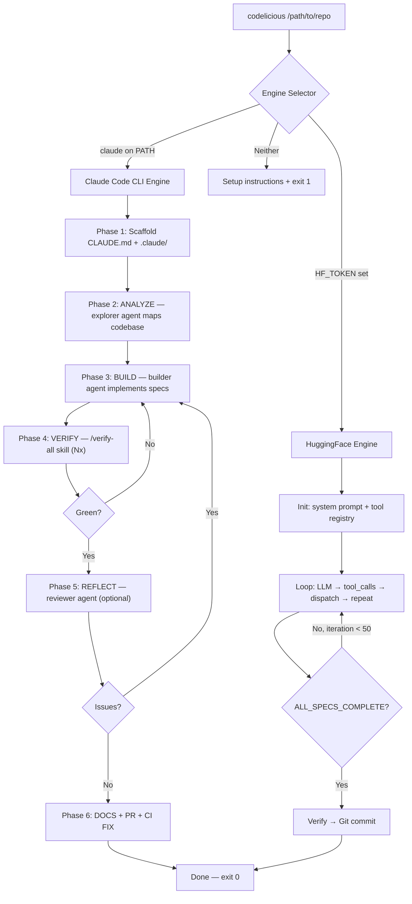

# spec-06: Production Hardening, Claude Code Best Practices, and Proxilion-Build Migration

## 1. Executive Summary

This spec completes the codelicious v2 architecture by:

1. **Porting battle-tested code** from proxilion-build-v1 (agent runner, scaffolder,
   prompts, verifier, error hierarchy, atomic I/O, build logger, progress tracker).
2. **Making Claude Code CLI mode a first-class citizen** with full Anthropic best
   practices: CLAUDE.md scaffolding, .claude/ directory with agents/skills/rules,
   memory.md integration, parallel agent spawning, and BUILD_COMPLETE sentinel.
3. **Fixing all known bugs** in the current codelicious codebase (broken cache
   persistence, missing verification, no error recovery, namespace issues).
4. **Cleaning up** by deleting proxilion-build-v1/ after all useful code is ported.

After this spec, codelicious will be a production-grade autonomous build system
with two engines (Claude Code CLI primary, HuggingFace fallback) and comprehensive
testing, logging, and error handling.

---

## 2. Current State Assessment

### 2.1 What works

- HuggingFace LLM client (`llm_client.py`) — zero-dependency HTTP, good error handling
- Tool registry + dispatch (`tools/registry.py`) — clean routing
- Filesystem sandbox (`tools/fs_tools.py`) — atomic writes, path validation
- Command runner (`tools/command_runner.py`) — allowlist enforcement
- Audit logger (`tools/audit_logger.py`) — colored output, file logging
- Git orchestrator (`git/git_orchestrator.py`) — branch protection, PR creation
- RAG engine (`context/rag_engine.py`) — SQLite vector DB, cosine similarity
- Error hierarchy (`errors.py`) — 40+ exception types (from proxilion-build port)

### 2.2 Critical issues (P1)

**P1-01: Cache persistence is broken**
`cache_engine.py` initializes files but `flush_cache()` is a stub comment.
State is never written to disk. Builds cannot resume after interruption.

**P1-02: No verification before git commit**
`loop_controller.py` commits after `ALL_SPECS_COMPLETE` without running tests,
lint, or security checks. Broken code gets committed.

**P1-03: No error recovery in agentic loop**
`_execute_agentic_iteration()` has no retry logic, no backoff on transient
failures, no state checkpointing between iterations.

**P1-04: No Claude Code CLI integration**
The entire system only works via HuggingFace. There's no subprocess management
for the `claude` binary, no prompt engineering for Claude Code's tool system,
no scaffolding of .claude/ directories.

### 2.3 High-severity issues (P2)

**P2-01: No CLAUDE.md or .claude/ scaffolding**
When Claude Code engine runs, it needs CLAUDE.md with project instructions,
.claude/agents/ for parallel sub-agents, .claude/skills/ for reusable workflows,
and .claude/rules/ for security/conventions. None of this exists.

**P2-02: No prompt engineering for Claude Code mode**
Claude Code CLI needs carefully crafted prompts that leverage its native tools
(Read, Write, Edit, Bash, Glob, Grep, Agent, TodoWrite). The current system
prompt is designed for HuggingFace's OpenAI-compatible tool calling format.

**P2-03: No build session logging**
No structured logging of build sessions. No way to debug what happened in a
previous run. No progress tracking for external monitoring.

**P2-04: No atomic state writes**
State files use plain `write_text()` which can corrupt on process kill.
proxilion-build's `_io.atomic_write_text()` pattern (tempfile + os.replace)
prevents this.

**P2-05: No completion sentinel mechanism**
The HF engine checks for `ALL_SPECS_COMPLETE` in LLM response text, but the
Claude engine needs a file-based sentinel (`.codelicious/BUILD_COMPLETE`) that
Claude Code writes when it's done.

### 2.4 Quality issues (P3)

**P3-01: Dead proxilion-build code in src/codelicious/**
~1,500 lines of proxilion-build-specific modules (context_manager.py, executor.py,
parser.py, planner.py, sandbox.py, verifier.py, budget_guard.py, scaffolder.py,
build_logger.py, progress.py) that are never imported by the codelicious entry
point. These were copied but never integrated.

**P3-02: config.py is proxilion-build specific**
The Config dataclass references proxilion-build concepts (PolicyConfig, etc.)
instead of codelicious configuration.

**P3-03: No startup banner or engine identification**
User has no feedback about which engine is active, what model is being used,
or what branch they're on.

---

## 3. Architecture After This Spec

```
src/codelicious/
├── cli.py                          # Entry point with engine selection
├── engines/
│   ├── __init__.py                 # select_engine(), BuildEngine base
│   ├── base.py                     # Abstract BuildEngine class
│   ├── claude_engine.py            # Claude Code CLI subprocess engine
│   │   ├── _build_command()        # Construct claude CLI args
│   │   ├── _drain_stdout/stderr()  # Non-blocking stream processing
│   │   ├── _parse_stream_event()   # JSON stream event parsing
│   │   ├── _enforce_timeout()      # Watchdog with SIGTERM/SIGKILL
│   │   └── run_build_cycle()       # Full lifecycle orchestration
│   └── huggingface_engine.py       # HF Inference HTTP engine (current code)
│       ├── LLMClient               # Zero-dep urllib HTTP client
│       └── run_build_cycle()       # Tool-dispatch agentic loop
├── scaffolder.py                   # CLAUDE.md + .claude/ directory generator
│   ├── scaffold()                  # Managed block in CLAUDE.md
│   └── scaffold_claude_dir()       # agents/skills/rules/settings
├── prompts.py                      # All prompt templates (Claude + HF)
│   ├── AGENT_BUILD_SPEC            # Claude Code: full autonomous build
│   ├── AGENT_VERIFY                # Claude Code: verification pass
│   ├── AGENT_REFLECT               # Claude Code: quality review
│   ├── AGENT_ANALYZE               # Claude Code: codebase exploration
│   ├── HF_SYSTEM_PROMPT            # HuggingFace: tool-dispatch system prompt
│   ├── check_build_complete()      # Sentinel file checker
│   ├── clear_build_complete()      # Sentinel cleanup
│   └── render()                    # {{variable}} template substitution
├── verifier.py                     # Language-agnostic verification pipeline
│   ├── detect_languages()          # Auto-detect project languages
│   ├── probe_tools()               # Check available linters/testers
│   ├── check_syntax()              # Syntax validation
│   ├── check_tests()               # Test suite runner
│   ├── check_lint()                # Linter runner
│   └── check_security()            # Security pattern scanner
├── _io.py                          # Atomic write utilities
│   └── atomic_write_text()         # tempfile + os.replace pattern
├── build_logger.py                 # Per-session structured logging
│   └── BuildSession                # meta.json, output.log, session.jsonl
├── progress.py                     # Progress event streaming
│   └── ProgressReporter            # JSON-Lines append + rotation
├── errors.py                       # Exception hierarchy (keep existing)
├── logger.py                       # Sensitive data redaction (keep existing)
├── config.py                       # Codelicious-native configuration
├── tools/                          # HF engine tools (keep existing)
│   ├── registry.py
│   ├── fs_tools.py
│   ├── command_runner.py
│   └── audit_logger.py
├── git/                            # Git orchestration (keep existing)
│   └── git_orchestrator.py
└── context/                        # Caching + RAG (keep existing)
    ├── cache_engine.py             # FIX: implement flush_cache()
    └── rag_engine.py
```

---

## 4. Implementation Phases

### Phase 1: Port Atomic I/O Utilities

**Files:** `src/codelicious/_io.py`
**Source:** `proxilion-build-v1/proxilion_build/_io.py`
**Intent:** All state writes must be crash-safe. Atomic write prevents corruption
when the process is killed mid-write.

**Implementation:**
```python
def atomic_write_text(path: pathlib.Path, content: str, mode: int = 0o644) -> None:
    """Write content atomically using tempfile + os.replace."""
    path.parent.mkdir(parents=True, exist_ok=True)
    fd, tmp = tempfile.mkstemp(dir=str(path.parent), suffix=".tmp")
    try:
        with os.fdopen(fd, "w", encoding="utf-8") as f:
            f.write(content)
            f.flush()
            os.fsync(f.fileno())
        os.chmod(tmp, mode)
        os.replace(tmp, str(path))
    except BaseException:
        try:
            os.unlink(tmp)
        except OSError:
            pass
        raise
```

**Tests:** Test atomic write, test crash recovery (kill mid-write doesn't corrupt),
test parent directory creation.

---

### Phase 2: Port Build Session Logger

**Files:** `src/codelicious/build_logger.py`
**Source:** `proxilion-build-v1/proxilion_build/build_logger.py`
**Intent:** Every build run gets a session directory with structured logs for
debugging and monitoring.

**Adapt from proxilion-build:**
- Session directory: `~/.codelicious/builds/{project_name}/{timestamp}/`
- Files: `meta.json`, `output.log`, `session.jsonl`, `summary.json`
- Thread-safe `emit()` method
- Context manager protocol
- Auto-cleanup of sessions older than 30 days
- Change all `proxilion-build` references to `codelicious`

**Tests:** Test session creation, emit, close, cleanup, thread safety.

---

### Phase 3: Port Progress Reporter

**Files:** `src/codelicious/progress.py`
**Source:** `proxilion-build-v1/proxilion_build/progress.py`
**Intent:** External tools can tail `.codelicious/progress.jsonl` for real-time
build status.

**Adapt from proxilion-build:**
- JSON-Lines event stream to `.codelicious/progress.jsonl`
- Auto-rotation at 10MB
- Thread-safe with `threading.Lock()`
- Context manager protocol
- Change all references from `.proxilion-build` to `.codelicious`

**Tests:** Test emit, rotation, thread safety, context manager.

---

### Phase 4: Port and Adapt Prompt Templates

**Files:** `src/codelicious/prompts.py`
**Source:** `proxilion-build-v1/proxilion_build/prompts.py`
**Intent:** All prompt text lives in one module. Claude Code mode gets prompts
that leverage Anthropic best practices. HuggingFace mode keeps the existing
system prompt.

**Claude Code prompts to port (adapt from proxilion-build, rebrand to codelicious):**

#### AGENT_BUILD_SPEC (Primary build prompt)
The main autonomous build prompt. Adapts proxilion-build's `AGENT_BUILD_SPEC` with
these codelicious-specific changes:
- Replace all `proxilion-build` references with `codelicious`
- Replace `.proxilion-build/` paths with `.codelicious/`
- Keep the 6-step structure: understand → find task → branch → build → commit/push/PR → mark progress
- Keep CI mirroring instructions (read .github/workflows before committing)
- Keep the "validate full branch diff" instruction
- Add: "Use the **builder** agent for parallel implementation of independent tasks"
- Add: "Use the **tester** agent to run tests and fix failures"
- Add: "Use the **reviewer** agent for security review before final commit"
- Add: "Use `/verify-all` skill after each significant change"
- Add: "Use `/run-tests` skill to validate test suite"
- Add: "Use TodoWrite to track sub-steps within each task"
- Add: "When you discover project conventions, update CLAUDE.md for future sessions"

#### AGENT_ANALYZE (Codebase exploration)
Read-only exploration that writes `.codelicious/STATE.md`. Port from proxilion-build
with path changes. Key instruction: "Use the **explorer** agent to map the codebase
in parallel."

#### AGENT_VERIFY (Verification pass)
Run `/verify-all` skill. Fix failures. Write BUILD_COMPLETE sentinel when green.

#### AGENT_REFLECT (Quality review)
Read-only review using **reviewer** agent. Add findings to STATE.md.

#### AGENT_CI_FIX (CI failure repair)
Fix CI failures. Template variables: `{{ci_output}}`, `{{ci_fix_pass}}`,
`{{max_ci_fix_passes}}`.

#### AGENT_DOCS (Documentation sync)
Update all documentation to match code.

#### HF_SYSTEM_PROMPT (HuggingFace mode — keep existing)
The current system prompt from `loop_controller.py` that instructs the HF model
to use `list_directory`, `read_file`, `write_file`, `run_command` tools. Keep
as-is since it works with the tool_registry dispatch pattern.

#### Utility functions
- `render(template, **kwargs)` — `{{key}}` substitution
- `check_build_complete(project_root)` — read `.codelicious/BUILD_COMPLETE`
- `clear_build_complete(project_root)` — delete sentinel before new run
- `extract_context(project_root)` — read STATE.md for template variables

**Tests:** Test render(), test check_build_complete with various content,
test that all Claude prompts contain expected keywords (agent names, skill names,
tool names).

---

### Phase 5: Port and Adapt Scaffolder

**Files:** `src/codelicious/scaffolder.py`
**Source:** `proxilion-build-v1/proxilion_build/scaffolder.py`
**Intent:** Before Claude Code engine runs, scaffold the target project with
CLAUDE.md instructions and .claude/ directory containing agents, skills, rules,
and permission settings.

#### 5.1 CLAUDE.md Managed Block

Port the sentinel-based managed block from proxilion-build. Rebrand:

```markdown
<!-- codelicious:start -->

# codelicious

This project is managed by codelicious. Read `.codelicious/STATE.md` for
the current task list and progress.

## Rules
- Read existing files before modifying them.
- Run `/verify-all` after changes to catch issues early.
- Update `.codelicious/STATE.md` as you complete tasks.
- When done, write "DONE" to `.codelicious/BUILD_COMPLETE`.

## How to Work
- Use the **builder** agent for parallel code implementation.
- Use the **tester** agent to run tests and fix failures.
- Use the **reviewer** agent for security and quality checks.
- Use the **explorer** agent for fast codebase research.
- Use `/run-tests`, `/lint-fix`, `/verify-all` skills for common workflows.
- Use TodoWrite to track sub-steps within complex tasks.
- When you discover project conventions, add them to this CLAUDE.md.

## Git & PR Policy
- You own all git operations: add, commit, push, branch creation.
- Write clear, descriptive commit messages that explain what changed and why.
- One commit per logical unit of work (e.g. one task, one fix).
- Create PRs with meaningful titles and descriptions summarizing actual changes.
- NEVER push to main/master/develop/release branches directly.
- NEVER force-push or amend published commits.

<!-- codelicious:end -->
```

#### 5.2 .claude/ Directory Structure

Generate these files in the TARGET project (not in codelicious itself):

**Agents:**

`.claude/agents/builder/SKILL.md`:
```yaml
---
name: builder
description: Code implementation specialist. Spawns to implement a specific feature, module, or function.
tools: Read, Edit, Write, Glob, Grep, Bash, Agent, TodoWrite
model: sonnet
maxTurns: 50
---

You are a code implementation specialist working inside a codelicious-managed
project.

CONTEXT:
- Read CLAUDE.md and .codelicious/STATE.md for project conventions.
- Read ALL files you will modify before making changes.
- Match existing patterns: naming, imports, error handling, code style.

YOUR JOB:
Implement the code you've been asked to write. Write clean, production-ready
code with tests. Run the test suite after your changes. Fix any failures.

QUALITY:
- Every new function needs tests.
- No hardcoded secrets, no eval(), no shell=True.
- Handle errors explicitly — no bare except.
- Follow the project's existing patterns exactly.
```

`.claude/agents/tester/SKILL.md`:
```yaml
---
name: tester
description: Test runner and fixer. Runs full test suite, diagnoses failures, fixes them.
tools: Read, Edit, Write, Glob, Grep, Bash
model: sonnet
maxTurns: 30
---

You are a test specialist working inside a codelicious-managed project.

YOUR JOB:
1. Run the full test suite (check .codelicious/STATE.md for the test command).
2. If all tests pass, report success.
3. If tests fail:
   - Read the failing test AND the code it tests.
   - Understand the root cause — is it a test bug or a code bug?
   - Fix the issue (prefer fixing code over changing tests).
   - Re-run the full test suite.
   - Repeat until all tests pass.

Also run the linter and formatter. Fix any issues.

Report: number of tests, pass/fail, any fixes applied.
```

`.claude/agents/reviewer/SKILL.md`:
```yaml
---
name: reviewer
description: Security and code quality reviewer. Read-only deep review.
tools: Read, Glob, Grep, Bash
disallowedTools: Edit, Write
model: sonnet
maxTurns: 20
---

You are a senior security and quality reviewer. You do NOT modify code —
you only read and report.

REVIEW DIMENSIONS:
- Security: injection, secrets, OWASP Top 10, unsafe deserialization
- Correctness: logic errors, off-by-one, unhandled edge cases
- Reliability: race conditions, resource leaks, missing error handling
- Test coverage: untested paths, missing edge cases
- Code quality: dead code, duplication, naming issues

For each finding, report:
- Severity: P1 (critical), P2 (important), P3 (minor)
- Location: file:line
- Description: what's wrong and why it matters
- Suggested fix: how to resolve it

Be thorough but avoid false positives. Only flag real issues.
```

`.claude/agents/explorer/SKILL.md`:
```yaml
---
name: explorer
description: Codebase exploration and analysis specialist. Fast research.
tools: Read, Glob, Grep, Bash
disallowedTools: Edit, Write
model: haiku
maxTurns: 15
---

You are a fast codebase explorer. Your job is to quickly find information
and report back. You do NOT modify any files.

CAPABILITIES:
- Map directory structures and file inventories
- Trace import chains and dependency graphs
- Find function/class definitions and their usages
- Identify patterns, conventions, and coding styles
- Answer specific questions about what the code does

Be concise. Return facts, file paths, and line numbers — not opinions.
```

**Skills:**

`.claude/skills/verify-all/SKILL.md`:
```yaml
---
name: verify-all
description: Run all quality checks — tests, lint, format, security scan.
allowed-tools: Read, Edit, Write, Bash, Glob, Grep
user-invocable: true
---

Run the complete verification pipeline for this project.

1. **Tests**: Run the full test suite. Fix any failures.
2. **Lint**: Run the linter. Fix all violations.
3. **Format**: Run the formatter. Fix any formatting issues.
4. **Security**: Grep for common security anti-patterns:
   - eval(, exec(, shell=True, subprocess.call.*shell
   - Hardcoded secrets: password\s*=\s*["'], api_key\s*=\s*["']
   - SQL injection: f"SELECT, f"INSERT, f"UPDATE, f"DELETE
5. **State**: Update .codelicious/STATE.md with current test count and status.

Report a summary of each check: pass/fail, issues found, fixes applied.
```

`.claude/skills/run-tests/SKILL.md`:
```yaml
---
name: run-tests
description: Run the full test suite, diagnose failures, fix them, re-run until green.
allowed-tools: Read, Edit, Write, Bash, Glob, Grep
user-invocable: true
---

Run the full test suite for this project.

Steps:
1. Read .codelicious/STATE.md to find the test command.
2. Run the test command.
3. If all tests pass, report the count and exit.
4. If tests fail:
   - Read the failing test file and the source file it tests.
   - Determine root cause (code bug vs test bug).
   - Fix the issue.
   - Re-run the full test suite.
   - Repeat until all tests pass or you've attempted 5 fix cycles.
5. Report: total tests, passed, failed, fixes applied.
```

`.claude/skills/lint-fix/SKILL.md`:
```yaml
---
name: lint-fix
description: Run the project linter and formatter, fix all violations.
allowed-tools: Read, Edit, Bash, Glob
user-invocable: true
---

Run the linter and formatter for this project and fix all issues.

Steps:
1. Detect the linter from project config:
   - Python: ruff check . --fix && ruff format .
   - JavaScript/TypeScript: npx eslint --fix . && npx prettier --write .
   - Rust: cargo clippy --fix && cargo fmt
   - Go: golangci-lint run --fix && gofmt -w .
2. Run the appropriate commands.
3. If auto-fix doesn't resolve everything, read the remaining errors and fix
   them manually.
4. Re-run the linter to confirm zero violations.
5. Report: violations found, auto-fixed, manually fixed, remaining.
```

`.claude/skills/update-state/SKILL.md`:
```yaml
---
name: update-state
description: Update .codelicious/STATE.md with accurate current status.
allowed-tools: Read, Write, Bash, Glob, Grep
user-invocable: true
---

Update .codelicious/STATE.md to accurately reflect the current state of
the project.

Steps:
1. Run the test suite and record the count.
2. Run the linter and check for violations.
3. Count source and test files.
4. Read the current STATE.md.
5. Update the test count, file counts, and task statuses to match reality.
6. Ensure all completed work is recorded.
7. Write the updated STATE.md.
```

**Rules:**

`.claude/rules/security.md`:
```yaml
---
paths:
  - "**/*.py"
  - "**/*.js"
  - "**/*.ts"
  - "**/*.go"
  - "**/*.rs"
---

# Security Rules

When writing or modifying code, always follow these security rules:

## Never Use
- eval() or exec() with user-controlled input
- shell=True in subprocess calls
- os.system() — use subprocess with shell=False
- String formatting in SQL queries — use parameterized queries
- pickle.loads() on untrusted data
- yaml.load() without SafeLoader

## Always Do
- Validate and sanitize all external input
- Use parameterized queries for database operations
- Set explicit timeouts on network calls and subprocesses
- Use context managers for file handles and connections
- Check return values from security-sensitive operations
- Use secrets module for random token generation, not random

## Credential Safety
- Never hardcode API keys, passwords, or tokens
- Load secrets from environment variables only
- Never log secrets — use masking/redaction
- Never commit .env files
```

`.claude/rules/conventions.md` — **dynamically generated** by reading pyproject.toml
for line-length, quote-style, indent-style. Fallback: 99 chars, double quotes, 4 spaces.

**Settings:**

`.claude/settings.json`:
```json
{
  "permissions": {
    "allow": [
      "Read", "Edit", "Write", "Glob", "Grep",
      "Bash(*)", "Agent", "TodoWrite"
    ],
    "deny": [
      "Bash(git push --force*)",
      "Bash(git push -f *)",
      "Bash(git checkout main*)",
      "Bash(git checkout master*)",
      "Bash(git push * main*)",
      "Bash(git push * master*)",
      "Bash(rm -rf /*)",
      "Bash(sudo *)"
    ]
  }
}
```

**Key features:**
- `scaffold()` uses sentinel-based managed block (idempotent update)
- `scaffold_claude_dir()` writes all files, skips if content matches (idempotent)
- `_detect_conventions()` reads pyproject.toml for project-specific formatting rules
- `_build_permissions()` creates allow/deny lists for Claude Code safety

**Tests:** Test scaffold creates CLAUDE.md, test scaffold updates existing CLAUDE.md,
test scaffold_claude_dir creates all files, test idempotency.

---

### Phase 6: Implement Claude Code Engine

**Files:** `src/codelicious/engines/claude_engine.py`
**Source:** Adapted from `proxilion-build-v1/proxilion_build/agent_runner.py` +
`proxilion-build-v1/proxilion_build/loop_controller.py` (run_agent_loop)
**Intent:** Spawn Claude Code CLI as subprocess, orchestrate full build lifecycle.

#### 6.1 Subprocess Management (from agent_runner.py)

Port these patterns directly:
- `_build_command()` — construct `claude --print --output-format stream-json
  --verbose --dangerously-skip-permissions [-p prompt]`
- Non-blocking stdout/stderr drain via `threading.Thread` + `queue.Queue`
- `_enforce_timeout()` — SIGTERM with 5s grace, then SIGKILL
- `_parse_stream_event()` — extract session_id and assistant text from JSON events
- `_check_agent_errors()` — classify auth errors, rate limits, generic failures
- Error types: `ClaudeAuthError`, `ClaudeRateLimitError`, `AgentTimeout`

**Named timeout constants:**
```python
_SIGTERM_GRACE_S: int = 5
_THREAD_JOIN_TIMEOUT_S: int = 10
_FINAL_WAIT_TIMEOUT_S: int = 30
```

#### 6.2 Build Lifecycle Orchestration (from run_agent_loop)

The Claude engine's `run_build_cycle()` follows this sequence:

```
1. SCAFFOLD  → Write CLAUDE.md + .claude/ to target project
2. ANALYZE   → Spawn claude with AGENT_ANALYZE prompt
                → Writes .codelicious/STATE.md
                → Check BUILD_COMPLETE sentinel
3. BUILD     → Spawn claude with AGENT_BUILD_SPEC prompt
                → Implements tasks, runs tests, commits
                → Check BUILD_COMPLETE sentinel
4. VERIFY    → Spawn claude with AGENT_VERIFY prompt (up to N passes)
                → Runs /verify-all, fixes failures
                → Check BUILD_COMPLETE sentinel
5. REFLECT   → Optional: spawn claude with AGENT_REFLECT prompt
                → Read-only quality review
                → If issues found → back to BUILD
6. DOCS      → Optional: spawn claude with AGENT_DOCS prompt
                → Updates documentation
7. PR        → Optional: push + create PR via git orchestrator
8. CI FIX    → Optional: spawn claude with AGENT_CI_FIX prompt (up to N passes)
```

Each phase:
- Clears BUILD_COMPLETE sentinel before running
- Checks BUILD_COMPLETE sentinel after agent exits
- Logs phase start/end to build session and progress reporter
- Handles rate limits (exponential backoff), auth errors (abort), timeouts (abort)
- Tracks session_id for resume across phases

#### 6.3 Session Resume

Support resuming interrupted builds:
```bash
codelicious /path/to/repo --resume <session_id>
```
The session_id is passed to `claude --resume <session_id>` so Claude Code
continues the same conversation context.

#### 6.4 Real-Time Output

Tee stdout events to both:
- Console (for user visibility)
- `output.log` in the build session directory (for debugging)

Parse stream-json events to show:
- Assistant text (reasoning and explanations)
- Tool use indicators (`[tool_use: Read]`, `[tool_use: Bash]`)
- Phase transitions and progress

**Tests:** Mock subprocess, test command construction, test stream parsing,
test error classification, test timeout enforcement, test session resume.

---

### Phase 7: Refactor HuggingFace Engine

**Files:** `src/codelicious/engines/huggingface_engine.py`
**Source:** Current `llm_client.py` + `loop_controller.py`
**Intent:** Extract the existing HF code into the engine interface without
changing behavior.

**Move:**
- `LLMClient` class from `llm_client.py` → internal to HF engine
- `BuildLoop._execute_agentic_iteration()` → `HuggingFaceEngine.run_build_cycle()`
- `BuildLoop.run_continuous_cycle()` → iteration loop inside engine

**Keep existing behavior:**
- Same system prompt (spec finder → execution → verification)
- Same tool dispatch via `ToolRegistry`
- Same `ALL_SPECS_COMPLETE` completion detection
- Same max 50 iterations

**Add:**
- Retry logic with exponential backoff on transient HTTP errors (429, 500, 502, 503)
- State checkpointing after each iteration (save messages to `.codelicious/state.json`)
- Verification call before git commit (use `verifier.py` if available)

**Tests:** Mock HTTP, test iteration cycle, test tool dispatch, test completion
detection, test retry on transient errors.

---

### Phase 8: Port Verification Pipeline

**Files:** `src/codelicious/verifier.py`
**Source:** `proxilion-build-v1/proxilion_build/verifier.py`
**Intent:** Both engines need to verify code before committing. The verifier
runs deterministic checks (syntax, tests, lint, security) without any LLM.

**Port from proxilion-build:**
- `detect_languages(project_dir)` — find Python, TypeScript, JS, Rust, Go
- `probe_tools()` — check if ruff, pytest, eslint, etc. are on PATH
- `check_syntax(project_dir)` — py_compile for Python
- `check_tests(project_dir, timeout)` — run pytest with timeout
- `check_lint(project_dir, timeout)` — run ruff/eslint
- `check_security(project_dir)` — grep for eval(), exec(), shell=True, secrets
- `verify(project_dir)` — run all checks, return `VerificationResult`

**Dataclasses:**
```python
@dataclass
class CheckResult:
    name: str
    passed: bool
    message: str
    details: str = ""

@dataclass
class VerificationResult:
    checks: list[CheckResult]

    @property
    def all_passed(self) -> bool:
        return all(c.passed for c in self.checks)
```

**Key adaptations:**
- Change `.proxilion-build/` paths to `.codelicious/`
- Add `encoding="utf-8"` and `errors="replace"` to all subprocess calls
- Use named timeout constants
- String literal stripping for accurate security scanning

**Tests:** Test each check function, test language detection, test security
scanner with known patterns.

---

### Phase 9: Fix Cache Persistence

**Files:** `src/codelicious/context/cache_engine.py`
**Intent:** Implement the `flush_cache()` stub so state actually persists to disk.

**Fix:**
```python
def flush_cache(self):
    """Atomically write cache state to .codelicious/cache.json."""
    from codelicious._io import atomic_write_text
    cache_path = self.codelicious_dir / "cache.json"
    atomic_write_text(cache_path, json.dumps(self.cache, indent=2))
```

Also fix:
- `record_memory_mutation()` should call `flush_cache()` after recording
- Add `save_state()` method that writes `.codelicious/state.json` atomically
- Add `load_state()` that reads state with consistency validation (from proxilion-build pattern)

**Tests:** Test flush_cache writes to disk, test atomic write survives interruption,
test load_state with corrupted file, test load_state with valid file.

---

### Phase 10: Update CLI with Engine Selection

**Files:** `src/codelicious/cli.py`
**Intent:** Add `--engine`, `--agent-timeout`, `--resume`, `--model` flags.
Implement engine auto-detection. Add startup banner.

**Changes:**
1. Add new CLI arguments (from spec-05)
2. Add `select_engine()` function (from spec-05)
3. Update `main()` to:
   a. Select engine
   b. Print startup banner
   c. For Claude engine: scaffold CLAUDE.md + .claude/, then run engine
   d. For HF engine: run engine (no scaffolding needed)
4. Add `--verify-passes`, `--no-reflect`, `--push-pr`, `--ci-fix-passes` flags
   for Claude engine control

**Startup banner:**
```
[codelicious] Engine: Claude Code CLI (claude-sonnet-4-6)
[codelicious] Project: /path/to/repo
[codelicious] Branch: codelicious/auto-build
[codelicious] Phases: analyze → build → verify (3x) → reflect → docs
```

**Tests:** Test CLI argument parsing, test engine selection logic, test banner output.

---

### Phase 11: Update Configuration

**Files:** `src/codelicious/config.py`
**Intent:** Replace proxilion-build Config with codelicious-native configuration.

**New Config dataclass:**
```python
@dataclass
class CodeliciousConfig:
    # Engine
    engine: str = "auto"  # "auto", "claude", "huggingface"

    # Claude engine
    model: str = ""  # Default: claude-sonnet-4-6 for Claude, deepseek-ai/DeepSeek-V3 for HF
    agent_timeout_s: int = 1800
    verify_passes: int = 3
    reflect: bool = True
    max_turns: int = 0  # 0 = unlimited
    effort: str = ""  # "low", "medium", "high", "max"
    push_pr: bool = False
    pr_base_branch: str = ""
    ci_fix_passes: int = 3

    # HuggingFace engine
    hf_endpoint: str = ""
    hf_model: str = ""
    max_iterations: int = 50
    temperature: float = 0.2

    # Shared
    project_dir: Path = field(default_factory=Path.cwd)
    dry_run: bool = False
    verbose: bool = False
    spec_filter: str | None = None
    resume_session_id: str = ""
```

**Loading order:** CLI args > env vars > `.codelicious/config.json` > defaults.

**Tests:** Test config loading, test env var override, test CLI arg override.

---

### Phase 12: Clean Up Dead Code

**Files:** Remove or repurpose dead proxilion-build modules
**Intent:** Remove ~1,500 lines of code that is never imported by the codelicious
entry point.

**Remove these files from `src/codelicious/`:**
- `context_manager.py` — proxilion-build token budgeting (not needed, Claude Code manages its own context)
- `executor.py` — proxilion-build LLM executor (replaced by engine pattern)
- `parser.py` — proxilion-build spec parser (codelicious uses LLM to find specs)
- `planner.py` — proxilion-build task planner (codelicious uses LLM to plan)
- `sandbox.py` — proxilion-build sandbox (codelicious uses `tools/fs_tools.py`)
- `budget_guard.py` — proxilion-build budget tracking (not needed for v2)

**Keep but will be replaced by ported versions:**
- `llm_client.py` → moves into `engines/huggingface_engine.py`
- `loop_controller.py` → replaced by engine orchestration

**Tests:** Verify imports still work after cleanup. Run full test suite.

---

### Phase 13: Delete proxilion-build-v1 Directory

**Files:** `proxilion-build-v1/`
**Intent:** All useful code has been ported. Remove the reference directory to
prevent confusion.

**Action:** `rm -rf proxilion-build-v1/`

**Pre-condition:** All phases 1-12 complete and tests passing.

---

## 5. Claude Code Best Practices Checklist

This section documents every Anthropic best practice that must be implemented
for the Claude Code engine to work optimally.

### 5.1 CLAUDE.md (Project Memory)

- [x] Managed block with sentinels for safe update
- [x] Rules section (read before modify, verify after change)
- [x] How to Work section (agent names, skill names, TodoWrite)
- [x] Git & PR Policy section (branch protection, commit guidelines)
- [x] Convention auto-detection from pyproject.toml

### 5.2 .claude/agents/ (Parallel Sub-Agents)

- [x] **builder** — implementation specialist (sonnet, maxTurns: 50)
- [x] **tester** — test runner & fixer (sonnet, maxTurns: 30)
- [x] **reviewer** — read-only security review (sonnet, maxTurns: 20)
- [x] **explorer** — fast codebase research (haiku, maxTurns: 15)

### 5.3 .claude/skills/ (Reusable Workflows)

- [x] **/verify-all** — tests + lint + format + security scan
- [x] **/run-tests** — test, diagnose, fix, re-run cycle
- [x] **/lint-fix** — lint + format with auto-fix
- [x] **/update-state** — sync STATE.md with reality

### 5.4 .claude/rules/ (Guardrails)

- [x] **security.md** — no eval, no shell=True, no hardcoded secrets
- [x] **conventions.md** — auto-detected from pyproject.toml

### 5.5 .claude/settings.json (Permissions)

- [x] Allow: Read, Edit, Write, Glob, Grep, Bash(*), Agent, TodoWrite
- [x] Deny: force-push, main/master checkout, rm -rf /, sudo

### 5.6 Prompt Engineering

- [x] Prompts reference agents by name ("Use the **builder** agent")
- [x] Prompts reference skills by name ("Use `/verify-all`")
- [x] Prompts instruct use of TodoWrite for sub-step tracking
- [x] Prompts instruct use of Glob/Grep before modifying code
- [x] Prompts instruct reading files before writing
- [x] Prompts instruct CI pipeline mirroring (read .github/workflows first)
- [x] Prompts instruct updating CLAUDE.md with discovered conventions
- [x] BUILD_COMPLETE sentinel file for completion detection

### 5.7 Agent Orchestration

- [x] Analyze phase uses **explorer** agent for parallel codebase mapping
- [x] Build phase uses **builder** agent for parallel task implementation
- [x] Verify phase uses `/verify-all` skill
- [x] Reflect phase uses **reviewer** agent for read-only review
- [x] Session resume via `--resume <session_id>`
- [x] Phase-based logging with timestamps

---

## 6. Testing Plan

### 6.1 Unit Tests

| Test File | Coverage |
|-----------|----------|
| `tests/test_io.py` | atomic_write_text, crash recovery |
| `tests/test_build_logger.py` | BuildSession create, emit, close, cleanup |
| `tests/test_progress.py` | ProgressReporter emit, rotation, thread safety |
| `tests/test_prompts.py` | render(), check_build_complete(), keyword presence |
| `tests/test_scaffolder.py` | scaffold(), scaffold_claude_dir(), idempotency |
| `tests/test_verifier.py` | check_syntax, check_tests, check_lint, check_security |
| `tests/test_config.py` | CodeliciousConfig loading, env vars, CLI args |
| `tests/test_cache_engine.py` | flush_cache, save_state, load_state |
| `tests/test_engine_detection.py` | Auto-detect, force flags, env var override |
| `tests/test_claude_engine.py` | Command construction, stream parsing, errors |
| `tests/test_huggingface_engine.py` | HTTP mock, tool dispatch, completion detect |

### 6.2 Integration Tests

- `tests/test_integration_claude.py` — Full Claude engine cycle with mocked subprocess
- `tests/test_integration_hf.py` — Full HF engine cycle with mocked HTTP
- `tests/test_scaffolder_integration.py` — Scaffold + verify .claude/ structure

---

## 7. File Inventory: What Gets Ported from proxilion-build-v1

| proxilion-build Source | Codelicious Destination | Adaptation |
|------------------------|------------------------|------------|
| `_io.py` | `_io.py` | Direct port, no changes |
| `agent_runner.py` | `engines/claude_engine.py` | Rebrand, integrate with engine interface |
| `build_logger.py` | `build_logger.py` | Rebrand paths to `.codelicious` |
| `progress.py` | `progress.py` | Rebrand paths to `.codelicious` |
| `prompts.py` | `prompts.py` | Rebrand, add HF_SYSTEM_PROMPT |
| `scaffolder.py` | `scaffolder.py` | Rebrand sentinels + managed block |
| `verifier.py` | `verifier.py` | Rebrand, keep language detection |
| `errors.py` | `errors.py` | Already ported, extend if needed |
| `loop_controller.py` (run_agent_loop) | `engines/claude_engine.py` | Phase orchestration pattern |
| `loop_controller.py` (run_loop) | `engines/huggingface_engine.py` | Iteration loop pattern |
| `config.py` | `config.py` | Rewrite for codelicious, keep env var pattern |
| `.claude/agents/*` | `scaffolder.py` (templates) | Rebrand, embedded in scaffolder |
| `.claude/skills/*` | `scaffolder.py` (templates) | Rebrand, embedded in scaffolder |
| `.claude/rules/*` | `scaffolder.py` (templates) | Rebrand, embedded in scaffolder |

---

## 8. System Design



---

## 9. Acceptance Criteria

- [x] `_io.atomic_write_text()` prevents corruption on process kill
- [x] `BuildSession` creates session directory with meta.json, output.log, session.jsonl
- [x] `ProgressReporter` writes JSON-Lines events with rotation at 10MB
- [x] All prompt templates reference agents, skills, and tools by name
- [x] `scaffold()` creates/updates CLAUDE.md with codelicious managed block
- [x] `scaffold_claude_dir()` generates 4 agents, 4 skills, 2 rules, 1 settings.json
- [x] Claude engine spawns subprocess, parses stream-json, handles errors
- [x] Claude engine orchestrates: scaffold → analyze → build → verify → reflect → PR
- [x] HF engine works identically to current behavior (no regression)
- [x] HF engine adds retry logic with exponential backoff
- [x] `verifier.py` runs syntax, test, lint, security checks
- [x] `cache_engine.flush_cache()` writes atomically to disk
- [x] CLI supports `--engine`, `--agent-timeout`, `--resume`, `--model` flags
- [x] Engine auto-detection works (claude → HF → setup instructions)
- [x] Startup banner shows engine, model, project, branch
- [x] All dead proxilion-build code removed from `src/codelicious/`
- [x] `proxilion-build-v1/` directory deleted
- [x] All tests pass: `python3 -m pytest tests/ -v`

---

## 10. The "Claude Code" Bridge

**Sequential Implementation Prompt for Claude Code:**

```
You are implementing spec-06 for Codelicious. This is a major refactoring
that ports battle-tested code from proxilion-build-v1 and introduces a
dual-engine architecture.

IMPORTANT: The proxilion-build-v1 directory is in this repo as a reference.
Copy patterns and logic from it, but rebrand everything to "codelicious".
Change all .proxilion-build/ paths to .codelicious/ paths.

Work through the phases in order (1-13). For each phase:
1. Read the spec section for that phase.
2. Read the proxilion-build source file referenced.
3. Create or modify the codelicious file.
4. Write tests for the new code.
5. Run tests: python3 -m pytest tests/ -v
6. Fix any failures before moving to the next phase.

After Phase 12 (dead code cleanup), run the full test suite one final time.
After Phase 13, delete proxilion-build-v1/ directory.

Use TodoWrite to track progress through the 13 phases.
Use the builder agent for parallel implementation when phases are independent.
Use the tester agent to run and fix tests after each phase.
```

---

## 11. The "HuggingFace" Bridge

**Sequential Implementation Prompt for HuggingFace models:**

```
You are implementing spec-06 for Codelicious. Reference:
docs/specs/06_production_hardening.md

The proxilion-build-v1/ directory contains reference code to port. For each
phase, read the source file and adapt it.

Phase order: 1 → 2 → 3 → 4 → 5 → 6 → 7 → 8 → 9 → 10 → 11 → 12 → 13

For each phase:
1. Use read_file to read the proxilion-build source.
2. Use write_file to create the codelicious version.
3. Use run_command to run tests: pytest tests/ -v
4. Fix failures before proceeding.

Signal ALL_SPECS_COMPLETE when all 13 phases are done and tests pass.
```
