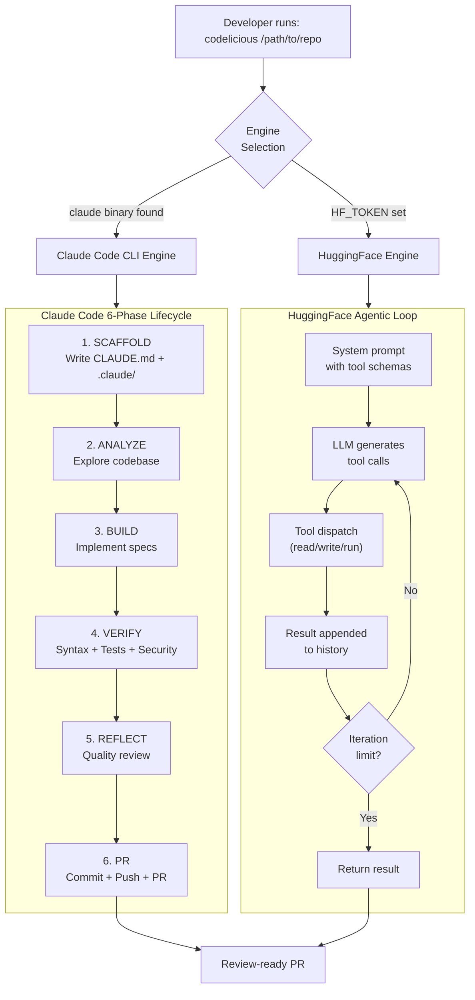
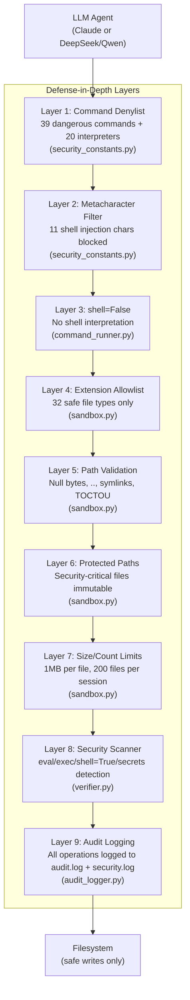
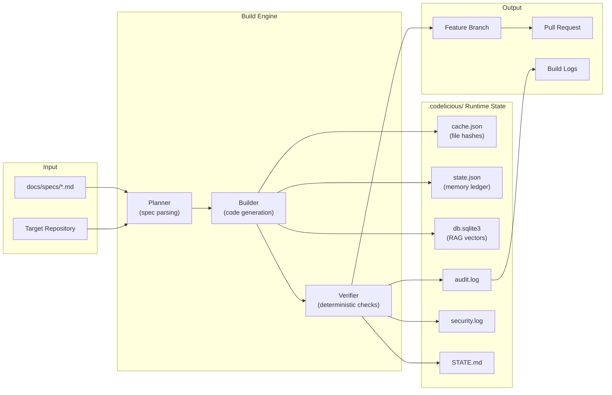
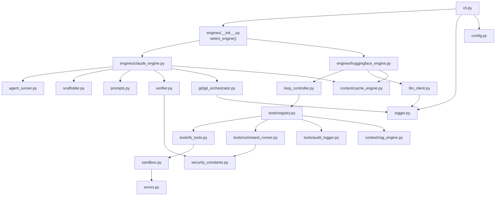

# spec-08: Hardening, Reliability, and Code Quality -- Closing Gaps From the Current Build

## 1. Executive Summary

Codelicious v1 shipped with 256 passing tests, a defense-in-depth sandbox, dual-engine
architecture, and a 6-phase Claude Code build lifecycle. The STATE.md security review
documented 42 findings (11 P1, 13 P2, 18 P3) and classified overall risk as MEDIUM.

This spec addresses every actionable gap discovered during the deep review of the live
codebase. It does not introduce net-new features. Every phase targets a concrete deficiency
in security, reliability, correctness, test coverage, documentation, or code quality that
already exists in the shipped code. The goal is to bring the codebase from MEDIUM risk to
LOW risk and from 256 tests to comprehensive coverage of all security-critical paths.

### Logic Breakdown (Current State)

| Category | Approximate % | Description |
|----------|---------------|-------------|
| Deterministic (Python safety harness) | 15% | Sandbox, verifier, command runner, git orchestrator, path validation, denylist enforcement, file extension checks, audit logging |
| Probabilistic (LLM-driven) | 85% | Spec parsing, task planning, code generation, test writing, error recovery, commit message generation, quality reflection |

This spec operates entirely within the deterministic 15% layer. No LLM prompts, model
selection, or probabilistic behavior is modified.

### Guiding Principles

- Fix what exists. Do not add features nobody asked for.
- Every change must have a test that would have failed before the fix.
- Security fixes are hardcoded in Python. Nothing is configurable by the LLM.
- All file I/O uses explicit UTF-8 encoding.
- All logging uses percent-style formatting so the SanitizingFilter can intercept arguments.
- Dead code is removed, not commented out.

---

## 2. Scope and Non-Goals

### In Scope

1. Security fixes for all P1 and P2 findings from the STATE.md review and the independent
   code quality audit.
2. Missing test coverage for CommandRunner, FSTooling, and LoopController.
3. Unimplemented CacheManager.flush_cache method.
4. BuildResult.success always-true bug in Claude engine.
5. Git staging safety (replace git add . with explicit file list).
6. Stale proxilion-build references in conftest.py.
7. Inconsistent metacharacter sets between verifier.py and command_runner.py.
8. Interpreter binary bypass in command denylist.
9. Unbounded message history in HuggingFace engine loop.
10. f-string logging calls that bypass the SanitizingFilter.
11. Missing dev dependencies declaration in pyproject.toml.
12. Global log-level mutation in audit_logger.py.
13. Documentation updates (README, CLAUDE.md, STATE.md, MEMORY.md).
14. Mermaid system architecture diagrams appended to README.md.

### Non-Goals

- New features (browser-in-the-loop, swarm architecture, vector DB -- these belong to spec-04).
- Model selection changes or prompt engineering.
- CI/CD pipeline creation (future spec).
- License or legal compliance work.
- Phase 12/13 dead code cleanup from spec-06 (already scoped there).

---

## 3. Intent and Expected Behavior

### As a developer running codelicious against a target repository:

- When the Claude engine build fails, I expect BuildResult.success to be False, not True.
  The PR automation must not transition a failed build to "Ready for Review."

- When the HuggingFace engine runs 50 iterations, I expect the message history to stay
  within a token budget so the process does not run out of memory or send 500k-token
  API requests that get rejected.

- When any module logs a message, I expect the SanitizingFilter to have the opportunity
  to redact secrets before the string is finalized. No f-string interpolation should
  occur before the filter runs.

- When I run the test suite, I expect every security-critical module to have test
  coverage: sandbox, command runner, fs_tools, verifier, audit logger, and the build
  loop controller.

- When the LLM attempts to run python3 -c or bash -c through the command runner, I expect
  it to be blocked, just as rm and sudo are blocked.

- When I install codelicious with pip install -e ".[dev]", I expect all verification
  tools (ruff, bandit, pip-audit) to be available without manual installation.

- When git stages files for commit, I expect only files written during the build session
  to be staged. No .env files, no stray temporary files, no files outside the intended
  scope.

- When CacheManager.flush_cache is called, I expect the cache dictionary to be atomically
  written to disk using the same os.replace pattern used everywhere else.

### As a security auditor reviewing the codebase:

- I expect a single, shared BLOCKED_METACHARACTERS constant used by both command_runner.py
  and verifier.py, so there is no divergence in shell injection prevention.

- I expect FSTooling.native_write_file to delegate to Sandbox rather than reimplementing
  a weaker version of path validation.

- I expect all exceptions raised by sandbox violations to use typed error classes from
  errors.py, not bare Exception.

- I expect the command denylist to include interpreter binaries (python, python3, perl,
  ruby, node, bash, sh, zsh, php) that could be used to execute arbitrary code.

- I expect audit_logger.py not to mutate global logging level names at import time.

---

## 4. Phased Implementation Plan

### Phase 1: Fix BuildResult.success Always-True Bug

**Priority:** P1 -- Correctness
**Files:** src/codelicious/engines/claude_engine.py
**Risk:** A failed build currently reports success, which can trigger PR transition on broken code.

**What to fix:**
Line 234 contains `success=build_complete or True` which evaluates to True regardless of
build_complete. Replace with `success=build_complete`.

**Acceptance criteria:**
- BuildResult.success is False when BUILD_COMPLETE sentinel file does not exist.
- BuildResult.success is True only when the sentinel file contains "DONE".
- A test exercises both cases.

**Claude Code prompt:**

```
Read src/codelicious/engines/claude_engine.py. On line 234, the expression
`build_complete or True` is always True. Fix it to `success=build_complete`.
Then write a test in tests/test_claude_engine.py that:
1. Mocks run_agent to be a no-op, mocks scaffold/scaffold_claude_dir to be no-ops.
2. Creates a temporary repo_path with no BUILD_COMPLETE file. Asserts result.success is False.
3. Creates a temporary repo_path with BUILD_COMPLETE containing "DONE". Asserts result.success is True.
Run pytest tests/test_claude_engine.py and fix any failures.
```

---

### Phase 2: Implement CacheManager.flush_cache

**Priority:** P1 -- Data Integrity
**Files:** src/codelicious/context/cache_engine.py
**Risk:** Cache mutations are lost on process exit. State diverges from disk.

**What to fix:**
The flush_cache method is a pass statement with a misleading docstring. Implement it using
the atomic write pattern (write to tempfile, os.replace). Also implement the disk flush in
record_memory_mutation which currently only appends to the in-memory list.

Additionally, all read_text() calls in this file lack explicit encoding="utf-8".

**Acceptance criteria:**
- flush_cache writes cache_dict to cache.json atomically using tempfile + os.replace.
- record_memory_mutation writes the updated state to state.json atomically after appending.
- All read_text and write_text calls specify encoding="utf-8".
- A test verifies that flush_cache persists data that survives a new CacheManager instance.
- A test verifies that record_memory_mutation persists the ledger entry to disk.

**Claude Code prompt:**

```
Read src/codelicious/context/cache_engine.py. The flush_cache method is unimplemented (pass).
The record_memory_mutation method appends to an in-memory list but never writes to disk.

Implement flush_cache using this pattern:
1. Import tempfile and os at the top.
2. Write json.dumps(cache_dict, indent=2) to a NamedTemporaryFile in self.codelicious_dir
   with delete=False, encoding="utf-8".
3. os.replace the temp file to self.cache_file.
4. Wrap in try/except to clean up the temp file on failure.

Implement record_memory_mutation to call flush on the state file after appending:
1. After state["memory_ledger"].append(interaction_summary), write state to self.state_file
   using the same atomic pattern.

Fix all read_text() calls to include encoding="utf-8".
Fix all write_text() calls to include encoding="utf-8".
Fix all f-string logger calls to use percent-style: logger.warning("msg: %s", var).

Write tests in tests/test_cache_engine.py:
1. test_flush_cache_persists_data -- flush, create new CacheManager, load, assert match.
2. test_record_memory_mutation_persists -- record, create new CacheManager, load, assert entry exists.
3. test_flush_cache_atomic_on_failure -- mock os.replace to raise, assert original file unchanged.

Run pytest tests/test_cache_engine.py and fix any failures.
```

---

### Phase 3: Unify Metacharacter Constants and Add Interpreter Denylist

**Priority:** P1 -- Security
**Files:** src/codelicious/tools/command_runner.py, src/codelicious/verifier.py
**Risk:** Inconsistent metacharacter sets create bypass opportunities. Missing interpreter
binaries allow arbitrary code execution through python3 -c, bash -c, etc.

**What to fix:**

1. Create a shared constant in a new file src/codelicious/security_constants.py that both
   modules import.
2. The canonical set is: `frozenset("|&;$`(){}><!")`  -- the superset from command_runner.py.
3. Add interpreter binaries to DENIED_COMMANDS: python, python3, python2, perl, ruby, node,
   nodejs, bash, sh, zsh, fish, dash, csh, tcsh, ksh, php, lua, Rscript, julia, pwsh,
   powershell.
4. Update verifier.py to import and use the shared constant instead of its local set.

**Acceptance criteria:**
- A single BLOCKED_METACHARACTERS constant exists in security_constants.py.
- Both command_runner.py and verifier.py import from security_constants.py.
- DENIED_COMMANDS includes all interpreter binaries listed above.
- Existing tests still pass.
- New tests in tests/test_command_runner.py verify:
  - Each denied command is blocked (parametrize over the full set).
  - Each metacharacter is blocked (parametrize over the full set).
  - Path-prefixed binaries (/usr/bin/rm, /usr/local/bin/python3) are caught.
  - Allowed commands (pytest, ruff, npm, cargo) pass through.
  - Commands with script extensions (rm.sh, sudo.bat) are caught.

**Claude Code prompt:**

```
Create src/codelicious/security_constants.py with two frozensets:

BLOCKED_METACHARACTERS containing: | & ; $ ` ( ) { } > < !

DENIED_COMMANDS containing all commands currently in command_runner.py PLUS these
interpreter binaries: python, python3, python2, perl, ruby, node, nodejs, bash, sh,
zsh, fish, dash, csh, tcsh, ksh, php, lua, Rscript, julia, pwsh, powershell.

Update src/codelicious/tools/command_runner.py to:
1. Import BLOCKED_METACHARACTERS and DENIED_COMMANDS from security_constants.
2. Remove the local definitions.

Update src/codelicious/verifier.py to:
1. Import BLOCKED_METACHARACTERS from security_constants.
2. Replace the local metacharacter set in check_custom_command with the imported constant.

Create tests/test_command_runner.py with:
1. test_denied_commands_blocked -- parametrize over every entry in DENIED_COMMANDS.
2. test_metacharacters_blocked -- parametrize over every char in BLOCKED_METACHARACTERS.
3. test_path_prefixed_binaries_blocked -- /usr/bin/rm, /usr/local/bin/python3.
4. test_allowed_commands_pass -- pytest, ruff, npm test, cargo build.
5. test_script_extensions_blocked -- rm.sh, sudo.bat, kill.zsh.
6. test_empty_command_blocked.

Run the full test suite with pytest and fix any failures.
```

---

### Phase 4: Unify FSTooling Write Path Through Sandbox

**Priority:** P1 -- Security
**Files:** src/codelicious/tools/fs_tools.py, src/codelicious/tools/registry.py
**Risk:** FSTooling.native_write_file has a weaker security model than Sandbox.write_file.
The HuggingFace engine routes all writes through FSTooling, bypassing extension allowlisting,
denied patterns, file size limits, and file count limits.

**What to fix:**

1. Add a Sandbox instance to FSTooling.__init__ (constructed from repo_path with sensible
   defaults).
2. Rewrite native_write_file to delegate to self.sandbox.write_file(rel_path, content).
3. Remove the local _assert_in_sandbox, PROTECTED_PATHS, _is_protected_path, and the
   manual tempfile logic from FSTooling -- all of this is now handled by Sandbox.
4. Keep native_read_file and native_list_directory as they are (reads do not need the
   full sandbox).
5. Update the ToolRegistry to pass a Sandbox instance when constructing FSTooling, or
   let FSTooling construct its own.
6. Change the bare Exception in _assert_in_sandbox (which is now removed) -- ensure that
   any remaining sandbox violations use SandboxViolationError from errors.py.

**Acceptance criteria:**
- FSTooling.native_write_file delegates entirely to Sandbox.write_file.
- All Sandbox protections (extension allowlist, denied patterns, size limits, count limits,
  symlink detection, TOCTOU mitigation) apply to HuggingFace engine writes.
- Existing test_sandbox.py tests still pass.
- New tests in tests/test_fs_tools.py verify:
  - Path traversal via "../../../etc/passwd" is blocked.
  - Writing to .env is blocked.
  - Writing a .exe file is blocked (extension not allowed).
  - Writing to a protected path (e.g., .codelicious/config.json) is blocked.
  - Writing a valid .py file inside the repo succeeds.
  - Reading a file that exists returns its content.
  - Reading a file outside the sandbox is blocked.
  - Listing a directory returns expected entries.

**Claude Code prompt:**

```
Read src/codelicious/tools/fs_tools.py and src/codelicious/sandbox.py.

Refactor FSTooling to delegate writes to Sandbox:

1. Add `from codelicious.sandbox import Sandbox` at the top.
2. In __init__, add: self.sandbox = Sandbox(repo_path)
3. Rewrite native_write_file to:
   - Call self.sandbox.write_file(rel_path, content)
   - Return success ToolResponse on success
   - Catch any codelicious.errors exception and return failure ToolResponse with the
     error message (do NOT leak the full traceback to the LLM)
4. Remove _assert_in_sandbox, PROTECTED_PATHS, _is_protected_path -- Sandbox handles all of this.
5. Update native_read_file to use self.sandbox.resolve_path for path validation instead
   of the removed _assert_in_sandbox. Catch PathTraversalError specifically.

Create tests/test_fs_tools.py with the acceptance criteria tests listed above. Use tmp_path
fixtures to create isolated test directories.

Run pytest tests/test_fs_tools.py and fix any failures.
```

---

### Phase 5: Fix Git Staging to Use Explicit File Lists

**Priority:** P1 -- Security
**Files:** src/codelicious/git/git_orchestrator.py
**Risk:** git add . stages everything in the working tree including .env files, secrets,
and stray files created by the LLM through the Claude engine's --dangerously-skip-permissions
bypass.

**What to fix:**

1. Change commit_verified_changes to accept an optional list of file paths to stage.
2. If a file list is provided, run git add on each file individually instead of git add .
3. If no file list is provided (backwards compatibility), fall back to git add . but add
   a .gitignore safety check: warn if any file matching *.env*, *secret*, *credential*,
   *token*, *.pem, *.key patterns would be staged.
4. Add a pre-commit check that runs git diff --cached --name-only and scans the output
   for suspicious file patterns before executing git commit.

**Acceptance criteria:**
- When called with a file list, only those files are staged.
- When called without a file list, git add . runs but a warning is logged if sensitive
  file patterns are detected in the staging area.
- A pre-commit scan logs warnings for .env, .pem, .key, and credential files.
- Existing git orchestrator tests still pass.
- New test verifies that explicit file staging works correctly.

**Claude Code prompt:**

```
Read src/codelicious/git/git_orchestrator.py.

Modify commit_verified_changes:
1. Add parameter: files_to_stage: list[str] | None = None
2. If files_to_stage is provided and non-empty:
   - Run git add for each file individually: self._run_cmd(["git", "add", f])
3. If files_to_stage is None or empty:
   - Run git add . as before
   - After staging, run git diff --cached --name-only to get staged files
   - Check each staged file against SENSITIVE_PATTERNS = {".env", ".pem", ".key",
     "secret", "credential", "token", "id_rsa", "id_ed25519"}
   - Log a warning for each match: logger.warning("Potentially sensitive file staged: %s", f)
4. Add the SENSITIVE_PATTERNS as a module-level frozenset.

Write a test in tests/test_git_orchestrator.py that:
1. Creates a tmp git repo with git init.
2. Creates a .env file and a src/main.py file.
3. Calls commit_verified_changes with files_to_stage=["src/main.py"].
4. Asserts that .env is NOT in the committed files (git show --stat).

Run pytest tests/test_git_orchestrator.py and fix any failures.
```

---

### Phase 6: Bound Message History in HuggingFace Engine

**Priority:** P2 -- Reliability/Performance
**Files:** src/codelicious/loop_controller.py, src/codelicious/engines/huggingface_engine.py
**Risk:** Unbounded O(n-squared) token growth across 50 iterations can cause OOM or API
rejection for payloads exceeding model context limits.

**What to fix:**

1. Add a MAX_HISTORY_TOKENS constant (default: 80000) to loop_controller.py.
2. Before each LLM call, estimate the total token count of the message history using the
   existing estimate_tokens function from context_manager.py.
3. If the total exceeds MAX_HISTORY_TOKENS, truncate from the front: keep the system
   message (index 0), remove the oldest non-system messages until the total is under budget.
4. Log a warning each time truncation occurs with the number of messages removed and the
   token count before/after.

**Acceptance criteria:**
- Message history stays under MAX_HISTORY_TOKENS across all iterations.
- The system message is never truncated.
- A test creates a message list that exceeds the budget and verifies truncation occurs.
- A test verifies the system message is preserved after truncation.

**Claude Code prompt:**

```
Read src/codelicious/loop_controller.py and src/codelicious/context/context_manager.py.

Add message history truncation to the build loop:

1. Import estimate_tokens from context_manager (or implement a simple len-based estimator
   if estimate_tokens is not suitable: tokens ~ len(text) / 4).
2. Add MAX_HISTORY_TOKENS = 80_000 at module level.
3. Create a function truncate_history(messages: list[dict], max_tokens: int) -> list[dict]:
   - Calculate total tokens across all messages.
   - If under max_tokens, return messages unchanged.
   - Keep messages[0] (system message) always.
   - Remove messages starting from index 1 until total is under budget.
   - Log: logger.warning("Truncated %d messages from history (tokens: %d -> %d)", ...)
   - Return the truncated list.
4. Call truncate_history(messages, MAX_HISTORY_TOKENS) before each LLM API call.

Write tests in tests/test_loop_controller.py:
1. test_truncation_under_budget -- no messages removed when under limit.
2. test_truncation_over_budget -- messages removed when over limit.
3. test_system_message_preserved -- system message always kept.

Run pytest tests/test_loop_controller.py and fix any failures.
```

---

### Phase 7: Fix Logging to Use Percent-Style Formatting Everywhere

**Priority:** P2 -- Security
**Files:** Multiple (see list below)
**Risk:** f-string logging calls bypass the SanitizingFilter, potentially leaking API keys,
error bodies, and other sensitive data into log files and stderr.

**Files to fix:**
- src/codelicious/llm_client.py
- src/codelicious/loop_controller.py
- src/codelicious/tools/command_runner.py
- src/codelicious/context/cache_engine.py
- src/codelicious/git/git_orchestrator.py
- src/codelicious/engines/huggingface_engine.py

**What to fix:**
Replace every `logger.xxx(f"...")` call with `logger.xxx("...", ...)` using percent-style
placeholders (%s, %d, etc.).

**Acceptance criteria:**
- Zero f-string logger calls remain in the codebase.
- A grep for `logger\.(debug|info|warning|error|critical)\(f"` returns zero matches.
- All existing tests still pass (logging output format may change but behavior does not).

**Claude Code prompt:**

```
Search the entire src/codelicious/ directory for logger calls using f-strings:
grep -rn 'logger\.\(debug\|info\|warning\|error\|critical\)(f"' src/codelicious/

For every match, convert from f-string to percent-style formatting. Examples:
  BEFORE: logger.info(f"LLM Planner: {self.planner_model} | Coder: {self.coder_model}")
  AFTER:  logger.info("LLM Planner: %s | Coder: %s", self.planner_model, self.coder_model)

  BEFORE: logger.debug(f"Executing sandboxed command: {args}")
  AFTER:  logger.debug("Executing sandboxed command: %s", args)

  BEFORE: logger.warning(f"Failed to load cache.json: {e}")
  AFTER:  logger.warning("Failed to load cache.json: %s", e)

Do this for EVERY f-string logger call in every file under src/codelicious/.
After fixing, run: grep -rn 'logger\.\(debug\|info\|warning\|error\|critical\)(f"' src/codelicious/
Verify zero results. Then run the full test suite with pytest.
```

---

### Phase 8: Fix audit_logger.py Global Log Level Mutation

**Priority:** P2 -- Code Quality
**Files:** src/codelicious/tools/audit_logger.py
**Risk:** Importing audit_logger.py globally mutates Python's log level names for the
entire process, injecting ANSI escape codes into all loggers including file handlers,
CI collectors, and third-party libraries.

**What to fix:**

1. Remove the three logging.addLevelName calls from module scope.
2. Create a custom Formatter subclass (AuditFormatter) that adds ANSI color codes to the
   level name only when the output stream is a TTY.
3. Apply AuditFormatter to the console handler only, not file handlers.

**Acceptance criteria:**
- Importing audit_logger does not mutate global logging state.
- Console output to a TTY still shows colored level names.
- File output and non-TTY output shows plain level names (INFO, WARNING, ERROR).
- Existing test_security_audit.py tests still pass.

**Claude Code prompt:**

```
Read src/codelicious/tools/audit_logger.py.

Remove lines 8-10 (the three logging.addLevelName calls at module scope).

Add a custom formatter class:

class AuditFormatter(logging.Formatter):
    COLORS = {
        logging.INFO: "\033[1;36m[AGENT INFO]\033[0m",
        logging.WARNING: "\033[1;33m[AGENT WARN]\033[0m",
        logging.ERROR: "\033[1;31m[AGENT ERROR]\033[0m",
    }

    def __init__(self, fmt=None, datefmt=None, style="%", use_color=False):
        super().__init__(fmt, datefmt, style)
        self.use_color = use_color

    def format(self, record):
        if self.use_color and record.levelno in self.COLORS:
            record.levelname = self.COLORS[record.levelno]
        return super().format(record)

Update the AuditLogger class to use AuditFormatter with use_color=sys.stderr.isatty()
for its console handler and use_color=False for file handlers.

Run pytest tests/test_security_audit.py and fix any failures.
```

---

### Phase 9: Fix conftest.py Stale proxilion-build References

**Priority:** P2 -- Test Correctness
**Files:** tests/conftest.py
**Risk:** The tmp_project_dir fixture creates .proxilion-build/ instead of .codelicious/,
causing any test that relies on this fixture to operate on the wrong state directory.

**What to fix:**
1. Replace ".proxilion-build" with ".codelicious" in the directory name.
2. Replace "proxilion-build State" with "codelicious Build State" in the STATE.md content.
3. Update the docstring and module docstring from "proxilion-build" to "codelicious".

**Acceptance criteria:**
- Zero references to "proxilion" remain in any test file.
- A grep for "proxilion" in the tests/ directory returns zero matches.
- All existing tests still pass.

**Claude Code prompt:**

```
Read tests/conftest.py.

Replace all occurrences:
1. ".proxilion-build" -> ".codelicious"
2. "proxilion-build State" -> "codelicious Build State"
3. "proxilion-build" in the module docstring -> "codelicious"

Run: grep -rn "proxilion" tests/
Verify zero results. Then run pytest to confirm all tests pass.
```

---

### Phase 10: Sanitize LLM API Error Bodies in Exception Messages

**Priority:** P2 -- Security
**Files:** src/codelicious/llm_client.py
**Risk:** Raw HTTP error bodies from LLM providers can contain account identifiers, billing
info, and diagnostic tokens. These are logged at ERROR level and embedded in RuntimeError
messages that propagate through the exception chain and can be sent back to the LLM as
error context.

**What to fix:**

1. Log the full error body at DEBUG level only.
2. Raise RuntimeError with a sanitized message containing only the status code and a
   generic description.
3. Apply the same treatment to any other location where external API error bodies are
   embedded in exception messages.

**Acceptance criteria:**
- Full error bodies are only visible at DEBUG log level.
- RuntimeError messages contain only the status code and a generic message.
- The SanitizingFilter still runs on DEBUG-level messages (it already does).
- A test verifies that the raised RuntimeError does not contain the raw error body.

**Claude Code prompt:**

```
Read src/codelicious/llm_client.py.

Find the HTTPError handler (around line 117-119). Change from:
  error_body = e.read().decode("utf-8")
  logger.error(f"HTTPError {e.code}: {error_body}")
  raise RuntimeError(f"LLM API Error ({model}): {e.code} - {error_body}")

To:
  error_body = e.read().decode("utf-8")
  logger.debug("LLM API error body (status %s): %s", e.code, error_body)
  raise RuntimeError(
      "LLM API Error (%s): HTTP %s - see debug logs for details" % (model, e.code)
  )

Search for any other locations where external error bodies are embedded in exceptions
and apply the same pattern.

Write a test in tests/test_llm_client.py that:
1. Mocks urllib to raise an HTTPError with a body containing "account_id: acct_12345".
2. Asserts the RuntimeError message does NOT contain "acct_12345".
3. Asserts "HTTP" and the status code ARE in the message.

Run pytest tests/test_llm_client.py and fix any failures.
```

---

### Phase 11: Cap RAG Engine top_k and Add SQLite Index ✓

**Priority:** P3 -- Performance/Reliability
**Files:** src/codelicious/context/rag_engine.py
**Risk:** Unbounded top_k allows the LLM to request all vectors, causing memory exhaustion.
Missing index on file_path causes full table scans on DELETE.

**What to fix:**

1. Cap top_k to a maximum of 20 inside semantic_search. Log a warning if the requested
   value exceeds the cap.
2. Add a CREATE INDEX IF NOT EXISTS on file_path in the _init_db method.
3. Use cursor.fetchmany() or iterate with a generator instead of fetchall() to avoid
   loading all vectors into memory simultaneously.

**Acceptance criteria:**
- semantic_search with top_k=100000 returns at most 20 results.
- A warning is logged when top_k is capped.
- The SQLite schema includes an index on file_path.
- A test verifies the top_k cap behavior.

**Claude Code prompt:**

```
Read src/codelicious/context/rag_engine.py.

1. In semantic_search, add at the start:
   MAX_TOP_K = 20
   if top_k > MAX_TOP_K:
       logger.warning("top_k=%d exceeds maximum, capping to %d", top_k, MAX_TOP_K)
       top_k = MAX_TOP_K

2. In _init_db, after the CREATE TABLE statement, add:
   cursor.execute(
       "CREATE INDEX IF NOT EXISTS idx_file_chunks_path ON file_chunks(file_path)"
   )

3. Replace cursor.fetchall() in semantic_search with an iterative approach:
   - Use cursor.execute(...) and iterate with for row in cursor: to avoid loading
     all rows into memory at once.
   - Accumulate results using a heapq of size top_k for O(n log k) performance.

Write a test in tests/test_rag_engine.py that:
1. Inserts 50 chunks.
2. Calls semantic_search with top_k=100.
3. Asserts the result length is at most 20.

Run pytest tests/test_rag_engine.py and fix any failures.
```

---

### Phase 12: Declare Dev Dependencies in pyproject.toml

**Priority:** P3 -- Developer Experience
**Files:** pyproject.toml
**Risk:** Developers and CI runners that install from pyproject.toml cannot run the full
verification pipeline because ruff, bandit, and pip-audit are not declared as dependencies.

**What to fix:**

1. Add a [project.optional-dependencies] dev group with: ruff, bandit, pip-audit, pytest,
   pytest-cov.
2. Keep the existing test group for backwards compatibility.
3. Update the README Quick Start to mention pip install -e ".[dev]".

**Acceptance criteria:**
- pip install -e ".[dev]" installs all verification tools.
- The test optional-dependencies group still works independently.
- README Quick Start reflects the new install command.

**Claude Code prompt:**

```
Read pyproject.toml.

Add under [project.optional-dependencies]:
dev = [
    "pytest>=7.0",
    "pytest-cov>=4.0",
    "ruff>=0.4.0",
    "bandit>=1.7.0",
    "pip-audit>=2.6.0",
]

Keep the existing test group as-is for backwards compatibility.

Read README.md. In the Quick Start section, change:
  pip install -e .
To:
  pip install -e ".[dev]"

Add a note below it: "# Or minimal install without dev tools: pip install -e ."
```

---

### Phase 13: Fix BuildSession.__exit__ Success Reporting ✓

**Priority:** P3 -- Correctness
**Files:** src/codelicious/build_logger.py
**Risk:** BuildSession context manager reports success based on exception presence, not
actual build result. A build that catches its own errors and returns BuildResult(success=False)
will be recorded as successful in summary.json.

**What to fix:**

1. Add a result attribute to BuildSession initialized to None.
2. Add a set_result(success: bool) method.
3. In __exit__, use self.result if it has been set, otherwise fall back to exc_type is None.
4. Document that callers should call session.set_result(result.success) before exiting
   the context manager.

**Acceptance criteria:**
- When set_result(False) is called, __exit__ records success=False even without an exception.
- When set_result is not called, the existing behavior (exc_type is None) is preserved.
- A test exercises both paths.

**Claude Code prompt:**

```
Read src/codelicious/build_logger.py. Find the BuildSession class.

Add:
1. In __init__: self._explicit_success: bool | None = None
2. New method:
   def set_result(self, success: bool) -> None:
       self._explicit_success = success
3. In __exit__, change:
   self.close(success=(exc_type is None))
   To:
   if self._explicit_success is not None:
       self.close(success=self._explicit_success)
   else:
       self.close(success=(exc_type is None))

Write a test:
1. Use BuildSession as context manager, call set_result(False), exit normally.
   Assert summary.json shows success=False.
2. Use BuildSession as context manager, do NOT call set_result, exit normally.
   Assert summary.json shows success=True (backwards compatible).

Run pytest and fix any failures.
```

---

### Phase 14: Add Missing .gitignore Entries

**Priority:** P3 -- Safety
**Files:** .gitignore (create if not present at repo root)
**Risk:** Without proper .gitignore entries, git add . can stage sensitive runtime files.

**What to fix:**
Ensure the following patterns are in .gitignore:
- .env
- .env.*
- !.env.example
- .codelicious/
- *.pem
- *.key
- __pycache__/
- *.pyc
- dist/
- build/
- *.egg-info/
- .pytest_cache/
- .ruff_cache/
- *.sqlite3

**Acceptance criteria:**
- .gitignore exists at repo root with all listed patterns.
- git status does not show .codelicious/ or __pycache__/ as untracked.

**Claude Code prompt:**

```
Check if .gitignore exists at the repo root. If it does, read it and add any missing
entries from the list below. If it does not exist, create it.

Required entries:
.env
.env.*
!.env.example
.codelicious/
*.pem
*.key
__pycache__/
*.pyc
dist/
build/
*.egg-info/
.pytest_cache/
.ruff_cache/
*.sqlite3
.DS_Store
```

---

### Phase 15: Comprehensive Test Suite Expansion and Verification

**Priority:** P1 -- Quality Gate
**Files:** tests/ (all test files)
**Risk:** Without comprehensive test coverage of security-critical modules, regressions can
ship undetected.

**What to fix:**
This phase runs the full test suite, identifies any failures introduced by Phases 1-14,
and fixes them. It also adds any missing edge-case tests.

**Test coverage targets by module:**
| Module | Current Tests | Target Tests |
|--------|--------------|--------------|
| command_runner.py | 0 | 15+ |
| fs_tools.py | 0 | 10+ |
| loop_controller.py | 0 | 5+ |
| cache_engine.py | 0 | 5+ |
| claude_engine.py | 0 | 3+ |
| llm_client.py | 0 | 3+ |
| rag_engine.py | existing | +3 |
| git_orchestrator.py | existing | +3 |
| build_logger.py | existing | +2 |
| sandbox.py | 46 | 46+ (no regression) |
| verifier.py | 57 | 57+ (no regression) |

**Acceptance criteria:**
- All tests pass (zero failures).
- Lint passes (ruff check).
- Format passes (ruff format --check).
- Security scan passes (no eval, exec, shell=True, hardcoded secrets).
- Total test count is at least 300 (up from 256).

**Claude Code prompt:**

```
Run the full test suite: python -m pytest tests/ -v
If any tests fail, read the failing test file and the source file it tests, diagnose the
root cause, and fix it.

After all tests pass, run:
1. ruff check src/ tests/
2. ruff format --check src/ tests/
3. grep -rn "eval(" src/codelicious/ (should return zero outside of comments/strings)
4. grep -rn "exec(" src/codelicious/ (should return zero outside of comments/strings)
5. grep -rn "shell=True" src/codelicious/ (should return zero)

Fix any issues found. Re-run until all checks are green.

Report the final test count and any remaining warnings.
```

---

### Phase 16: Update Documentation and State

**Priority:** P2 -- Maintainability
**Files:** README.md, CLAUDE.md, .codelicious/STATE.md, .claude/projects/*/MEMORY.md

**What to fix:**

1. Update .codelicious/STATE.md to reflect spec-08 completion status.
2. Update README.md Security Model section to mention interpreter binary blocking and
   unified metacharacter constants.
3. Append Mermaid architecture diagrams to README.md (see Section 5 of this spec).
4. Verify CLAUDE.md is accurate and up to date.
5. Record key decisions in memory files for future conversation context.

**Acceptance criteria:**
- STATE.md reflects spec-08 status and updated test count.
- README.md contains Mermaid diagrams (see Section 5).
- All documentation references are accurate.

**Claude Code prompt:**

```
Update .codelicious/STATE.md:
1. Set Current Spec to spec-08.
2. Set Phase to the current phase being worked on.
3. Update test count after all phases are complete.
4. Add spec-08 to the Completed Tasks section with all phase checkboxes.

Update the README.md Security Model section to add:
- "Interpreter binary denylist -- python, bash, node, perl, ruby, php and 15+ other
  interpreters blocked to prevent arbitrary code execution"
- "Unified security constants -- single source of truth for metacharacter and command
  deny lists across all modules"

Append the Mermaid diagrams from spec-08 Section 5 to the bottom of README.md under
a new "## Architecture Diagrams" heading.
```

---

## 5. System Architecture Diagrams (Mermaid)

The following diagrams should be appended to README.md under an "## Architecture Diagrams"
heading.

### 5.1 High-Level Build Lifecycle



### 5.2 Security Architecture (Defense in Depth)



### 5.3 Data Flow and State Management



### 5.4 Module Dependency Graph



---

## 6. Quick Install and Verification

```bash
# Clone the repository
git clone https://github.com/clay-good/codelicious.git
cd codelicious

# Install with all development tools
pip install -e ".[dev]"

# Run the full test suite
python -m pytest tests/ -v

# Run lint and format checks
ruff check src/ tests/
ruff format --check src/ tests/

# Run security scan
grep -rn "eval(" src/codelicious/
grep -rn "shell=True" src/codelicious/

# Run codelicious against a target repo
codelicious /path/to/your/repo
```

---

## 7. Sample Dummy Data for Testing

Each phase's Claude Code prompt includes specific test fixtures. Below are additional
sample data definitions for integration testing:

### Sample Spec File (for end-to-end tests)

```markdown
# Feature: Calculator

## Requirements
- Add function that adds two numbers
- Add function that subtracts two numbers
- Write tests for both functions

## Acceptance Criteria
- All tests pass
- No hardcoded values
- Functions have type hints
```

### Sample Config (for cache_engine tests)

```json
{
  "file_hashes": {
    "src/main.py": "a1b2c3d4e5f6",
    "tests/test_main.py": "f6e5d4c3b2a1"
  },
  "ast_exports": {}
}
```

### Sample State Ledger (for state persistence tests)

```json
{
  "memory_ledger": [
    "Implemented calculator add function",
    "Added pytest test coverage for add",
    "Fixed type hint on subtract return value"
  ],
  "completed_tasks": [
    "task-1: Implement add function",
    "task-2: Implement subtract function"
  ]
}
```

### Sample Security Violation Inputs (for sandbox tests)

| Input | Expected Result | Module |
|-------|----------------|--------|
| ../../../etc/passwd | PathTraversalError | sandbox.py |
| .env.production | DeniedPathError | sandbox.py |
| payload.exe | DisallowedExtensionError | sandbox.py |
| python3 -c "import os" | Denied command | command_runner.py |
| pytest; rm -rf / | Blocked metacharacter | command_runner.py |
| /usr/bin/sudo apt install | Denied command | command_runner.py |

---

## 8. Phase Execution Order and Dependencies

```
Phase 1  (BuildResult bug)           -- no dependencies, start immediately
Phase 2  (CacheManager flush)        -- no dependencies, start immediately
Phase 3  (Security constants)        -- no dependencies, start immediately
Phase 4  (FSTooling -> Sandbox)      -- depends on Phase 3 (uses security_constants)
Phase 5  (Git staging)               -- no dependencies, start immediately
Phase 6  (Message history bounds)    -- no dependencies, start immediately
Phase 7  (Logging format)            -- no dependencies, start immediately
Phase 8  (Audit logger fix)          -- no dependencies, start immediately
Phase 9  (conftest.py fix)           -- no dependencies, start immediately
Phase 10 (API error sanitization)    -- no dependencies, start immediately
Phase 11 (RAG engine caps)           -- no dependencies, start immediately
Phase 12 (pyproject.toml deps)       -- no dependencies, start immediately
Phase 13 (BuildSession exit fix)     -- no dependencies, start immediately
Phase 14 (.gitignore)                -- no dependencies, start immediately
Phase 15 (Full test suite)           -- depends on ALL previous phases
Phase 16 (Documentation + diagrams)  -- depends on Phase 15
```

Phases 1-14 are independent of each other (except Phase 4 depends on Phase 3) and can
be executed in parallel by separate builder agents. Phase 15 is the integration gate.
Phase 16 is the documentation pass.

---

## 9. Success Criteria

This spec is complete when:

1. All 16 phases have been implemented and verified.
2. The test suite passes with at least 300 tests (up from 256).
3. Zero f-string logger calls remain in src/codelicious/.
4. Zero references to "proxilion" remain in tests/.
5. CacheManager.flush_cache is implemented and tested.
6. BuildResult.success correctly reflects build outcome.
7. FSTooling delegates writes to Sandbox.
8. DENIED_COMMANDS includes interpreter binaries.
9. BLOCKED_METACHARACTERS is a single shared constant.
10. Message history is bounded in the HuggingFace engine loop.
11. Git staging uses explicit file lists or warns on sensitive patterns.
12. README.md contains Mermaid architecture diagrams.
13. .codelicious/STATE.md reflects spec-08 completion.
14. pip install -e ".[dev]" installs all verification tools.
15. .gitignore covers all sensitive and generated file patterns.
16. Overall risk assessment drops from MEDIUM to LOW.

---

## 10. Rollback Plan

Each phase modifies a small, isolated set of files. If a phase introduces a regression:

1. Revert the specific phase's changes using git revert on its commit.
2. Re-run the test suite to confirm the revert is clean.
3. Investigate the root cause before re-attempting.

No phase modifies the LLM prompt templates, model selection, or probabilistic behavior.
All changes are within the deterministic safety harness. A full revert of spec-08 returns
the codebase to its pre-spec-08 state with no behavioral changes to the LLM-driven
workflow.
