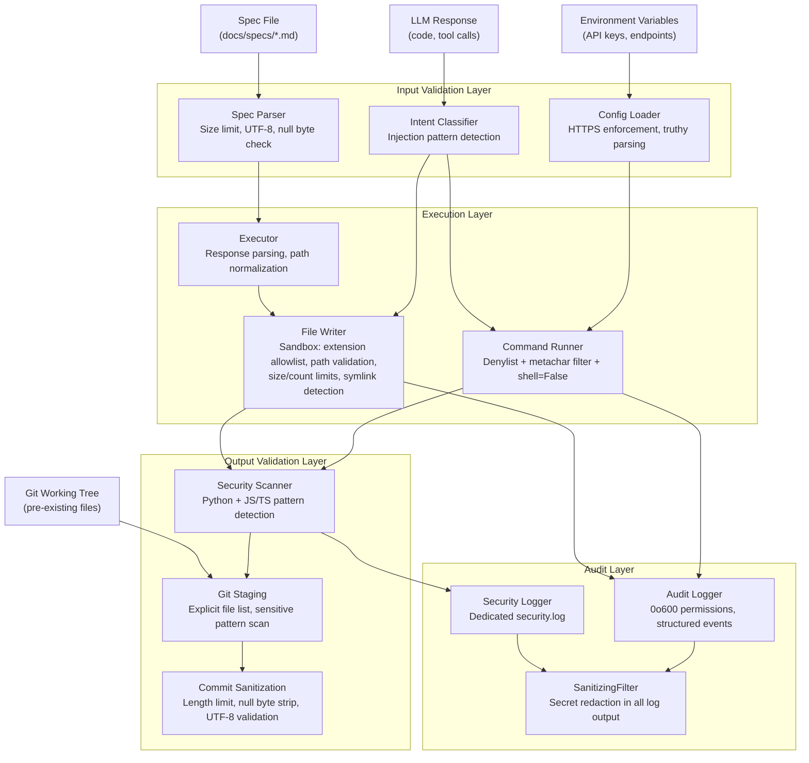
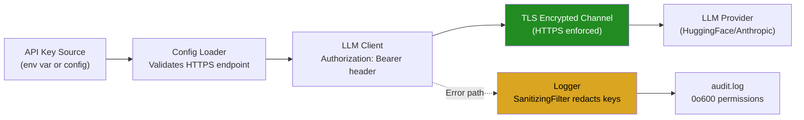

# spec-09: Deep Security Remediation, Reliability Hardening, and Test Completeness

## 1. Executive Summary

Spec-08 addressed the 42 findings from the original STATE.md security review. This spec
addresses an additional 24 findings discovered during a second, independent deep review
of the live codebase performed on 2026-03-16. These findings include four CRITICAL
issues, nine HIGH issues, and eleven MEDIUM issues that spec-08 does not cover.

The most severe finding is that the Claude Code engine hardcodes the
--dangerously-skip-permissions flag with no opt-out, meaning every agent invocation runs
with maximum filesystem and tool permissions. The second most severe finding is that the
LLM endpoint URL is user-configurable via environment variable but the code never
validates that the endpoint uses HTTPS, allowing API keys to be transmitted in cleartext
if an attacker controls the LLM_ENDPOINT variable. The third is that git add . stages
pre-existing sensitive files that were never written by codelicious. The fourth is that
the Claude engine always returns success=True regardless of build outcome (also covered
by spec-08 Phase 1 but with a different root cause identified here: the expression
build_complete or True is used).

This spec does not introduce net-new features. Every phase targets a concrete deficiency
in security, reliability, correctness, test coverage, or code quality that already exists
in the shipped code.

### Logic Breakdown (Current State)

| Category | Approximate % | Description |
|----------|---------------|-------------|
| Deterministic (Python safety harness) | 15% | Sandbox, verifier, command runner, git orchestrator, path validation, denylist enforcement, file extension checks, audit logging, config loading, build session management |
| Probabilistic (LLM-driven) | 85% | Spec parsing, task planning, code generation, test writing, error recovery, commit message generation, quality reflection, intent classification |

This spec operates entirely within the deterministic 15% layer. No LLM prompts, model
selection, or probabilistic behavior is modified.

### Relationship to spec-08

Spec-08 covers: BuildResult always-true bug, CacheManager stubs, metacharacter unification,
FSTooling-to-Sandbox delegation, git staging safety, message history bounds, f-string
logging, audit_logger global mutation, conftest proxilion references, API error sanitization,
RAG engine caps, pyproject dev deps, BuildSession exit fix, gitignore entries, test
expansion, and documentation updates.

This spec covers issues NOT addressed by spec-08: --dangerously-skip-permissions opt-in,
HTTPS endpoint validation, dead code removal (loop_controller.py), audit/security log
file permissions, SQLite DB file permissions, read_text encoding inconsistency,
commit message sanitization, security scanner multi-language support, secret regex
accuracy, wrong logger name in test_sandbox.py, executor markdown filter for exact-name
files, build_logger cleanup fragility, onerror closure scoping, logger SanitizingFilter
%s bug, and comprehensive missing test coverage for llm_client, git_orchestrator,
rag_engine, and huggingface_engine.

Where spec-08 covers a finding partially, this spec extends the fix with additional
hardening not specified there.

### Guiding Principles

- Fix what exists. Do not add features nobody asked for.
- Every change must have a test that would have failed before the fix.
- Security fixes are hardcoded in Python. Nothing is configurable by the LLM.
- All file I/O uses explicit UTF-8 encoding.
- Dead code is removed, not commented out.
- Prefer allowlists over denylists where feasible.
- Validate at system boundaries (user input, environment variables, external APIs).

---

## 2. Scope and Non-Goals

### In Scope

1. --dangerously-skip-permissions opt-in mechanism (agent_runner.py).
2. HTTPS endpoint validation for LLM API calls (llm_client.py, rag_engine.py).
3. Dead code removal: loop_controller.py (duplicate of huggingface_engine.py).
4. File permission hardening for audit.log, security.log, db.sqlite3.
5. read_text encoding consistency (fs_tools.py).
6. Commit message sanitization (git_orchestrator.py).
7. Security scanner multi-language support (verifier.py).
8. Secret detection regex accuracy (verifier.py).
9. Wrong logger name in test_sandbox.py (test correctness).
10. Executor markdown filter for Makefile/Dockerfile (executor.py).
11. build_logger cleanup_old_builds fragility (build_logger.py).
12. onerror closure scoping in cleanup loop (build_logger.py).
13. SanitizingFilter non-string record.msg handling (logger.py).
14. Comprehensive test coverage for llm_client.py, git_orchestrator.py, rag_engine.py,
    huggingface_engine.py.
15. Sample dummy data generation for all new test modules.
16. Full lint, format, and security verification pass.
17. Documentation updates (README.md, STATE.md, CLAUDE.md, MEMORY.md).
18. Updated Mermaid system architecture diagrams in README.md.

### Non-Goals

- New features (browser-in-the-loop, swarm architecture, vector DB upgrades).
- Model selection changes or prompt engineering.
- CI/CD pipeline creation (future spec).
- License or legal compliance work.
- Items already fully covered by spec-08 (no duplication).
- Allowlist-based command runner rewrite (future spec; this spec adds hardening within
  the existing denylist model).

---

## 3. Intent and Expected Behavior

### As a developer running codelicious against a target repository:

- When I run codelicious without explicitly opting in to dangerous permissions, I expect
  the Claude agent to run with its default permission model. The
  --dangerously-skip-permissions flag must not be passed unless I set
  CODELICIOUS_DANGEROUS_PERMISSIONS=1 or pass --allow-dangerous-permissions on the CLI.

- When I configure LLM_ENDPOINT to point to an HTTP (not HTTPS) URL, I expect
  codelicious to refuse to start and print a clear error message explaining why HTTPS
  is required. My API key must never be sent over an unencrypted connection.

- When git commits changes, I expect the commit message to be sanitized: truncated
  to a reasonable length, stripped of null bytes and control characters, and validated
  as non-empty before the git commit command runs.

- When the security scanner runs on a project that contains JavaScript or TypeScript
  files, I expect it to detect dangerous patterns like eval(), child_process.exec(),
  and new Function() in those files, not only in Python files.

- When I look at the test suite, I expect every module that handles external input
  (llm_client, git_orchestrator, rag_engine, huggingface_engine) to have dedicated
  unit tests with mocked external dependencies.

### As a security auditor reviewing the codebase:

- I expect .codelicious/audit.log, .codelicious/security.log, and .codelicious/db.sqlite3
  to be created with 0o600 permissions so that only the file owner can read them.

- I expect no dead code that duplicates security-critical logic. If loop_controller.py
  is a predecessor of huggingface_engine.py, I expect it to be removed so that security
  patches need only be applied in one place.

- I expect the SanitizingFilter in logger.py to handle non-string record.msg without
  breaking percent-style formatting or silently dropping log records.

- I expect secret detection regexes to use separate patterns for single-quoted and
  double-quoted strings to avoid false positives and false negatives caused by the
  quote character class.

- I expect test assertions to target the correct logger name ("codelicious.sandbox",
  not "proxilion_build.sandbox") so that tests actually validate the behavior they
  claim to test.

### As a contributor reading the codebase:

- I expect the README.md to contain accurate architecture diagrams that reflect the
  current module structure, including the threat model diagram showing where each
  security control applies.

- I expect pip install -e ".[dev]" to install everything needed to run the full
  verification pipeline.

- I expect documentation to explain the permission model, the HTTPS requirement,
  and the security scanning scope.

---

## 4. Phased Implementation Plan

### Phase 1: Require Opt-In for --dangerously-skip-permissions

**Priority:** CRITICAL
**Files:** src/codelicious/agent_runner.py, src/codelicious/config.py, src/codelicious/cli.py
**Risk:** Every Claude agent invocation currently runs with maximum permissions. If the
model is manipulated via prompt injection in a spec file, there is no permission gate
inside the claude process itself.

**What to fix:**

1. In config.py, add a boolean field allow_dangerous_permissions to the Config dataclass,
   defaulting to False. Read from environment variable CODELICIOUS_DANGEROUS_PERMISSIONS
   (truthy values: "1", "true", "yes").
2. In cli.py, add a --allow-dangerous-permissions CLI flag that sets this config field.
3. In agent_runner.py _build_agent_command, only include --dangerously-skip-permissions
   in the command list when config.allow_dangerous_permissions is True. When False, omit
   the flag entirely.
4. When the flag is omitted, log a single INFO message: "Running Claude agent with
   default permission model. Set CODELICIOUS_DANGEROUS_PERMISSIONS=1 to skip permission
   prompts."
5. When the flag is included, log a WARNING: "Running Claude agent with
   --dangerously-skip-permissions. The agent has unrestricted filesystem and tool access."

**Acceptance criteria:**
- By default, --dangerously-skip-permissions is NOT passed to the claude binary.
- Setting CODELICIOUS_DANGEROUS_PERMISSIONS=1 causes the flag to be passed.
- Passing --allow-dangerous-permissions on the CLI causes the flag to be passed.
- A warning is logged when dangerous permissions are enabled.
- An info message is logged when running with default permissions.
- A test verifies the command list includes the flag only when opted in.
- A test verifies the command list excludes the flag by default.

**Claude Code prompt:**

```
Read src/codelicious/agent_runner.py, src/codelicious/config.py, and src/codelicious/cli.py.

In config.py:
1. Add to the Config dataclass: allow_dangerous_permissions: bool = False
2. In build_config(), read from env: os.environ.get("CODELICIOUS_DANGEROUS_PERMISSIONS", "")
3. Parse truthy values: value.lower() in ("1", "true", "yes")
4. Also accept from CLI args: getattr(args, "allow_dangerous_permissions", False)

In cli.py:
1. Add argument: parser.add_argument("--allow-dangerous-permissions", action="store_true",
   default=False, help="Allow Claude agent to skip permission prompts")

In agent_runner.py _build_agent_command:
1. Change the function signature to accept a config parameter (it already does).
2. Replace the hardcoded "--dangerously-skip-permissions" line with:
   if getattr(config, "allow_dangerous_permissions", False):
       cmd.append("--dangerously-skip-permissions")
       logger.warning("Running Claude agent with --dangerously-skip-permissions. "
                       "The agent has unrestricted filesystem and tool access.")
   else:
       logger.info("Running Claude agent with default permission model. "
                   "Set CODELICIOUS_DANGEROUS_PERMISSIONS=1 to skip permission prompts.")

Write tests in tests/test_agent_runner.py:
1. test_default_excludes_dangerous_flag -- build command with default config, assert
   "--dangerously-skip-permissions" not in the command list.
2. test_opt_in_includes_dangerous_flag -- build command with
   allow_dangerous_permissions=True, assert "--dangerously-skip-permissions" in the
   command list.

Run pytest tests/test_agent_runner.py and fix any failures.
```

---

### Phase 2: Enforce HTTPS for LLM API Endpoints

**Priority:** CRITICAL
**Files:** src/codelicious/llm_client.py, src/codelicious/context/rag_engine.py
**Risk:** The LLM_ENDPOINT environment variable is user-configurable. If set to an
http:// URL, the Authorization header (containing the API key) is transmitted in
cleartext. An attacker who can set environment variables or intercept network traffic
can steal the API key.

**What to fix:**

1. In llm_client.py __init__, after setting self.endpoint_url, validate that it starts
   with "https://". If it does not, raise a ValueError with a clear message:
   "LLM endpoint must use HTTPS. Got: {scheme}://"
2. In rag_engine.py, if the embedding endpoint is configurable, apply the same check.
3. Allow an explicit override for local development: if the environment variable
   CODELICIOUS_ALLOW_HTTP_ENDPOINT is set to "1", permit http:// endpoints but log
   a WARNING that credentials may be exposed.

**Acceptance criteria:**
- Attempting to use an http:// endpoint raises ValueError by default.
- Setting CODELICIOUS_ALLOW_HTTP_ENDPOINT=1 allows http:// with a warning.
- https:// endpoints work without any override.
- A test verifies that http:// raises ValueError.
- A test verifies that https:// works.
- A test verifies the override mechanism.

**Claude Code prompt:**

```
Read src/codelicious/llm_client.py and src/codelicious/context/rag_engine.py.

In llm_client.py __init__ (or wherever self.endpoint_url is set):
1. After setting self.endpoint_url, add:
   from urllib.parse import urlparse
   parsed = urlparse(self.endpoint_url)
   if parsed.scheme != "https":
       allow_http = os.environ.get("CODELICIOUS_ALLOW_HTTP_ENDPOINT", "").lower()
       if allow_http in ("1", "true", "yes"):
           logger.warning(
               "LLM endpoint uses %s:// -- credentials may be exposed in transit",
               parsed.scheme,
           )
       else:
           raise ValueError(
               "LLM endpoint must use HTTPS (got %s://). "
               "Set CODELICIOUS_ALLOW_HTTP_ENDPOINT=1 to override for local development."
               % parsed.scheme
           )

2. Import os at the top if not already imported.

In rag_engine.py, apply the same validation to any configurable embedding endpoint URL.

Write tests in tests/test_llm_client.py (create the file if it does not exist):
1. test_http_endpoint_raises -- instantiate LLMClient with http:// endpoint, assert
   ValueError is raised with "HTTPS" in the message.
2. test_https_endpoint_works -- instantiate with https:// endpoint, no error.
3. test_http_allowed_with_override -- set CODELICIOUS_ALLOW_HTTP_ENDPOINT=1 in
   monkeypatch, instantiate with http://, no error.

Run pytest tests/test_llm_client.py and fix any failures.
```

---

### Phase 3: Remove Dead Code (loop_controller.py)

**Priority:** HIGH
**Files:** src/codelicious/loop_controller.py, any files that import from it
**Risk:** loop_controller.py contains a near-duplicate of the agentic loop in
huggingface_engine.py. Maintaining two copies means security patches applied to one
may not be applied to the other. It also contains unvalidated JSON deserialization
that was flagged as P1-9.

**What to fix:**

1. Search the entire codebase for imports of loop_controller or BuildLoop.
2. If any active code path imports it, refactor that code to use
   huggingface_engine.py instead.
3. Delete src/codelicious/loop_controller.py entirely.
4. Remove any test files that test loop_controller.py exclusively (tests that were
   added by spec-08 Phase 6 should be redirected to test the truncation logic in
   huggingface_engine.py instead).
5. Update the master spec and README module dependency graph to remove the
   loop_controller node.

**Acceptance criteria:**
- loop_controller.py does not exist in the source tree.
- No import of loop_controller appears in any Python file.
- grep -rn "loop_controller" src/ returns zero matches.
- All existing tests still pass.
- The message history truncation logic (from spec-08 Phase 6) lives in
  huggingface_engine.py, not in the deleted file.

**Claude Code prompt:**

```
Search for all imports and references to loop_controller:
grep -rn "loop_controller" src/
grep -rn "loop_controller" tests/
grep -rn "BuildLoop" src/
grep -rn "BuildLoop" tests/

If huggingface_engine.py imports from loop_controller.py, move the imported
functionality directly into huggingface_engine.py.

If any test file tests loop_controller directly, update it to test the equivalent
logic in huggingface_engine.py.

After all references are resolved, delete src/codelicious/loop_controller.py.
Delete src/codelicious/__pycache__/loop_controller.cpython-314.pyc if it exists.

Run the full test suite: python -m pytest tests/ -v
Fix any import errors or test failures.

Verify: grep -rn "loop_controller" src/ tests/ -- should return zero results.
```

---

### Phase 4: Harden File Permissions on Runtime State Files

**Priority:** HIGH
**Files:** src/codelicious/tools/audit_logger.py, src/codelicious/context/rag_engine.py
**Risk:** audit.log, security.log, and db.sqlite3 are created with default permissions
(subject to umask). On shared or multi-user machines, other users can read audit logs
containing operational details and source code chunks stored in the RAG database.

**What to fix:**

1. In audit_logger.py, after the Path.touch() calls for audit.log and security.log,
   add explicit chmod(0o600) calls.
2. In rag_engine.py, after the SQLite database is created (after _init_db returns),
   add a chmod(0o600) call on the database file path.
3. Handle the case where chmod fails (e.g., on Windows) by logging a warning rather
   than crashing.

**Acceptance criteria:**
- audit.log is created with 0o600 permissions on Unix systems.
- security.log is created with 0o600 permissions on Unix systems.
- db.sqlite3 is created with 0o600 permissions on Unix systems.
- chmod failures are logged as warnings, not raised as exceptions.
- A test verifies the file permissions on Unix (skip on Windows).

**Claude Code prompt:**

```
Read src/codelicious/tools/audit_logger.py.

Find the lines where self.log_file and self.security_log_file are created with
Path.touch(). After each touch() call, add:

try:
    self.log_file.chmod(0o600)
except OSError:
    logger.warning("Could not set permissions on %s", self.log_file)

Do the same for self.security_log_file.

Read src/codelicious/context/rag_engine.py.

After _init_db() is called in __init__, add:

try:
    self.db_path.chmod(0o600)
except OSError:
    logger.warning("Could not set permissions on %s", self.db_path)

Write a test in tests/test_security_audit.py (or a new file):
1. Create an AuditLogger with a tmp_path.
2. Assert that audit.log has permissions 0o600 (use os.stat().st_mode & 0o777).
3. Assert that security.log has permissions 0o600.
4. Mark the test with @pytest.mark.skipif(sys.platform == "win32", reason="chmod")

Write a test in tests/test_rag_engine.py:
1. Create a RagEngine with a tmp_path.
2. Assert that db.sqlite3 has permissions 0o600.

Run pytest and fix any failures.
```

---

### Phase 5: Fix read_text Encoding Inconsistency in fs_tools.py

**Priority:** MEDIUM
**Files:** src/codelicious/tools/fs_tools.py
**Risk:** native_read_file calls Path.read_text() without specifying encoding. On
Windows this defaults to cp1252 instead of UTF-8, producing different output across
platforms. sandbox.py explicitly uses encoding="utf-8".

**What to fix:**

1. Change target.read_text() to target.read_text(encoding="utf-8") in
   native_read_file.
2. Audit all other read_text() and write_text() calls in fs_tools.py for missing
   encoding parameters and fix them.
3. Add errors="replace" to read_text calls so that binary files produce replacement
   characters instead of raising UnicodeDecodeError.

**Acceptance criteria:**
- All read_text() calls in fs_tools.py specify encoding="utf-8".
- All write_text() calls in fs_tools.py specify encoding="utf-8".
- Reading a file with non-UTF-8 bytes does not raise an exception.
- A test reads a file containing non-ASCII UTF-8 content and verifies correct output.

**Claude Code prompt:**

```
Read src/codelicious/tools/fs_tools.py.

Find all calls to .read_text() and .write_text(). For each one:
- Add encoding="utf-8" parameter.
- For read_text, also add errors="replace".

Examples:
  BEFORE: content = target.read_text()
  AFTER:  content = target.read_text(encoding="utf-8", errors="replace")

  BEFORE: tmp.write_text(content)
  AFTER:  tmp.write_text(content, encoding="utf-8")

Write a test in tests/test_fs_tools.py:
1. Create a file containing bytes "\xc3\xa9" (the UTF-8 encoding of the character
   with code point U+00E9).
2. Call native_read_file and assert the content contains that character.
3. Create a file containing invalid UTF-8 byte "\xff".
4. Call native_read_file and assert no exception is raised (content contains
   the replacement character).

Run pytest tests/test_fs_tools.py and fix any failures.
```

---

### Phase 6: Sanitize Commit Messages in git_orchestrator.py

**Priority:** HIGH
**Files:** src/codelicious/git/git_orchestrator.py
**Risk:** Commit messages are assembled from LLM-generated content with no length limit,
no null byte stripping, and no validation that the message is non-empty. An adversarial
model could produce a 10 MB commit message that bloats repository history. Null bytes
and control characters can confuse git tooling and diff viewers.

**What to fix:**

1. Add a _sanitize_commit_message helper function that:
   a. Strips null bytes (\x00).
   b. Strips control characters (bytes 0x01-0x1f except \n and \t).
   c. Strips leading and trailing whitespace.
   d. Truncates the first line (subject) to 72 characters.
   e. Truncates the total message to 4096 characters.
   f. Returns None if the result is empty after stripping.
2. Call _sanitize_commit_message before git commit -m.
3. If the sanitized message is None or empty, use a fallback: "codelicious: automated
   build commit".
4. Log a warning if the message was truncated or if the fallback was used.

**Acceptance criteria:**
- Commit messages are truncated to 4096 characters maximum.
- The subject line (first line) is truncated to 72 characters.
- Null bytes and control characters are stripped.
- An empty message triggers the fallback.
- A test verifies truncation at the boundary.
- A test verifies null byte stripping.
- A test verifies the empty message fallback.

**Claude Code prompt:**

```
Read src/codelicious/git/git_orchestrator.py.

Add a module-level helper function:

_MAX_SUBJECT_LENGTH = 72
_MAX_MESSAGE_LENGTH = 4096

def _sanitize_commit_message(message: str) -> str:
    # Strip null bytes
    message = message.replace("\x00", "")
    # Strip control characters except newline and tab
    message = "".join(
        c for c in message
        if c in ("\n", "\t") or (ord(c) >= 0x20)
    )
    message = message.strip()
    if not message:
        logger.warning("Empty commit message, using fallback")
        return "codelicious: automated build commit"
    # Truncate subject line
    lines = message.split("\n", 1)
    if len(lines[0]) > _MAX_SUBJECT_LENGTH:
        logger.warning(
            "Commit subject truncated from %d to %d chars",
            len(lines[0]), _MAX_SUBJECT_LENGTH,
        )
        lines[0] = lines[0][:_MAX_SUBJECT_LENGTH]
    message = "\n".join(lines)
    # Truncate total message
    if len(message) > _MAX_MESSAGE_LENGTH:
        logger.warning(
            "Commit message truncated from %d to %d chars",
            len(message), _MAX_MESSAGE_LENGTH,
        )
        message = message[:_MAX_MESSAGE_LENGTH]
    return message

In commit_verified_changes, before the git commit -m call, add:
    commit_message = _sanitize_commit_message(commit_message)

Write tests in tests/test_git_orchestrator.py:
1. test_commit_message_truncation -- message of 10000 chars truncated to 4096.
2. test_commit_message_null_bytes -- message with \x00 bytes has them stripped.
3. test_commit_message_empty_fallback -- empty string returns fallback message.
4. test_commit_message_subject_truncation -- 200-char subject line truncated to 72.

Run pytest tests/test_git_orchestrator.py and fix any failures.
```

---

### Phase 7: Extend Security Scanner to JavaScript and TypeScript

**Priority:** HIGH
**Files:** src/codelicious/verifier.py
**Risk:** The built-in security scanner only checks .py files. The HuggingFace engine
(after spec-08 Phase 4 unifies writes through Sandbox) can write .js and .ts files.
Dangerous patterns in those files go undetected unless external tools like semgrep
are installed.

**What to fix:**

1. Add a _JS_SECURITY_PATTERNS list to verifier.py containing patterns for:
   - eval( -- arbitrary code execution
   - new Function( -- dynamic function creation
   - child_process -- Node.js subprocess access
   - require("child_process") and require('child_process')
   - exec( and execSync( from child_process
   - innerHTML and outerHTML assignments (XSS vectors)
   - document.write( -- XSS vector
   - __proto__ and constructor.prototype -- prototype pollution
2. In check_security, after scanning .py files, scan .js and .ts files using
   _JS_SECURITY_PATTERNS.
3. Apply the same comment-stripping logic (skip lines starting with // or
   inside /* */ blocks).
4. The existing _SECURITY_PATTERNS for Python remain unchanged.

**Acceptance criteria:**
- .js and .ts files are scanned for dangerous patterns.
- eval() in a .js file triggers a security finding.
- child_process usage triggers a security finding.
- Comments containing eval() do not trigger false positives.
- Python scanning behavior is unchanged.
- A test creates a .js file with eval() and verifies detection.
- A test creates a .ts file with child_process and verifies detection.
- A test creates a .js file with eval() in a comment and verifies no false positive.

**Claude Code prompt:**

```
Read src/codelicious/verifier.py. Find the check_security method and the
_SECURITY_PATTERNS list.

Add a new list _JS_SECURITY_PATTERNS at module level:

_JS_SECURITY_PATTERNS: list[tuple[re.Pattern, str]] = [
    (re.compile(r"\beval\s*\("), "eval() call detected"),
    (re.compile(r"\bnew\s+Function\s*\("), "new Function() detected"),
    (re.compile(r"\bchild_process\b"), "child_process module usage"),
    (re.compile(r"\bexecSync\s*\("), "execSync() call detected"),
    (re.compile(r"\.innerHTML\s*="), "innerHTML assignment (XSS risk)"),
    (re.compile(r"\bdocument\.write\s*\("), "document.write() (XSS risk)"),
    (re.compile(r"__proto__"), "prototype pollution risk"),
    (re.compile(r"constructor\s*\.\s*prototype"), "prototype pollution risk"),
]

In check_security, after scanning Python files, add a block that:
1. Globs for **/*.js and **/*.ts files in repo_path.
2. For each file, reads the content with encoding="utf-8", errors="replace".
3. Strips single-line comments (lines starting with optional whitespace then //).
4. Strips multi-line comments (/* ... */) using a regex.
5. Checks each remaining line against _JS_SECURITY_PATTERNS.
6. Reports findings in the same format as Python findings.

Write tests in tests/test_verifier.py (or a new test file):
1. test_js_eval_detected -- create a .js file with eval(userInput), run
   check_security, assert finding reported.
2. test_ts_child_process_detected -- create a .ts file with
   require("child_process"), assert finding reported.
3. test_js_comment_not_false_positive -- create a .js file with
   "// eval(userInput)" on a comment line, assert no finding for that line.

Run pytest and fix any failures.
```

---

### Phase 8: Fix Secret Detection Regex Accuracy

**Priority:** MEDIUM
**Files:** src/codelicious/verifier.py
**Risk:** The current secret detection regex uses the character class [^'"]{4,} which
rejects strings containing quote characters. This means secret = "it's fine" does not
match. Conversely, api_key_description = "some text" matches as a false positive because
the variable name contains "api_key" as a substring.

**What to fix:**

1. Replace the single combined regex with two patterns: one for double-quoted strings
   and one for single-quoted strings.
2. Use word boundary anchors (\b) around the variable names to avoid substring matches.
3. Require the value to be at least 8 characters (not 4) to reduce false positives on
   short configuration strings.

**Acceptance criteria:**
- password = "mysecretpassword123" is detected (double-quoted, 8+ chars).
- api_key = 'sk-ant-1234567890' is detected (single-quoted, 8+ chars).
- api_key_description = "some text" is NOT detected (substring match, not a secret).
- password = "test" is NOT detected (value too short, likely a test fixture).
- A test verifies each of these four cases.

**Claude Code prompt:**

```
Read src/codelicious/verifier.py. Find the _SECRET_PATTERNS list (around line 463).

Replace the existing secret pattern:
  re.compile(r"(?:password|secret|api_key)\s*=\s*['\"][^'\"]{4,}['\"]", re.IGNORECASE)

With two separate patterns:
  # Double-quoted secrets (value 8+ chars, word boundary on variable name)
  re.compile(
      r'\b(?:password|secret|api_key|api_secret|auth_token|access_token)\s*=\s*"[^"]{8,}"',
      re.IGNORECASE,
  ),
  # Single-quoted secrets (value 8+ chars, word boundary on variable name)
  re.compile(
      r"\b(?:password|secret|api_key|api_secret|auth_token|access_token)\s*=\s*'[^']{8,}'",
      re.IGNORECASE,
  ),

Write tests in tests/test_verifier.py:
1. test_secret_double_quoted_detected -- file with: password = "mysecretpassword123"
2. test_secret_single_quoted_detected -- file with: api_key = 'sk-ant-1234567890'
3. test_secret_substring_not_detected -- file with: api_key_description = "some text"
   (should NOT be detected)
4. test_secret_short_value_not_detected -- file with: password = "test" (should NOT
   be detected because value is under 8 chars)

Run pytest and fix any failures.
```

---

### Phase 9: Fix Wrong Logger Name in test_sandbox.py

**Priority:** MEDIUM
**Files:** tests/test_sandbox.py
**Risk:** The test test_write_file_cleanup_failure_logged uses the logger name
"proxilion_build.sandbox" but the actual logger is "codelicious.sandbox". The test
never captures any log records and the assertion passes vacuously (there are zero
records, so "any(...)" over an empty iterable returns False, but the assertion checks
for the presence of a specific message -- if the assertion is "assert any(...)" it
will always be False, causing the test to fail; if the assertion logic is inverted or
the test was passing for other reasons, it may be silently wrong).

**What to fix:**

1. Change "proxilion_build.sandbox" to "codelicious.sandbox" in test_sandbox.py.
2. Search all test files for any remaining "proxilion" references and fix them.
3. Run the specific test to confirm it now actually captures log records.

**Acceptance criteria:**
- The logger name in test_sandbox.py is "codelicious.sandbox".
- Zero references to "proxilion" remain in any test file.
- The test actually captures and validates log records (not vacuously passing).

**Claude Code prompt:**

```
Read tests/test_sandbox.py. Search for "proxilion":
grep -n "proxilion" tests/test_sandbox.py

Replace all occurrences of "proxilion_build.sandbox" with "codelicious.sandbox".
Replace all occurrences of "proxilion_build" with "codelicious".
Replace all occurrences of "proxilion-build" with "codelicious".

Search all test files for remaining proxilion references:
grep -rn "proxilion" tests/

Fix any remaining occurrences.

Run the specific test that was using the wrong logger name to verify it now
actually captures log output:
python -m pytest tests/test_sandbox.py -v -k "cleanup"

Run the full test suite to confirm nothing else broke.
```

---

### Phase 10: Fix Executor Markdown Filter for Exact-Name Files

**Priority:** MEDIUM
**Files:** src/codelicious/executor.py
**Risk:** The markdown extraction strategy in _parse_markdown_with_filename only accepts
paths where the final component contains a dot (i.e., has a file extension). Files like
Makefile, Dockerfile, and .gitignore -- which are in Sandbox.ALLOWED_EXACT_NAMES -- are
silently dropped from the extraction results. This creates inconsistency: the sandbox
allows writing these files but the executor cannot extract them from LLM markdown output.

**What to fix:**

1. In _parse_markdown_with_filename, after the extension check, add a secondary check
   against a set of allowed exact names (Makefile, Dockerfile, .gitignore, .dockerignore,
   LICENSE, Procfile, Gemfile, Rakefile, Vagrantfile, Justfile).
2. Import or duplicate the ALLOWED_EXACT_NAMES set from sandbox.py, or define a local
   constant to avoid a circular import.

**Acceptance criteria:**
- A markdown code block with filename "Makefile" is extracted successfully.
- A markdown code block with filename "Dockerfile" is extracted successfully.
- A markdown code block with filename ".gitignore" is extracted successfully.
- A markdown code block with filename "some_random_name" (no extension, not in the
  exact names list) is still rejected.
- A test verifies each case.

**Claude Code prompt:**

```
Read src/codelicious/executor.py. Find the _parse_markdown_with_filename function.

Find the line that checks for a dot in the filename:
  if "." in path.split("/")[-1]:

Change it to also accept exact-name files:

ALLOWED_EXACT_NAMES = frozenset({
    "Makefile", "Dockerfile", ".gitignore", ".dockerignore",
    "LICENSE", "Procfile", "Gemfile", "Rakefile",
})

# In the filter condition:
filename = path.split("/")[-1]
if "." in filename or filename in ALLOWED_EXACT_NAMES:
    results.append((path, content.strip("\n")))

Write tests in tests/test_executor.py:
1. test_markdown_extracts_makefile -- LLM output with a markdown block labeled
   "Makefile", verify it is extracted.
2. test_markdown_extracts_dockerfile -- same for "Dockerfile".
3. test_markdown_extracts_gitignore -- same for ".gitignore".
4. test_markdown_rejects_extensionless_unknown -- a markdown block labeled
   "randomname" (no extension, not in ALLOWED_EXACT_NAMES) is not extracted.

Run pytest tests/test_executor.py and fix any failures.
```

---

### Phase 11: Fix build_logger.py Cleanup Fragility and onerror Scoping

**Priority:** MEDIUM
**Files:** src/codelicious/build_logger.py
**Risk:** cleanup_old_builds checks for a suffix "z" on session IDs using a
case-sensitive comparison. If the strftime format changes to uppercase "Z" (ISO 8601
convention), cleanup silently stops working and build directories accumulate
indefinitely. Additionally, the onerror closure is redefined inside the loop on every
iteration. On Python 3.12+, the onerror parameter to shutil.rmtree is deprecated in
favor of onexc.

**What to fix:**

1. Define the session ID suffix as a module-level constant:
   _SESSION_ID_SUFFIX = "z"
2. Use this constant in both the strftime format string and the cleanup check.
3. Move the onerror function out of the loop to module scope.
4. Add a compatibility check for Python 3.12+ to use onexc instead of onerror
   when available.

**Acceptance criteria:**
- The session ID suffix is defined once and used in both generation and validation.
- The onerror function is defined once at module scope.
- Cleanup works correctly with both uppercase and lowercase suffixes.
- Existing build_logger tests still pass.
- A test verifies that cleanup removes old session directories.

**Claude Code prompt:**

```
Read src/codelicious/build_logger.py.

Add a module-level constant:
_SESSION_ID_SUFFIX = "z"

Find the strftime format string that generates session IDs. Replace the hardcoded
"z" suffix with _SESSION_ID_SUFFIX:
  session_id = datetime.now(timezone.utc).strftime("%Y%m%dT%H%M%S") + _SESSION_ID_SUFFIX

Find the cleanup_old_builds function. Change the suffix check to be
case-insensitive:
  if not session_id.lower().endswith(_SESSION_ID_SUFFIX.lower()):
      continue

Move the onerror function out of the for loop to module scope:

def _rmtree_onerror(func, path, exc_info):
    logger.warning("Failed to remove %s: %s", path, exc_info[1])

In cleanup_old_builds, replace the inline onerror definition with a reference to
_rmtree_onerror. Add Python 3.12 compatibility:

import sys
if sys.version_info >= (3, 12):
    shutil.rmtree(session_dir, onexc=lambda fn, p, exc: _rmtree_onerror(fn, p, (type(exc), exc, None)))
else:
    shutil.rmtree(session_dir, onerror=_rmtree_onerror)

Write a test in tests/test_build_logger.py:
1. test_cleanup_removes_old_sessions -- create session dirs with timestamps older
   than retention_days, run cleanup, assert they are removed.
2. test_cleanup_keeps_recent_sessions -- create session dirs with recent timestamps,
   run cleanup, assert they are kept.

Run pytest tests/test_build_logger.py and fix any failures.
```

---

### Phase 12: Fix SanitizingFilter Non-String record.msg Handling

**Priority:** MEDIUM
**Files:** src/codelicious/logger.py
**Risk:** When record.msg is not a string, the filter converts it with str(record.msg)
but does not clear record.args. If the stringified form contains percent signs, the
standard logging machinery will try to interpolate args into the message, potentially
raising TypeError and silently suppressing the log record.

**What to fix:**

1. In the SanitizingFilter.filter method, after converting a non-string record.msg
   to str, also set record.args to None. This prevents the logging machinery from
   attempting percent-style interpolation on the already-formatted string.
2. Apply sanitize_message to each string argument in record.args as well (if args
   is a tuple or dict), so that secrets passed as arguments are also redacted.

**Acceptance criteria:**
- A log call with a non-string msg and args does not raise TypeError.
- A log call with a secret in record.args has the secret redacted.
- Existing logging behavior for normal string messages is unchanged.
- A test verifies the non-string msg case.
- A test verifies secret redaction in args.

**Claude Code prompt:**

```
Read src/codelicious/logger.py. Find the SanitizingFilter class.

In the filter method, change:

    if not isinstance(record.msg, str):
        record.msg = str(record.msg)
    record.msg = sanitize_message(record.msg)

To:

    if not isinstance(record.msg, str):
        record.msg = str(record.msg)
        record.args = None  # Prevent %-interpolation on pre-formatted string
    record.msg = sanitize_message(record.msg)
    # Also sanitize arguments
    if record.args is not None:
        if isinstance(record.args, dict):
            record.args = {
                k: sanitize_message(str(v)) if isinstance(v, str) else v
                for k, v in record.args.items()
            }
        elif isinstance(record.args, tuple):
            record.args = tuple(
                sanitize_message(v) if isinstance(v, str) else v
                for v in record.args
            )

Write tests in tests/test_logger.py (create if it does not exist):
1. test_non_string_msg_does_not_raise -- log a non-string object with args,
   assert no TypeError is raised and the message is logged.
2. test_secret_in_args_redacted -- log a message with an API key in args:
   logger.info("Key: %s", "sk-ant-secret123456789")
   Assert the output contains "***REDACTED***" instead of the key.
3. test_normal_string_msg_unchanged -- log a normal string message, assert
   the output matches.

Run pytest tests/test_logger.py and fix any failures.
```

---

### Phase 13: Comprehensive Test Coverage for Untested Modules

**Priority:** HIGH
**Files:** tests/test_llm_client.py, tests/test_git_orchestrator.py,
tests/test_rag_engine.py, tests/test_huggingface_engine.py
**Risk:** Several security-sensitive modules have zero dedicated test coverage:
llm_client.py handles API keys and HTTP requests, git_orchestrator.py runs git
subprocesses and creates PRs, rag_engine.py performs SQLite operations and HTTP
embedding requests, huggingface_engine.py runs the full build loop. Without tests,
regressions in these modules ship undetected.

**What to fix:**

Create comprehensive test suites for each module using mocked external dependencies.

**Test coverage targets:**

| Module | Tests to Write |
|--------|---------------|
| llm_client.py | HTTP success/failure, timeout handling, JSON parsing, model selection, API key header |
| git_orchestrator.py | Branch safety (main/master blocked), commit flow, file staging, PR creation mock |
| rag_engine.py | Ingest, search, delete, top_k cap, empty DB behavior, file permission |
| huggingface_engine.py | Build cycle with mocked LLM, iteration limit, completion detection, error recovery |

**Sample dummy data for tests:**

LLM client test fixtures:
- Valid API response: {"choices": [{"message": {"content": "def add(a, b): return a + b"}}]}
- Error response body: {"error": {"message": "Rate limit exceeded", "type": "rate_limit"}}
- Tool call response: {"choices": [{"message": {"tool_calls": [{"function": {"name": "write_file", "arguments": "{\"path\": \"main.py\", \"content\": \"print(1)\"}"}}]}}]}

Git orchestrator test fixtures:
- A tmp_path initialized with git init, git config user.email/name
- A .env file and a src/main.py file for staging tests
- A commit message with null bytes and control characters

RAG engine test fixtures:
- 50 text chunks of varying lengths for ingest and search testing
- A search query with known cosine-similarity match

HuggingFace engine test fixtures:
- A mock spec file in docs/specs/
- A mocked LLMClient that returns predetermined responses for 3 iterations
  then returns "ALL_SPECS_COMPLETE"

**Acceptance criteria:**
- At least 10 tests for llm_client.py.
- At least 8 tests for git_orchestrator.py.
- At least 8 tests for rag_engine.py.
- At least 5 tests for huggingface_engine.py.
- All tests pass.
- Total test count across the entire suite is at least 320 (up from current 256).

**Claude Code prompt:**

```
Create tests/test_llm_client.py with these tests (mock urllib.request.urlopen):
1. test_chat_completion_success -- mock a valid JSON response, assert parsed content.
2. test_chat_completion_http_error -- mock HTTPError, assert RuntimeError raised.
3. test_chat_completion_timeout -- mock URLError with timeout, assert error handling.
4. test_chat_completion_invalid_json -- mock response with invalid JSON, assert error.
5. test_api_key_in_header -- mock urlopen, capture the Request object, assert
   Authorization header contains "Bearer {key}".
6. test_model_selection_planner -- assert planner model is used for planning calls.
7. test_model_selection_coder -- assert coder model is used for coding calls.
8. test_parse_tool_calls -- provide a response with tool_calls, assert parsed correctly.
9. test_parse_content -- provide a response with content, assert parsed correctly.
10. test_http_endpoint_rejected (from Phase 2).

Create tests/test_git_orchestrator.py with these tests (use tmp_path with git init):
1. test_main_branch_blocked -- assert_safe_branch raises on "main".
2. test_master_branch_blocked -- assert_safe_branch raises on "master".
3. test_feature_branch_allowed -- assert_safe_branch passes on "feature/foo".
4. test_checkout_or_create_branch -- creates a new branch.
5. test_commit_with_explicit_files -- stages only specified files.
6. test_commit_message_sanitized (from Phase 6).
7. test_empty_commit_message_fallback (from Phase 6).
8. test_sensitive_file_warning -- git add . with a .env file logs a warning.

Create tests/test_rag_engine.py with these tests:
1. test_ingest_and_search -- ingest chunks, search, verify results returned.
2. test_search_empty_db -- search on empty DB returns empty list.
3. test_delete_file_chunks -- ingest then delete, verify search returns nothing.
4. test_top_k_cap -- insert 50 chunks, search with top_k=100, assert max 20 returned.
5. test_ingest_duplicate_file -- ingest same file twice, verify no duplicate chunks.
6. test_db_file_permissions -- assert db.sqlite3 has 0o600 permissions (from Phase 4).
7. test_search_relevance -- ingest diverse chunks, search for specific term, verify
   most relevant chunk is in top results.
8. test_ingest_large_content -- ingest a 100KB string, verify it is chunked.

Create tests/test_huggingface_engine.py with these tests (mock LLMClient):
1. test_build_cycle_completes -- mock LLM to return ALL_SPECS_COMPLETE after 3 iterations.
2. test_iteration_limit_respected -- mock LLM to never complete, assert loop stops at max.
3. test_tool_dispatch_write_file -- mock LLM to return a write_file tool call, assert
   file is written.
4. test_tool_dispatch_read_file -- mock LLM to return a read_file tool call, assert
   content is returned.
5. test_error_recovery -- mock LLM to return an error on iteration 2 then recover.

Run the full test suite: python -m pytest tests/ -v
Fix any failures. Report the total test count.
```

---

### Phase 14: Full Lint, Format, and Security Verification Pass

**Priority:** HIGH
**Files:** All source and test files
**Risk:** Without a clean verification pass after all changes, regressions, style
violations, or security issues introduced by the previous phases may go undetected.

**What to fix:**

1. Run ruff check on all source and test files. Fix any violations.
2. Run ruff format --check on all files. Fix any formatting issues.
3. Run the security scan: grep for eval(, exec(, shell=True, hardcoded secrets.
4. Run the full test suite. Fix any failures.
5. Verify zero f-string logger calls remain (building on spec-08 Phase 7).
6. Verify zero "proxilion" references remain in any file.

**Acceptance criteria:**
- ruff check passes with zero violations.
- ruff format --check passes with zero formatting issues.
- Security scan passes (no eval, exec, shell=True, hardcoded secrets in source).
- All tests pass.
- Zero f-string logger calls in src/codelicious/.
- Zero "proxilion" references in the entire codebase.

**Claude Code prompt:**

```
Run the full verification pipeline:

1. python -m pytest tests/ -v
   Fix any test failures.

2. ruff check src/ tests/
   Fix any lint violations.

3. ruff format --check src/ tests/
   Fix any formatting issues.

4. grep -rn "eval(" src/codelicious/ -- verify only in comments/strings/ast.parse
5. grep -rn "exec(" src/codelicious/ -- verify only in comments/strings
6. grep -rn "shell=True" src/codelicious/ -- should return zero
7. grep -rn 'logger\.\(debug\|info\|warning\|error\|critical\)(f"' src/codelicious/
   -- should return zero
8. grep -rn "proxilion" src/ tests/ -- should return zero

Fix any issues found. Re-run until all checks are green.
Report the final test count.
```

---

### Phase 15: Update Documentation, State, and Memory

**Priority:** MEDIUM
**Files:** README.md, .codelicious/STATE.md, CLAUDE.md

**What to fix:**

1. Update .codelicious/STATE.md to reflect spec-09 status and updated test count.
2. Update README.md:
   a. Add a note about the HTTPS requirement for LLM endpoints in the Security Model
      section.
   b. Add a note about the --allow-dangerous-permissions opt-in.
   c. Update the CLI Reference to include the new flag.
   d. Update the Project Structure to remove loop_controller.py.
   e. Update the Module Dependency Graph Mermaid diagram to remove the loop_controller
      node.
3. Update CLAUDE.md if any build rules or conventions changed.
4. Append a new Mermaid threat model diagram to README.md (see Section 5).

**Acceptance criteria:**
- STATE.md reflects spec-09 completion and updated verification results.
- README.md CLI Reference includes --allow-dangerous-permissions.
- README.md Security Model mentions HTTPS enforcement.
- README.md Project Structure does not reference loop_controller.py.
- Mermaid diagrams are up to date.
- CLAUDE.md is accurate.

**Claude Code prompt:**

```
Update .codelicious/STATE.md:
1. Set Current Spec to spec-09.
2. Update test count after all phases are complete.
3. Add spec-09 to the Completed Tasks section with all phase checkboxes.
4. Update the Risk Assessment to LOW if all P1 and P2 findings are resolved.

Update README.md:
1. In the Security Model section, add:
   - "HTTPS enforcement -- LLM API endpoints must use HTTPS by default. Plaintext
     HTTP endpoints are rejected unless explicitly overridden for local development."
   - "Permission opt-in -- The --dangerously-skip-permissions flag is not passed to
     Claude by default. Users must explicitly opt in via CLI flag or environment
     variable."

2. In the CLI Reference, add:
   --allow-dangerous-permissions   Skip Claude permission prompts (requires explicit opt-in)

3. In the Project Structure, remove the loop_controller.py entry.

4. In the Module Dependency Graph Mermaid diagram, remove the LC node and its edges.

5. Append the threat model diagram from spec-09 Section 5 under the existing
   Architecture Diagrams heading.

Verify CLAUDE.md is up to date with any new conventions.
```

---

## 5. System Architecture Diagrams (Mermaid)

The following diagram should be appended to README.md under the existing "Architecture
Diagrams" heading.

### 5.1 Threat Model: Where Security Controls Apply



### 5.2 Data Flow: API Key Lifecycle



---

## 6. Quick Install and Verification

```bash
# Clone the repository
git clone https://github.com/clay-good/codelicious.git
cd codelicious

# Install with all development tools
pip install -e ".[dev]"

# Run the full test suite
python -m pytest tests/ -v

# Run lint and format checks
ruff check src/ tests/
ruff format --check src/ tests/

# Run security scan
grep -rn "eval(" src/codelicious/
grep -rn "shell=True" src/codelicious/

# Verify no dead code references
grep -rn "loop_controller" src/

# Verify HTTPS enforcement
python -c "from codelicious.llm_client import LLMClient; LLMClient('key', endpoint='http://bad')"
# Expected: ValueError: LLM endpoint must use HTTPS

# Run codelicious with default (safe) permissions
codelicious /path/to/your/repo

# Run codelicious with dangerous permissions (explicit opt-in)
CODELICIOUS_DANGEROUS_PERMISSIONS=1 codelicious /path/to/your/repo
```

---

## 7. Sample Dummy Data for Testing

### LLM Client Test Fixtures

Valid chat completion response:
```json
{
  "choices": [
    {
      "message": {
        "role": "assistant",
        "content": "def add(a: int, b: int) -> int:\n    return a + b"
      }
    }
  ],
  "usage": {
    "prompt_tokens": 100,
    "completion_tokens": 50
  }
}
```

Error response body:
```json
{
  "error": {
    "message": "Rate limit exceeded. Please retry after 60 seconds.",
    "type": "rate_limit_error",
    "code": 429
  }
}
```

Tool call response:
```json
{
  "choices": [
    {
      "message": {
        "role": "assistant",
        "tool_calls": [
          {
            "id": "call_001",
            "type": "function",
            "function": {
              "name": "write_file",
              "arguments": "{\"path\": \"src/main.py\", \"content\": \"print('hello')\"}"
            }
          }
        ]
      }
    }
  ]
}
```

### Git Orchestrator Test Fixtures

Repository setup script (for test fixtures):
```python
import subprocess
def create_test_repo(tmp_path):
    repo = tmp_path / "repo"
    repo.mkdir()
    subprocess.run(["git", "init"], cwd=repo, capture_output=True)
    subprocess.run(
        ["git", "config", "user.email", "test@example.com"],
        cwd=repo, capture_output=True,
    )
    subprocess.run(
        ["git", "config", "user.name", "Test User"],
        cwd=repo, capture_output=True,
    )
    # Create initial commit so HEAD exists
    (repo / "README.md").write_text("# Test", encoding="utf-8")
    subprocess.run(["git", "add", "README.md"], cwd=repo, capture_output=True)
    subprocess.run(
        ["git", "commit", "-m", "Initial commit"],
        cwd=repo, capture_output=True,
    )
    return repo
```

Commit message sanitization test inputs:

| Input | Expected Output | Reason |
|-------|----------------|--------|
| "" | "codelicious: automated build commit" | Empty triggers fallback |
| "A" * 200 | First 72 chars of "A" * 200 (subject line) | Subject truncation |
| "Fix bug\x00in parser" | "Fix bugin parser" | Null byte stripped |
| "Fix\x01\x02\x03" | "Fix" | Control chars stripped |
| "A" * 10000 | 4096 chars | Total length truncation |

### RAG Engine Test Fixtures

Text chunks for ingest testing:
```python
SAMPLE_CHUNKS = [
    {"file_path": "src/auth.py", "content": "def login(user, password): ..."},
    {"file_path": "src/auth.py", "content": "def logout(session_id): ..."},
    {"file_path": "src/db.py", "content": "class DatabaseConnection: ..."},
    {"file_path": "src/api.py", "content": "def handle_request(req): ..."},
    {"file_path": "tests/test_auth.py", "content": "def test_login(): ..."},
]
```

### Security Scanner Test Fixtures

JavaScript files with dangerous patterns:
```javascript
// test_dangerous.js -- should trigger findings
const result = eval(userInput);
const proc = require("child_process");
document.innerHTML = userContent;

// test_safe.js -- should NOT trigger findings
const evaluated = "eval is just a word in a string";
// eval(this_is_a_comment)
const processName = "child_process_name";
```

### Secret Detection Test Fixtures

| Input Line | Should Detect | Reason |
|-----------|--------------|--------|
| password = "mysecretpassword123" | Yes | Double-quoted, 8+ chars, exact var name |
| api_key = 'sk-ant-1234567890abcdef' | Yes | Single-quoted, 8+ chars, exact var name |
| api_key_description = "some text" | No | Substring match, not exact word boundary |
| password = "test" | No | Value under 8 chars, likely test fixture |
| SECRET = "abcdefghijklmnop" | Yes | Exact var name, 8+ chars |
| auth_token = 'tok_live_abc123xyz' | Yes | Exact var name, 8+ chars |

---

## 8. Phase Execution Order and Dependencies

```
Phase 1  (Dangerous permissions opt-in)   -- no dependencies, start immediately
Phase 2  (HTTPS endpoint validation)      -- no dependencies, start immediately
Phase 3  (Dead code removal)              -- no dependencies, start immediately
Phase 4  (File permission hardening)      -- no dependencies, start immediately
Phase 5  (read_text encoding)             -- no dependencies, start immediately
Phase 6  (Commit message sanitization)    -- no dependencies, start immediately
Phase 7  (JS/TS security scanner)         -- no dependencies, start immediately
Phase 8  (Secret regex accuracy)          -- no dependencies, start immediately
Phase 9  (Wrong logger name fix)          -- no dependencies, start immediately
Phase 10 (Executor exact-name filter)     -- no dependencies, start immediately
Phase 11 (build_logger cleanup fix)       -- no dependencies, start immediately
Phase 12 (SanitizingFilter fix)           -- no dependencies, start immediately
Phase 13 (Comprehensive test coverage)    -- depends on Phases 1-12 (tests validate fixes)
Phase 14 (Full verification pass)         -- depends on Phase 13
Phase 15 (Documentation and state)        -- depends on Phase 14
```

Phases 1-12 are independent of each other and can be executed in parallel by separate
builder agents. Phase 13 is the integration testing gate that validates all fixes.
Phase 14 is the lint/format/security gate. Phase 15 is the documentation pass.

---

## 9. Success Criteria

This spec is complete when:

1. All 15 phases have been implemented and verified.
2. --dangerously-skip-permissions requires explicit opt-in.
3. HTTP (non-HTTPS) LLM endpoints are rejected by default.
4. loop_controller.py is deleted with zero remaining references.
5. audit.log, security.log, and db.sqlite3 are created with 0o600 permissions.
6. All read_text/write_text calls specify encoding="utf-8".
7. Commit messages are sanitized (length, null bytes, control chars, non-empty).
8. Security scanner checks .js and .ts files for dangerous patterns.
9. Secret detection regex uses word boundaries and separate quote patterns.
10. test_sandbox.py uses the correct logger name "codelicious.sandbox".
11. Executor markdown filter accepts Makefile, Dockerfile, and .gitignore.
12. build_logger cleanup uses a shared suffix constant and module-scope onerror.
13. SanitizingFilter handles non-string record.msg without breaking formatting.
14. Dedicated tests exist for llm_client, git_orchestrator, rag_engine, and
    huggingface_engine.
15. Total test count is at least 320 (up from 256 baseline).
16. ruff check and ruff format pass with zero violations.
17. Zero references to "proxilion" or "loop_controller" remain in the codebase.
18. README.md contains updated Mermaid diagrams including the threat model.
19. STATE.md reflects spec-09 completion with updated risk assessment.
20. Overall risk assessment drops from MEDIUM to LOW.

---

## 10. Rollback Plan

Each phase modifies a small, isolated set of files. If a phase introduces a regression:

1. Revert the specific phase's changes using git revert on its commit.
2. Re-run the test suite to confirm the revert is clean.
3. Investigate the root cause before re-attempting.

No phase modifies the LLM prompt templates, model selection, or probabilistic behavior.
All changes are within the deterministic safety harness. A full revert of spec-09 returns
the codebase to its post-spec-08 state with no behavioral changes to the LLM-driven
workflow.

The --dangerously-skip-permissions change (Phase 1) is the highest-impact change. If
it causes issues in automated pipelines that depend on the current behavior, those
pipelines can set CODELICIOUS_DANGEROUS_PERMISSIONS=1 to restore the previous behavior
without reverting the code change.
