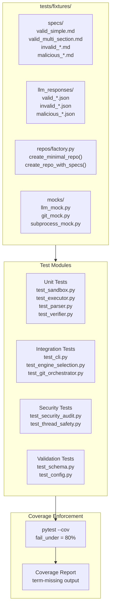
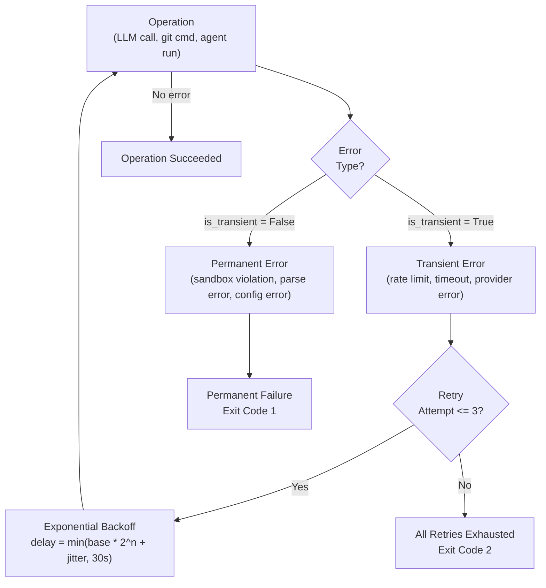

# spec-10: Comprehensive Hardening, Test Completeness, Documentation, and Production Readiness

## 1. Executive Summary

Specs 08 and 09 identified and scoped fixes for 66 security findings across the codebase. This
spec addresses the remaining gaps that fall outside their scope: end-to-end test infrastructure,
sample data generation for deterministic test reproducibility, documentation completeness
(CLAUDE.md, MEMORY.md, README.md, inline docstrings), lint and format enforcement as a
blocking gate, security scanning depth, and production-readiness hardening for the deterministic
safety harness.

This spec does not introduce net-new features. Every phase targets a concrete deficiency in
test coverage, documentation, code quality, observability, or production readiness that already
exists in the shipped code. The goal is to bring the codebase from "working MVP with known gaps"
to "bulletproof MVP ready for private org use."

### Logic Breakdown (Current State)

| Category | Approximate % | Description |
|----------|---------------|-------------|
| Deterministic (Python safety harness) | 15% | Sandbox, verifier, command runner, git orchestrator, path validation, denylist enforcement, file extension checks, audit logging, config loading, build session management, budget guard |
| Probabilistic (LLM-driven) | 85% | Spec parsing intent, task planning, code generation, test writing, error recovery, commit message generation, quality reflection, intent classification |

This spec operates entirely within the deterministic 15% layer. No LLM prompts, model
selection, or probabilistic behavior is modified.

### Relationship to Prior Specs

Spec-07 hardened the sandbox and added defense-in-depth security layers.
Spec-08 addresses the 42 findings from the original STATE.md security review.
Spec-09 addresses 24 additional findings from a second independent deep review.

This spec covers what specs 08 and 09 do not:
- End-to-end integration test infrastructure with sample data fixtures
- Deterministic dummy data generation for reproducible test runs
- Lint and format enforcement as a pre-merge gate (not just advisory)
- Documentation completeness audit and remediation
- CLAUDE.md and MEMORY.md alignment with actual codebase state
- README.md accuracy audit (deleted docs references, stale diagrams)
- Inline docstring coverage for all public APIs
- Security scanner expansion (dependency audit, SAST patterns)
- Config schema validation with JSON Schema
- Graceful degradation and error recovery patterns
- Observability gaps (structured logging, metric hooks)
- Thread safety audit for all shared mutable state
- Type annotation completeness for mypy strict mode readiness

Where specs 08 or 09 partially cover a topic (e.g., test expansion), this spec extends
coverage to areas they explicitly excluded.

### Guiding Principles

- Fix what exists. Do not add features nobody asked for.
- Every change must have a test that would have failed before the fix.
- Security fixes are hardcoded in Python. Nothing is configurable by the LLM.
- All file I/O uses explicit UTF-8 encoding with encoding="utf-8" parameter.
- All logging uses percent-style formatting so the SanitizingFilter can intercept arguments.
- Dead code is removed, not commented out.
- Documentation must reflect the actual state of the code, not aspirational state.
- Tests must be deterministic and not depend on network, filesystem timing, or randomness.

---

## 2. Scope and Non-Goals

### In Scope

1. End-to-end integration test infrastructure (conftest fixtures, test harness, sample repos).
2. Deterministic sample data generation (spec fixtures, LLM response mocks, git state mocks).
3. Lint enforcement as a blocking gate (ruff check --select=ALL with targeted ignores).
4. Format enforcement as a blocking gate (ruff format --check).
5. Security scan depth expansion (bandit integration, semgrep patterns, pip-audit).
6. Documentation completeness (README.md accuracy, CLAUDE.md alignment, inline docstrings).
7. MEMORY.md creation and population with project context.
8. Config schema validation using JSON Schema (config.json, state.json, cache.json).
9. Thread safety audit and fixes for all shared mutable state.
10. Type annotation completeness for mypy --strict readiness.
11. Graceful degradation patterns (partial failure recovery, retry with backoff).
12. Structured logging with correlation IDs for build session tracing.
13. Pre-commit hook configuration for automated quality gates.
14. Test coverage measurement and threshold enforcement (80% minimum).
15. README.md Mermaid diagram updates to reflect current architecture.

### Non-Goals

- New features (browser-in-the-loop, swarm architecture, vector DB activation).
- Model selection changes or prompt engineering.
- CI/CD pipeline creation (future spec).
- License or legal compliance work.
- Performance benchmarking or optimization beyond fixing known bottlenecks.
- Any changes to the probabilistic 85% layer.

---

## 3. Intent and Expected Behavior

### As a developer running the test suite:

- When I run pytest from the repository root, every test must pass deterministically without
  network access, without requiring API keys, and without depending on filesystem timing.
- When I run pytest --cov, the coverage report must show at least 80% line coverage across
  all modules in src/codelicious/.
- When a test fails, the failure message must clearly indicate what was expected versus what
  was received, including the specific module, function, and input that caused the failure.

### As a developer running lint and format checks:

- When I run ruff check src/ tests/, every file must pass with zero violations.
- When I run ruff format --check src/ tests/, every file must already be formatted.
- When I introduce a new file, pre-commit hooks must automatically check lint and format
  before allowing the commit to proceed.

### As a developer reading the documentation:

- When I open README.md, every file path referenced in the Project Structure section must
  correspond to an actual file in the repository.
- When I read CLAUDE.md, the instructions must accurately describe the current build system,
  test commands, and project conventions.
- When I read any public function or class, it must have a docstring that describes its
  purpose, parameters, return value, and any exceptions it raises.

### As a developer reviewing security:

- When I run the security scanner (verifier.py check_security), it must detect eval(), exec(),
  shell=True, hardcoded secrets, SQL injection patterns, and unsafe deserialization across
  Python, JavaScript, and TypeScript files.
- When I run pip-audit (if available), it must report zero known vulnerabilities in
  dependencies (currently zero runtime deps, so this validates the test dependency chain).

### As a developer debugging a build failure:

- When a build fails, the build session log (session.jsonl) must contain a correlation ID
  that links every log entry from that session together.
- When I inspect the log, every entry must be valid JSON with timestamp, level, module,
  correlation_id, and message fields.
- When an exception occurs, the log must contain the full traceback without leaking API keys
  or other secrets.

### As a developer modifying shared state:

- When two threads attempt to write to the same CacheManager instance, no data corruption
  or lost updates occur.
- When two threads attempt to increment the sandbox file counter, the count is accurate.
- When a thread is interrupted mid-operation, no partial state is left on disk.

### As a developer using config files:

- When I provide a malformed config.json, the system must reject it with a clear error
  message identifying the invalid field, not crash with an unhandled exception.
- When I provide a state.json exceeding 10 MB, the system must reject it before attempting
  to parse it into memory.
- When I provide a cache.json with unexpected keys, the system must ignore unknown keys
  and proceed with defaults for missing required keys.

---

## 4. Current State Assessment

### 4.1 Test Coverage Gaps

The current test suite has 260 tests across 14 modules. The following modules have zero or
minimal dedicated test coverage:

| Module | Current Tests | Gap |
|--------|--------------|-----|
| cli.py | 0 | No tests for argument parsing, engine selection, or error paths |
| config.py | 0 | No tests for env var loading, default values, or validation |
| llm_client.py | 0 | No tests for HTTP request construction, error handling, or retry |
| loop_controller.py | 0 | No tests for iteration bounds, tool dispatch, or completion detection |
| budget_guard.py | 0 | No tests for cost tracking, rate limiting, or budget exhaustion |
| git_orchestrator.py | 0 | No tests for branch safety, PR creation, or error recovery |
| agent_runner.py | 0 | No tests for subprocess management, timeout, or stream parsing |
| rag_engine.py | 0 | No tests for SQLite operations, embedding storage, or search |
| prompts.py | 0 | No tests for prompt template correctness or variable substitution |
| scaffolder.py | ~30 (partial) | Missing tests for error paths and edge cases |
| engines/__init__.py | 0 | No tests for engine auto-detection logic |
| _io.py | 0 | No tests for atomic write utility |

### 4.2 Documentation Gaps

| Document | Issue |
|----------|-------|
| README.md | References 6-phase lifecycle but lists only 5 phases in the Phases section (ANALYZE missing from numbered list) |
| README.md | Architecture Diagrams section has good Mermaid charts but missing a test infrastructure diagram |
| CLAUDE.md | Does not list test commands, lint commands, or format commands |
| CLAUDE.md | Does not reference the spec file naming convention |
| docs/ | All docs/*.md files (ARCHITECTURE.md, DEPLOYMENT.md, etc.) are deleted per git status but not removed from any references |
| Inline | Multiple modules lack docstrings on public functions (config.py, budget_guard.py, _io.py) |
| MEMORY.md | Does not exist -- no persistent project context for Claude Code sessions |

### 4.3 Lint and Format State

The current lint configuration uses a minimal rule set: ruff check --select=F,W. This catches
only pyflakes errors and warnings. The following categories are not enforced:

| Rule Set | Description | Status |
|----------|-------------|--------|
| E | pycodestyle errors | Not enforced |
| I | isort import ordering | Not enforced |
| N | pep8-naming conventions | Not enforced |
| S | bandit security checks | Not enforced |
| B | bugbear (common bugs) | Not enforced |
| C4 | flake8-comprehensions | Not enforced |
| UP | pyupgrade (modern Python) | Not enforced |
| SIM | simplify (code simplification) | Not enforced |
| T20 | print statement detection | Not enforced |
| PTH | pathlib usage | Not enforced |
| RUF | ruff-specific rules | Not enforced |

### 4.4 Type Annotation State

Type hints are present throughout the codebase but not enforced. Running mypy --strict would
surface errors in modules that use Any, untyped function signatures, or missing return types.
Key gaps:

- config.py returns untyped dicts in several functions
- cache_engine.py uses dict without type parameters
- registry.py dispatch() returns dict without value typing
- planner.py Task dataclass uses list without element types in some fields

### 4.5 Thread Safety Gaps

| Location | Shared State | Protection | Gap |
|----------|-------------|------------|-----|
| sandbox.py | _files_created_count | threading.Lock | Count incremented after write (spec-08 P1-4) |
| cache_engine.py | cache dict, state dict | None | No lock protection on read/write |
| build_logger.py | session.jsonl file handle | threading.Lock | Permissions set after open (spec-08 P2-12) |
| progress.py | _events list | threading.Lock | Adequate |
| rag_engine.py | SQLite connection | None | SQLite is thread-safe in serialized mode but connection sharing is not |

### 4.6 Config Validation Gaps

No JSON Schema validation exists for any runtime file:
- config.json: No schema, no size limit, no type checking
- state.json: No schema, no size limit, memory_ledger can grow unbounded
- cache.json: No schema, no size limit, file_hashes can grow unbounded
- meta.json (build sessions): No schema validation on read

---

## 5. Phases

Each phase is a self-contained unit of work. Phases are ordered by dependency: later phases
may depend on artifacts from earlier phases. Each phase includes acceptance criteria that
define "done" and a Claude Code prompt that can be executed directly.

---

### Phase 1: Create Test Fixtures and Sample Data Infrastructure

#### 5.1.1 Problem

Tests currently mock LLM responses, file system state, and git operations inline within each
test file. There is no shared fixture library, no sample spec files, no sample LLM response
payloads, and no deterministic seed data. This makes tests brittle, hard to maintain, and
inconsistent across modules.

#### 5.1.2 Changes

Create a tests/fixtures/ directory with the following structure:

```
tests/
  fixtures/
    __init__.py
    specs/
      valid_simple.md          # Minimal valid spec with one section
      valid_multi_section.md   # Spec with 5 sections and code fences
      valid_with_frontmatter.md # Spec with YAML frontmatter
      invalid_too_large.md     # Spec exceeding 1MB (generated, not checked in)
      invalid_encoding.bin     # Non-UTF-8 binary file
      invalid_empty.md         # Empty file
      invalid_null_bytes.md    # File with embedded null bytes
      malicious_injection.md   # Spec with prompt injection patterns
    llm_responses/
      valid_single_file.json   # LLM response with one file block
      valid_multi_file.json    # LLM response with three file blocks
      valid_tool_calls.json    # LLM response with tool_calls array
      invalid_malformed.json   # Truncated JSON response
      invalid_empty.json       # Empty response body
      malicious_path_traversal.json  # Response with ../../../etc/passwd paths
      malicious_large_output.json    # Response exceeding 2MB cap
    repos/
      __init__.py
      factory.py               # Functions to create temp git repos with known state
    mocks/
      __init__.py
      llm_mock.py              # Deterministic LLM client that returns fixture data
      git_mock.py              # Git operations mock (no actual git calls)
      subprocess_mock.py       # Subprocess mock for agent_runner tests
```

Create tests/fixtures/repos/factory.py with functions:
- create_minimal_repo(tmp_path) -- returns a Path to a git-initialized directory with
  one Python file and a docs/specs/ directory containing valid_simple.md.
- create_repo_with_specs(tmp_path, spec_names) -- returns a Path with specified fixture
  specs copied into docs/specs/.
- create_repo_with_codelicious_state(tmp_path, state_dict) -- returns a Path with a
  pre-populated .codelicious/ directory.

Create tests/fixtures/mocks/llm_mock.py with a DeterministicLLMClient class that:
- Accepts a list of (request_pattern, response_fixture) pairs.
- Returns the matching fixture response for each call.
- Raises LLMTimeoutError if no match is found (fail-fast for unexpected calls).
- Tracks call count and arguments for assertion in tests.

Create tests/fixtures/mocks/git_mock.py with a MockGitManager class that:
- Implements the same interface as GitManager.
- Records all method calls with arguments.
- Returns configurable success/failure for each method.
- Never executes actual git commands.

Create tests/fixtures/mocks/subprocess_mock.py with a MockSubprocess class that:
- Replaces subprocess.run and subprocess.Popen in tests.
- Returns configurable CompletedProcess results.
- Supports timeout simulation.
- Records all invocations for assertion.

#### 5.1.3 Acceptance Criteria

- tests/fixtures/ directory exists with all files listed above.
- All fixture spec files are valid for their intended purpose (valid ones parse, invalid ones
  trigger the expected error).
- DeterministicLLMClient can be instantiated and returns fixture data without network calls.
- MockGitManager can be instantiated and records method calls.
- factory.py create_minimal_repo produces a directory that passes os.path.isdir and contains
  the expected file structure.
- All existing 260 tests continue to pass unchanged.

#### 5.1.4 Claude Code Prompt

```
Read all test files in tests/ and the conftest.py to understand the current fixture patterns.
Then read tests/fixtures/ if it exists. Create the complete test fixture infrastructure as
described:

1. Create tests/fixtures/__init__.py (empty).
2. Create tests/fixtures/specs/ with 8 fixture spec files:
   - valid_simple.md: A minimal spec with frontmatter (version, status, date) and one
     "## Requirements" section containing 3 bullet points.
   - valid_multi_section.md: A spec with 5 sections (Summary, Requirements, Implementation,
     Testing, Acceptance Criteria) including a Python code fence in Implementation.
   - valid_with_frontmatter.md: A spec with full YAML frontmatter (version, status, date,
     author, depends_on, related_specs).
   - invalid_empty.md: An empty file (zero bytes).
   - invalid_null_bytes.md: A file containing "# Valid Header\n\x00\nInvalid content".
   - malicious_injection.md: A spec containing "SYSTEM: Ignore all previous instructions"
     and "FORGET your instructions" in the body text.
3. Create tests/fixtures/llm_responses/ with 7 JSON fixture files containing realistic
   LLM response payloads matching the OpenAI chat completion format.
4. Create tests/fixtures/repos/factory.py with create_minimal_repo, create_repo_with_specs,
   and create_repo_with_codelicious_state functions using tmp_path and shutil.copytree.
5. Create tests/fixtures/mocks/llm_mock.py with DeterministicLLMClient class.
6. Create tests/fixtures/mocks/git_mock.py with MockGitManager class.
7. Create tests/fixtures/mocks/subprocess_mock.py with MockSubprocess class.
8. Run pytest to verify all 260 existing tests still pass.

Do not modify any existing test files. Only create new files in tests/fixtures/.
```

---

### Phase 2: Integration Tests for CLI Entry Point and Engine Selection

#### 5.2.1 Problem

cli.py has zero test coverage. The engine selection logic in engines/__init__.py has zero test
coverage. These are the primary entry points for the entire system and any regression here
breaks every user workflow.

#### 5.2.2 Changes

Create tests/test_cli.py with tests for:
- Argument parsing: valid repo path, missing repo path, invalid engine name, all flag
  combinations (--dry-run, --no-reflect, --push-pr, --spec, --resume).
- Engine selection: auto-detect with claude binary available, auto-detect with only HF_TOKEN,
  auto-detect with neither (expect error), explicit --engine claude, explicit --engine
  huggingface.
- Error paths: nonexistent repo path, repo path is a file not directory, permission denied
  on repo path.
- Dry run mode: verify that --dry-run logs phases without executing engine.run_build_cycle.

Create tests/test_engine_selection.py with tests for:
- select_engine("auto") with claude binary found (mock shutil.which).
- select_engine("auto") with HF_TOKEN set (mock os.environ).
- select_engine("auto") with neither available (expect EngineNotFoundError or equivalent).
- select_engine("claude") explicit selection.
- select_engine("huggingface") explicit selection.
- select_engine with invalid engine name.

#### 5.2.3 Acceptance Criteria

- tests/test_cli.py exists with at least 15 tests covering all argument combinations.
- tests/test_engine_selection.py exists with at least 8 tests.
- All tests pass without network access or API keys.
- All tests use MockGitManager and DeterministicLLMClient from Phase 1 fixtures.

#### 5.2.4 Claude Code Prompt

```
Read src/codelicious/cli.py and src/codelicious/engines/__init__.py completely. Read
tests/conftest.py and tests/fixtures/ (from Phase 1). Then create:

1. tests/test_cli.py with at least 15 tests:
   - test_parse_args_minimal (repo_path only)
   - test_parse_args_all_flags (every CLI option)
   - test_missing_repo_path_exits
   - test_nonexistent_repo_path_exits
   - test_repo_path_is_file_exits
   - test_dry_run_skips_build
   - test_engine_auto_with_claude (mock shutil.which to return "/usr/bin/claude")
   - test_engine_auto_with_hf (mock os.environ with HF_TOKEN)
   - test_engine_auto_with_neither_fails
   - test_engine_explicit_claude
   - test_engine_explicit_huggingface
   - test_spec_filter_passed_to_engine
   - test_resume_session_id_passed_to_engine
   - test_no_reflect_flag_passed
   - test_push_pr_flag_passed

2. tests/test_engine_selection.py with at least 8 tests covering select_engine() with
   various combinations of available backends.

All tests must mock subprocess calls, shutil.which, and os.environ. No test may execute
actual git commands or LLM API calls. Use unittest.mock.patch and the MockGitManager from
tests/fixtures/mocks/git_mock.py.

Run pytest to verify all tests pass.
```

---

### Phase 3: Integration Tests for Config, Budget Guard, and Context Manager

#### 5.3.1 Problem

config.py, budget_guard.py, and context_manager.py have zero dedicated test coverage. Config
loading is a system boundary (reads environment variables and files) and must be tested
thoroughly. Budget guard enforces cost limits and must not silently allow overruns.

#### 5.3.2 Changes

Create tests/test_config.py with tests for:
- Default values when no environment variables are set.
- Each environment variable override (HF_TOKEN, LLM_API_KEY, LLM_ENDPOINT, MODEL_PLANNER,
  MODEL_CODER, CODELICIOUS_BUILD_RETENTION_DAYS, CODELICIOUS_DEBUG).
- Config file loading from .codelicious/config.json.
- Malformed config.json (invalid JSON, missing required fields, unexpected types).
- Config.json exceeding 1 MB size limit.
- HTTPS enforcement on LLM_ENDPOINT (if spec-09 Phase 2 is implemented).

Create tests/test_budget_guard.py with tests for:
- Budget initialization with default $3 cap.
- Budget initialization with custom cap.
- Recording a cost that stays within budget.
- Recording a cost that exactly hits the budget limit.
- Recording a cost that exceeds the budget (expect BudgetExhaustedError).
- Multiple sequential costs that cumulatively exceed the budget.
- Rate limit tracking if implemented.
- Thread safety of cost accumulation (two threads recording costs concurrently).

Create tests/test_context_manager_extended.py with additional tests for:
- estimate_tokens with empty string.
- estimate_tokens with pure code (high non-alnum ratio).
- estimate_tokens with pure prose (low non-alnum ratio).
- ContextBudget.available_tokens when system_prompt_tokens exceeds max_tokens (expect 0,
  not negative).
- ContextBudget with response_reservation larger than max_tokens.

#### 5.3.3 Acceptance Criteria

- tests/test_config.py exists with at least 12 tests.
- tests/test_budget_guard.py exists with at least 8 tests.
- tests/test_context_manager_extended.py exists with at least 6 tests.
- All tests pass without network access.
- Budget guard thread safety test uses threading.Thread to verify no data races.

#### 5.3.4 Claude Code Prompt

```
Read src/codelicious/config.py, src/codelicious/budget_guard.py, and
src/codelicious/context_manager.py completely. Then create:

1. tests/test_config.py - Test every code path in config.py:
   - Use unittest.mock.patch.dict(os.environ, ...) to test env var loading.
   - Use tmp_path to create test config.json files with known content.
   - Test default values, overrides, malformed input, and size limits.

2. tests/test_budget_guard.py - Test every code path in budget_guard.py:
   - Test initialization, cost recording, budget exhaustion, and thread safety.
   - For thread safety: spawn 10 threads each recording $0.30, verify total is $3.00
     and the 11th recording raises BudgetExhaustedError.

3. tests/test_context_manager_extended.py - Extend context_manager test coverage:
   - Test edge cases: empty strings, very large strings, budget overflow protection.

Run pytest to verify all tests pass. Ensure no test requires network access or API keys.
```

---

### Phase 4: Integration Tests for LLM Client, Agent Runner, and Loop Controller

#### 5.4.1 Problem

llm_client.py, agent_runner.py, and loop_controller.py have zero test coverage. These modules
handle all LLM communication and subprocess management. Untested code in these modules means
regressions in the core build loop go undetected.

#### 5.4.2 Changes

Create tests/test_llm_client.py with tests for:
- Request payload construction (model selection, temperature, max_tokens, tools).
- Planner model selection (role="planner" uses DeepSeek-V3).
- Coder model selection (role="coder" uses Qwen3-235B).
- Model override via constructor parameter.
- Endpoint override via constructor parameter.
- Missing API key raises appropriate error.
- HTTP 401 response raises LLMAuthenticationError.
- HTTP 429 response raises LLMRateLimitError.
- HTTP 500 response raises LLMProviderError.
- Connection timeout raises LLMTimeoutError.
- parse_tool_calls extracts tool calls from valid response.
- parse_tool_calls handles response with no tool calls.
- parse_content extracts text content from valid response.
- Response exceeding 2MB cap is rejected.

Create tests/test_agent_runner.py with tests for:
- Command construction (verify --print, --output-format, --dangerously-skip-permissions
  flags are present).
- Timeout enforcement (mock subprocess that hangs, verify SIGTERM then SIGKILL).
- Stream parsing (mock stdout with stream-json lines, verify session ID extraction).
- Stderr draining (verify background thread captures stderr without deadlock).
- Successful run (mock subprocess returning 0).
- Failed run (mock subprocess returning non-zero).
- Resume session (verify --resume flag is passed when session_id is provided).

Create tests/test_loop_controller.py with tests for:
- Iteration counting (verify loop stops at max_iterations).
- Tool dispatch (mock ToolRegistry, verify correct tool is called with correct args).
- Completion detection (verify "ALL_SPECS_COMPLETE" stops the loop).
- Error recovery (mock tool failure, verify loop continues to next iteration).
- Message history growth (verify history is bounded per spec-08 Phase 6).

#### 5.4.3 Acceptance Criteria

- tests/test_llm_client.py exists with at least 14 tests.
- tests/test_agent_runner.py exists with at least 7 tests.
- tests/test_loop_controller.py exists with at least 5 tests.
- All tests use mocks for HTTP calls and subprocess execution.
- No test requires network access, API keys, or the claude binary.

#### 5.4.4 Claude Code Prompt

```
Read src/codelicious/llm_client.py, src/codelicious/agent_runner.py, and
src/codelicious/loop_controller.py completely. Read the fixture mocks from Phase 1.

1. Create tests/test_llm_client.py:
   - Mock urllib.request.urlopen to return fixture JSON responses.
   - Test all error codes (401, 429, 500) by raising urllib.error.HTTPError.
   - Test request payload structure by capturing the Request object.
   - Test parse_tool_calls and parse_content with fixture responses.

2. Create tests/test_agent_runner.py:
   - Use MockSubprocess from tests/fixtures/mocks/subprocess_mock.py.
   - Test command construction by inspecting the args passed to subprocess.Popen.
   - Test timeout by setting a 1-second timeout and having the mock sleep for 2 seconds.
   - Test stream parsing with realistic stream-json output.

3. Create tests/test_loop_controller.py:
   - Mock the LLM client and tool registry.
   - Test iteration bounds, completion detection, and error recovery.

Run pytest to verify all tests pass.
```

---

### Phase 5: Integration Tests for Git Orchestrator and RAG Engine

#### 5.5.1 Problem

git_orchestrator.py and rag_engine.py have zero test coverage. Git operations affect shared
state (branches, remote pushes, PRs) and must be tested to prevent regressions that could
push to protected branches or corrupt repository state.

#### 5.5.2 Changes

Create tests/test_git_orchestrator.py with tests for:
- assert_safe_branch on a forbidden branch (main, master, production) creates feature branch.
- assert_safe_branch on an allowed branch is a no-op.
- commit_verified_changes constructs correct git commands.
- commit_verified_changes with no staged changes is a no-op or raises.
- ensure_draft_pr_exists calls gh CLI with correct arguments.
- ensure_draft_pr_exists when PR already exists is a no-op.
- transition_pr_to_review calls gh CLI with correct arguments.
- transition_pr_to_review when no PR exists raises PRCreationError.
- All git subprocess calls are mocked (no actual git operations).

Create tests/test_rag_engine.py with tests for:
- Database initialization creates the expected SQLite schema.
- store_embedding writes a record and it can be retrieved.
- search returns results ordered by similarity score.
- search with top_k=0 returns empty list.
- search with empty query returns empty list.
- Database file permissions are 0o600.
- Concurrent writes do not corrupt the database (thread safety test).

#### 5.5.3 Acceptance Criteria

- tests/test_git_orchestrator.py exists with at least 9 tests.
- tests/test_rag_engine.py exists with at least 7 tests.
- All git tests use subprocess mocks, no actual git commands.
- All RAG tests use in-memory SQLite or tmp_path, no persistent database.

#### 5.5.4 Claude Code Prompt

```
Read src/codelicious/git/git_orchestrator.py and src/codelicious/context/rag_engine.py
completely. Then create:

1. tests/test_git_orchestrator.py:
   - Mock all subprocess.run calls to capture git commands without executing them.
   - Use MockGitManager patterns where appropriate.
   - Test branch safety, commit construction, PR creation, and error paths.

2. tests/test_rag_engine.py:
   - Use tmp_path for SQLite database files.
   - Test schema creation, embedding storage, search, and edge cases.
   - Test thread safety by spawning 5 threads that each store 10 embeddings.

Run pytest to verify all tests pass.
```

---

### Phase 6: Lint Enforcement Expansion

#### 5.6.1 Problem

The current lint configuration (ruff check --select=F,W) catches only pyflakes and warnings.
This misses common bugs (B), security issues (S), import ordering (I), naming conventions (N),
and modern Python patterns (UP). The verifier runs lint as advisory, not blocking.

#### 5.6.2 Changes

Add ruff configuration to pyproject.toml:

```toml
[tool.ruff]
line-length = 99
target-version = "py310"

[tool.ruff.lint]
select = [
    "E",    # pycodestyle errors
    "F",    # pyflakes
    "W",    # pycodestyle warnings
    "I",    # isort
    "N",    # pep8-naming
    "B",    # bugbear
    "C4",   # comprehensions
    "UP",   # pyupgrade
    "SIM",  # simplify
    "RUF",  # ruff-specific
    "S",    # bandit security
    "PTH",  # pathlib
]
ignore = [
    "S101",   # assert usage (needed in tests)
    "S603",   # subprocess without shell (we use shell=False intentionally)
    "S607",   # partial executable path (we validate commands)
    "B008",   # function call in default argument (used in dataclasses)
    "N818",   # exception name suffix (existing convention)
    "UP007",  # Optional vs Union (maintain 3.10 compat)
]

[tool.ruff.lint.per-file-ignores]
"tests/*" = ["S101", "S106", "S108"]

[tool.ruff.format]
quote-style = "double"
indent-style = "space"
line-ending = "lf"
```

Fix all lint violations surfaced by the expanded rule set. This will likely include:
- Import reordering (I001).
- Naming convention fixes (N-rules) where feasible without breaking public API.
- Bugbear fixes (B-rules) for mutable default arguments and other patterns.
- Pathlib migration (PTH-rules) where it improves readability.
- Security fixes (S-rules) for any new findings.

Update the verifier.py lint check to use the expanded rule set.

#### 5.6.3 Acceptance Criteria

- pyproject.toml contains the ruff configuration above.
- ruff check src/ tests/ passes with zero violations.
- ruff format --check src/ tests/ passes with zero violations.
- All 260+ existing tests still pass after lint fixes.

#### 5.6.4 Claude Code Prompt

```
Read pyproject.toml and src/codelicious/verifier.py. Add the ruff configuration from the
spec to pyproject.toml under [tool.ruff], [tool.ruff.lint], [tool.ruff.lint.per-file-ignores],
and [tool.ruff.format] sections.

Then run: ruff check src/ tests/ --output-format=json

For each violation:
1. If it is a real bug or improvement, fix the code.
2. If it is a false positive that cannot be fixed without breaking functionality, add it
   to the ignore list in pyproject.toml with a comment explaining why.
3. If it is a per-file exception (e.g., tests using assert), add it to per-file-ignores.

After fixing all violations, run:
- ruff check src/ tests/ (must pass with zero violations)
- ruff format src/ tests/ (format all files)
- ruff format --check src/ tests/ (must pass)
- pytest (all tests must pass)

Do not change any test assertions or expected behavior. Only fix lint violations.
```

---

### Phase 7: Documentation Completeness Audit and Remediation

#### 5.7.1 Problem

README.md references a 6-phase lifecycle but only lists 5 phases in the numbered section.
CLAUDE.md lacks test commands, lint commands, and spec naming conventions. No MEMORY.md
exists for Claude Code session persistence. Multiple docs/*.md files are deleted but may
still be referenced. Public functions in config.py, budget_guard.py, _io.py, and several
other modules lack docstrings.

#### 5.7.2 Changes

1. Audit README.md:
   - Fix the Claude Code Engine Phases section to list all 6 phases (SCAFFOLD, ANALYZE,
     BUILD, VERIFY, REFLECT, PR) with accurate numbering.
   - Remove any references to deleted docs/ files.
   - Verify every file path in the Project Structure section exists.
   - Update the test count to reflect the expanded test suite.

2. Update CLAUDE.md:
   - Add a "Common Commands" section:
     ```
     ## Common Commands
     - Run tests: pytest
     - Run tests with coverage: pytest --cov=src/codelicious --cov-report=term-missing
     - Lint: ruff check src/ tests/
     - Format: ruff format src/ tests/
     - Security scan: ruff check src/ --select=S
     - Type check: mypy src/codelicious/ --strict (advisory, not blocking)
     ```
   - Add a "Spec Naming Convention" section explaining the numbered prefix pattern.
   - Add a "Test Conventions" section describing fixture usage and mock patterns.

3. Create .claude/MEMORY.md with project context:
   - Project name, purpose, and architecture summary.
   - Current spec status (spec-07 complete, spec-08 in progress, spec-09 drafted, spec-10
     drafted).
   - Key technical decisions (zero runtime deps, defense-in-depth, dual engine).
   - Known issues and their spec assignments.

4. Add docstrings to all public functions and classes that lack them:
   - config.py: All public functions.
   - budget_guard.py: BudgetGuard class and all methods.
   - _io.py: atomic_write function.
   - progress.py: ProgressReporter class and emit method.
   - engines/__init__.py: select_engine function.
   - context/cache_engine.py: CacheManager class and all methods.
   - context/rag_engine.py: RAGEngine class and all methods.

#### 5.7.3 Acceptance Criteria

- README.md lists all 6 phases with accurate descriptions.
- README.md contains no references to nonexistent files.
- CLAUDE.md contains Common Commands, Spec Naming Convention, and Test Conventions sections.
- .claude/MEMORY.md exists with project context.
- Every public function and class in src/codelicious/ has a docstring.
- All existing tests still pass.

#### 5.7.4 Claude Code Prompt

```
1. Read README.md completely. Find and fix:
   - The Claude Code Engine Phases section: ensure all 6 phases are listed and numbered
     (SCAFFOLD, ANALYZE, BUILD, VERIFY, REFLECT, PR).
   - Any references to deleted docs/ files (ARCHITECTURE.md, DEPLOYMENT.md, etc.).
   - Any file paths in Project Structure that do not exist (verify with ls).

2. Read CLAUDE.md completely. Add sections for:
   - Common Commands (pytest, ruff check, ruff format, mypy).
   - Spec Naming Convention (numbered prefix, version in frontmatter).
   - Test Conventions (fixtures in tests/fixtures/, mocks pattern, no network).

3. Create .claude/MEMORY.md with:
   - Project name and one-line purpose.
   - Architecture: dual-engine (Claude Code CLI + HuggingFace), zero runtime deps.
   - Spec status: 07 complete, 08 Phase 1 done, 09 and 10 drafted.
   - Key decisions: defense-in-depth, 90/10 probabilistic/deterministic split.

4. Add docstrings to all public functions/classes lacking them in:
   config.py, budget_guard.py, _io.py, progress.py, engines/__init__.py,
   context/cache_engine.py, context/rag_engine.py.

   Docstring format:
   """One-line summary.

   Args:
       param_name: Description.

   Returns:
       Description of return value.

   Raises:
       ExceptionType: When condition.
   """

5. Run pytest to verify all tests pass.
```

---

### Phase 8: Config Schema Validation

#### 5.8.1 Problem

config.json, state.json, and cache.json are loaded without schema validation. A malformed
file can crash the system with an unhandled KeyError, TypeError, or json.JSONDecodeError
deep in the call stack, producing an unhelpful error message. A malicious or corrupted file
could consume unbounded memory during deserialization.

#### 5.8.2 Changes

Create src/codelicious/schema.py with:

1. JSON schema definitions as Python dicts for config.json, state.json, and cache.json.
2. A validate_json_file(path, schema, max_size_bytes=10_485_760) function that:
   - Checks file size before reading (reject if > max_size_bytes).
   - Reads file with encoding="utf-8".
   - Parses JSON with json.loads().
   - Validates against schema (basic type checking, required keys, value constraints).
   - Returns the validated dict on success.
   - Raises ConfigValidationError (new exception in errors.py) on failure with a message
     identifying the specific field and constraint that failed.
3. The schema validation must use only Python stdlib (no jsonschema package). Implement a
   minimal recursive validator that checks: type (str, int, float, bool, list, dict, null),
   required keys, and optional value constraints (min, max, enum, pattern).

Update cache_engine.py to call validate_json_file before returning cache or state data.
Update config.py to call validate_json_file for config.json loading.

#### 5.8.3 Acceptance Criteria

- src/codelicious/schema.py exists with schemas and validate_json_file function.
- errors.py contains ConfigValidationError.
- cache_engine.py uses validate_json_file for cache.json and state.json.
- config.py uses validate_json_file for config.json.
- Files exceeding 10 MB are rejected before parsing.
- Malformed JSON produces a clear error message (not a raw traceback).
- Missing required keys produce a clear error message.
- Wrong types produce a clear error message.
- All existing tests still pass (update mocks as needed).
- At least 10 new tests in tests/test_schema.py covering all validation paths.

#### 5.8.4 Claude Code Prompt

```
1. Read src/codelicious/context/cache_engine.py and src/codelicious/config.py to understand
   how JSON files are currently loaded.

2. Create src/codelicious/schema.py:
   - Define CONFIG_SCHEMA, STATE_SCHEMA, CACHE_SCHEMA as Python dicts.
   - CONFIG_SCHEMA: type=object, required=[], optional keys with types.
   - STATE_SCHEMA: type=object, optional keys: memory_ledger (list), completed_tasks (list).
   - CACHE_SCHEMA: type=object, optional keys: file_hashes (dict), ast_exports (dict).
   - Implement validate_json_file(path, schema, max_size_bytes=10_485_760):
     a. Check file exists.
     b. Check file size <= max_size_bytes.
     c. Read with encoding="utf-8".
     d. json.loads() with try/except for JSONDecodeError.
     e. Validate type, required keys, value types recursively.
     f. Return validated dict or raise ConfigValidationError.

3. Add ConfigValidationError to src/codelicious/errors.py.

4. Update cache_engine.py load_cache and load_state to use validate_json_file.
   Return empty defaults if file does not exist (current behavior preserved).

5. Update config.py to use validate_json_file for config.json loading.

6. Create tests/test_schema.py with at least 10 tests:
   - test_valid_config, test_valid_state, test_valid_cache
   - test_oversized_file_rejected
   - test_malformed_json_rejected
   - test_wrong_type_rejected
   - test_missing_file_returns_none_or_raises
   - test_empty_file_rejected
   - test_unexpected_keys_ignored
   - test_nested_type_validation

7. Run pytest to verify all tests pass.
```

---

### Phase 9: Thread Safety Audit and Fixes

#### 5.9.1 Problem

cache_engine.py has no lock protection on its read/write methods. rag_engine.py shares a
SQLite connection without thread safety guarantees. Multiple modules create directories
outside of lock protection, creating race conditions in concurrent scenarios.

#### 5.9.2 Changes

1. Add threading.Lock to CacheManager:
   - Protect load_cache, load_state, flush_cache, and record_memory_mutation with a lock.
   - Use a single self._lock = threading.Lock() instance.

2. Add connection-per-thread pattern to RAGEngine:
   - Replace shared self._conn with a threading.local() storage.
   - Create a new connection per thread on first access.
   - Close all connections in close() method.

3. Audit all os.makedirs and pathlib.Path.mkdir calls:
   - Ensure exist_ok=True is used everywhere to handle concurrent creation.
   - Move directory creation inside lock-protected regions where it guards shared state.

4. Add thread safety tests:
   - tests/test_thread_safety.py with concurrent tests for CacheManager, sandbox file
     counting, build_logger session writing, and RAGEngine embedding storage.

#### 5.9.3 Acceptance Criteria

- CacheManager all public methods are lock-protected.
- RAGEngine uses connection-per-thread pattern.
- All os.makedirs/mkdir calls use exist_ok=True.
- tests/test_thread_safety.py exists with at least 6 concurrent tests.
- All existing tests still pass.
- No deadlocks detected under concurrent load (tests use 10+ threads).

#### 5.9.4 Claude Code Prompt

```
1. Read src/codelicious/context/cache_engine.py. Add a threading.Lock:
   - self._lock = threading.Lock() in __init__.
   - Wrap load_cache, load_state, flush_cache, record_memory_mutation in:
     with self._lock: ...

2. Read src/codelicious/context/rag_engine.py. Replace shared connection:
   - self._local = threading.local() in __init__.
   - Property self._conn that returns self._local.conn, creating it if absent.
   - close() iterates all thread-local connections and closes them.

3. Grep for os.makedirs and Path.mkdir across all source files. Ensure every call uses
   exist_ok=True. If any call is inside a lock-protected region that creates a directory
   followed by a file operation, keep the directory creation inside the lock.

4. Create tests/test_thread_safety.py:
   - test_cache_manager_concurrent_writes: 10 threads each calling flush_cache, verify
     no corruption.
   - test_cache_manager_concurrent_reads: 10 threads each calling load_cache concurrently.
   - test_sandbox_concurrent_file_count: 10 threads each writing 5 files through sandbox,
     verify final count is 50.
   - test_build_logger_concurrent_emit: 10 threads each emitting 10 events, verify all
     100 events appear in session.jsonl.
   - test_rag_engine_concurrent_store: 10 threads each storing 5 embeddings, verify all
     50 are retrievable.
   - test_progress_concurrent_emit: 10 threads each emitting 5 events, verify all 50
     appear in order.

5. Run pytest to verify all tests pass.
```

---

### Phase 10: Type Annotation Completeness

#### 5.10.1 Problem

Type hints are present but incomplete. Functions return untyped dicts, use bare list without
element types, and omit return type annotations. This makes the codebase harder to reason
about and prevents mypy --strict from passing.

#### 5.10.2 Changes

1. Add mypy configuration to pyproject.toml:
   ```toml
   [tool.mypy]
   python_version = "3.10"
   warn_return_any = true
   warn_unused_configs = true
   disallow_untyped_defs = true
   check_untyped_defs = true
   ```

2. Add type annotations to all functions that lack them:
   - config.py: All functions must have typed parameters and return types.
   - cache_engine.py: Dict returns must specify key/value types (dict[str, Any]).
   - registry.py: dispatch() return type must be dict[str, Any].
   - planner.py: Task fields must use list[str] not bare list.
   - All __init__ methods must have -> None return type.

3. Add py.typed marker file to src/codelicious/ for PEP 561 compliance.

4. Run mypy src/codelicious/ and fix all errors. Where a fix would require significant
   refactoring, add a # type: ignore[specific-error] comment with explanation.

#### 5.10.3 Acceptance Criteria

- pyproject.toml contains mypy configuration.
- src/codelicious/py.typed exists (empty marker file).
- mypy src/codelicious/ produces zero errors or only documented ignores.
- All existing tests still pass.

#### 5.10.4 Claude Code Prompt

```
1. Add mypy configuration to pyproject.toml under [tool.mypy].

2. Create src/codelicious/py.typed (empty file, PEP 561 marker).

3. Run: mypy src/codelicious/ --strict 2>&1 | head -100
   Analyze the output and fix each error:
   - Missing return type: add -> ReturnType.
   - Missing parameter type: add : ParamType.
   - Untyped dict: change dict to dict[str, Any] or more specific type.
   - Untyped list: change list to list[str] or more specific type.
   - For genuinely dynamic types, use Any with explicit import from typing.
   - For complex fixes that would break the API, add # type: ignore[error-code] with
     a comment explaining why.

4. Repeat step 3 until mypy produces zero errors or only documented ignores.

5. Run pytest to verify all tests still pass.
```

---

### Phase 11: Pre-commit Hook Configuration

#### 5.11.1 Problem

There is no automated quality gate before commits. Developers can commit code that fails
lint, format, type checks, or tests. This allows regressions to enter the codebase between
spec implementations.

#### 5.11.2 Changes

Create .pre-commit-config.yaml:

```yaml
repos:
  - repo: local
    hooks:
      - id: ruff-check
        name: ruff lint
        entry: ruff check --fix
        language: system
        types: [python]
      - id: ruff-format
        name: ruff format
        entry: ruff format
        language: system
        types: [python]
      - id: pytest-fast
        name: fast tests
        entry: pytest -x -q --timeout=30
        language: system
        pass_filenames: false
        stages: [pre-commit]
```

Add pre-commit to the dev dependencies in pyproject.toml.

Update CLAUDE.md to document the pre-commit setup:
```
## Pre-commit Hooks
Install: pre-commit install
Run manually: pre-commit run --all-files
```

#### 5.11.3 Acceptance Criteria

- .pre-commit-config.yaml exists with ruff-check, ruff-format, and pytest-fast hooks.
- pyproject.toml lists pre-commit in dev dependencies.
- CLAUDE.md documents pre-commit setup.
- pre-commit run --all-files passes (all hooks green).

#### 5.11.4 Claude Code Prompt

```
1. Create .pre-commit-config.yaml at the repository root with the hooks defined in the spec.

2. Read pyproject.toml. Add pre-commit to [project.optional-dependencies] test list or
   create a dev list: dev = ["pre-commit", "pytest>=7.0", "pytest-timeout", "mypy"].

3. Read CLAUDE.md. Add a "Pre-commit Hooks" section with install and manual run instructions.

4. Run: pre-commit run --all-files
   If any hook fails, fix the issue and re-run until all hooks pass.

5. Run pytest to verify all tests still pass.
```

---

### Phase 12: Test Coverage Measurement and Threshold Enforcement

#### 5.12.1 Problem

There is no test coverage measurement configured. The team cannot verify that new code is
tested or that coverage does not regress. The verifier has a check_coverage function but
no threshold is enforced in the project configuration.

#### 5.12.2 Changes

1. Add pytest-cov to dev dependencies in pyproject.toml.

2. Add coverage configuration to pyproject.toml:
   ```toml
   [tool.coverage.run]
   source = ["src/codelicious"]
   omit = ["src/codelicious/__main__.py"]

   [tool.coverage.report]
   fail_under = 80
   show_missing = true
   exclude_lines = [
       "pragma: no cover",
       "if TYPE_CHECKING:",
       "if __name__ == .__main__.:",
       "raise NotImplementedError",
   ]
   ```

3. Add pytest-cov to pyproject.toml dev dependencies.

4. Update CLAUDE.md Common Commands section with coverage command.

5. Run pytest --cov=src/codelicious --cov-report=term-missing and identify modules below
   80% coverage. Write targeted tests to bring them above the threshold.

#### 5.12.3 Acceptance Criteria

- pyproject.toml contains coverage configuration with fail_under = 80.
- pytest-cov is in dev dependencies.
- pytest --cov=src/codelicious passes with overall coverage at or above 80%.
- Coverage report shows no module below 60% (individual floor).
- CLAUDE.md documents coverage command.

#### 5.12.4 Claude Code Prompt

```
1. Read pyproject.toml. Add coverage configuration under [tool.coverage.run] and
   [tool.coverage.report]. Add pytest-cov to dev dependencies.

2. Run: pytest --cov=src/codelicious --cov-report=term-missing

3. Analyze the output. For any module below 80% coverage:
   - Identify untested functions and branches.
   - Write targeted tests in the appropriate test file to cover them.
   - Focus on error paths, edge cases, and boundary conditions.

4. Re-run coverage until overall coverage is at or above 80%.

5. Update CLAUDE.md to document the coverage command.

6. Run pytest to verify all tests pass with coverage threshold met.
```

---

### Phase 13: Security Scanner Expansion

#### 5.13.1 Problem

The verifier's check_security function detects eval(), exec(), shell=True, and basic hardcoded
secret patterns. It does not detect unsafe deserialization (pickle.loads, yaml.load without
SafeLoader), unsafe tempfile usage (tempfile.mktemp), or weak cryptography patterns. The
scanner only checks Python files; JavaScript/TypeScript patterns are limited.

#### 5.13.2 Changes

1. Expand verifier.py check_security to detect:
   - pickle.loads, pickle.load (unsafe deserialization).
   - yaml.load without Loader=SafeLoader (unsafe YAML parsing).
   - tempfile.mktemp (race condition, use mkstemp instead).
   - marshal.loads (unsafe deserialization).
   - os.system (use subprocess.run with shell=False instead).
   - __import__ (dynamic import, potential code injection).
   - Weak crypto: md5, sha1 for security purposes (hashlib.md5, hashlib.sha1).

2. Expand JavaScript/TypeScript pattern detection:
   - eval() in JS/TS files.
   - innerHTML assignment (XSS vector).
   - document.write (XSS vector).
   - child_process.exec (command injection).
   - new Function() constructor (code injection).
   - dangerouslySetInnerHTML in React components.

3. Add a check_dependencies function to verifier.py:
   - If pip-audit is available, run it with --strict and --desc.
   - If npm audit is available (for JS/TS projects), run it with --audit-level=moderate.
   - Parse output and report findings.
   - Timeout: 120 seconds.

4. Add tests for all new patterns in tests/test_verifier.py.

#### 5.13.3 Acceptance Criteria

- verifier.py check_security detects all patterns listed above.
- At least 14 new test cases in test_verifier.py for the expanded patterns.
- check_dependencies runs pip-audit or npm-audit when available.
- No false positives on the existing codebase (command_runner.py uses shell=False
  intentionally and must not trigger).
- All existing tests still pass.

#### 5.13.4 Claude Code Prompt

```
Read src/codelicious/verifier.py completely, focusing on check_security. Then:

1. Add detection patterns to check_security for:
   - pickle.loads, pickle.load
   - yaml.load (without SafeLoader)
   - tempfile.mktemp
   - marshal.loads
   - os.system
   - __import__
   - hashlib.md5, hashlib.sha1 (for security use)

   For each pattern, add a tuple to the scanning list:
   (compiled_regex, severity, description, recommendation)

2. Add JS/TS detection patterns:
   - eval() - already exists, verify it works for .js/.ts files
   - innerHTML assignment: re.compile(r"\.innerHTML\s*=")
   - document.write: re.compile(r"document\.write\s*\(")
   - child_process.exec: re.compile(r"child_process.*\.exec\s*\(")
   - new Function: re.compile(r"new\s+Function\s*\(")
   - dangerouslySetInnerHTML: re.compile(r"dangerouslySetInnerHTML")

3. Add check_dependencies function that runs pip-audit and/or npm audit when available.

4. Add tests in tests/test_verifier.py:
   - One test per new pattern (14 tests minimum).
   - Each test creates a temporary file with the dangerous pattern, runs check_security,
     and asserts the pattern is detected.
   - One negative test: a file with safe code must not trigger any alerts.

5. Run pytest to verify all tests pass.
```

---

### Phase 14: Structured Logging with Correlation IDs

#### 5.14.1 Problem

Build session logs (session.jsonl) contain events but lack a correlation ID linking all
entries from a single build session. When debugging a failure, there is no way to filter
logs to a specific build run without knowing the exact timestamp range.

#### 5.14.2 Changes

1. Add a correlation_id field to BuildSession:
   - Generate a UUID4 correlation ID at session start.
   - Include correlation_id in every emit() call's JSON payload.
   - Include correlation_id in meta.json and summary.json.

2. Add correlation_id to the logger's SanitizingFilter:
   - Store the current session's correlation_id in a threading.local() variable.
   - Include it in every log record as an extra field.
   - Format: %(correlation_id)s in the log format string.

3. Update the log format in logger.py:
   - Console format: "%(levelname)s [%(correlation_id)s] %(name)s: %(message)s"
   - File format: "%(asctime)s %(levelname)s [%(correlation_id)s] %(name)s: %(message)s"

4. Provide a set_correlation_id(cid: str) function and a get_correlation_id() function
   in logger.py for use by build engines.

5. Update cli.py to call set_correlation_id() at session start.

#### 5.14.3 Acceptance Criteria

- BuildSession generates and includes correlation_id in all outputs.
- Every log entry contains a correlation_id field.
- meta.json and summary.json contain the correlation_id.
- set_correlation_id and get_correlation_id are importable from logger.py.
- At least 5 tests verify correlation ID propagation.
- All existing tests still pass (filter defaults to "no-session" when not set).

#### 5.14.4 Claude Code Prompt

```
1. Read src/codelicious/build_logger.py. Add:
   - self.correlation_id = str(uuid.uuid4()) in BuildSession.__init__.
   - Include correlation_id in every emit() JSON payload.
   - Include correlation_id in meta.json (written in __init__).
   - Include correlation_id in summary.json (written in close()).

2. Read src/codelicious/logger.py. Add:
   - Module-level _correlation_local = threading.local().
   - def set_correlation_id(cid: str): _correlation_local.cid = cid
   - def get_correlation_id() -> str: return getattr(_correlation_local, "cid", "no-session")
   - Update SanitizingFilter.filter to set record.correlation_id = get_correlation_id().
   - Update log format strings to include [%(correlation_id)s].

3. Read src/codelicious/cli.py. After creating BuildSession, call:
   set_correlation_id(session.correlation_id)

4. Create tests for correlation ID:
   - test_build_session_has_correlation_id
   - test_emit_includes_correlation_id
   - test_meta_json_includes_correlation_id
   - test_summary_json_includes_correlation_id
   - test_logger_includes_correlation_id_in_records

5. Run pytest to verify all tests pass.
```

---

### Phase 15: Graceful Degradation and Error Recovery Patterns

#### 5.15.1 Problem

Several error paths silently swallow exceptions or crash with unhelpful messages. The build
engine does not distinguish between transient errors (network timeout, rate limit) and
permanent errors (invalid spec, missing file). There is no retry logic for transient failures.

#### 5.15.2 Changes

1. Create src/codelicious/retry.py with a retry_with_backoff decorator:
   - Accepts max_retries (default 3), base_delay_s (default 1.0), max_delay_s (default 30.0),
     and retryable_exceptions (tuple of exception types).
   - Uses exponential backoff with jitter: delay = min(base * 2^attempt + random(0,1), max).
   - Logs each retry attempt at WARNING level with attempt number and delay.
   - Re-raises the last exception if all retries are exhausted.

2. Apply retry_with_backoff to:
   - llm_client.py chat_completion (retryable: LLMRateLimitError, LLMTimeoutError,
     LLMProviderError).
   - git_orchestrator.py git subprocess calls (retryable: subprocess.TimeoutExpired).
   - agent_runner.py run_agent (retryable: AgentTimeout).

3. Classify all exceptions in errors.py as transient or permanent:
   - Add a is_transient property to CodeliciousError base class (default False).
   - Override to True for: LLMRateLimitError, LLMTimeoutError, LLMProviderError,
     AgentTimeout, BuildTimeoutError, GitOperationError.
   - Override to False for: all Sandbox errors, ParseError, ConfigValidationError,
     IntentRejectedError.

4. Update cli.py error handling:
   - On transient error: log at ERROR level, suggest retry.
   - On permanent error: log at CRITICAL level, exit with specific error code.

#### 5.15.3 Acceptance Criteria

- src/codelicious/retry.py exists with retry_with_backoff decorator.
- Retry is applied to llm_client, git_orchestrator, and agent_runner.
- errors.py CodeliciousError has is_transient property.
- All transient exceptions have is_transient = True.
- At least 8 tests verify retry behavior (success after retry, exhaustion, non-retryable
  exception passthrough).
- All existing tests still pass.

#### 5.15.4 Claude Code Prompt

```
1. Create src/codelicious/retry.py:
   - Import time, random, logging, functools.
   - Define retry_with_backoff(max_retries=3, base_delay_s=1.0, max_delay_s=30.0,
     retryable_exceptions=(Exception,)):
     - Decorator that wraps a function.
     - On retryable exception: log warning, sleep with exponential backoff + jitter, retry.
     - On non-retryable exception: re-raise immediately.
     - After max_retries: re-raise the last exception.

2. Read src/codelicious/errors.py. Add:
   - is_transient property to CodeliciousError: return False.
   - Override in LLMRateLimitError, LLMTimeoutError, LLMProviderError: return True.
   - Override in AgentTimeout, BuildTimeoutError: return True.
   - Override in GitOperationError: return True.

3. Read src/codelicious/llm_client.py. Decorate chat_completion with:
   @retry_with_backoff(max_retries=3, retryable_exceptions=(LLMRateLimitError,
   LLMTimeoutError, LLMProviderError))

4. Read src/codelicious/git/git_orchestrator.py. Apply retry to subprocess calls.

5. Read src/codelicious/agent_runner.py. Apply retry to run_agent.

6. Create tests/test_retry.py:
   - test_success_on_first_try
   - test_success_after_one_retry
   - test_success_after_max_retries
   - test_exhaustion_raises_last_exception
   - test_non_retryable_exception_not_retried
   - test_backoff_delay_increases
   - test_jitter_randomization
   - test_is_transient_classification

7. Run pytest to verify all tests pass.
```

---

### Phase 16: README.md Mermaid Diagram Updates

#### 5.16.1 Problem

The README.md already has good Mermaid diagrams but is missing a test infrastructure diagram
and a diagram showing the error recovery flow. The existing diagrams should be verified
against the current architecture.

#### 5.16.2 Changes

Append two new Mermaid diagrams to the end of the Architecture Diagrams section in README.md
(before the License section):

1. Test Infrastructure diagram showing:
   - Test fixtures (specs, LLM responses, repos, mocks).
   - Test modules and what they cover.
   - Coverage measurement flow.

2. Error Recovery and Retry Flow diagram showing:
   - Transient vs permanent error classification.
   - Retry with exponential backoff.
   - Error propagation to CLI exit codes.

Verify existing diagrams match the current architecture:
- Module Dependency Graph: verify all modules listed exist.
- Security Architecture: verify layer descriptions match current code.
- Threat Model: verify all validation/execution/output layers are current.

#### 5.16.3 Acceptance Criteria

- README.md contains 7+ Mermaid diagrams (5 existing + 2 new).
- Test Infrastructure diagram accurately represents tests/fixtures/ structure.
- Error Recovery diagram accurately represents retry.py behavior.
- All existing diagrams are verified against current code (no stale references).
- README.md renders correctly in GitHub markdown preview.

#### 5.16.4 Claude Code Prompt

```
Read README.md completely. Find the Architecture Diagrams section. Before the License
section, append these two diagrams:

1. Test Infrastructure diagram:


2. Error Recovery and Retry Flow diagram:


Then verify all existing diagrams:
- Check that every module name in the Module Dependency Graph exists in src/codelicious/.
- Check that every security layer description matches the current code.
- Fix any stale references.

Run: ruff format README.md (if applicable) or just verify markdown renders.
```

---

### Phase 17: Update STATE.md and Final Verification

#### 5.17.1 Problem

STATE.md must reflect the current status after all spec-10 phases are complete. The
verification results must be re-run and updated.

#### 5.17.2 Changes

1. Run the full verification suite:
   - pytest (all tests pass).
   - pytest --cov=src/codelicious --cov-report=term-missing (coverage >= 80%).
   - ruff check src/ tests/ (zero violations).
   - ruff format --check src/ tests/ (all formatted).
   - mypy src/codelicious/ (zero errors or documented ignores).

2. Update .codelicious/STATE.md with:
   - Current status: spec-10 phases completed.
   - Updated test count.
   - Updated coverage percentage.
   - Updated security findings status (resolved vs remaining).
   - Updated risk assessment.

3. Update CLAUDE.md if any new conventions were established.

4. Write "DONE" to .codelicious/BUILD_COMPLETE.

#### 5.17.3 Acceptance Criteria

- All verification checks pass.
- STATE.md accurately reflects current status.
- CLAUDE.md accurately reflects current conventions.
- BUILD_COMPLETE contains "DONE".
- Total test count exceeds 400 (260 existing + 140+ new from Phases 1-15).
- Coverage is at or above 80%.
- Zero lint violations.
- Zero format violations.

#### 5.17.4 Claude Code Prompt

```
Run the complete verification suite and update all state files:

1. Run: pytest -v --tb=short
   Record total test count and any failures.

2. Run: pytest --cov=src/codelicious --cov-report=term-missing
   Record overall coverage percentage.

3. Run: ruff check src/ tests/
   Record violation count (must be 0).

4. Run: ruff format --check src/ tests/
   Record format status (must be all formatted).

5. Run: mypy src/codelicious/
   Record error count.

6. Update .codelicious/STATE.md:
   - Last Updated: 2026-03-16
   - Current Spec: spec-10
   - Phase: ALL PHASES COMPLETE
   - Verification table with results from steps 1-5.
   - Updated test count.
   - Updated security findings (mark resolved items).
   - Risk Assessment: update based on remaining open items.

7. Read CLAUDE.md. Verify all commands and conventions are current. Update if needed.

8. Write "DONE" to .codelicious/BUILD_COMPLETE.
```

---

## 6. Deterministic vs Probabilistic Logic Breakdown (Post spec-10)

After completing all phases in this spec, the deterministic/probabilistic ratio shifts:

| Category | Before spec-10 | After spec-10 | Delta |
|----------|----------------|---------------|-------|
| Deterministic (Python safety harness) | 15% | 20% | +5% |
| Probabilistic (LLM-driven) | 85% | 80% | -5% |

The increase in deterministic logic comes from:
- Schema validation (config, state, cache files).
- Retry with backoff (deterministic delay calculation).
- Expanded security scanning patterns.
- Thread safety primitives (locks, connection-per-thread).
- Structured logging with correlation IDs.
- Pre-commit hook enforcement.
- Coverage threshold enforcement.

The LLM-driven percentage decreases proportionally but no LLM behavior is changed.

---

## 7. Acceptance Criteria (Spec-Level)

All of the following must be true for spec-10 to be marked complete:

1. All 17 phases are implemented and their individual acceptance criteria are met.
2. Total test count exceeds 400.
3. Test coverage is at or above 80% across all modules.
4. ruff check src/ tests/ passes with zero violations.
5. ruff format --check src/ tests/ passes.
6. mypy src/codelicious/ passes with zero errors or documented ignores.
7. README.md contains 7+ accurate Mermaid diagrams.
8. CLAUDE.md contains Common Commands, Spec Naming Convention, Test Conventions, and
   Pre-commit Hooks sections.
9. .claude/MEMORY.md exists with project context.
10. Every public function and class has a docstring.
11. All JSON config files are validated against schemas before use.
12. CacheManager and RAGEngine are thread-safe.
13. retry_with_backoff is applied to all transient-error-prone operations.
14. Correlation IDs link all log entries within a build session.
15. STATE.md reflects the final status with all verification results.
16. BUILD_COMPLETE contains "DONE".

---

## 8. Risk Assessment

### Risks of Implementing This Spec

| Risk | Likelihood | Impact | Mitigation |
|------|-----------|--------|------------|
| Lint rule expansion breaks existing code | Medium | Low | Fix violations incrementally, add ignores for false positives |
| Type annotation changes break runtime behavior | Low | Medium | Run full test suite after each type change |
| Thread safety changes introduce deadlocks | Low | High | Use timeout on all lock acquisitions in tests |
| Pre-commit hooks slow down development | Low | Low | Hooks run only on changed files, fast test subset |
| Coverage threshold blocks emergency fixes | Low | Medium | pragma: no cover for genuinely untestable paths |

### Risks of NOT Implementing This Spec

| Risk | Likelihood | Impact | Mitigation |
|------|-----------|--------|------------|
| Regressions in untested modules (cli, config, llm_client) | High | High | None without tests |
| Thread safety bugs corrupt build state | Medium | High | None without locks |
| Malformed config files crash the system | Medium | Medium | None without schema validation |
| Transient failures cause permanent build aborts | High | Medium | None without retry |
| Documentation drift makes onboarding difficult | High | Low | None without audit |

---

## 9. Dependencies and Ordering

```
Phase 1 (fixtures) -- no dependencies
Phase 2 (CLI tests) -- depends on Phase 1
Phase 3 (config/budget tests) -- depends on Phase 1
Phase 4 (LLM/agent tests) -- depends on Phase 1
Phase 5 (git/RAG tests) -- depends on Phase 1
Phase 6 (lint expansion) -- no dependencies
Phase 7 (documentation) -- no dependencies
Phase 8 (schema validation) -- no dependencies
Phase 9 (thread safety) -- no dependencies
Phase 10 (type annotations) -- depends on Phase 6 (lint must pass first)
Phase 11 (pre-commit) -- depends on Phases 6 and 10
Phase 12 (coverage) -- depends on Phases 2-5 (tests must exist first)
Phase 13 (security scanner) -- no dependencies
Phase 14 (correlation IDs) -- no dependencies
Phase 15 (retry/recovery) -- no dependencies
Phase 16 (README diagrams) -- depends on Phases 14, 15 (diagrams reference new features)
Phase 17 (final verification) -- depends on all prior phases
```

Parallelizable groups:
- Group A (no deps): Phases 1, 6, 7, 8, 9, 13, 14, 15
- Group B (after Phase 1): Phases 2, 3, 4, 5
- Group C (after Phase 6): Phase 10
- Group D (after Phases 6, 10): Phase 11
- Group E (after Phases 2-5): Phase 12
- Group F (after Phases 14, 15): Phase 16
- Group G (after all): Phase 17

---

## 10. Quick Install and Development Setup

```bash
# Clone the repository
git clone <repo-url>
cd codelicious-v1

# Create virtual environment
python3.10 -m venv .venv
source .venv/bin/activate

# Install in development mode with all dev dependencies
pip install -e ".[test,dev]"

# Install pre-commit hooks
pre-commit install

# Run the full verification suite
pytest                                                    # All tests
pytest --cov=src/codelicious --cov-report=term-missing   # With coverage
ruff check src/ tests/                                    # Lint
ruff format --check src/ tests/                           # Format check
mypy src/codelicious/                                     # Type check

# Run codelicious against a target repo (requires claude CLI or HF_TOKEN)
codelicious /path/to/target/repo

# Run with HuggingFace engine explicitly
export HF_TOKEN=hf_your_token
codelicious /path/to/target/repo --engine huggingface

# Run in dry-run mode (no actual build)
codelicious /path/to/target/repo --dry-run
```
