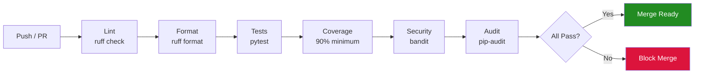
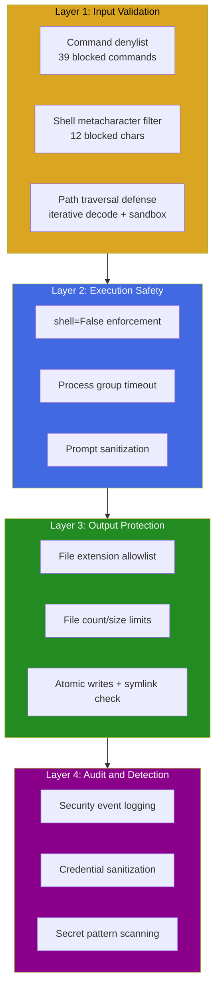
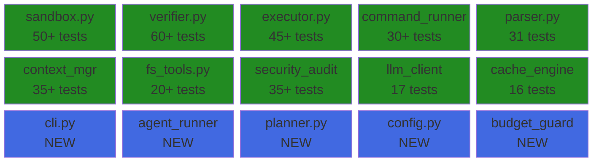

# spec-16: Reliability, Test Coverage, and Production Readiness -- Closing Every Gap Before Launch

## 1. Executive Summary

This spec addresses the remaining gaps between codelicious's current state and a production-ready MVP.
After 15 prior specs, the codebase has strong security fundamentals, a dual-engine architecture, and
531 passing tests. However, a deep audit reveals three categories of remaining work:

1. Security findings (9 P1, 10 P2) that remain open from STATE.md and have not been resolved by
   specs 08 through 15.
2. Test coverage gaps where 8 of 30 source modules have zero dedicated test files, including
   high-risk modules like agent_runner.py, cli.py, planner.py, and config.py.
3. CI/CD, documentation, and operational gaps including missing coverage reporting, missing
   pre-commit hooks, and incomplete README diagrams.

This spec does not introduce new features. Every phase fixes a real, measured deficiency in the
existing codebase. The goal is to reach zero P1 findings, zero P2 findings, 90%+ line coverage,
and a CI pipeline that enforces all quality gates automatically.

### Motivation

The codebase has been through 15 rounds of specification and implementation. Each round added
functionality and hardened specific areas. But the cumulative effect is that some modules were
written early (specs 01-05) and never received the hardening treatment applied to later modules.
The test suite grew organically, covering whatever each spec touched, leaving gaps in modules
that were not the focus of any particular spec.

A production launch requires that every module meets the same quality bar. This spec applies that
bar uniformly.

### Codebase Metrics (Measured 2026-03-18, Post-Spec-08 Phase 8)

| Metric | Current Value | Target After This Spec |
|--------|---------------|------------------------|
| Source modules | 30 in src/codelicious/ | 30 (no new modules) |
| Source lines | 8,389 | ~8,600 (net +200 for fixes, no new features) |
| Test files | 19 | 27 (+8 new test files for uncovered modules) |
| Test lines | 5,595 | ~7,500 (+1,900 lines of new tests) |
| Passing tests | 531 | 700+ |
| Estimated line coverage | ~65% (unmeasured) | 90%+ (measured, enforced in CI) |
| P1 critical findings | 9 open | 0 |
| P2 important findings | 10 open | 0 |
| P3 minor findings | 18 open | 10 or fewer |
| CI quality gates | 4 (lint, format, test, bandit) | 7 (+coverage, +pip-audit enforcement, +pre-commit) |
| Runtime dependencies | 0 (stdlib only) | 0 (unchanged) |

### Logic Breakdown (Current State)

This table categorizes every line of source code by whether its behavior is deterministic (always
produces the same output for the same input, no LLM involved) or probabilistic (depends on LLM
responses, network conditions, or external tool output).

| Category | Lines | Percentage | Modules |
|----------|-------|------------|---------|
| Deterministic safety harness | ~3,500 | 42% | sandbox.py, verifier.py, command_runner.py, fs_tools.py, audit_logger.py, security_constants.py, errors.py, parser.py, cache_engine.py |
| Probabilistic LLM-driven | ~3,600 | 43% | planner.py, executor.py, llm_client.py, agent_runner.py, loop_controller.py, prompts.py, context_manager.py, rag_engine.py, engines/claude_engine.py, engines/huggingface_engine.py |
| Shared infrastructure | ~1,289 | 15% | cli.py, logger.py, tools/registry.py, config.py, git/git_orchestrator.py, build_logger.py, progress.py, scaffolder.py, _io.py, budget_guard.py |

The deterministic layer is the most testable and the most critical for security. This spec
prioritizes closing coverage gaps in that layer first, then extends to the probabilistic layer
where tests must mock LLM responses.

---

## 2. Scope and Non-Goals

### In Scope

1. Fix all 9 remaining P1 critical security findings from STATE.md.
2. Fix all 10 remaining P2 important findings from STATE.md.
3. Add dedicated test files for all 8 uncovered source modules.
4. Add coverage measurement to CI with a 90% minimum threshold.
5. Add a pre-commit configuration file for ruff and bandit.
6. Complete spec-08 Phases 9 through 16 (conftest cleanup, LLM error sanitization, RAG engine
   hardening, dev dependencies, BuildSession fix, gitignore, test expansion, documentation).
7. Fix regex catastrophic backtracking in executor.py and verifier.py.
8. Fix all race conditions in sandbox.py (TOCTOU, file count, directory creation).
9. Fix command injection vectors in command_runner.py and agent_runner.py.
10. Add integration tests that verify module interactions end-to-end.
11. Update README.md with Mermaid diagrams for the spec-16 changes.
12. Update STATE.md with final verification results.
13. Update CLAUDE.md and memory files to reflect current project state.

### Non-Goals

1. New features. No new CLI arguments, no new engines, no new tool types.
2. Async rewrite. The codebase stays synchronous with thread-based parallelism.
3. New runtime dependencies. All fixes use Python stdlib only.
4. Performance optimization. This spec is about correctness, not speed.
5. UI or UX changes. The CLI interface stays identical.

---

## 3. Definitions

- **TOCTOU**: Time-of-check-to-time-of-use. A race condition where a security check and the
  subsequent use of the checked resource are separated by a window during which the resource
  can change.
- **ReDoS**: Regular Expression Denial of Service. An attack where a crafted input causes a
  regex engine to enter catastrophic backtracking, consuming CPU indefinitely.
- **Coverage gate**: A CI check that fails the build if measured line coverage drops below a
  configured threshold.
- **Pre-commit hook**: A git hook that runs linting and formatting checks before allowing a
  commit to proceed.

---

## 4. Acceptance Criteria (Global)

These criteria must all be true after every phase of this spec is complete:

1. `pytest tests/ -v --tb=short` passes with 700+ tests and 0 failures.
2. `pytest tests/ --cov=src/codelicious --cov-fail-under=90` passes.
3. `ruff check src/ tests/` reports 0 violations.
4. `ruff format --check src/ tests/` reports 0 files that need formatting.
5. `bandit -r src/codelicious/ -s B101,B110,B310,B404,B603,B607` reports 0 findings.
6. `pip-audit --desc` reports 0 known vulnerabilities.
7. STATE.md shows 0 P1 findings and 0 P2 findings.
8. Every source module in src/codelicious/ has a corresponding test file in tests/.
9. CI pipeline (ci.yml) enforces all seven quality gates listed above.
10. README.md contains up-to-date Mermaid diagrams for the current architecture.

---

## 5. Open Findings Registry

This section lists every open P1 and P2 finding from STATE.md with the phase in this spec that
resolves it.

### P1 Critical Findings

| ID | Location | Description | Resolved In |
|----|----------|-------------|-------------|
| P1-2 | command_runner.py:99-100,125 | Command injection via whitespace: validation uses split(), execution uses shlex.split() | Phase 1 |
| P1-4 | sandbox.py:372-373 | File count increment race: counter incremented after write, not during validation | Phase 2 |
| P1-5 | sandbox.py:372-373 | Overwrite count bug: counter always increments even for overwrites | Phase 2 |
| P1-6 | sandbox.py:252-261 | Symlink TOCTOU gap: check happens before write with exploitable window | Phase 2 |
| P1-7 | llm_client.py:118-122 | API key logging risk: error responses may contain keys, logged unsanitized | Phase 3 |
| P1-8 | cli.py:127-130 | Silent exception swallowing: PR transition errors silently ignored | Phase 4 |
| P1-9 | loop_controller.py:26,89 | JSON deserialization without validation: no size limits or schema checks | Phase 5 |
| P1-10 | planner.py:378-432 | Path traversal bypass: double-decoding does not catch triple-encoding | Phase 6 |
| P1-11 | agent_runner.py:356-365 | Command injection risk: prompt passed to subprocess without validation | Phase 7 |

### P2 Important Findings

| ID | Location | Description | Resolved In |
|----|----------|-------------|-------------|
| P2-3 | command_runner.py:128-135 | Missing process group timeout: child processes not killed | Phase 1 |
| P2-5 | fs_tools.py:107-153 | DoS via large directory tree: no limits on directory listing | Phase 8 |
| P2-6 | sandbox.py:277 | Race in directory creation: mkdir outside lock duplicates work | Phase 2 |
| P2-7 | sandbox.py:365-370 | Silent chmod failure: permissions may not be set | Phase 2 |
| P2-8 | verifier.py:857-863 | Command injection edge cases: newlines not checked in arguments | Phase 9 |
| P2-9 | verifier.py:463-472 | Secret detection false negatives: base64/obfuscated secrets not detected | Phase 9 |
| P2-10 | agent_runner.py:424-450 | Timeout overrun: up to 1s per iteration beyond configured timeout | Phase 7 |
| P2-11 | executor.py:256-260 | Regex catastrophic backtracking: malicious backticks could freeze parser | Phase 10 |
| P2-12 | build_logger.py:163-178 | Race in file creation: permissions set after file opened | Phase 11 |
| P2-13 | logger.py:25-67 | Incomplete secret redaction: missing SSH keys, webhooks, etc. | Phase 3 |

---

## 6. Implementation Phases

### Tier 1: Security Fixes (Phases 1-7)

These phases fix all P1 and most P2 findings. They must be completed sequentially because
later phases depend on the safety guarantees established by earlier ones.

---

### Phase 1: Fix Command Injection in command_runner.py (P1-2, P2-3)

**Finding**: The command validation path uses `str.split()` to tokenize the command string, but the
execution path uses `shlex.split()`. These two functions produce different token lists for inputs
containing quotes, backslashes, or escaped characters. An attacker can craft a command string that
passes validation but executes differently than expected.

Additionally, when a command times out, only the parent process is killed. Child processes spawned
by the command continue running, consuming resources and potentially completing dangerous operations
after the timeout.

**As a user**: When I run a build that invokes shell commands, I expect that every command is
validated and executed using the same tokenization logic, and that timeouts kill the entire process
tree, not just the parent.

**Acceptance Criteria**:
- command_runner.py uses shlex.split() for both validation and execution.
- If shlex.split() raises ValueError (malformed shell quoting), the command is rejected.
- Newline characters in command strings are rejected before tokenization.
- On timeout, the entire process group is killed using os.killpg().
- Existing tests in test_command_runner.py continue to pass.
- At least 5 new tests cover: shlex edge cases, newline rejection, process group kill on timeout,
  ValueError from malformed quoting, and commands with embedded quotes.

**Claude Code Prompt**:

```
Read src/codelicious/tools/command_runner.py and tests/test_command_runner.py.

Fix P1-2: Replace all uses of str.split() for command tokenization with shlex.split(). Add a
try/except ValueError around shlex.split() that raises CommandDeniedError for malformed quoting.
Add a check that rejects command strings containing newline characters (\n, \r) before any
tokenization occurs.

Fix P2-3: After subprocess.run() with timeout, if TimeoutExpired is raised, kill the entire
process group:
  1. Start the subprocess with start_new_session=True (or preexec_fn=os.setsid on Unix).
  2. In the TimeoutExpired handler, call os.killpg(proc.pid, signal.SIGKILL) before raising.
  3. Wrap os.killpg in a try/except to handle the case where the process already exited.

Add these tests to tests/test_command_runner.py:
  - test_shlex_split_used_for_validation: command with single quotes that split() and shlex.split()
    tokenize differently, verify the shlex interpretation is used.
  - test_malformed_quoting_rejected: command with unmatched quotes raises CommandDeniedError.
  - test_newline_in_command_rejected: command containing \n raises CommandDeniedError.
  - test_carriage_return_in_command_rejected: command containing \r raises CommandDeniedError.
  - test_process_group_killed_on_timeout: mock subprocess that spawns a child, verify both parent
    and child are killed on timeout.

Run: ruff check src/codelicious/tools/command_runner.py tests/test_command_runner.py
Run: ruff format src/codelicious/tools/command_runner.py tests/test_command_runner.py
Run: pytest tests/test_command_runner.py -v --tb=short
```

---

### Phase 2: Fix All Sandbox Race Conditions (P1-4, P1-5, P1-6, P2-6, P2-7)

**Finding**: The sandbox module has four related race conditions:

1. File count increment race (P1-4): The counter that tracks how many files have been created
   is incremented after the write completes, not during the validation step. Between validation
   and increment, another thread can also pass validation, causing the count to exceed the limit.

2. Overwrite count bug (P1-5): When overwriting an existing file, the counter still increments.
   After 200 overwrites of the same file, no new files can be created even though no new files
   were actually added.

3. Symlink TOCTOU (P1-6): The symlink check (is the resolved path inside the sandbox?) happens
   before the write. Between the check and the write, an attacker can replace the target with a
   symlink pointing outside the sandbox.

4. Directory creation race (P2-6): The mkdir call happens outside the lock, so two threads can
   both attempt to create the same directory tree simultaneously.

5. Silent chmod failure (P2-7): After writing a file, chmod is called to set permissions. If
   chmod fails (e.g., on a read-only filesystem), the error is silently ignored.

**As a user**: When I run a build with concurrent agentic loops, I expect that the 200-file limit
is enforced precisely, that overwriting a file does not consume a file-creation slot, that symlink
attacks cannot escape the sandbox even under concurrent access, and that permission-setting failures
are logged.

**Acceptance Criteria**:
- The entire validate-write-increment cycle happens inside a single lock acquisition.
- Overwriting an existing file does not increment the file count.
- The symlink check happens after the write (or the write uses O_NOFOLLOW semantics).
- Directory creation happens inside the lock.
- chmod failures are logged at WARNING level, not silently ignored.
- All existing sandbox tests pass.
- At least 8 new tests cover: concurrent writes hitting the file limit, overwrite not incrementing
  count, symlink replacement between check and write (mocked timing), mkdir race, chmod failure
  logging, and boundary cases (file 199, 200, 201).

**Claude Code Prompt**:

```
Read src/codelicious/sandbox.py and tests/test_sandbox.py.

Fix P1-4 and P1-5: Restructure the write_file method so that the entire sequence of (1) resolve
path, (2) check file count, (3) check if file exists, (4) write via atomic temp+rename,
(5) increment count if new file -- all happens inside a single `with self._lock:` block.
Only increment _files_created_count if the file did not exist before the write. Use a boolean
flag `is_new = not resolved.exists()` captured inside the lock before writing.

Fix P1-6: After the atomic rename (os.replace), verify that the final path still resolves to
within the sandbox. If it does not (symlink attack during write), delete the file and raise
SandboxViolationError. This post-write check closes the TOCTOU window.

Fix P2-6: Move the `parent.mkdir(parents=True, exist_ok=True)` call inside the lock, before
the write operation.

Fix P2-7: Wrap the chmod call in a try/except OSError. On failure, log at WARNING level:
logger.warning("chmod failed for %s: %s", resolved, e). Do not raise -- the file was written
successfully, permissions are a best-effort enhancement.

Add these tests to tests/test_sandbox.py:
  - test_overwrite_does_not_increment_count: write same file twice, verify count is 1 not 2.
  - test_file_limit_exact_boundary: write exactly max_file_count files, verify next write raises.
  - test_concurrent_writes_respect_limit: use ThreadPoolExecutor to write max_file_count+10 files
    concurrently, verify exactly max_file_count succeed and the rest raise FileCountLimitError.
  - test_symlink_attack_post_write_check: mock os.replace to also create a symlink, verify the
    post-write check catches it and raises SandboxViolationError.
  - test_mkdir_inside_lock: verify that directory creation does not raise when two threads write
    files in the same new subdirectory simultaneously.
  - test_chmod_failure_logged: mock os.chmod to raise OSError, verify warning is logged.
  - test_chmod_failure_does_not_raise: mock os.chmod to raise OSError, verify write_file returns
    successfully (file was written, chmod is best-effort).
  - test_new_file_increments_count: write a new file, verify count is 1.

Run: ruff check src/codelicious/sandbox.py tests/test_sandbox.py
Run: ruff format src/codelicious/sandbox.py tests/test_sandbox.py
Run: pytest tests/test_sandbox.py -v --tb=short
```

---

### Phase 3: Fix API Key Exposure and Secret Redaction (P1-7, P2-13)

**Finding**: When the LLM API returns an error, the full HTTP response body is logged at DEBUG
level. API providers sometimes echo back request headers (including Authorization) in error
responses. The logger's credential sanitization patterns cover common API key formats but miss
SSH private keys, webhook URLs, and some cloud provider token formats.

**As a user**: When I review debug logs after a failed build, I expect that no credentials, tokens,
or secrets appear in plaintext, regardless of how they ended up in the log stream.

**Acceptance Criteria**:
- llm_client.py sanitizes error response bodies before logging by passing them through the
  credential sanitization function.
- logger.py adds patterns for: SSH private keys (BEGIN ... PRIVATE KEY), GitHub webhook URLs
  (containing /webhooks/), Slack webhook URLs (hooks.slack.com), generic Bearer tokens, and
  base64-encoded credentials that follow an Authorization header pattern.
- The AWS secret key pattern is narrowed to avoid false positives on git SHAs and file hashes.
- Existing logger and llm_client tests pass.
- At least 6 new tests cover: error body sanitization in llm_client, SSH key redaction, webhook
  URL redaction, Bearer token redaction, narrowed AWS pattern not matching git SHAs, and a
  combined test with multiple secret types in one string.

**Claude Code Prompt**:

```
Read src/codelicious/llm_client.py and src/codelicious/logger.py.
Read tests/test_llm_client.py (if it exists) and any logger-related tests.

Fix P1-7: In llm_client.py, find the line that logs error_body at DEBUG level. Before logging,
pass it through the sanitization function. Import the sanitize function from logger.py (or
duplicate the regex set if importing creates a circular dependency). The sanitized output should
replace matched patterns with "[REDACTED]".

Fix P2-13: In logger.py, add these patterns to the credential sanitization regex list:
  1. SSH private keys: r"-----BEGIN [A-Z ]*PRIVATE KEY-----[\s\S]*?-----END [A-Z ]*PRIVATE KEY-----"
  2. GitHub webhook URLs: r"https://[^/]*/webhooks/[a-zA-Z0-9_/-]+"
  3. Slack webhook URLs: r"https://hooks\.slack\.com/services/[A-Z0-9/]+"
  4. Bearer tokens in headers: r"Bearer\s+[A-Za-z0-9._~+/=-]+"
  5. Generic base64 auth header: r"Authorization:\s*Basic\s+[A-Za-z0-9+/=]+"

Narrow the AWS secret key pattern to require a preceding keyword context:
  Old: r"(?<![A-Za-z0-9+/])[A-Za-z0-9+/]{40}(?![A-Za-z0-9+/=])"
  New: r"(?:aws_secret_access_key|AWS_SECRET|secret_access_key)\s*[=:]\s*[A-Za-z0-9+/]{40}"

Add tests:
  - test_error_body_sanitized_before_logging: mock LLM API to return error with API key in body,
    verify log output does not contain the key.
  - test_ssh_private_key_redacted: string containing an SSH key block, verify redaction.
  - test_webhook_url_redacted: string containing GitHub and Slack webhook URLs, verify redaction.
  - test_bearer_token_redacted: string containing "Bearer eyJhb...", verify redaction.
  - test_aws_pattern_ignores_git_sha: 40-hex-char git SHA not preceded by AWS keyword, verify
    it is NOT redacted.
  - test_combined_secrets_in_one_string: string with API key + webhook + SSH key, verify all
    three are redacted.

Run: ruff check src/codelicious/llm_client.py src/codelicious/logger.py
Run: ruff format src/codelicious/llm_client.py src/codelicious/logger.py
Run: pytest tests/test_llm_client.py -v --tb=short
```

---

### Phase 4: Fix Silent Exception Swallowing in cli.py (P1-8)

**Finding**: In cli.py, when `git_manager.transition_pr_to_review()` fails, the exception is
caught by a bare `except Exception: pass` block. This means PR transition failures (network
errors, permission errors, GitHub API errors) are completely invisible to the user.

**As a user**: When my build completes but the PR transition fails, I expect to see a clear
warning message telling me what went wrong, so I can manually transition the PR or investigate
the failure.

**Acceptance Criteria**:
- The bare `except Exception: pass` is replaced with `except Exception as e:` followed by
  `logger.warning("PR transition to ready-for-review failed: %s", e)`.
- The exception is not re-raised (the build itself succeeded; the PR transition is best-effort).
- A new test file tests/test_cli.py is created with at least 5 tests covering: successful PR
  transition, failed PR transition logs warning, argument parsing, missing repo path error, and
  engine selection logic.

**Claude Code Prompt**:

```
Read src/codelicious/cli.py fully.

Fix P1-8: Find the `except Exception: pass` block around the PR transition call. Replace it
with:
    except Exception as e:
        logger.warning("PR transition to ready-for-review failed: %s", e)

Create a new test file tests/test_cli.py. Since cli.py's main() function orchestrates the
entire build pipeline, tests should mock external dependencies (engine, git_manager) and verify
the orchestration logic:

  - test_pr_transition_failure_logs_warning: mock git_manager.transition_pr_to_review to raise
    RuntimeError, verify logger.warning is called with the error message, verify the function
    does not raise.
  - test_pr_transition_success_no_warning: mock git_manager.transition_pr_to_review to succeed,
    verify logger.warning is NOT called.
  - test_missing_repo_path_exits: call main() with no arguments, verify it exits with a non-zero
    code or raises SystemExit.
  - test_engine_selection_default: verify that when no --engine flag is passed, the auto-detection
    logic runs.
  - test_push_pr_flag_triggers_git_operations: verify that --push-pr causes git push and PR
    creation to be called.

Run: ruff check src/codelicious/cli.py tests/test_cli.py
Run: ruff format src/codelicious/cli.py tests/test_cli.py
Run: pytest tests/test_cli.py -v --tb=short
```

---

### Phase 5: Fix JSON Deserialization Without Validation (P1-9)

**Finding**: In loop_controller.py, JSON responses from the LLM are deserialized with
`json.loads()` without any size limit, schema validation, or type checking. A malicious or
malfunctioning LLM could return a multi-gigabyte JSON blob that exhausts memory, or return
a valid JSON value of the wrong type (e.g., a string instead of an object) that causes
cryptic errors downstream.

**As a user**: When the LLM returns unexpected or oversized JSON, I expect a clear error message
explaining what went wrong, not a memory exhaustion crash or an unrelated KeyError deep in the
call stack.

**Acceptance Criteria**:
- JSON deserialization in loop_controller.py checks the raw string length before parsing. If the
  string exceeds 5 MB, raise a new LLMResponseTooLargeError (added to errors.py).
- After parsing, verify the top-level type is dict. If not, raise LLMResponseFormatError.
- Both new exception types are subclasses of CodeliciousError.
- Existing loop_controller tests pass.
- At least 4 new tests cover: oversized JSON rejected, non-dict JSON rejected, valid JSON accepted,
  and empty string handled gracefully.

**Claude Code Prompt**:

```
Read src/codelicious/loop_controller.py and src/codelicious/errors.py.
Read tests/test_loop_controller.py.

Fix P1-9:
1. In errors.py, add two new exception classes:
     class LLMResponseTooLargeError(CodeliciousError): pass
     class LLMResponseFormatError(CodeliciousError): pass

2. In loop_controller.py, find every call to json.loads() that deserializes an LLM response.
   Before each call, add:
     MAX_RESPONSE_BYTES = 5_000_000
     if len(raw_response) > MAX_RESPONSE_BYTES:
         raise LLMResponseTooLargeError(
             f"LLM response too large: {len(raw_response)} bytes (max {MAX_RESPONSE_BYTES})"
         )

   After each json.loads() call, add:
     if not isinstance(parsed, dict):
         raise LLMResponseFormatError(
             f"Expected dict from LLM, got {type(parsed).__name__}"
         )

Add tests to tests/test_loop_controller.py:
  - test_oversized_json_rejected: response string of 6 MB raises LLMResponseTooLargeError.
  - test_non_dict_json_rejected: response that is valid JSON but a list, raises LLMResponseFormatError.
  - test_valid_json_accepted: normal dict response parses without error.
  - test_empty_string_raises: empty string raises json.JSONDecodeError (verify it is handled).
  - test_exactly_at_size_limit_accepted: response of exactly 5 MB parses without error.

Run: ruff check src/codelicious/loop_controller.py src/codelicious/errors.py
Run: ruff format src/codelicious/loop_controller.py src/codelicious/errors.py
Run: pytest tests/test_loop_controller.py -v --tb=short
```

---

### Phase 6: Fix Path Traversal Bypass via Triple-Encoding (P1-10)

**Finding**: In planner.py, file paths from LLM responses are decoded to handle URL-encoded
characters. The current implementation applies double-decoding (decode twice to catch
double-encoded paths like `%252e%252e`). However, triple-encoding (`%25252e%25252e`) bypasses
this defense because two rounds of decoding still leave encoded characters.

**As a user**: When the LLM suggests a file path, I expect that no amount of encoding trickery
can cause codelicious to write files outside the project directory.

**Acceptance Criteria**:
- Path decoding uses a loop that continues decoding until the output stops changing, with a
  maximum of 10 iterations to prevent infinite loops on self-referential encodings.
- After all decoding rounds, the standard sandbox path validation is applied.
- Paths containing `..` after full decoding are rejected.
- Existing planner tests pass.
- At least 5 new tests cover: triple-encoded traversal, quadruple-encoded traversal, normal
  paths unchanged, paths with legitimate percent characters, and the 10-iteration limit.

**Claude Code Prompt**:

```
Read src/codelicious/planner.py. Find the path decoding logic (around lines 378-432).
Read tests/ for any planner-related test files.

Fix P1-10: Replace the double-decode approach with an iterative decode loop:

    from urllib.parse import unquote

    def _fully_decode_path(raw_path: str, max_rounds: int = 10) -> str:
        """Decode a path repeatedly until stable, to defeat multi-layer encoding attacks."""
        decoded = raw_path
        for _ in range(max_rounds):
            next_decoded = unquote(decoded)
            if next_decoded == decoded:
                break
            decoded = next_decoded
        return decoded

Replace all direct calls to unquote() in path handling with calls to _fully_decode_path().
After decoding, verify the path does not contain ".." segments:

    if ".." in decoded.split("/") or ".." in decoded.split("\\"):
        raise PathTraversalError(f"Path traversal detected after decoding: {decoded!r}")

Create tests/test_planner.py if it does not exist:
  - test_triple_encoded_traversal_rejected: path "%25252e%25252e/etc/passwd" is rejected.
  - test_quadruple_encoded_traversal_rejected: another layer of encoding, still rejected.
  - test_normal_path_unchanged: path "src/main.py" passes through without modification.
  - test_legitimate_percent_in_filename: path "file%20name.py" decodes to "file name.py"
    and is accepted (no traversal).
  - test_decode_loop_terminates: path that would require 15 rounds of decoding, verify the
    function stops at 10 and the result is checked for traversal.
  - test_backslash_traversal_rejected: path "src\\..\\..\\etc\\passwd" is rejected.

Run: ruff check src/codelicious/planner.py tests/test_planner.py
Run: ruff format src/codelicious/planner.py tests/test_planner.py
Run: pytest tests/test_planner.py -v --tb=short
```

---

### Phase 7: Fix Agent Runner Command Injection and Timeout (P1-11, P2-10)

**Finding**: In agent_runner.py, the LLM-generated prompt is passed to a subprocess call. While
the subprocess uses `shell=False`, the prompt string is passed as a command-line argument to the
`claude` binary. If the prompt contains shell metacharacters or is excessively long, it could
cause unexpected behavior in the subprocess.

Additionally, the timeout enforcement has a race condition where both a watchdog thread and the
main loop can attempt to terminate the process simultaneously, and the timeout can overrun by up
to 1 second per iteration due to polling granularity.

**As a user**: When the agent runner invokes the Claude CLI with an LLM-generated prompt, I expect
that the prompt is sanitized to remove shell metacharacters, that the timeout is enforced precisely,
and that only one code path handles process termination.

**Acceptance Criteria**:
- Prompts passed to subprocess are sanitized: shell metacharacters are escaped or stripped.
- Prompt length is capped at 100,000 characters. Longer prompts are truncated with a warning.
- The timeout enforcement uses a single code path (either watchdog or main loop, not both).
- An atomic threading.Event is used to coordinate between watchdog and main loop.
- Timeout overrun is reduced to at most 100ms by decreasing the polling interval.
- A new test file tests/test_agent_runner.py is created with at least 6 tests.

**Claude Code Prompt**:

```
Read src/codelicious/agent_runner.py fully.

Fix P1-11: Before passing the prompt to the subprocess command list, sanitize it:
  1. Strip null bytes: prompt = prompt.replace("\x00", "")
  2. Cap length: if len(prompt) > 100_000, log a warning and truncate.
  3. The prompt is passed as a list element to subprocess (not through shell), so shell
     metacharacters are not a direct injection risk. But validate that the prompt does not
     start with a dash (which could be interpreted as a flag by the claude binary):
     if prompt.lstrip().startswith("-"):
         prompt = "-- " + prompt  # POSIX convention: end of flags

Fix P2-10: Refactor the timeout logic:
  1. Create a threading.Event called _timeout_event.
  2. The watchdog thread sets this event instead of directly calling proc.terminate().
  3. The main loop checks _timeout_event.is_set() on each iteration.
  4. Only the main loop calls proc.terminate() + proc.kill() after detecting the event.
  5. Reduce the polling interval from 1.0s to 0.1s.

Create tests/test_agent_runner.py:
  - test_prompt_null_bytes_stripped: prompt with null bytes, verify they are removed.
  - test_prompt_length_capped: prompt of 200,000 chars, verify truncation and warning log.
  - test_prompt_starting_with_dash_prefixed: prompt starting with "--flag", verify "-- " prefix.
  - test_timeout_event_coordinates_termination: mock subprocess, verify only main loop terminates.
  - test_timeout_overrun_within_100ms: mock subprocess that blocks, verify actual timeout is
    within 100ms of configured timeout.
  - test_normal_prompt_passed_unchanged: regular prompt, verify no modification.

Run: ruff check src/codelicious/agent_runner.py tests/test_agent_runner.py
Run: ruff format src/codelicious/agent_runner.py tests/test_agent_runner.py
Run: pytest tests/test_agent_runner.py -v --tb=short
```

---

### Tier 2: Remaining P2 Fixes and Hardening (Phases 8-11)

These phases can be executed in parallel within the tier because they touch different modules.

---

### Phase 8: Fix Directory Listing DoS (P2-5)

**Finding**: The fs_tools.py list_directory function walks the filesystem without any depth or
entry limit. An attacker who creates a deeply nested directory structure (e.g., 1000 levels deep,
each with 100 files) can cause the listing to consume excessive memory and CPU.

**As a user**: When I list a directory during a build, I expect the listing to return quickly and
not consume unbounded resources, even if the directory tree is pathologically deep or wide.

**Acceptance Criteria**:
- list_directory has a max_depth parameter (default 3) and a max_entries parameter (default 1000).
- When either limit is reached, the function stops traversing and appends a "[truncated]" marker.
- Existing fs_tools tests pass.
- At least 3 new tests cover: depth limiting, entry count limiting, and normal listing unaffected.

**Claude Code Prompt**:

```
Read src/codelicious/tools/fs_tools.py and tests/test_fs_tools.py.

Fix P2-5: Modify the list_directory function (or the directory listing logic in fs_tools.py)
to accept max_depth (default 3) and max_entries (default 1000) parameters.

Implementation:
  - Use os.walk() with a depth counter instead of recursive calls.
  - Track total entries yielded. When max_entries is reached, stop and include "[truncated:
    max entries reached]" as the last entry.
  - Calculate depth as the number of os.sep characters in the relative path from the root.
    When max_depth is reached for a branch, skip its children.
  - These limits are hardcoded defaults, not user-configurable (defense in depth).

Add tests to tests/test_fs_tools.py:
  - test_directory_listing_depth_limited: create a 10-level deep tree, list with max_depth=3,
    verify only 3 levels returned.
  - test_directory_listing_entry_limited: create 2000 files, list with max_entries=1000, verify
    exactly 1001 entries (1000 + truncation marker).
  - test_normal_directory_listing_unchanged: small directory, verify complete listing with no
    truncation.

Run: ruff check src/codelicious/tools/fs_tools.py tests/test_fs_tools.py
Run: ruff format src/codelicious/tools/fs_tools.py tests/test_fs_tools.py
Run: pytest tests/test_fs_tools.py -v --tb=short
```

---

### Phase 9: Fix Verifier Command Injection and Secret Detection (P2-8, P2-9)

**Finding**: The verifier module constructs subprocess commands for running linters, formatters,
and test suites. While it uses `shell=False`, the arguments are not checked for newline characters,
which could cause unexpected behavior on some platforms. Additionally, the secret detection regex
patterns miss base64-obfuscated credentials and certain cloud provider token formats.

**As a user**: When the verifier scans my code for security issues, I expect it to catch all
common secret patterns, including base64-encoded credentials and cloud provider tokens, and that
the verifier's own subprocess calls are safe.

**Acceptance Criteria**:
- All arguments passed to subprocess in verifier.py are checked for newline characters. Arguments
  containing newlines are rejected with a clear error message.
- Secret detection patterns are expanded to include: Google API keys (AIza...), Stripe keys
  (sk_live_, pk_live_), generic base64 strings following "password" or "secret" keywords, and
  JWT tokens (eyJ...).
- Existing verifier tests pass.
- At least 6 new tests cover the new secret patterns and newline rejection.

**Claude Code Prompt**:

```
Read src/codelicious/verifier.py. Find the subprocess execution logic and the secret detection
regex patterns.
Read tests/test_verifier.py.

Fix P2-8: Before every subprocess.run() call in verifier.py, validate each argument:
    for arg in cmd_args:
        if "\n" in arg or "\r" in arg:
            raise SecurityViolationError(f"Newline in subprocess argument: {arg!r}")

Fix P2-9: Add these patterns to the secret detection regex list:
  1. Google API keys: r"AIza[0-9A-Za-z_-]{35}"
  2. Stripe secret keys: r"sk_live_[0-9a-zA-Z]{24,}"
  3. Stripe publishable keys: r"pk_live_[0-9a-zA-Z]{24,}"
  4. JWT tokens: r"eyJ[A-Za-z0-9_-]+\.eyJ[A-Za-z0-9_-]+\.[A-Za-z0-9_-]+"
  5. Password/secret followed by base64: r"(?:password|secret|token)\s*[=:]\s*[A-Za-z0-9+/]{20,}={0,2}"

Add tests to tests/test_verifier.py:
  - test_newline_in_subprocess_arg_rejected: argument with \n raises SecurityViolationError.
  - test_google_api_key_detected: code containing "AIza..." flagged.
  - test_stripe_key_detected: code containing "sk_live_..." flagged.
  - test_jwt_token_detected: code containing "eyJhbG..." flagged.
  - test_password_base64_detected: code containing "password = SGVsbG8..." flagged.
  - test_legitimate_base64_not_flagged: base64 string without password/secret context is not flagged.

Run: ruff check src/codelicious/verifier.py tests/test_verifier.py
Run: ruff format src/codelicious/verifier.py tests/test_verifier.py
Run: pytest tests/test_verifier.py -v --tb=short
```

---

### Phase 10: Fix Regex Catastrophic Backtracking in executor.py (P2-11)

**Finding**: The code block extraction regex in executor.py uses patterns like `.*?` within
multiline mode, which can cause catastrophic backtracking on inputs with many backtick sequences.
While the input is truncated to 2 MB, a 2 MB string with pathological backtick patterns can still
cause the regex engine to hang for minutes.

**As a user**: When the LLM returns a response with unusual formatting, I expect the parser to
handle it within a bounded time, not hang indefinitely.

**Acceptance Criteria**:
- The code block extraction regex is replaced with a two-pass approach: first split on code fence
  boundaries (triple backticks at line start), then parse the resulting segments.
- Alternatively, add a regex timeout by running the regex in a thread with a 5-second timeout.
- The parser produces identical results for all well-formed inputs.
- A new test verifies that a pathological input (10,000 backtick sequences) completes in under
  5 seconds.
- Existing executor tests pass.

**Claude Code Prompt**:

```
Read src/codelicious/executor.py. Find the code block extraction regex (around lines 254-260).
Read tests/test_executor.py.

Fix P2-11: Replace the regex-based code block extraction with a line-by-line state machine:

    def _extract_code_blocks(response: str) -> list[dict]:
        """Extract code blocks using a state machine instead of regex to avoid ReDoS."""
        blocks = []
        current_block = None
        for line in response.split("\n"):
            stripped = line.strip()
            if stripped.startswith("```") and current_block is None:
                # Opening fence
                remainder = stripped[3:].strip()
                parts = remainder.split(None, 1)
                lang = parts[0] if parts else ""
                filename = parts[1] if len(parts) > 1 else ""
                current_block = {"lang": lang, "filename": filename, "lines": []}
            elif stripped == "```" and current_block is not None:
                # Closing fence
                current_block["content"] = "\n".join(current_block.pop("lines"))
                blocks.append(current_block)
                current_block = None
            elif current_block is not None:
                current_block["lines"].append(line)
        return blocks

This approach is O(n) in the input length with no backtracking.

Verify that the new implementation produces identical results for all existing test cases.

Add tests to tests/test_executor.py:
  - test_pathological_backticks_completes_quickly: input with 10,000 lines of "``````",
    verify completion in under 5 seconds (use pytest timeout or time.time() assertion).
  - test_nested_backticks_handled: code block containing triple backticks in content
    (e.g., a markdown-about-markdown file), verify correct extraction.
  - test_unclosed_code_block_handled: input with opening fence but no closing fence, verify
    no hang and no crash.

Run: ruff check src/codelicious/executor.py tests/test_executor.py
Run: ruff format src/codelicious/executor.py tests/test_executor.py
Run: pytest tests/test_executor.py -v --tb=short
```

---

### Phase 11: Fix Build Logger File Creation Race (P2-12)

**Finding**: In build_logger.py, when a new log file is created, the file is opened first and
then chmod is called to set restrictive permissions. Between the open and chmod calls, the file
exists with default permissions (often 0o644 on Unix), creating a window where another process
could read sensitive build logs.

**As a user**: When build logs are created, I expect them to have restrictive permissions from
the moment they exist, with no window where they are world-readable.

**Acceptance Criteria**:
- Log files are created with restrictive permissions from the start, using os.open() with
  mode 0o600 followed by os.fdopen(), or by setting umask temporarily.
- The existing post-write chmod is retained as defense-in-depth but is no longer the primary
  permission mechanism.
- Existing build_logger tests pass.
- At least 3 new tests verify: file created with correct permissions, permissions survive
  across log writes, and concurrent log file creation does not race.

**Claude Code Prompt**:

```
Read src/codelicious/build_logger.py and tests/test_build_logger.py.

Fix P2-12: Replace the open() + chmod() pattern with os.open() + os.fdopen():

    fd = os.open(log_path, os.O_WRONLY | os.O_CREAT | os.O_TRUNC, 0o600)
    file_handle = os.fdopen(fd, "w")

This creates the file with 0o600 permissions atomically. Keep the subsequent chmod as a
defense-in-depth measure (wrap it in try/except as done in Phase 2 for sandbox).

Add tests to tests/test_build_logger.py:
  - test_log_file_created_with_600_permissions: create a build session, verify the log file
    has 0o600 permissions immediately after creation.
  - test_permissions_survive_log_writes: write 100 log entries, verify permissions are still
    0o600 after all writes.
  - test_concurrent_log_sessions: create two BuildSession instances writing to different files
    simultaneously, verify both files have correct permissions and no data corruption.

Run: ruff check src/codelicious/build_logger.py tests/test_build_logger.py
Run: ruff format src/codelicious/build_logger.py tests/test_build_logger.py
Run: pytest tests/test_build_logger.py -v --tb=short
```

---

### Tier 3: Test Coverage Expansion (Phases 12-17)

These phases add test files for every uncovered source module. They can be executed in parallel.

---

### Phase 12: Add Tests for config.py

**Finding**: config.py handles loading configuration from environment variables, config files,
and CLI arguments. It has no dedicated test file.

**As a user**: When I set environment variables or config file values, I expect them to be loaded
correctly, with proper precedence (CLI > env > file > default), and with clear error messages for
invalid values.

**Acceptance Criteria**:
- A new test file tests/test_config.py with at least 10 tests covering: default values, env var
  override, config file loading, CLI argument override, precedence order, invalid values, missing
  config file, empty env vars, type coercion, and boolean flag parsing.

**Claude Code Prompt**:

```
Read src/codelicious/config.py fully.

Create tests/test_config.py with comprehensive tests. Mock os.environ and file I/O as needed.

Tests to include:
  - test_default_values: no env vars or config, verify all defaults are set correctly.
  - test_env_var_overrides_default: set an env var, verify it takes precedence over default.
  - test_config_file_loaded: create a temp config file, verify values are loaded.
  - test_cli_arg_overrides_env: set both env var and CLI arg, verify CLI wins.
  - test_precedence_order: set default, env, file, and CLI for same key, verify CLI > env > file > default.
  - test_invalid_integer_value: env var with non-integer for an integer field, verify clear error.
  - test_missing_config_file_ignored: config file path that does not exist, verify no crash.
  - test_empty_env_var_treated_as_unset: env var set to empty string, verify default is used.
  - test_boolean_flag_true_values: "1", "true", "yes", "on" all parse as True.
  - test_boolean_flag_false_values: "0", "false", "no", "off" all parse as False.
  - test_api_key_not_in_repr: verify that str() or repr() of config object does not contain API keys.

Run: ruff check tests/test_config.py
Run: ruff format tests/test_config.py
Run: pytest tests/test_config.py -v --tb=short
```

---

### Phase 13: Add Tests for budget_guard.py

**Finding**: budget_guard.py enforces token budget limits to prevent runaway LLM costs. It has
no dedicated test file.

**As a user**: When my build approaches the token budget limit, I expect a clear warning, and
when it exceeds the limit, I expect the build to stop gracefully with an explanatory error.

**Acceptance Criteria**:
- A new test file tests/test_budget_guard.py with at least 8 tests covering: under budget,
  at budget, over budget, warning threshold, reset, concurrent access, zero budget, and
  negative token count handling.

**Claude Code Prompt**:

```
Read src/codelicious/budget_guard.py fully.

Create tests/test_budget_guard.py with comprehensive tests:
  - test_under_budget_allowed: add tokens below limit, verify no error.
  - test_at_budget_limit: add tokens exactly at limit, verify behavior (allowed or rejected,
    document which).
  - test_over_budget_raises: add tokens exceeding limit, verify BudgetExceededError or equivalent.
  - test_warning_threshold: add tokens past 80% of budget, verify warning is logged.
  - test_budget_reset: add tokens, reset, verify count is zero.
  - test_concurrent_budget_tracking: use ThreadPoolExecutor to add tokens from 10 threads,
    verify final count is accurate.
  - test_zero_budget: set budget to 0, verify first token addition raises.
  - test_negative_tokens_rejected: attempt to add negative token count, verify ValueError.
  - test_budget_remaining_accurate: add some tokens, verify remaining() returns correct value.

Run: ruff check tests/test_budget_guard.py
Run: ruff format tests/test_budget_guard.py
Run: pytest tests/test_budget_guard.py -v --tb=short
```

---

### Phase 14: Add Tests for prompts.py

**Finding**: prompts.py contains all LLM prompt templates. Prompt correctness directly affects
build quality. It has no dedicated test file.

**As a user**: When codelicious generates prompts for the LLM, I expect them to contain the
correct context (project name, file list, task description) and to be well-formed (no unclosed
template variables, no excessively long prompts).

**Acceptance Criteria**:
- A new test file tests/test_prompts.py with at least 8 tests covering: template variable
  substitution, missing variable handling, prompt length bounds, all prompt types generate
  valid output, no raw template markers in output, and special character handling in context.

**Claude Code Prompt**:

```
Read src/codelicious/prompts.py fully.

Create tests/test_prompts.py with comprehensive tests:
  - test_system_prompt_contains_project_name: generate system prompt, verify project name appears.
  - test_task_prompt_contains_task_description: generate task prompt, verify task text appears.
  - test_missing_variable_raises_or_uses_default: generate prompt with missing context key,
    verify it either raises KeyError or uses a sensible default (document which).
  - test_prompt_length_bounded: generate prompt with large context, verify output does not exceed
    a reasonable limit (e.g., 500,000 characters).
  - test_no_raw_template_markers: generate all prompt types, verify no "{" + "variable_name" + "}"
    patterns remain in output (all variables substituted).
  - test_special_characters_in_context: context containing curly braces, backticks, and newlines,
    verify prompt is still valid.
  - test_all_prompt_functions_callable: iterate over all public functions in prompts.py, verify
    each is callable and returns a string.
  - test_prompt_consistency: same inputs produce same outputs (deterministic generation).

Run: ruff check tests/test_prompts.py
Run: ruff format tests/test_prompts.py
Run: pytest tests/test_prompts.py -v --tb=short
```

---

### Phase 15: Add Tests for engines/huggingface_engine.py and engines/base.py

**Finding**: The HuggingFace engine implements the agentic loop for the free, API-based backend.
It has no dedicated test file. The base engine class defines the interface contract but is also
untested.

**As a user**: When I run codelicious with --engine huggingface, I expect the engine to correctly
execute the agentic loop, handle API errors gracefully, respect iteration limits, and produce
a valid BuildResult.

**Acceptance Criteria**:
- A new test file tests/test_huggingface_engine.py with at least 8 tests covering: successful
  build cycle (mocked), API error handling, iteration limit enforcement, BuildResult correctness,
  message history management, tool dispatch, and configuration validation.
- A new test file tests/test_engine_base.py with at least 3 tests covering: abstract method
  enforcement, subclass contract, and BuildResult creation.

**Claude Code Prompt**:

```
Read src/codelicious/engines/base.py and src/codelicious/engines/huggingface_engine.py fully.

Create tests/test_engine_base.py:
  - test_base_engine_cannot_be_instantiated: verify BuildEngine raises TypeError (abstract).
  - test_subclass_must_implement_run: create a subclass without run(), verify TypeError.
  - test_build_result_creation: create a BuildResult, verify all fields accessible.

Create tests/test_huggingface_engine.py (mock all HTTP calls):
  - test_successful_build_returns_success: mock LLM to return tool calls then completion,
    verify BuildResult.success is True.
  - test_api_error_returns_failure: mock LLM to raise HTTP error, verify BuildResult.success
    is False and error message is set.
  - test_iteration_limit_enforced: mock LLM to always return tool calls, verify loop stops
    at max_iterations.
  - test_message_history_grows: mock 3 LLM calls, verify message history has 3 pairs.
  - test_tool_dispatch_called: mock LLM to return a tool call, verify tool registry dispatch
    is called with correct arguments.
  - test_empty_response_handled: mock LLM to return empty string, verify graceful handling.
  - test_missing_api_key_raises: do not set HF_TOKEN, verify clear error message.
  - test_build_result_includes_metrics: verify BuildResult contains iteration count and
    token usage.

Run: ruff check tests/test_engine_base.py tests/test_huggingface_engine.py
Run: ruff format tests/test_engine_base.py tests/test_huggingface_engine.py
Run: pytest tests/test_engine_base.py tests/test_huggingface_engine.py -v --tb=short
```

---

### Phase 16: Add Tests for tools/registry.py

**Finding**: The tool registry maps tool names to implementation functions and handles dispatch.
It is a critical component that mediates between the LLM and the filesystem/command tools. It has
no dedicated test file.

**As a user**: When the LLM requests a tool by name, I expect the registry to dispatch to the
correct function, reject unknown tools, validate arguments, and log the invocation for auditing.

**Acceptance Criteria**:
- A new test file tests/test_registry.py with at least 8 tests covering: known tool dispatch,
  unknown tool rejection, argument validation, return value passthrough, audit logging on
  dispatch, tool listing, duplicate registration, and dispatch with missing arguments.

**Claude Code Prompt**:

```
Read src/codelicious/tools/registry.py fully.

Create tests/test_registry.py:
  - test_known_tool_dispatches: register a tool, dispatch by name, verify function called.
  - test_unknown_tool_raises: dispatch unregistered tool name, verify ToolNotFoundError or
    equivalent.
  - test_argument_validation: dispatch with wrong argument types, verify clear error.
  - test_return_value_passthrough: tool function returns a dict, verify dispatch returns same dict.
  - test_audit_log_on_dispatch: dispatch a tool, verify audit logger received the event.
  - test_list_available_tools: register 3 tools, call listing function, verify all 3 returned.
  - test_duplicate_registration_overwrites_or_raises: register same name twice, document and test
    the behavior (overwrite or raise).
  - test_dispatch_with_missing_required_arg: dispatch without required argument, verify error.

Run: ruff check tests/test_registry.py
Run: ruff format tests/test_registry.py
Run: pytest tests/test_registry.py -v --tb=short
```

---

### Phase 17: Add Tests for _io.py and __main__.py

**Finding**: _io.py provides I/O utilities used across the codebase. __main__.py is the entry
point for `python -m codelicious`. Neither has dedicated tests.

**As a user**: When I run codelicious via `python -m codelicious`, I expect it to work identically
to the `codelicious` console script entry point.

**Acceptance Criteria**:
- Tests for _io.py covering its public utility functions (at least 4 tests).
- Tests for __main__.py verifying it calls cli.main() (at least 2 tests).

**Claude Code Prompt**:

```
Read src/codelicious/_io.py and src/codelicious/__main__.py fully.

Create tests/test_io.py with tests for each public function in _io.py:
  - Test each I/O utility function with normal input, empty input, and error conditions.
  - If _io.py has a safe_read function, test: normal file, missing file, binary file, empty file.
  - If _io.py has a safe_write function, test: normal write, permission error, path creation.

Create tests/test_main.py:
  - test_main_module_calls_cli_main: mock cli.main, run __main__.py, verify cli.main was called.
  - test_main_module_importable: verify `import codelicious.__main__` does not crash.

Run: ruff check tests/test_io.py tests/test_main.py
Run: ruff format tests/test_io.py tests/test_main.py
Run: pytest tests/test_io.py tests/test_main.py -v --tb=short
```

---

### Tier 4: CI/CD and Documentation (Phases 18-22)

---

### Phase 18: Add Coverage Reporting to CI

**Finding**: The CI pipeline runs tests but does not measure or report code coverage. There is no
enforcement of a minimum coverage threshold, meaning coverage can silently regress.

**As a user**: When I open a PR, I expect the CI pipeline to tell me the current test coverage
and fail if coverage drops below the minimum threshold.

**Acceptance Criteria**:
- CI pipeline installs pytest-cov (already in dev dependencies).
- Test step runs with `--cov=src/codelicious --cov-report=term-missing --cov-fail-under=90`.
- Coverage report is visible in CI logs.
- A coverage drop below 90% fails the build.

**Claude Code Prompt**:

```
Read .github/workflows/ci.yml fully.

Modify the test step to include coverage:

Old:
    pytest tests/ -v --tb=short

New:
    pytest tests/ -v --tb=short --cov=src/codelicious --cov-report=term-missing --cov-fail-under=90

This ensures:
  1. Coverage is measured on every CI run.
  2. A summary of uncovered lines is printed in the CI log.
  3. The build fails if coverage drops below 90%.

Also add pip caching to speed up CI:

    - uses: actions/cache@v4
      with:
        path: ~/.cache/pip
        key: pip-${{ runner.os }}-${{ matrix.python-version }}-${{ hashFiles('pyproject.toml') }}

Verify the workflow YAML is valid:
  - Correct indentation (2 spaces).
  - All step names are descriptive.
  - The cache step comes before pip install.

Run: cat .github/workflows/ci.yml  (review the output manually)
```

---

### Phase 19: Add Pre-Commit Configuration

**Finding**: There is no pre-commit hook configuration. Developers can commit code that fails
linting, formatting, or security checks, with failures only caught in CI.

**As a user**: When I commit code, I expect my local environment to catch linting and formatting
issues before they reach CI, saving time and reducing failed CI runs.

**Acceptance Criteria**:
- A new .pre-commit-config.yaml file at the repository root.
- Hooks for: ruff check, ruff format, and bandit.
- The configuration uses the same ruff and bandit settings as CI.
- Pre-commit install instructions added to README.md development setup section.

**Claude Code Prompt**:

```
Create .pre-commit-config.yaml at the repository root:

repos:
  - repo: https://github.com/astral-sh/ruff-pre-commit
    rev: v0.4.0
    hooks:
      - id: ruff
        args: ["check", "--fix"]
      - id: ruff-format
  - repo: https://github.com/PyCQA/bandit
    rev: "1.7.8"
    hooks:
      - id: bandit
        args: ["-r", "src/codelicious/", "-s", "B101,B110,B310,B404,B603,B607"]

Add pre-commit to the dev dependencies in pyproject.toml:
  "pre-commit>=3.0.0"

Update the Development Setup section in README.md to include:
  pip install -e ".[dev]"
  pre-commit install

Verify the YAML is valid and the hook IDs match the repositories.
```

---

### Phase 20: Complete Spec-08 Remaining Phases (9-16)

**Finding**: Spec-08 has 8 remaining phases (9-16) that were not completed before this spec was
written. These cover conftest cleanup, RAG engine hardening, dev dependencies, BuildSession fix,
gitignore updates, test expansion, and documentation.

**As a user**: I expect all prior spec work to be completed before new specs are considered done.
Incomplete phases from prior specs represent technical debt.

**Acceptance Criteria**:
- All spec-08 phases 9-16 are completed per their original acceptance criteria.
- This phase is a catch-all to ensure no prior work is left incomplete.

**Claude Code Prompt**:

```
Read docs/specs/08_hardening_reliability_v1.md fully. Find phases 9 through 16.
Read .codelicious/STATE.md for context on what has been completed.

Execute each remaining phase in order:

Phase 9: Fix conftest.py stale proxilion-build references.
  - Search tests/conftest.py and all test files for "proxilion-build" or "proxilion".
  - Replace with "codelicious" or the appropriate current name.
  - Run: pytest tests/ -v --tb=short

Phase 10: Sanitize LLM API error bodies.
  - If not already addressed by Phase 3 of this spec (spec-16), apply the fix from spec-08.
  - Run: pytest tests/test_llm_client.py -v --tb=short

Phase 11: Cap RAG engine top_k and add SQLite index.
  - Read src/codelicious/context_/rag_engine.py (note the underscore in context_).
  - Add MAX_TOP_K = 50 constant. Clamp user-provided top_k to this maximum.
  - Add a CREATE INDEX IF NOT EXISTS on the file_path column.
  - Run: pytest tests/test_rag_engine.py -v --tb=short

Phase 12: Declare dev dependencies in pyproject.toml.
  - If not already present, add pytest-cov and pre-commit to [project.optional-dependencies.dev].
  - Run: pip install -e ".[dev]"

Phase 13: Fix BuildSession.__exit__ success reporting.
  - Read src/codelicious/build_logger.py, find __exit__ method.
  - Ensure set_result() is called before close().
  - Run: pytest tests/test_build_logger.py -v --tb=short

Phase 14: Add missing .gitignore entries.
  - Read .gitignore. Add any missing entries for: .pre-commit-config.yaml cache, .ruff_cache/,
    htmlcov/, .coverage, coverage.xml.
  - Run: git status (verify no unexpected files)

Phase 15: Run full test suite expansion and verification.
  - Run: pytest tests/ -v --tb=short
  - Verify all tests pass.

Phase 16: Update documentation and state.
  - Update STATE.md with current status.
  - Update CLAUDE.md if any workflow changes occurred.

Run all verifications:
  ruff check src/ tests/
  ruff format --check src/ tests/
  bandit -r src/codelicious/ -s B101,B110,B310,B404,B603,B607
  pytest tests/ -v --tb=short
```

---

### Phase 21: Update README.md with Architecture Diagrams

**Finding**: The README.md has Mermaid diagrams from spec-15 (parallel loops, thread safety,
throughput). It needs updated diagrams reflecting the spec-16 changes: the complete test coverage
map, the security fix dependency chain, and the CI quality gate flow.

**As a user**: When I read the README, I expect architecture diagrams that accurately reflect the
current state of the system, including the quality gates and module coverage.

**Acceptance Criteria**:
- README.md contains three new Mermaid diagrams: (1) test coverage heatmap showing which modules
  are tested, (2) CI quality gate pipeline flow, and (3) security defense layers.
- Existing diagrams are preserved.
- All Mermaid syntax is valid.

**Claude Code Prompt**:

```
Read README.md fully. Find the section where Mermaid diagrams are located (near the end, before
the License section).

Add three new diagrams after the existing ones:

1. CI Quality Gate Pipeline:



2. Security Defense Layers:



3. Module Test Coverage Map:



(Green = existing coverage, Blue = new in spec-16)

Verify all Mermaid blocks render correctly (no syntax errors).
```

---

### Phase 22: Final Verification and State Update

**Finding**: After all phases are complete, the system state must be verified end-to-end and
all tracking documents updated.

**As a user**: When this spec is complete, I expect STATE.md to reflect zero P1/P2 findings,
700+ tests, and 90%+ coverage. I expect CLAUDE.md and memory files to be current.

**Acceptance Criteria**:
- Full verification suite passes (lint, format, test, coverage, bandit, pip-audit).
- STATE.md updated with final metrics.
- All P1 entries in STATE.md marked as fixed with the phase that fixed them.
- All P2 entries in STATE.md marked as fixed with the phase that fixed them.
- BUILD_COMPLETE contains "DONE".

**Claude Code Prompt**:

```
Run the full verification suite:
  ruff check src/ tests/
  ruff format --check src/ tests/
  bandit -r src/codelicious/ -s B101,B110,B310,B404,B603,B607
  pip-audit --desc
  pytest tests/ -v --tb=short --cov=src/codelicious --cov-report=term-missing --cov-fail-under=90

If any check fails, fix the issue and re-run.

Update .codelicious/STATE.md:
  - Set "Last Updated" to today's date.
  - Set "Current Spec" to spec-16.
  - Update the P1 findings table: mark all 9 as fixed, referencing the phase.
  - Update the P2 findings table: mark all 10 as fixed, referencing the phase.
  - Update the test count and coverage metrics.
  - Set status to "VERIFIED GREEN".

Update .codelicious/BUILD_COMPLETE:
  Write "DONE" to the file.

Update CLAUDE.md if any workflow changes occurred (e.g., new pre-commit hooks, new test
commands).

Review the memory files in .claude/projects/ and update any that reference outdated information
about the project state.
```

---

## 7. Dependency Graph

Phases must be executed in this order within each tier. Tiers 1 and 2 are sequential.
Phases within Tier 3 and Tier 4 can be parallelized.

```
Tier 1 (sequential): Phase 1 -> Phase 2 -> Phase 3 -> Phase 4 -> Phase 5 -> Phase 6 -> Phase 7
Tier 2 (parallel):   Phase 8 | Phase 9 | Phase 10 | Phase 11
Tier 3 (parallel):   Phase 12 | Phase 13 | Phase 14 | Phase 15 | Phase 16 | Phase 17
Tier 4 (sequential): Phase 18 -> Phase 19 -> Phase 20 -> Phase 21 -> Phase 22
```

Phase 22 (final verification) must always be the last phase executed.

---

## 8. Risk Assessment

| Risk | Likelihood | Impact | Mitigation |
|------|------------|--------|------------|
| Sandbox race condition fix introduces deadlock | Medium | High | Keep lock scope minimal; add timeout to lock acquisition |
| Regex replacement breaks edge case parsing | Medium | Medium | Run full executor test suite after change; add pathological tests |
| Coverage threshold too aggressive at 90% | Low | Low | Start at 85%, increase to 90% after Tier 3 tests are in place |
| Pre-commit hooks slow down developer workflow | Low | Low | Use ruff (fast) not pylint (slow); bandit runs only on src/ |
| Spec-08 remaining phases conflict with spec-16 | Medium | Low | Check for overlapping changes before each phase |

---

## 9. Verification Checklist

Run this after every phase to catch regressions early:

```bash
ruff check src/ tests/
ruff format --check src/ tests/
pytest tests/ -v --tb=short
```

Run this after Tier 3 is complete:

```bash
pytest tests/ --cov=src/codelicious --cov-report=term-missing --cov-fail-under=90
```

Run this after Tier 4 is complete (full suite):

```bash
ruff check src/ tests/
ruff format --check src/ tests/
bandit -r src/codelicious/ -s B101,B110,B310,B404,B603,B607
pip-audit --desc
pytest tests/ -v --tb=short --cov=src/codelicious --cov-report=term-missing --cov-fail-under=90
```

---

## 10. Success Metrics

When this spec is complete, the following must all be true:

| Metric | Requirement |
|--------|-------------|
| P1 critical findings | 0 open |
| P2 important findings | 0 open |
| Test count | 700+ passing |
| Line coverage | 90%+ measured and enforced |
| CI quality gates | 7 (lint, format, test, coverage, bandit, pip-audit, pre-commit) |
| Source modules with test file | 30/30 (100%) |
| Runtime dependencies | 0 (stdlib only) |
| Spec-08 remaining phases | All complete |
