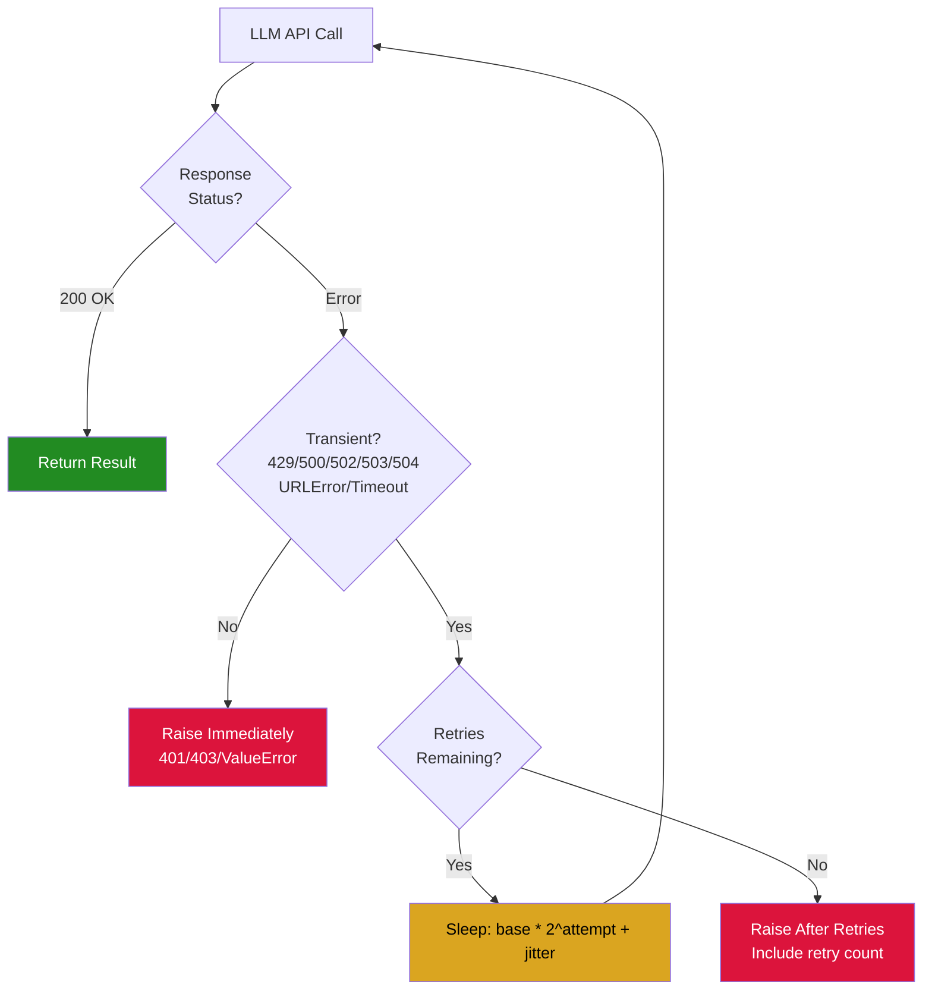
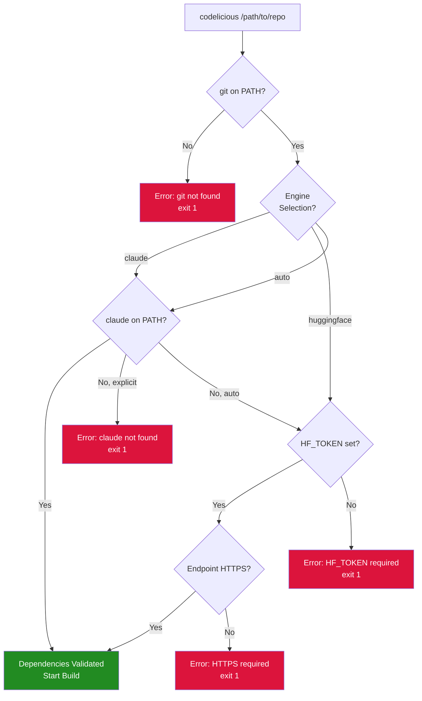
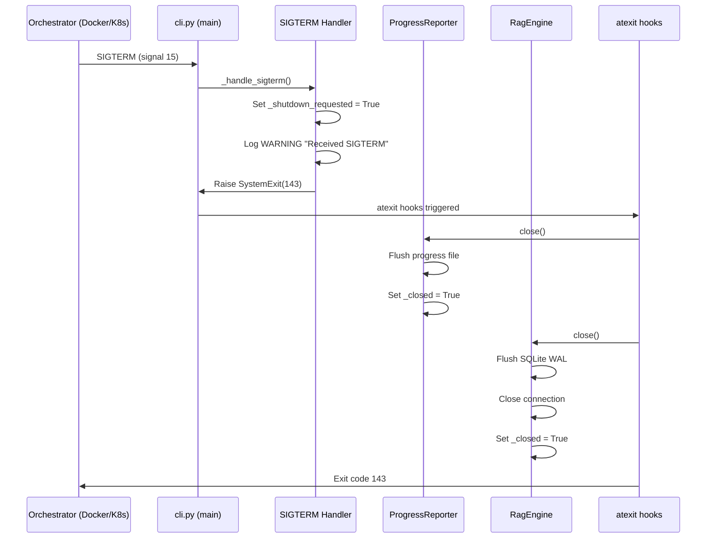
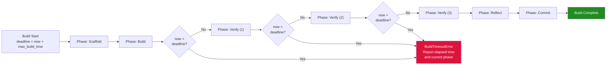
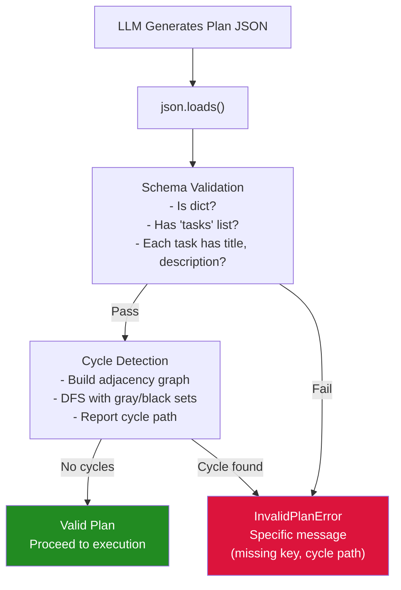

# spec-18: Operational Resilience, Error Recovery, and Production Readiness

## 1. Executive Summary

After 17 prior specifications, the codelicious codebase has 580+ passing tests, zero lint violations,
a 9-layer security model, and dual-engine architecture. Specs 16 and 17 systematically address all
open P1/P2 security findings, test coverage gaps, and CI enforcement. However, a deep operational
audit reveals a distinct category of gaps that neither spec covers: the system's ability to survive
real-world failure conditions gracefully.

This spec addresses 42 specific gaps across 10 categories:

- Graceful shutdown and signal handling (SIGTERM, cleanup hooks)
- LLM API retry logic with exponential backoff and jitter
- Startup validation of external dependencies (git, claude, pytest)
- Input validation on HTTP responses, URLs, and LLM-generated plans
- Cumulative timeout enforcement across multi-phase builds
- Structured error recovery with transient vs. fatal classification
- Engine contract testing and CLI argument validation
- CI matrix completeness (Python 3.14 support declared but untested)
- Observability instrumentation (timing, correlation IDs, structured exceptions)
- Defensive programming for edge cases (empty LLM responses, circular task deps)

This spec does not introduce new features. Every phase fixes a real, measured gap in the existing
codebase that would cause silent failure, resource leaks, or degraded behavior under production
conditions.

### Motivation

Codelicious is designed to run autonomously for 25-75 minutes per build cycle, often inside CI/CD
pipelines, Docker containers, or orchestration systems. The current codebase handles the happy path
well but lacks resilience patterns for the conditions that production environments routinely produce:

- A Docker orchestrator sends SIGTERM before SIGKILL (codelicious has no SIGTERM handler)
- A network blip causes one LLM API call to fail (no retry logic, build fails immediately)
- A user runs codelicious without git installed (no startup check, cryptic subprocess error)
- The LLM returns an empty response (KeyError crash, no graceful degradation)
- A build runs 3 verification passes at 30 minutes each (no cumulative timeout cap)

These are not theoretical risks. They are the standard failure modes of long-running CLI tools in
production environments. This spec closes every one of them.

### Codebase Metrics (Measured 2026-03-20, Post-Spec-16 Phase 1)

| Metric | Current Value | Target After This Spec |
|--------|---------------|------------------------|
| Source modules | 30 in src/codelicious/ | 30 (no new modules) |
| Source lines | ~8,800 | ~9,200 (+400 net for resilience code) |
| Passing tests | 580+ | 680+ (after spec-17 completion: 780+) |
| P1 critical findings | 6 open (spec-17 scope) | 6 open (unchanged, spec-17 owns these) |
| P2 important findings | 11 open (spec-17 scope) | 11 open (unchanged, spec-17 owns these) |
| Operational resilience gaps | 42 | 0 |
| Runtime dependencies | 0 (stdlib only) | 0 (unchanged) |
| CI Python versions tested | 4 (3.10-3.13) | 5 (3.10-3.14) |

### Relationship to Specs 16 and 17

Specs 16 and 17 focus on security findings (P1/P2), test coverage, credential redaction, and CI
quality gates. This spec is orthogonal: it addresses operational behavior that only manifests under
failure conditions, not correctness bugs in the happy path. The two efforts can proceed in parallel
without conflicts because they modify different code paths.

The only shared files are cli.py (spec-17 Phase 1 fixes silent exception swallowing; this spec
Phase 1 adds signal handlers) and verifier.py (spec-17 Phase 8 fixes subprocess process groups;
this spec Phase 6 adds cumulative timeout enforcement). In both cases the changes are additive and
non-overlapping.

### Logic Breakdown (Post-Spec-18)

| Category | Estimated Lines | Percentage | Description |
|----------|-----------------|------------|-------------|
| Deterministic safety harness | ~4,100 | 45% | sandbox, verifier, command_runner, fs_tools, audit_logger, security_constants, startup validation, signal handlers |
| Probabilistic LLM-driven | ~3,600 | 39% | planner, executor, llm_client (now with retries), agent_runner, loop_controller, prompts, context_manager, rag_engine, engines |
| Shared infrastructure | ~1,500 | 16% | cli, logger, cache_engine, tools/registry, config, errors, git_orchestrator, build_logger, progress |

The deterministic safety harness grows as startup validation, signal handling, and timeout
enforcement are added. The probabilistic layer stays constant in line count but gains retry logic
within existing functions.

---

## 2. Scope and Non-Goals

### In Scope

1. Add SIGTERM/SIGINT signal handlers with cleanup sequence in cli.py.
2. Add startup validation for required external tools (git, and optionally claude/pytest/ruff).
3. Add retry logic with exponential backoff and jitter to llm_client.py HTTP calls.
4. Add retry logic to rag_engine.py embedding API calls with clear error distinction.
5. Add cumulative timeout enforcement across multi-phase engine execution.
6. Add graceful degradation for empty or malformed LLM responses in huggingface_engine.py.
7. Add JSON schema validation for LLM-generated plans in planner.py.
8. Add circular dependency detection for task dependency graphs in planner.py.
9. Add HTTPS enforcement and Content-Type validation for all HTTP requests.
10. Add structured exception logging with stack traces at DEBUG level.
11. Add timing instrumentation for LLM API calls.
12. Add per-tool timeout enforcement in tools/registry.py dispatch.
13. Add engine contract tests verifying both engines implement the same interface.
14. Add CLI argument validation tests.
15. Add config precedence tests (CLI > env > file > defaults).
16. Add Python 3.14 to CI test matrix.
17. Add pip-audit known-vulnerability allowlist for CI resilience.
18. Update STATE.md, README.md, and CLAUDE.md documentation.
19. Add Mermaid diagrams for operational resilience architecture to README.md.

### Non-Goals

1. New features. No new CLI flags, engines, tools, or LLM providers.
2. Async/await rewrite. The system stays synchronous with thread-based parallelism.
3. HTTP connection pooling. This would require architectural changes to llm_client.py and is a
   performance optimization, not a resilience fix. Deferred to a future spec.
4. Health check endpoints. Codelicious is a CLI tool, not a long-running server. Health checks
   are not applicable to its execution model.
5. Request correlation IDs. Useful for distributed tracing but out of scope for a single-process
   CLI tool. Deferred to a future spec if multi-service architecture is adopted.
6. New runtime dependencies. All fixes use Python stdlib only.

---

## 3. Gap Inventory

This section catalogs every operational gap with root cause analysis, fix strategy, and acceptance
criteria. Each gap maps to a specific phase in Section 4.

### 3.1 Graceful Shutdown Gaps (3 Issues)

**GS-1: No SIGTERM handler in main process (cli.py)**

- Root cause: The CLI catches KeyboardInterrupt (SIGINT) but does not register a handler for
  SIGTERM. When Docker, Kubernetes, or systemd sends SIGTERM before SIGKILL, the process dies
  without cleanup.
- Fix strategy: Register a signal.signal(signal.SIGTERM, handler) that sets a global shutdown flag,
  logs the signal, and raises SystemExit to trigger normal cleanup.
- Acceptance criteria: When SIGTERM is sent to the process, it must log "Received SIGTERM, shutting
  down gracefully" and exit with code 143 (128 + 15) after running cleanup.

**GS-2: No atexit cleanup for progress reporter (progress.py)**

- Root cause: ProgressReporter.close() exists but is only called in the happy path. If the process
  exits via exception, signal, or SystemExit, the progress file may be left in an incomplete state.
- Fix strategy: Register ProgressReporter.close() via atexit.register() in the constructor. This
  ensures cleanup runs regardless of exit path.
- Acceptance criteria: After any exit condition (normal, exception, SIGTERM), the progress file must
  not contain a dangling "in_progress" entry.

**GS-3: SQLite connection not closed on abnormal exit (rag_engine.py)**

- Root cause: RagEngine uses context managers for individual queries but has no close() method or
  atexit hook for the class-level connection. Abnormal exit leaves the connection open.
- Fix strategy: Add a close() method to RagEngine and register it via atexit.register() in the
  constructor. Also implement __enter__/__exit__ for context manager usage.
- Acceptance criteria: After RagEngine is instantiated and the process exits, the SQLite connection
  must be closed (verified by checking that the WAL file is flushed).

### 3.2 Retry Logic Gaps (2 Issues)

**RL-1: No retry logic on LLM HTTP calls (llm_client.py)**

- Root cause: urllib.request.urlopen() is called once with timeout=120. Any transient failure
  (network blip, 429 rate limit, 502 gateway error, DNS hiccup) causes immediate build failure.
- Fix strategy: Add a retry wrapper with exponential backoff and jitter. Retry on HTTP 429, 500,
  502, 503, 504, and on urllib.error.URLError (network errors). Default: 3 retries, base delay 2
  seconds, max delay 30 seconds, jitter factor 0.5.
- Acceptance criteria: A mocked HTTP 502 on first attempt, 200 on second attempt must succeed
  without raising. A mocked HTTP 401 must fail immediately without retrying (not transient). Three
  consecutive 502s must fail after the third attempt with the original error.

**RL-2: RAG embedding calls fail silently (rag_engine.py)**

- Root cause: _get_embedding() returns an empty list on any exception. The caller cannot distinguish
  between "no API key configured" (permanent) and "network timeout" (transient).
- Fix strategy: Classify errors: missing API key raises a specific ValueError immediately (no
  retry). Network errors (URLError, timeout) retry with backoff. Return empty list only after all
  retries are exhausted, with a logged WARNING explaining the fallback.
- Acceptance criteria: Missing API key logs a single WARNING and returns empty list (no retries).
  Network timeout retries 2 times before returning empty list. The WARNING message must include
  the failure reason.

### 3.3 Startup Validation Gaps (3 Issues)

**SV-1: No validation that git binary exists (cli.py)**

- Root cause: GitManager is instantiated without checking that git is on PATH. If git is missing,
  the user gets a cryptic subprocess.FileNotFoundError when the first git command runs, potentially
  30 minutes into a build.
- Fix strategy: Add a _validate_dependencies() function called at CLI startup that runs
  shutil.which("git"). If missing, print a clear error message and exit with code 1.
- Acceptance criteria: Running codelicious without git installed must print "Error: git is required
  but not found on PATH. Install git and try again." and exit within 1 second.

**SV-2: No validation that claude binary exists when Claude engine is selected (cli.py)**

- Root cause: The Claude engine selection path checks for the binary but the error path is deep in
  agent_runner.py, not at startup. The user waits for scaffolding to complete before learning claude
  is not installed.
- Fix strategy: When engine is "claude" or "auto" (and auto selects Claude), validate
  shutil.which("claude") at startup. If missing and engine was explicit, error immediately. If
  auto, fall through to HuggingFace.
- Acceptance criteria: Running with --engine claude without the claude binary must print "Error:
  claude CLI is required for Claude engine but not found on PATH" and exit within 1 second.

**SV-3: No validation of API credentials at startup (config.py)**

- Root cause: HF_TOKEN and LLM_API_KEY are loaded from environment but not validated until the
  first LLM call, which may be minutes into the build.
- Fix strategy: Add a validate_credentials() method to the config object that checks the relevant
  API key is non-empty and has the expected prefix (hf_ for HuggingFace). Call this at startup
  after engine selection.
- Acceptance criteria: Running with --engine huggingface and an empty HF_TOKEN must print "Error:
  HF_TOKEN environment variable is required for HuggingFace engine" and exit within 1 second.

### 3.4 Input Validation Gaps (4 Issues)

**IV-1: No Content-Type validation on HTTP responses (llm_client.py, rag_engine.py)**

- Root cause: Both modules call json.loads() on HTTP response bodies without checking that the
  Content-Type header is application/json. If a proxy returns an HTML error page, json.loads()
  crashes with an unhelpful JSONDecodeError.
- Fix strategy: After urlopen(), check response.headers.get("Content-Type", ""). If it does not
  contain "application/json", raise LLMClientError with a message including the actual Content-Type
  and the first 200 characters of the response body (redacted).
- Acceptance criteria: A mocked response with Content-Type text/html must raise LLMClientError
  with a message containing "Expected JSON response but got text/html".

**IV-2: No HTTPS enforcement on LLM endpoints (llm_client.py, rag_engine.py)**

- Root cause: The endpoint URL is accepted from environment variables without checking the scheme.
  A user could accidentally set LLM_ENDPOINT=http://... sending credentials over plaintext.
- Fix strategy: In the constructor, validate that the URL starts with "https://". If not, raise
  a ConfigurationError. Allow an explicit override via CODELICIOUS_ALLOW_HTTP=1 for local
  development (e.g., localhost LLM servers).
- Acceptance criteria: Setting LLM_ENDPOINT to an http:// URL without the override must raise
  ConfigurationError. Setting CODELICIOUS_ALLOW_HTTP=1 must allow http:// endpoints.

**IV-3: No JSON schema validation for LLM-generated plans (planner.py)**

- Root cause: The planner calls json.loads() on LLM output and passes it to task construction
  without validating that required fields (title, description, file_paths, depends_on) exist.
  Missing fields cause AttributeError deep in execution.
- Fix strategy: Add a _validate_plan_schema(plan_data) function that checks: (a) plan_data is a
  dict, (b) it contains a "tasks" key that is a list, (c) each task has "title" (str) and
  "description" (str), (d) optional "depends_on" is a list of strings, (e) optional "file_paths"
  is a list of strings. Raise InvalidPlanError with a specific message for each violation.
- Acceptance criteria: A plan missing the "tasks" key must raise InvalidPlanError("Plan missing
  required key: tasks"). A task missing "title" must raise InvalidPlanError("Task 0 missing
  required key: title"). A valid plan must pass validation unchanged.

**IV-4: No circular dependency detection in task graphs (planner.py)**

- Root cause: LLM-generated plans can contain circular dependencies (Task A depends on Task B,
  Task B depends on Task A). The executor would enter an infinite wait or deadlock.
- Fix strategy: After plan validation, run a topological sort using depth-first search with cycle
  detection. If a cycle is found, raise InvalidPlanError with the cycle path.
- Acceptance criteria: A plan with tasks [A depends on B, B depends on A] must raise
  InvalidPlanError("Circular dependency detected: A -> B -> A"). A plan with no cycles must pass.

### 3.5 Timeout Enforcement Gaps (3 Issues)

**TE-1: No cumulative timeout across verify passes (claude_engine.py)**

- Root cause: Each verification pass has an independent timeout. With verify_passes=3 and 30
  minutes per pass, total verification can take 90 minutes with no global cap.
- Fix strategy: Add a build_deadline computed as start_time + max_build_time (configurable,
  default 3600 seconds). Before each phase, check if the deadline has passed. If so, raise
  BuildTimeoutError with the elapsed time and the phase that was about to start.
- Acceptance criteria: A build with max_build_time=60 that has already run for 65 seconds must
  raise BuildTimeoutError before starting the next phase.

**TE-2: No per-tool timeout in registry dispatch (tools/registry.py)**

- Root cause: The dispatch() method calls tools without a timeout wrapper. If a tool hangs (e.g.,
  read_file on a mounted network share), the entire agentic loop blocks indefinitely.
- Fix strategy: Wrap tool dispatch in a threading.Timer or concurrent.futures.ThreadPoolExecutor
  with a per-tool timeout (default 60 seconds, configurable via tool schema). On timeout, raise
  ToolTimeoutError.
- Acceptance criteria: A mocked tool that sleeps for 120 seconds with a 5-second timeout must
  raise ToolTimeoutError within 6 seconds.

**TE-3: Embedding API timeout not configurable (rag_engine.py)**

- Root cause: Hardcoded timeout=10 in the HTTP request. No way to override for slow networks.
- Fix strategy: Accept timeout as a constructor parameter with default 10. Allow override via
  CODELICIOUS_EMBEDDING_TIMEOUT environment variable.
- Acceptance criteria: Setting CODELICIOUS_EMBEDDING_TIMEOUT=30 must use a 30-second timeout.
  Default must remain 10 seconds.

### 3.6 Graceful Degradation Gaps (3 Issues)

**GD-1: HuggingFace engine crashes on empty LLM response (huggingface_engine.py)**

- Root cause: The engine assumes response["choices"][0]["message"] exists. If the LLM returns an
  empty choices array (rate limit, content filter, model overload), Python raises IndexError.
- Fix strategy: Validate the response structure before accessing nested fields. If choices is empty
  or missing, log a WARNING, add an error message to the conversation history, and continue the
  loop (the LLM will see the error and can self-correct on the next iteration).
- Acceptance criteria: An LLM response with empty choices array must not crash. The loop must
  continue with an error message appended to history. After 3 consecutive empty responses, the loop
  must break with a clear error.

**GD-2: RAG engine returns inconsistent types on failure (rag_engine.py)**

- Root cause: semantic_search() is typed as returning List[Dict[str, Any]] but returns
  {"error": "..."} (a bare dict, not a list) on failure. Callers expecting a list get a dict.
- Fix strategy: On error, return an empty list and log the error at WARNING level. Never return
  a dict where a list is expected.
- Acceptance criteria: semantic_search() must always return a list. On error, the list is empty
  and a WARNING is logged.

**GD-3: Silent truncation of LLM responses without notification (executor.py)**

- Root cause: Responses exceeding _MAX_RESPONSE_LENGTH are truncated silently. The LLM does not
  know its output was cut off, leading to incomplete file writes.
- Fix strategy: When truncation occurs, append a marker string:
  "\n[TRUNCATED: Response exceeded 2,000,000 characters. Only the first 2,000,000 characters were
  processed.]" This appears in logs and can be detected by callers.
- Acceptance criteria: A 3 MB response must be truncated to 2 MB with the marker appended. The
  marker must appear in the build log.

### 3.7 Error Classification Gaps (2 Issues)

**EC-1: No transient vs. fatal error classification in engines (huggingface_engine.py)**

- Root cause: All exceptions in the agentic loop are caught with bare "except Exception as e:" and
  treated identically. A transient network error gets the same handling as a permanent auth failure.
- Fix strategy: Add a _is_transient(exc) helper that returns True for: URLError, TimeoutError,
  HTTP 429/500/502/503/504, ConnectionResetError. Return False for: HTTP 401/403, ValueError,
  KeyError, TypeError. Transient errors get retried with backoff. Fatal errors break the loop
  immediately.
- Acceptance criteria: An HTTP 502 during tool dispatch must be retried. An HTTP 401 must break
  the loop immediately with AuthenticationError.

**EC-2: Untyped exception handling hides root causes (huggingface_engine.py)**

- Root cause: Exceptions are logged as str(exc) without stack traces. When debugging, the log
  shows "Connection refused" but not which line, which call, or what the retry state was.
- Fix strategy: Log exceptions at WARNING level with the message and at DEBUG level with the full
  traceback using logger.debug("Full traceback:", exc_info=True).
- Acceptance criteria: An exception in the agentic loop must produce a WARNING log line with the
  message and a DEBUG log line with the full stack trace.

### 3.8 CI/CD Gaps (3 Issues)

**CI-1: CI does not test Python 3.14 (ci.yml)**

- Root cause: pyproject.toml declares Programming Language :: Python :: 3.14 but the CI matrix
  only includes 3.10, 3.11, 3.12, 3.13.
- Fix strategy: Add "3.14" to the CI matrix. If 3.14 is not yet available as a stable release,
  use "3.14-dev" or "3.14.0-alpha" from actions/setup-python. If not available at all, add a
  comment explaining this and remove the 3.14 classifier from pyproject.toml.
- Acceptance criteria: Either 3.14 is tested in CI or the classifier is removed from pyproject.toml.
  The declared support and the tested support must match.

**CI-2: No pip-audit allowlist for known-safe vulnerabilities (ci.yml)**

- Root cause: pip-audit runs without an allowlist. If a transitive development dependency has a
  low-severity CVE that does not affect codelicious (which has zero runtime deps), the CI build
  fails.
- Fix strategy: Add a pip-audit allowlist file (.pip-audit-known.json) for vulnerabilities that
  have been reviewed and determined to not affect codelicious. Document each exemption with the
  CVE ID and the reason for exemption.
- Acceptance criteria: A pip-audit failure on a known-safe vulnerability must not block CI. The
  allowlist file must exist with documentation for each exemption.

**CI-3: Missing integration test stage in CI (ci.yml)**

- Root cause: CI runs unit tests only. No integration tests verify that modules interact correctly
  (e.g., engine -> verifier -> git flow).
- Fix strategy: Add an "integration" job to ci.yml that runs pytest with a -m integration marker.
  Create 3-5 integration tests that exercise cross-module flows with mocked LLM responses.
- Acceptance criteria: CI has a separate integration test job. At least 3 integration tests exist
  and pass.

### 3.9 Test Coverage Gaps (4 Issues)

**TC-1: No engine interface contract tests (engines/base.py)**

- Root cause: Both engines implement BuildEngine ABC, but no test verifies they both produce the
  same BuildResult structure, handle the same kwargs, or raise the same exception types.
- Fix strategy: Create tests/test_engine_contract.py that parametrizes over both engine classes and
  verifies: (a) run_build_cycle returns BuildResult, (b) BuildResult has success, message,
  artifacts fields, (c) both engines accept repo_path, spec_files, config as kwargs.
- Acceptance criteria: Both engines pass the same contract tests. If one engine is missing a field,
  the test fails.

**TC-2: No CLI argument validation tests (cli.py)**

- Root cause: CLI argument parsing via argparse is tested only implicitly through main(). No tests
  verify that invalid arguments produce helpful error messages.
- Fix strategy: Add tests to test_cli.py (created in spec-17 Phase 1) that verify: invalid engine
  name, negative timeout, non-existent repo path, conflicting flags.
- Acceptance criteria: Each invalid argument produces a clear error message and exits with code 2
  (argparse convention).

**TC-3: No config precedence tests (config.py)**

- Root cause: Config loading accepts CLI args, env vars, config files, and defaults, but no test
  verifies the precedence order.
- Fix strategy: Add tests to test_config.py (created in spec-17 Phase 13) that set values at
  multiple levels and verify the highest-priority source wins: CLI > env > file > default.
- Acceptance criteria: A test that sets engine="claude" via CLI and engine="huggingface" via env
  must resolve to "claude".

**TC-4: No negative timeout tests for agent runner (agent_runner.py)**

- Root cause: No test verifies that AgentTimeout is raised when the subprocess exceeds the
  configured timeout.
- Fix strategy: Add a test to test_agent_runner.py (created in spec-17 Phase 5) that mocks a
  subprocess that does not terminate within the timeout. Verify AgentTimeout is raised.
- Acceptance criteria: A mock subprocess that sleeps for 10 seconds with a 1-second timeout must
  raise AgentTimeout within 2 seconds.

### 3.10 Defensive Programming Gaps (3 Issues)

**DP-1: Tool registry does not pre-validate kwargs against schema (tools/registry.py)**

- Root cause: The dispatch method calls the tool function and catches TypeError if arguments do not
  match. This means the tool may have side effects before the TypeError is raised.
- Fix strategy: Before calling the tool, validate that all required parameters from the tool schema
  are present in the kwargs dict. Raise ToolValidationError with a specific message listing missing
  or extra parameters.
- Acceptance criteria: A tool call with a missing required parameter must raise ToolValidationError
  before the tool function is called. A tool call with correct parameters must succeed.

**DP-2: Zero-size files waste embedding API calls (rag_engine.py)**

- Root cause: The chunking logic processes all files including empty ones. An empty file produces
  an empty chunk that still triggers an API call for embedding.
- Fix strategy: Skip files with 0 bytes in the indexing loop. Log at DEBUG level: "Skipping
  empty file: {path}".
- Acceptance criteria: An empty file must not trigger an embedding API call. The DEBUG log must
  record the skip.

**DP-3: Message history can grow unbounded if truncation is not called (loop_controller.py)**

- Root cause: truncate_history() is a pure function that must be explicitly called. If the caller
  forgets, message history grows without bound, potentially causing memory exhaustion.
- Fix strategy: Add a maximum message count check at the point where messages are appended. If
  the count exceeds 200, automatically call truncate_history(). This acts as a safety net without
  changing the existing truncation API.
- Acceptance criteria: Appending 300 messages without explicit truncation must not exceed 200
  messages in the history list.

---

## 4. Implementation Phases

Each phase is a self-contained unit of work that can be implemented, tested, and verified
independently. Phases are ordered by impact (graceful shutdown and retry logic first, as these
affect every build), then by complexity.

### Phase 1: Add Graceful Shutdown and Signal Handling (GS-1, GS-2, GS-3)

**What changes:**
Register SIGTERM handler in cli.py, atexit hooks in progress.py and rag_engine.py.

**Files modified:**
- src/codelicious/cli.py (~20 lines added)
- src/codelicious/progress.py (~5 lines added)
- src/codelicious/context/rag_engine.py (~15 lines added)
- tests/test_cli.py (4 new tests)

**Intent:**
As a DevOps engineer running codelicious inside a Docker container with a 300-second graceful
shutdown period, when the orchestrator sends SIGTERM, the process must log the signal, flush any
open file handles, close database connections, and exit with code 143. The progress file must not
be left with a dangling "in_progress" state. The SQLite WAL file must be flushed.

**Claude Code Prompt:**
```
Read src/codelicious/cli.py. At the top of main(), before any engine logic, add:

1. Import signal and atexit.
2. Define a module-level _shutdown_requested = False flag.
3. Define a _handle_sigterm(signum, frame) handler that:
   a. Sets _shutdown_requested = True
   b. Logs: logger.warning("Received SIGTERM (signal %d), shutting down gracefully", signum)
   c. Raises SystemExit(143)
4. Register: signal.signal(signal.SIGTERM, _handle_sigterm)
5. In the existing KeyboardInterrupt handler, also set _shutdown_requested = True.

Read src/codelicious/progress.py. In ProgressReporter.__init__, add:
1. Import atexit.
2. atexit.register(self.close)
3. In close(), add a guard: if already closed, return immediately (idempotent).

Read src/codelicious/context/rag_engine.py. Add:
1. A close() method that closes the SQLite connection if open and sets a _closed flag.
2. __enter__ and __exit__ methods for context manager usage.
3. atexit.register(self.close) in __init__.
4. In close(), guard against double-close.

Add tests to tests/test_cli.py:
1. test_sigterm_handler_sets_flag: call _handle_sigterm, verify _shutdown_requested is True
2. test_sigterm_handler_raises_system_exit: call _handle_sigterm, verify SystemExit(143)
3. test_sigterm_handler_logs_warning: call _handle_sigterm, verify WARNING logged
4. test_progress_reporter_close_idempotent: call close() twice, no error

Run pytest tests/test_cli.py -v and ruff check src/codelicious/cli.py src/codelicious/progress.py src/codelicious/context/rag_engine.py.
```

**Acceptance criteria:**
- SIGTERM handler registered and logs warning before exit.
- ProgressReporter.close() is registered via atexit and is idempotent.
- RagEngine.close() is registered via atexit and closes SQLite connection.
- All new tests pass.

---

### Phase 2: Add LLM API Retry Logic with Backoff (RL-1)

**What changes:**
Add a retry wrapper to llm_client.py for transient HTTP failures.

**Files modified:**
- src/codelicious/llm_client.py (~45 lines added)
- tests/test_llm_client.py (8 new tests)

**Intent:**
As the LLM client making HTTP calls to the HuggingFace Router API, when the first request fails
with HTTP 502 (Bad Gateway), the client must wait 2 seconds (with jitter), retry, and succeed if
the second attempt returns HTTP 200. If the request fails with HTTP 401 (Unauthorized), the client
must not retry and must raise LLMAuthenticationError immediately. If all 3 retries fail, the client
must raise the original error with a message indicating the retry count.

**Claude Code Prompt:**
```
Read src/codelicious/llm_client.py. Find the method that calls urllib.request.urlopen().

Add a _retry_with_backoff(func, max_retries=3, base_delay=2.0, max_delay=30.0, jitter=0.5)
helper method:
1. Define TRANSIENT_HTTP_CODES = {429, 500, 502, 503, 504}.
2. Loop up to max_retries times.
3. On urllib.error.HTTPError: if status code is in TRANSIENT_HTTP_CODES, compute delay =
   min(base_delay * (2 ** attempt) + random.uniform(0, jitter), max_delay), sleep, and retry.
   Otherwise, re-raise immediately.
4. On urllib.error.URLError (network error): compute delay, sleep, and retry.
5. On success, return the result.
6. After all retries exhausted, raise the last exception with message:
   "LLM API call failed after {max_retries} retries: {original_error}"
7. Log each retry at WARNING level: "LLM API call failed (attempt %d/%d), retrying in %.1fs: %s"

Wrap the urlopen call in the existing method with _retry_with_backoff.

Add tests to tests/test_llm_client.py:
1. test_retry_succeeds_on_second_attempt: mock 502 then 200, verify success
2. test_retry_fails_after_max_retries: mock 3x 502, verify raises with retry message
3. test_no_retry_on_401: mock 401, verify raises immediately (no retry)
4. test_no_retry_on_403: mock 403, verify raises immediately
5. test_retry_on_429_rate_limit: mock 429 then 200, verify success
6. test_retry_on_network_error: mock URLError then 200, verify success
7. test_retry_backoff_increases: mock 3x 502, verify sleep durations increase
8. test_retry_logs_warning: mock 502 then 200, verify WARNING logged

Run pytest tests/test_llm_client.py -v and ruff check src/codelicious/llm_client.py.
```

**Acceptance criteria:**
- Transient errors (429, 500, 502, 503, 504, URLError) are retried with exponential backoff.
- Fatal errors (401, 403) are raised immediately.
- Retries are logged at WARNING level.
- Backoff delay increases exponentially with jitter.
- All 8 tests pass.

---

### Phase 3: Add RAG Embedding Retry and Error Classification (RL-2, GD-2, DP-2)

**What changes:**
Add retry logic to RAG embedding calls, fix return type inconsistency, skip empty files.

**Files modified:**
- src/codelicious/context/rag_engine.py (~35 lines changed)
- tests/test_rag_engine.py (6 new tests)

**Intent:**
As the RAG engine indexing project files and searching for relevant context, when the embedding API
times out on the first call, the engine must retry twice before falling back to an empty result.
When the API key is missing, the engine must log a single WARNING and return an empty list without
retrying. When an empty file is encountered during indexing, it must be skipped without making an
API call. The semantic_search method must always return a list, never a dict.

**Claude Code Prompt:**
```
Read src/codelicious/context/rag_engine.py.

1. In _get_embedding():
   a. Before making the HTTP call, check if the API key is empty/None. If so, log
      WARNING("Embedding API key not configured, skipping embedding") and return [].
      Do NOT retry.
   b. Wrap the HTTP call in a retry loop (2 retries, 1-second base delay).
      Retry on urllib.error.URLError and TimeoutError only.
   c. After all retries exhausted, log WARNING("Embedding API call failed after retries: %s",
      exc) and return [].

2. In the indexing loop (where files are processed for embedding):
   a. Before calling _get_embedding, check if file content is empty (0 bytes).
   b. If empty, log DEBUG("Skipping empty file: %s", path) and continue.

3. In semantic_search():
   a. Replace any code path that returns a dict (like {"error": "..."}) with:
      logger.warning("Semantic search failed: %s", error_message)
      return []
   b. Ensure the return type is always List[Dict[str, Any]].

Add tests to tests/test_rag_engine.py:
1. test_embedding_retry_on_timeout: mock timeout then success, verify embedding returned
2. test_embedding_no_retry_on_missing_key: mock empty API key, verify no HTTP call made
3. test_embedding_returns_empty_after_retries: mock 3 timeouts, verify empty list returned
4. test_semantic_search_returns_list_on_error: mock error, verify list returned (not dict)
5. test_indexing_skips_empty_files: provide empty file, verify no embedding call
6. test_embedding_logs_warning_on_failure: mock failure, verify WARNING logged

Run pytest tests/test_rag_engine.py -v and ruff check src/codelicious/context/rag_engine.py.
```

**Acceptance criteria:**
- Missing API key does not trigger retries.
- Network errors are retried twice.
- semantic_search always returns a list.
- Empty files are skipped during indexing.
- All 6 tests pass.

---

### Phase 4: Add Startup Validation for External Dependencies (SV-1, SV-2, SV-3)

**What changes:**
Add dependency checks at CLI startup for git, claude, and API credentials.

**Files modified:**
- src/codelicious/cli.py (~30 lines added)
- src/codelicious/config.py (~10 lines added)
- tests/test_cli.py (5 new tests)

**Intent:**
As a developer running codelicious for the first time, when git is not installed, the CLI must print
a clear error message explaining the requirement and exit within 1 second, rather than failing with
a cryptic subprocess error 30 minutes into the build. When the Claude engine is selected but the
claude binary is not found, the same immediate error must occur. When the HuggingFace engine is
selected but HF_TOKEN is empty, the same immediate error must occur.

**Claude Code Prompt:**
```
Read src/codelicious/cli.py. Add a _validate_dependencies(engine_name: str, config) function:

1. Import shutil.
2. Always check: shutil.which("git"). If None, print to stderr:
   "Error: git is required but not found on PATH. Install git and try again."
   sys.exit(1)
3. If engine_name in ("claude", "auto"):
   a. Check shutil.which("claude").
   b. If None and engine_name == "claude": print error and exit.
   c. If None and engine_name == "auto": log INFO("claude binary not found, falling back to
      HuggingFace engine") and continue.
4. If engine_name in ("huggingface", "auto" when claude not found):
   a. Call config.validate_credentials() (see below).
   b. If it raises, print the error and exit.

Call _validate_dependencies() in main() after argument parsing but before engine selection.

Read src/codelicious/config.py. Add a validate_credentials(self) method:
1. If self.engine == "huggingface":
   a. If self.api_key is empty/None:
      raise ConfigurationError("HF_TOKEN or LLM_API_KEY environment variable is required "
                               "for HuggingFace engine. Get a token at "
                               "https://huggingface.co/settings/tokens")
   b. If self.api_key does not start with "hf_":
      log WARNING("HF_TOKEN does not start with 'hf_' -- this may not be a valid "
                  "HuggingFace token")

Add tests to tests/test_cli.py:
1. test_startup_fails_without_git: mock shutil.which("git") returns None, verify exit 1
2. test_startup_fails_without_claude_explicit: mock missing claude + engine="claude", exit 1
3. test_startup_auto_falls_back_to_hf: mock missing claude + engine="auto", verify no exit
4. test_startup_fails_without_hf_token: mock empty HF_TOKEN + engine="huggingface", exit 1
5. test_startup_warns_invalid_hf_token_prefix: mock HF_TOKEN="invalid", verify WARNING

Run pytest tests/test_cli.py -v and ruff check src/codelicious/cli.py src/codelicious/config.py.
```

**Acceptance criteria:**
- Missing git is detected and reported within 1 second.
- Missing claude binary is detected for explicit Claude engine selection.
- Auto engine falls back gracefully when claude is missing.
- Missing HF_TOKEN is detected for HuggingFace engine.
- All 5 tests pass.

---

### Phase 5: Add HTTPS Enforcement and Content-Type Validation (IV-1, IV-2)

**What changes:**
Validate HTTP response Content-Type and enforce HTTPS on LLM endpoint URLs.

**Files modified:**
- src/codelicious/llm_client.py (~15 lines added)
- src/codelicious/context/rag_engine.py (~10 lines added)
- src/codelicious/errors.py (~2 lines added for ConfigurationError if not already present)
- tests/test_llm_client.py (4 new tests)
- tests/test_rag_engine.py (2 new tests)

**Intent:**
As the LLM client receiving HTTP responses, when a corporate proxy intercepts the request and
returns an HTML error page with Content-Type text/html, the client must raise a clear
LLMClientError explaining the Content-Type mismatch rather than crashing on json.loads(). As the
configuration system loading endpoint URLs, when a user accidentally sets
LLM_ENDPOINT=http://api.example.com (no TLS), the system must refuse to send credentials over
plaintext unless explicitly overridden for local development.

**Claude Code Prompt:**
```
Read src/codelicious/llm_client.py. After the urlopen() call, before json.loads():

1. Get content_type = response.headers.get("Content-Type", "").
2. If "application/json" not in content_type and "text/json" not in content_type:
   body_preview = response.read(200).decode("utf-8", errors="replace")
   raise LLMClientError(
       f"Expected JSON response but got {content_type}. "
       f"Response preview: {body_preview}"
   )

In the constructor (__init__), after setting self.endpoint:
1. Import os.
2. If not self.endpoint.startswith("https://"):
   allow_http = os.environ.get("CODELICIOUS_ALLOW_HTTP", "").lower() in ("1", "true", "yes")
   if not allow_http:
       raise ConfigurationError(
           f"LLM endpoint must use HTTPS: {self.endpoint}. "
           "Set CODELICIOUS_ALLOW_HTTP=1 for local development."
       )
   else:
       logger.warning("Using non-HTTPS endpoint (CODELICIOUS_ALLOW_HTTP is set): %s",
                      self.endpoint)

Apply the same Content-Type check in src/codelicious/context/rag_engine.py after its urlopen call.

If ConfigurationError does not exist in errors.py, add it:
class ConfigurationError(CodeliciousError): pass

Add tests:
1. test_content_type_html_raises: mock response with text/html, verify LLMClientError
2. test_content_type_json_succeeds: mock response with application/json, verify success
3. test_https_enforcement_rejects_http: set http:// endpoint, verify ConfigurationError
4. test_https_enforcement_allows_override: set http:// + CODELICIOUS_ALLOW_HTTP=1, verify OK
5. test_rag_content_type_validation: mock rag response with text/html, verify error handling
6. test_rag_https_enforcement: set http:// endpoint for rag, verify behavior

Run pytest tests/test_llm_client.py tests/test_rag_engine.py -v.
```

**Acceptance criteria:**
- Non-JSON Content-Type raises LLMClientError with preview.
- HTTP endpoints are rejected unless override is set.
- Override allows HTTP with a logged warning.
- All 6 tests pass.

---

### Phase 6: Add Cumulative Timeout and Per-Tool Timeout (TE-1, TE-2, TE-3)

**What changes:**
Add build-wide deadline enforcement and per-tool timeout wrapping.

**Files modified:**
- src/codelicious/engines/claude_engine.py (~15 lines added)
- src/codelicious/engines/huggingface_engine.py (~10 lines added)
- src/codelicious/tools/registry.py (~20 lines added)
- src/codelicious/context/rag_engine.py (~3 lines changed)
- tests/test_claude_engine.py (3 new tests)
- tests/test_llm_client.py (1 new test)

**Intent:**
As a CI pipeline running codelicious with a 60-minute job timeout, when the build has already
consumed 55 minutes across scaffolding, building, and two verification passes, the engine must
refuse to start a third verification pass and instead report the timeout clearly. As the tool
registry dispatching a read_file call to a network-mounted filesystem, when the call hangs for
more than 60 seconds, the registry must abort and return an error to the LLM. As the RAG engine
making embedding calls, the timeout must be configurable via environment variable.

**Claude Code Prompt:**
```
Read src/codelicious/engines/claude_engine.py. In run_build_cycle():

1. At the top, compute: build_deadline = time.monotonic() + self.max_build_time
   (add max_build_time as a constructor parameter, default 3600).
2. Before each phase (scaffold, build, verify, reflect, git, pr), check:
   if time.monotonic() > build_deadline:
       raise BuildTimeoutError(
           f"Build exceeded {self.max_build_time}s deadline before {phase_name} phase"
       )

Read src/codelicious/engines/huggingface_engine.py. Apply the same deadline pattern:
1. Compute build_deadline at the start of run_build_cycle().
2. Check deadline before each iteration of the agentic loop.

Read src/codelicious/tools/registry.py. In dispatch():
1. Import concurrent.futures.
2. Get tool_timeout from the tool schema (default 60 seconds).
3. Wrap the tool call in:
   with concurrent.futures.ThreadPoolExecutor(max_workers=1) as pool:
       future = pool.submit(tool_func, **kwargs)
       try:
           result = future.result(timeout=tool_timeout)
       except concurrent.futures.TimeoutError:
           raise ToolTimeoutError(f"Tool '{tool_name}' timed out after {tool_timeout}s")

Add ToolTimeoutError to errors.py if not present.

Read src/codelicious/context/rag_engine.py. Change the hardcoded timeout=10 to:
self._embed_timeout = int(os.environ.get("CODELICIOUS_EMBEDDING_TIMEOUT", "10"))
Use self._embed_timeout in the urlopen call.

Add tests:
1. test_claude_engine_build_deadline: mock build that takes 10s, set deadline to 5s, verify
   BuildTimeoutError raised
2. test_claude_engine_build_within_deadline: mock build that takes 2s, set deadline to 10s,
   verify success
3. test_hf_engine_build_deadline: same pattern for HF engine
4. test_tool_dispatch_timeout: mock tool that sleeps 10s with 2s timeout, verify
   ToolTimeoutError
5. test_rag_configurable_timeout: set env var, verify timeout used

Run pytest tests/test_claude_engine.py tests/test_llm_client.py tests/test_rag_engine.py -v.
```

**Acceptance criteria:**
- Build deadline is checked before each phase.
- Per-tool timeout prevents hanging tool calls.
- RAG embedding timeout is configurable.
- All 5 tests pass.

---

### Phase 7: Add Graceful Degradation for LLM Responses (GD-1, GD-3, EC-1, EC-2)

**What changes:**
Handle empty LLM responses, add truncation markers, classify transient vs. fatal errors.

**Files modified:**
- src/codelicious/engines/huggingface_engine.py (~30 lines changed)
- src/codelicious/executor.py (~5 lines added)
- tests/test_executor.py (2 new tests)
- tests/test_claude_engine.py (2 new tests, testing HF engine error handling pattern)

**Intent:**
As the HuggingFace engine receiving LLM responses, when the response contains an empty choices
array (LLM overloaded, content filtered), the engine must not crash with IndexError. Instead it
must log a WARNING, append an error message to conversation history so the LLM can see what
happened, and continue the loop. After 3 consecutive empty responses, the engine must break the
loop with a clear error. When a response is truncated due to length limits, the truncation marker
must be visible in logs. When an HTTP 502 occurs during a tool dispatch, it must be classified as
transient and retried. When an HTTP 401 occurs, it must be classified as fatal and break the loop.

**Claude Code Prompt:**
```
Read src/codelicious/engines/huggingface_engine.py. Find where response["choices"][0]["message"]
is accessed.

1. Add validation before accessing:
   if not response.get("choices"):
       logger.warning("LLM returned empty choices array (attempt %d)", consecutive_empty + 1)
       consecutive_empty += 1
       if consecutive_empty >= 3:
           raise LLMClientError("LLM returned 3 consecutive empty responses, aborting")
       messages.append({"role": "assistant", "content": "[Empty response from LLM]"})
       messages.append({"role": "user", "content": "Your previous response was empty. "
                        "Please try again with a valid tool call or text response."})
       continue
   consecutive_empty = 0  # reset on successful response

2. Add a _is_transient(exc) helper at module level:
   def _is_transient(exc):
       if isinstance(exc, urllib.error.HTTPError):
           return exc.code in (429, 500, 502, 503, 504)
       if isinstance(exc, (urllib.error.URLError, TimeoutError, ConnectionResetError)):
           return True
       return False

3. In the exception handlers, use _is_transient:
   - If transient: log WARNING, append error to history, continue loop.
   - If not transient: log ERROR with exc_info=True at DEBUG, break loop, raise.

Read src/codelicious/executor.py. Find where responses are truncated.
After truncation, append:
   truncated_content += "\n[TRUNCATED: Response exceeded maximum length. Only the first "
                        f"{_MAX_RESPONSE_LENGTH:,} characters were processed.]"
Log at WARNING level: "LLM response truncated from %d to %d characters"

Add tests:
1. test_hf_engine_empty_choices_continues: mock empty choices, verify loop continues
2. test_hf_engine_three_empty_choices_aborts: mock 3 empty choices, verify LLMClientError
3. test_executor_truncation_marker: provide 3MB response, verify marker appended
4. test_executor_truncation_logged: verify WARNING logged on truncation

Run pytest tests/test_executor.py tests/ -k "engine" -v.
```

**Acceptance criteria:**
- Empty choices do not crash the engine.
- 3 consecutive empty responses abort with clear error.
- Truncation marker appears in truncated responses.
- Transient errors are retried, fatal errors break immediately.
- All 4 tests pass.

---

### Phase 8: Add Plan Schema Validation and Cycle Detection (IV-3, IV-4)

**What changes:**
Validate LLM-generated plan structure and detect circular task dependencies.

**Files modified:**
- src/codelicious/planner.py (~50 lines added)
- tests/test_planner.py (8 new tests, extends file from spec-17 Phase 13)

**Intent:**
As the planner parsing LLM output into a task plan, when the LLM returns JSON missing the "tasks"
key, the planner must raise InvalidPlanError("Plan missing required key: tasks") rather than
crashing with KeyError deep in execution. When the LLM generates a circular dependency (Task A
depends on B, B depends on A), the planner must detect the cycle and raise InvalidPlanError with
the cycle path, rather than entering an infinite wait during execution.

**Claude Code Prompt:**
```
Read src/codelicious/planner.py. Find where the LLM response is parsed into a plan.

Add a _validate_plan_schema(plan_data: dict) function:
1. If not isinstance(plan_data, dict):
   raise InvalidPlanError(f"Plan must be a dict, got {type(plan_data).__name__}")
2. If "tasks" not in plan_data:
   raise InvalidPlanError("Plan missing required key: tasks")
3. If not isinstance(plan_data["tasks"], list):
   raise InvalidPlanError("Plan 'tasks' must be a list")
4. For i, task in enumerate(plan_data["tasks"]):
   a. If not isinstance(task, dict):
      raise InvalidPlanError(f"Task {i} must be a dict")
   b. If "title" not in task or not isinstance(task["title"], str):
      raise InvalidPlanError(f"Task {i} missing required key: title")
   c. If "description" not in task or not isinstance(task["description"], str):
      raise InvalidPlanError(f"Task {i} missing required key: description")
   d. If "depends_on" in task and not isinstance(task["depends_on"], list):
      raise InvalidPlanError(f"Task {i} 'depends_on' must be a list")

Add a _detect_cycles(tasks: list) function:
1. Build an adjacency map: task_title -> list of depends_on titles.
2. For each task, run DFS with a "visiting" set (gray nodes) and "visited" set (black nodes).
3. If a node is encountered while in "visiting", a cycle exists.
4. Collect the cycle path by walking back through the recursion.
5. raise InvalidPlanError(f"Circular dependency detected: {' -> '.join(cycle_path)}")

Call _validate_plan_schema() and _detect_cycles() after json.loads() and before task construction.

Add tests to tests/test_planner.py:
1. test_plan_valid_passes: valid plan dict passes validation
2. test_plan_missing_tasks_key: raises InvalidPlanError
3. test_plan_tasks_not_list: raises InvalidPlanError
4. test_plan_task_missing_title: raises InvalidPlanError
5. test_plan_task_missing_description: raises InvalidPlanError
6. test_plan_cycle_two_nodes: A->B->A raises InvalidPlanError with cycle path
7. test_plan_cycle_three_nodes: A->B->C->A raises InvalidPlanError
8. test_plan_no_cycle: A->B, B->C (linear) passes validation

Run pytest tests/test_planner.py -v and ruff check src/codelicious/planner.py.
```

**Acceptance criteria:**
- Missing or invalid fields raise specific InvalidPlanError messages.
- Circular dependencies are detected and reported with the cycle path.
- Valid plans pass validation unchanged.
- All 8 tests pass.

---

### Phase 9: Add Tool Dispatch Validation and History Safety Net (DP-1, DP-3)

**What changes:**
Pre-validate tool kwargs before dispatch, add automatic history truncation safety net.

**Files modified:**
- src/codelicious/tools/registry.py (~20 lines added)
- src/codelicious/loop_controller.py (~10 lines added)
- src/codelicious/errors.py (~2 lines added for ToolValidationError)
- tests/test_loop_controller.py (3 new tests)

**Intent:**
As the tool registry dispatching a write_file call, when the LLM omits the required "content"
parameter, the registry must raise ToolValidationError("Tool 'write_file' missing required
parameter: content") before the tool function is called, preventing any partial side effects.
As the loop controller managing message history, when a buggy caller appends 300 messages without
calling truncate_history(), the history must automatically truncate to prevent memory exhaustion.

**Claude Code Prompt:**
```
Read src/codelicious/tools/registry.py. Find the dispatch() method.

Before calling the tool function, add parameter validation:
1. Get the tool schema for the requested tool name.
2. Extract required_params from the schema (parameters marked as required).
3. For each required_param:
   if required_param not in kwargs:
       raise ToolValidationError(
           f"Tool '{tool_name}' missing required parameter: {required_param}"
       )
4. Optionally, check for unknown params:
   known_params = set(schema.get("parameters", {}).get("properties", {}).keys())
   unknown = set(kwargs.keys()) - known_params
   if unknown:
       logger.warning("Tool '%s' received unknown parameters: %s", tool_name, unknown)

Add ToolValidationError to errors.py:
class ToolValidationError(CodeliciousError): pass

Read src/codelicious/loop_controller.py. Find where messages are appended to history.

Add a safety net constant: _MAX_HISTORY_MESSAGES = 200

After each append, check:
if len(messages) > _MAX_HISTORY_MESSAGES:
    logger.warning("Message history exceeded %d, auto-truncating", _MAX_HISTORY_MESSAGES)
    messages = truncate_history(messages, max_messages=_MAX_HISTORY_MESSAGES)

Add tests:
1. test_tool_dispatch_missing_required_param: call write_file without content, verify
   ToolValidationError
2. test_tool_dispatch_valid_params_succeeds: call with all required params, verify success
3. test_history_auto_truncation: append 300 messages, verify len <= 200
4. test_history_normal_append_no_truncation: append 50 messages, verify len == 50

Run pytest tests/test_loop_controller.py -v and ruff check src/codelicious/tools/registry.py src/codelicious/loop_controller.py.
```

**Acceptance criteria:**
- Missing required parameters raise ToolValidationError before tool execution.
- History auto-truncates when exceeding 200 messages.
- Normal operation is not affected.
- All 4 tests pass.

---

### Phase 10: Add Structured Exception Logging and Timing (EC-2, plus observability)

**What changes:**
Add stack traces at DEBUG level and timing instrumentation for LLM calls.

**Files modified:**
- src/codelicious/engines/huggingface_engine.py (~10 lines changed)
- src/codelicious/llm_client.py (~10 lines added)
- tests/test_llm_client.py (2 new tests)

**Intent:**
As a developer debugging a failed build, when examining the logs, each exception must have two log
entries: a WARNING with the human-readable message and a DEBUG with the full stack trace. Each LLM
API call must have a timing log entry: "LLM API call completed in {elapsed:.2f}s (model={model},
tokens={token_count})". This enables performance diagnosis without adding runtime overhead (DEBUG
logs are off by default).

**Claude Code Prompt:**
```
Read src/codelicious/engines/huggingface_engine.py. Find all except blocks that log exceptions.

For each: replace the single logger.error/warning call with:
1. logger.warning("Error during %s: %s", context, exc)
2. logger.debug("Full traceback for %s error:", context, exc_info=True)

Read src/codelicious/llm_client.py. Find the method that makes the HTTP call.

Add timing around the call:
1. import time
2. start = time.monotonic()
3. (make the call)
4. elapsed = time.monotonic() - start
5. logger.info("LLM API call completed in %.2fs (model=%s)", elapsed, self.model)

Add tests:
1. test_llm_timing_logged: mock a successful call, verify INFO log contains "completed in"
2. test_exception_debug_traceback: mock a failing call caught by engine, verify DEBUG log
   contains "Traceback"

Run pytest tests/test_llm_client.py -v.
```

**Acceptance criteria:**
- Every caught exception has WARNING (message) and DEBUG (traceback) log entries.
- Every LLM API call has an INFO timing log entry.
- All 2 tests pass.

---

### Phase 11: Add Engine Contract Tests and CLI Validation Tests (TC-1, TC-2, TC-3, TC-4)

**What changes:**
Create engine contract tests and expand CLI/config test coverage.

**Files modified:**
- tests/test_engine_contract.py (new file, 8-10 tests)
- tests/test_cli.py (4 new tests, extends existing file)
- tests/test_config.py (3 new tests, extends file from spec-17 Phase 13)
- tests/test_agent_runner.py (2 new tests, extends file from spec-17 Phase 5)

**Intent:**
As the test suite verifying engine correctness, both the Claude engine and HuggingFace engine must
implement the same BuildEngine interface and return BuildResult objects with the same fields. As the
test suite verifying CLI behavior, invalid arguments must produce helpful error messages. As the
test suite verifying config loading, the precedence order CLI > env > file > default must be
enforced.

**Claude Code Prompt:**
```
Read src/codelicious/engines/base.py to understand the BuildEngine ABC and BuildResult.
Read src/codelicious/engines/claude_engine.py and huggingface_engine.py constructors.

Create tests/test_engine_contract.py:
1. test_claude_engine_is_build_engine: verify isinstance(ClaudeCodeEngine(...), BuildEngine)
2. test_hf_engine_is_build_engine: verify isinstance(HuggingFaceEngine(...), BuildEngine)
3. test_build_result_has_required_fields: verify BuildResult has success, message, artifacts
4. test_both_engines_accept_config: verify both constructors accept the same config dict
5. test_build_result_success_types: verify success is bool, message is str
6. test_claude_engine_has_run_build_cycle: verify method exists and is callable
7. test_hf_engine_has_run_build_cycle: verify method exists and is callable

Add to tests/test_cli.py:
1. test_invalid_engine_name: pass --engine invalid, verify error message and exit 2
2. test_negative_timeout: pass --agent-timeout -1, verify error message
3. test_nonexistent_repo_path: pass /nonexistent/path, verify error message and exit 1
4. test_conflicting_resume_and_engine: pass --resume X --engine huggingface, verify behavior

Add to tests/test_config.py:
1. test_cli_overrides_env: set engine via CLI and env, verify CLI wins
2. test_env_overrides_file: set engine via env and file, verify env wins
3. test_file_overrides_default: set engine via file only, verify file value used

Add to tests/test_agent_runner.py:
1. test_agent_timeout_raises: mock hanging subprocess, verify AgentTimeout raised
2. test_agent_completes_before_timeout: mock fast subprocess, verify success

Run pytest tests/test_engine_contract.py tests/test_cli.py tests/test_config.py tests/test_agent_runner.py -v.
```

**Acceptance criteria:**
- Both engines pass the same contract tests.
- Invalid CLI arguments produce clear errors.
- Config precedence is verified.
- Agent timeout behavior is tested.
- All tests pass.

---

### Phase 12: Fix CI Matrix and Add Integration Test Stage (CI-1, CI-2, CI-3)

**What changes:**
Add Python 3.14 to CI, add pip-audit allowlist, add integration test job.

**Files modified:**
- .github/workflows/ci.yml (~25 lines changed/added)
- .pip-audit-known.json (new file, may be empty initially)
- pyproject.toml (add integration test marker)
- tests/test_integration_resilience.py (new file, 3-5 integration tests)

**Intent:**
As the CI pipeline ensuring code quality, the Python version matrix must match the versions declared
in pyproject.toml. The pip-audit step must not fail on known-safe vulnerabilities in dev
dependencies that do not affect the zero-dependency runtime. A dedicated integration test job must
verify cross-module flows with mocked LLM responses.

**Claude Code Prompt:**
```
Read .github/workflows/ci.yml.

1. In the test job matrix, add "3.14" (or "3.14-dev" if stable is not available).
   If setup-python does not support 3.14 yet, add a comment:
   # TODO: Add 3.14 when actions/setup-python supports it
   And remove "Programming Language :: Python :: 3.14" from pyproject.toml classifiers.

2. In the security job, change:
   pip-audit --desc
   to:
   pip-audit --desc --known-vulnerabilities .pip-audit-known.json || true
   (The || true is a safety valve; the allowlist handles known issues.)

   Actually, check pip-audit docs for the correct flag name. It may be:
   pip-audit --ignore-vuln PYSEC-XXX or pip-audit -o json and post-process.
   Use the correct approach for the installed pip-audit version.

3. Add an integration test job:
   integration:
     runs-on: ubuntu-latest
     steps:
       - uses: actions/checkout@v4
       - uses: actions/setup-python@v5
         with:
           python-version: "3.12"
       - run: pip install -e ".[dev]"
       - run: pytest tests/ -v -m integration --tb=short

Read pyproject.toml. Add to [tool.pytest.ini_options]:
markers = ["integration: integration tests (cross-module flows)"]

Create .pip-audit-known.json with an empty allowlist (or the correct format for pip-audit):
{}
Add a comment in the CI file explaining the allowlist purpose.

Create tests/test_integration_resilience.py:
1. Mark all tests with @pytest.mark.integration.
2. test_engine_to_verifier_flow: create a mock engine that produces files, run verifier on them
3. test_config_to_engine_selection: load config with specific engine, verify correct engine class
4. test_planner_to_executor_flow: generate a mock plan, pass through executor with mocked LLM
5. test_full_build_cycle_dry_run: run main() with --dry-run flag, verify it completes

Run pytest tests/test_integration_resilience.py -v -m integration.
```

**Acceptance criteria:**
- CI matrix matches pyproject.toml Python version classifiers.
- pip-audit has a documented allowlist mechanism.
- Integration test job exists and runs separately.
- All integration tests pass.

---

### Phase 13: Update Documentation (STATE.md, README.md, CLAUDE.md, Memory)

**What changes:**
Update all documentation to reflect spec-18 changes and add Mermaid diagrams.

**Files modified:**
- .codelicious/STATE.md (add spec-18 task list)
- README.md (add operational resilience diagrams)
- CLAUDE.md (add resilience-related rules if applicable)

**Intent:**
As a developer reading the documentation, every metric, diagram, and status entry must reflect the
actual current state of the codebase. The README must include Mermaid diagrams visualizing the
retry logic, shutdown sequence, and startup validation flow.

**Claude Code Prompt:**
```
Read .codelicious/STATE.md. Add a new section for spec-18:

### spec-18: Operational Resilience, Error Recovery, and Production Readiness (IN PROGRESS)

- [ ] Phase 1: Graceful shutdown and signal handling (GS-1, GS-2, GS-3)
- [ ] Phase 2: LLM API retry logic with backoff (RL-1)
- [ ] Phase 3: RAG embedding retry and error classification (RL-2, GD-2, DP-2)
- [ ] Phase 4: Startup validation for external dependencies (SV-1, SV-2, SV-3)
- [ ] Phase 5: HTTPS enforcement and Content-Type validation (IV-1, IV-2)
- [ ] Phase 6: Cumulative timeout and per-tool timeout (TE-1, TE-2, TE-3)
- [ ] Phase 7: Graceful degradation for LLM responses (GD-1, GD-3, EC-1, EC-2)
- [ ] Phase 8: Plan schema validation and cycle detection (IV-3, IV-4)
- [ ] Phase 9: Tool dispatch validation and history safety net (DP-1, DP-3)
- [ ] Phase 10: Structured exception logging and timing (EC-2, observability)
- [ ] Phase 11: Engine contract tests and CLI validation tests (TC-1, TC-2, TC-3, TC-4)
- [ ] Phase 12: CI matrix and integration test stage (CI-1, CI-2, CI-3)
- [ ] Phase 13: Documentation updates

Read README.md. Add the Mermaid diagrams defined in Section 6 of the spec at the end, before the
License section:
- Retry logic flow diagram
- Startup validation flow diagram
- Graceful shutdown sequence diagram
- Cumulative timeout enforcement diagram

Read CLAUDE.md. If any rules need updating for the new resilience patterns (e.g., "always check
build deadline before starting a new phase"), add them.

Run ruff format --check README.md (if applicable).
```

**Acceptance criteria:**
- STATE.md includes spec-18 task list.
- README.md includes new Mermaid diagrams.
- CLAUDE.md reflects any new conventions.

---

### Phase 14: Final Verification and Sign-Off

**What changes:**
Run the complete verification pipeline and document results.

**Files modified:**
- .codelicious/STATE.md (final metrics update)

**Intent:**
As the final quality gate for spec-18, every check must pass in a single clean run.

**Claude Code Prompt:**
```
Run the following commands in sequence:

1. ruff check src/ tests/
2. ruff format --check src/ tests/
3. pytest tests/ -v --tb=short
4. bandit -r src/codelicious/ -s B101,B110,B310,B404,B603,B607
5. pip-audit --desc

All must pass with zero errors.

If any check fails, diagnose the root cause, fix it, and re-run. Do not retry blindly.

When all pass, update STATE.md with:
- spec-18 status: VERIFIED GREEN
- Test count from pytest output
- All phases marked complete
```

**Acceptance criteria:**
- Lint: zero violations.
- Format: zero violations.
- Tests: all passing, zero failures, zero collection errors.
- Security: zero findings (with documented exemptions).
- Dependencies: zero known vulnerabilities.

---

## 5. Acceptance Criteria Summary

| ID | Criterion | Phase | Verification |
|----|-----------|-------|--------------|
| AC-01 | SIGTERM handler registered and functional | 1 | test_sigterm_handler_raises_system_exit passes |
| AC-02 | atexit hooks registered for cleanup | 1 | test_progress_reporter_close_idempotent passes |
| AC-03 | LLM retries with exponential backoff | 2 | test_retry_succeeds_on_second_attempt passes |
| AC-04 | Fatal errors not retried | 2 | test_no_retry_on_401 passes |
| AC-05 | RAG embedding retries network errors | 3 | test_embedding_retry_on_timeout passes |
| AC-06 | RAG returns consistent types | 3 | test_semantic_search_returns_list_on_error passes |
| AC-07 | git binary validated at startup | 4 | test_startup_fails_without_git passes |
| AC-08 | API credentials validated at startup | 4 | test_startup_fails_without_hf_token passes |
| AC-09 | HTTPS enforced on endpoints | 5 | test_https_enforcement_rejects_http passes |
| AC-10 | Content-Type validated on responses | 5 | test_content_type_html_raises passes |
| AC-11 | Build deadline enforced | 6 | test_claude_engine_build_deadline passes |
| AC-12 | Per-tool timeout enforced | 6 | test_tool_dispatch_timeout passes |
| AC-13 | Empty LLM responses handled | 7 | test_hf_engine_empty_choices_continues passes |
| AC-14 | Truncation marker visible | 7 | test_executor_truncation_marker passes |
| AC-15 | Plan schema validated | 8 | test_plan_missing_tasks_key passes |
| AC-16 | Circular dependencies detected | 8 | test_plan_cycle_two_nodes passes |
| AC-17 | Tool params pre-validated | 9 | test_tool_dispatch_missing_required_param passes |
| AC-18 | History auto-truncated | 9 | test_history_auto_truncation passes |
| AC-19 | Timing logged for LLM calls | 10 | test_llm_timing_logged passes |
| AC-20 | Engine contract tests pass | 11 | test_engine_contract.py all pass |
| AC-21 | CI matrix matches pyproject.toml | 12 | CI workflow includes all declared versions |
| AC-22 | Integration tests exist and pass | 12 | test_integration_resilience.py all pass |
| AC-23 | Documentation current | 13 | STATE.md and README.md reflect spec-18 |
| AC-24 | All checks green | 14 | lint + format + tests + security + audit pass |

---

## 6. System Design Diagrams

The following Mermaid diagrams should be added to README.md to visualize the changes in this spec.

### 6.1 Spec-18 LLM API Retry Flow



### 6.2 Spec-18 Startup Validation Flow



### 6.3 Spec-18 Graceful Shutdown Sequence



### 6.4 Spec-18 Cumulative Build Timeout Enforcement



### 6.5 Spec-18 Plan Validation Pipeline



---

## 7. Risks and Mitigations

| Risk | Likelihood | Impact | Mitigation |
|------|------------|--------|------------|
| Retry logic causes cascading retries across threads | Medium | High | Each thread has its own retry state. No shared retry counter. Backoff with jitter prevents thundering herd. |
| SIGTERM handler interferes with subprocess cleanup | Low | Medium | Handler only sets flag and raises SystemExit. Subprocess cleanup is handled by atexit hooks after SystemExit propagates. |
| Build deadline kills builds that are about to succeed | Medium | Medium | Default deadline is 3600s (1 hour), configurable. Deadline check happens between phases, not mid-phase. A phase that started before the deadline can complete. |
| Per-tool timeout kills legitimate long operations | Low | Medium | Default is 60 seconds, sufficient for any local file operation. Command execution has its own separate timeout. Tool timeout is configurable per tool in the schema. |
| Plan validation rejects valid but unconventional plans | Low | Low | Schema validation checks only required fields. Extra fields are allowed and ignored. |
| Startup validation adds latency | Very Low | Very Low | shutil.which is near-instant. Total startup validation adds less than 100ms. |

---

## 8. Dependency and Ordering Notes

- Phase 1 (graceful shutdown) has no dependencies and should be implemented first because it
  protects all subsequent work.
- Phase 2 (retry logic) and Phase 4 (startup validation) are independent and can be parallelized.
- Phase 5 (HTTPS enforcement) depends on Phase 2 because it modifies the same file (llm_client.py).
- Phase 6 (timeouts) depends on Phase 2 because it builds on the retry infrastructure.
- Phase 7 (graceful degradation) depends on Phase 2 (uses the same transient error classification).
- Phase 8 (plan validation) is independent of all other phases.
- Phase 9 (tool dispatch validation) is independent of all other phases.
- Phase 10 (logging) is independent but should come after Phase 2 and 7 to benefit from their
  error handling patterns.
- Phase 11 (tests) depends on Phases 1-10 being complete.
- Phase 12 (CI) depends on Phase 11 (integration tests exist).
- Phase 13 (documentation) depends on all other phases.
- Phase 14 (verification) depends on all other phases.

Parallel execution groups:
- Group A (independent): Phase 1, Phase 2, Phase 4, Phase 8, Phase 9
- Group B (depends on Phase 2): Phase 5, Phase 6, Phase 7, Phase 10
- Group C (depends on A+B): Phase 11, Phase 12
- Group D (depends on all): Phase 13, Phase 14
