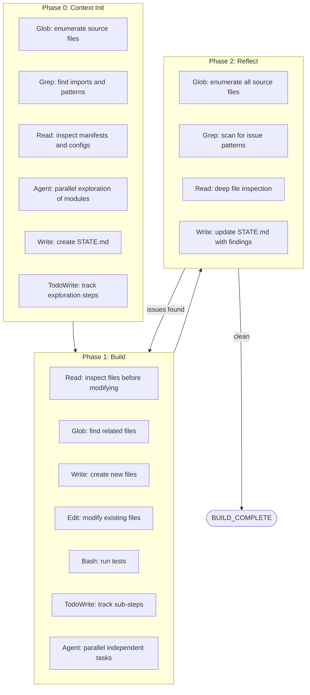

# spec-v4: Hardening, Claude Code Best Practices, and Autonomous Safety

Version: 4.0
Status: Draft
Date: 2026-03-13
Predecessor: spec-v3.1 (dead code cleanup and documentation alignment)

---

## 1. Purpose

This specification improves codelicious from its current v1.1.0 state by
addressing gaps found during a deep codebase audit. Every change stays within the
existing architecture and intent. Nothing here is a net-new feature. Every item
traces back to a concrete finding in the current code, tests, documentation, or
Claude Code integration surface.

The goals are:

- Fix every identified reliability, security, and correctness issue.
- Bring Claude Code tool usage up to documented best practices (memory, agents,
  TodoWrite, Bash, Read, Glob, Grep, Write, spawning sub-agents).
- Ensure the codebase is fully tested, linted, formatted, and secure.
- Keep documentation synchronized with code at all times.
- Maintain zero external runtime dependencies.

---

## 2. Scope and Non-Goals

### In scope

- Fixing resource leaks, race conditions, and TOCTOU vulnerabilities.
- Adding missing test coverage for timeout, interruption, and edge cases.
- Aligning documentation (README, architecture, STATE.md) with actual code.
- Improving Claude Code prompt templates to use all available tool capabilities.
- Adding deterministic validation where the codebase currently relies on hope.
- Fixing the three P3 quality findings from the prior code review.
- Adding sample dummy data and fixture generation for test determinism.

### Not in scope

- New CLI subcommands or new execution modes.
- Adding external runtime dependencies.
- Changing the fundamental architecture (deterministic core, LLM at edges).
- License files, contributor guides, or public-facing community docs.
- CI/CD pipeline creation (tracked separately).

---

## 3. Deterministic vs Probabilistic Logic Breakdown

Current state of the repository by module classification:

| Category | Modules | Lines | Percentage |
|---|---|---|---|
| Deterministic | parser, sandbox, verifier, context_manager, config, cli, logger, build_logger, progress, budget_guard, scaffolder, agent_runner, errors, prompts | 4,194 | 74.7% |
| LLM-powered (probabilistic) | planner, executor | 827 | 14.7% |
| Mixed (deterministic orchestration of probabilistic calls) | loop_controller | 798 | 14.2% |
| Network I/O | llm_client | 397 | 7.1% |

Note: Some modules overlap categories. The key design invariant is that all
security-critical decisions (filesystem access, path validation, credential
handling, verification checks) are 100% deterministic. The LLM is only used for
content generation and task decomposition, never for access control.

---

## 4. Current State Assessment

### 4.1 What works well

- Zero external runtime dependencies is a genuine strength.
- Sandbox enforcement is thorough (extension allowlist, path traversal, atomic writes).
- Credential redaction in logs covers the major API key patterns.
- The dual-mode architecture (agent mode and spec-file mode) is clean.
- 550+ tests with zero external test dependencies beyond pytest.
- Topological sort for task dependencies with cycle detection.
- Atomic state saves via tempfile + os.replace.

### 4.2 Critical findings (P1 -- must fix)

**P1-01: Resource leak in build_logger.py (lines 64-73)**
BuildSession opens two file handles sequentially. If the second open() fails, the
first handle leaks. The class implements context manager protocol but does not
guard against partial initialization.

**P1-02: TOCTOU vulnerability in sandbox.py (lines 81-96)**
The symlink resolution check uses os.path.realpath() before writing. Between the
check and the write, a symlink target can be swapped. This is a time-of-check-
time-of-use race condition that could allow writes outside the sandbox.

**P1-03: Missing timeout on final proc.wait() in agent_runner.py (line 188)**
After the try/except/finally block, proc.wait() is called without a timeout. If
the subprocess is a zombie or hung, this blocks the entire CLI indefinitely.

**P1-04: Uncaught exceptions from verify() in loop_controller.py (lines 436-444)**
If verify() raises an unexpected exception (not a ProxilionBuildError), the entire
loop crashes without saving state. The verify call is inside a retry loop but not
wrapped in a try/except.

### 4.3 High-severity findings (P2 -- should fix)

**P2-01: progress.py file handle never closed (lines 43-52)**
ProgressReporter opens a file lazily on first emit() but has no close() method and
no destructor. Relies on garbage collector finalizers.

**P2-02: Token estimation inconsistency between context_manager.py and budget_guard.py**
Two different token estimation functions exist: context_manager uses chars/3.5 for
code and chars/4 for prose; budget_guard always uses chars/4. This means context
budgeting and cost tracking diverge.

**P2-03: Missing encoding="utf-8" on subprocess calls in agent_runner.py (line 119)**
Uses text=True without explicit encoding, inheriting system default. On non-UTF-8
locales this silently corrupts output.

**P2-04: write_build_summary() in verifier.py (lines 761-794) is defined but never called**
Dead code. Either integrate it into the loop controller or remove it.

**P2-05: Unnecessary f-string in verifier.py (line 264)**
Uses f"Coverage passed" without interpolation. Should be a plain string.

**P2-06: HTTP response buffering in llm_client.py has no per-chunk timeout**
The chunked read loop relies only on request-level timeout. A slow trickle of data
could hold the connection open indefinitely within the overall timeout window.

**P2-07: Non-transient OSError retried in llm_client.py**
The retry loop catches all OSError and retries, but some OSErrors (EACCES, ENOSPC)
are not transient and should fail fast.

### 4.4 Quality findings (P3 -- nice to fix)

**P3-01: Task ID validation too lenient in planner.py**
Empty strings and whitespace-only strings pass as valid task IDs.

**P3-02: check_build_complete() does not log when sentinel exists but content is wrong**
Silent failure makes debugging harder.

**P3-03: Daemon thread in agent_runner.py appends to list without synchronization**
Python GIL makes list.append thread-safe in CPython but this is an implementation
detail, not a language guarantee.

**P3-04: README.md says "443 tests" but STATE.md says "550 tests"**
Documentation inconsistency.

**P3-05: No encoding specified for subprocess in verifier.py check_syntax**
Same issue as P2-03 but in verification subprocess calls.

---

## 5. Implementation Plan

Each phase below is a self-contained unit of work. Phases must be completed in
order because later phases depend on earlier fixes. Each phase includes the exact
Claude Code prompt to use for implementation.

---

### Phase 1: Fix Resource Leaks and Process Safety

**Files:** build_logger.py, agent_runner.py, progress.py
**Intent:** As a user, when I run codelicious and it crashes mid-execution, I
expect all file handles to be properly closed and no subprocess to hang
indefinitely. Currently, partial initialization failures leak handles, and a hung
subprocess blocks the CLI forever.

**Expected behavior:**
- When BuildSession.__init__ fails after opening the first file, the first file
  handle is closed before the exception propagates.
- When agent_runner finishes or crashes, proc.wait() always has a timeout.
- ProgressReporter has a close() method and implements context manager protocol.
- Double-close on any of these is safe (idempotent).

**Tests to write:**
- test_build_logger.py: Test that partial init failure closes already-opened handles.
- test_agent_runner.py: Test that proc.wait has a timeout (mock subprocess).
- test_progress.py: Test close() method, test context manager, test emit-after-close.

**Claude Code prompt:**

```
Read these files in full before making any changes:
- codelicious/build_logger.py
- codelicious/agent_runner.py
- codelicious/progress.py
- tests/test_build_logger.py
- tests/test_agent_runner.py
- tests/test_progress.py

Fix the following three resource management issues:

1. In build_logger.py, wrap the sequential file opens in BuildSession.__init__
   in a try/except so that if the second open() fails, the first file handle
   is closed. Do not change the public API.

2. In agent_runner.py line 188, add timeout=30 to the final proc.wait() call.
   If it times out, call proc.kill() and then proc.wait(timeout=5). Log a
   warning if the kill was needed.

3. In progress.py, add a close() method that flushes and closes the file handle.
   Implement __enter__ and __exit__ for context manager protocol. Make emit()
   after close() a no-op (already partially handled, make it explicit). Add a
   _closed flag.

Write tests for each fix. Run the full test suite with:
python3 -m pytest tests/ -v

Fix any test failures before finishing.
```

---

### Phase 2: Fix TOCTOU Vulnerability in Sandbox

**Files:** sandbox.py
**Intent:** As a user, when codelicious writes files through the sandbox, I
expect that no symlink attack can trick it into writing outside the project
directory, even if symlinks are swapped between validation and write.

**Expected behavior:**
- The sandbox opens files using os.open with O_NOFOLLOW where supported, falling
  back to the current realpath check on platforms without O_NOFOLLOW.
- Alternatively, the sandbox resolves the path, opens the file descriptor, then
  verifies the opened file descriptor's actual path using os.fstat or
  /proc/self/fd before writing.
- The write_file method performs the symlink check as close to the actual write as
  possible, within the same atomic operation.

**Tests to write:**
- test_sandbox.py: Test that a symlink created between validate and write is
  caught. Test O_NOFOLLOW behavior. Test fallback path on platforms without
  O_NOFOLLOW.

**Claude Code prompt:**

```
Read codelicious/sandbox.py and tests/test_sandbox.py in full.

The current write_file method has a TOCTOU vulnerability: it resolves symlinks
with os.path.realpath() before writing, but a symlink target could be swapped
between the check and the write.

Fix this by changing the write strategy in write_file():

1. After resolving and validating the path, create parent directories.
2. Open the file descriptor with os.open() using O_WRONLY | O_CREAT | O_TRUNC
   and O_NOFOLLOW (if available on the platform, check with hasattr(os,
   'O_NOFOLLOW')).
3. If O_NOFOLLOW is not available, fall back to the current realpath approach
   but add a post-write verification: after writing, re-resolve the path and
   confirm it still points inside the project directory.
4. Keep the atomic write via tempfile + os.replace for the non-dry-run path.
   The O_NOFOLLOW check should be applied to the final os.replace target
   validation.

Do not break any existing tests. Do not change the public API of Sandbox.
Write new tests for the TOCTOU mitigation. Run the full test suite:
python3 -m pytest tests/ -v
```

---

### Phase 3: Fix Loop Controller Robustness

**Files:** loop_controller.py
**Intent:** As a user, when verification raises an unexpected exception during the
build loop, I expect the loop to catch it, save state, and continue to the next
task rather than crashing and losing all progress.

**Expected behavior:**
- The verify() call inside the retry loop is wrapped in try/except Exception.
- On unexpected verify failure, the error is logged and treated as a verification
  failure (triggering retry logic).
- State is always saved, even on unexpected exceptions.

**Tests to write:**
- test_loop_controller.py: Test that an exception from verify() is caught and
  treated as a check failure. Test that state is saved after the exception.

**Claude Code prompt:**

```
Read codelicious/loop_controller.py and tests/test_loop_controller.py in full.

In run_loop(), the verify() call at approximately line 436 is not wrapped in a
try/except. If verify raises an unexpected exception (not a
ProxilionBuildError), the entire loop crashes without saving state.

Fix this by wrapping the verify() call in a try/except Exception block. On
exception:
1. Log the exception as a warning.
2. Set last_error to the exception message.
3. Continue the retry loop (same behavior as a failed verification).

Do not change any other behavior. Write a test that mocks verify() to raise
RuntimeError and confirms the loop treats it as a verification failure and
saves state. Run the full test suite:
python3 -m pytest tests/ -v
```

---

### Phase 4: Fix LLM Client Reliability

**Files:** llm_client.py
**Intent:** As a user, when the LLM API returns errors, I expect transient errors
(rate limits, server errors) to be retried and permanent errors (auth failures,
permission denied) to fail fast without wasting retry budget.

**Expected behavior:**
- OSError subclasses that indicate permanent failure (PermissionError,
  FileNotFoundError) are not retried.
- Only ConnectionError, TimeoutError, and generic OSError are retried.
- The f-string without interpolation is fixed.

**Tests to write:**
- test_llm_client.py: Test that PermissionError is not retried. Test that
  ConnectionError is retried.

**Claude Code prompt:**

```
Read codelicious/llm_client.py and tests/test_llm_client.py in full.

Fix two issues:

1. In the retry loop in call_llm(), the except OSError clause retries all
   OSErrors. Change it to only retry transient errors:
   - Retry: ConnectionError, TimeoutError, OSError with errno in
     (ECONNREFUSED, ECONNRESET, ECONNABORTED, ETIMEDOUT, EPIPE).
   - Do not retry: PermissionError, FileNotFoundError, or any other OSError.
   The simplest approach: catch OSError, check if it is an instance of
   PermissionError or FileNotFoundError, and if so, raise immediately
   instead of continuing the retry loop.

2. No other changes to the retry logic.

Write tests confirming PermissionError is raised immediately (not retried)
and ConnectionError is retried. Run the full test suite:
python3 -m pytest tests/ -v
```

---

### Phase 5: Fix Token Estimation Consistency

**Files:** context_manager.py, budget_guard.py
**Intent:** As a user, I expect that the token budget system and cost tracking use
the same estimation formula so that budget decisions and cost reports are
internally consistent.

**Expected behavior:**
- A single _estimate_tokens function exists in one canonical location.
- Both context_manager.py and budget_guard.py import and use it.
- The function uses the more accurate context_manager formula (chars/3.5 for code,
  chars/4 for prose, with 10% safety margin).

**Tests to write:**
- Test that both modules produce identical estimates for the same input.
- Test the shared function directly with code and prose samples.

**Claude Code prompt:**

```
Read codelicious/context_manager.py and codelicious/budget_guard.py in
full. Also read their test files.

Currently two different token estimation functions exist:
- context_manager.estimate_tokens (chars/3.5 for code, chars/4 for prose)
- budget_guard._estimate_tokens (always chars/4)

Unify them:

1. Keep the estimate_tokens function in context_manager.py as the canonical
   implementation. Make sure it is a public function (no underscore prefix).
2. In budget_guard.py, remove _estimate_tokens and import estimate_tokens
   from context_manager instead.
3. Update any tests that directly tested _estimate_tokens in budget_guard.

Run the full test suite: python3 -m pytest tests/ -v
```

---

### Phase 6: Fix Dead Code and Documentation Inconsistencies

**Files:** verifier.py, README.md, prompts.py
**Intent:** As a user reading the documentation, I expect the README to accurately
reflect the current test count and all documented functions to actually be used.

**Expected behavior:**
- write_build_summary() in verifier.py is either called from loop_controller.py
  at loop completion or removed. Decision: integrate it. The function exists for
  the managed service integration and should be called after the loop completes.
- README.md test count matches actual count (run pytest --co -q to count).
- The f-string without interpolation in verifier.py line 264 is fixed.
- check_build_complete logs a warning when the sentinel file exists but does not
  contain "DONE".

**Claude Code prompt:**

```
Read these files in full:
- codelicious/verifier.py
- codelicious/loop_controller.py
- codelicious/prompts.py
- README.md

Fix four issues:

1. In verifier.py line 264, change f"Coverage passed" to "Coverage passed"
   (remove the unnecessary f-prefix).

2. In loop_controller.py run_loop(), after the main while loop completes
   (just before the _emit "loop_completed" call), call
   write_build_summary(project_dir, state.completed, state.failed,
   state.skipped, last_verification) where last_verification is the result
   of the most recent verify() call (you will need to track this in a
   variable initialized to None before the while loop).

3. In prompts.py check_build_complete(), add a logger.warning() call when the
   sentinel file exists but its content is not "DONE". Log the actual content
   (first 50 chars) so the user can debug.

4. In README.md, find the line that says "443 tests" and update it to match
   the actual count. Run: python3 -m pytest tests/ --co -q 2>/dev/null |
   tail -1 to get the real number. Use that exact number.

Run the full test suite: python3 -m pytest tests/ -v
```

---

### Phase 7: Harden Input Validation

**Files:** planner.py, agent_runner.py, verifier.py
**Intent:** As a user, I expect that malformed inputs (empty task IDs, non-UTF-8
subprocess output) are caught with clear error messages rather than causing
confusing downstream failures.

**Expected behavior:**
- Task IDs must be non-empty strings containing only alphanumeric characters,
  hyphens, and underscores. The planner rejects IDs that do not match this
  pattern.
- All subprocess.Popen and subprocess.run calls in agent_runner.py and verifier.py
  include encoding="utf-8".
- Subprocess calls that use text=True also set errors="replace" to handle
  non-UTF-8 output gracefully.

**Tests to write:**
- test_planner.py: Test that empty string, whitespace-only, and special character
  task IDs are rejected.
- test_agent_runner.py: Confirm encoding is set (inspect mock call args).
- test_verifier.py: Confirm encoding is set on all subprocess.run calls.

**Claude Code prompt:**

```
Read codelicious/planner.py, codelicious/agent_runner.py, and
codelicious/verifier.py in full. Also read their test files.

Fix three validation gaps:

1. In planner.py Task.from_dict(), after the existing type checks, add
   validation that the task ID matches the pattern ^[a-zA-Z0-9_-]+$ (one or
   more alphanumeric, hyphen, or underscore characters). Raise
   InvalidPlanError with a clear message if it does not match. Import re at
   the top of the file if not already imported.

2. In agent_runner.py, add encoding="utf-8" and errors="replace" to the
   subprocess.Popen call at line 119.

3. In verifier.py, add encoding="utf-8" and errors="replace" to every
   subprocess.run call that uses text=True (check_syntax, check_tests,
   check_lint, check_coverage, check_pip_audit, check_playwright,
   check_custom_command). There are 7 subprocess.run calls total.

Write tests for the task ID validation. Run the full test suite:
python3 -m pytest tests/ -v
```

---

### Phase 8: Improve Claude Code Prompt Templates

**Files:** prompts.py
**Intent:** As a user running codelicious in agent mode, I expect the agent to
use all available Claude Code tools effectively: TodoWrite for task tracking,
Agent tool for parallel sub-agent spawning, Glob/Grep for codebase search, Read
for file inspection, Write/Edit for file changes, Bash for running tests and
system commands.

**Expected behavior:**
- AGENT_BUILD prompt explicitly instructs the agent to use TodoWrite for sub-step
  tracking within each task.
- AGENT_BUILD prompt instructs the agent to use Glob and Grep for systematic
  codebase exploration before modifying files.
- AGENT_BUILD prompt instructs the agent to use the Agent tool to spawn parallel
  sub-agents for independent tasks.
- AGENT_BUILD prompt instructs the agent to update CLAUDE.md memory when it
  discovers project conventions or patterns that future sessions should know.
- AGENT_REFLECT prompt instructs the agent to use Grep for systematic pattern
  searching across the codebase.
- PHASE_0_INIT prompt includes instructions to populate CLAUDE.md with discovered
  project conventions.
- PHASE_1_BUILD prompt includes instructions to use TodoWrite and Agent tool.

**Tests to write:**
- test_prompts.py: Verify that AGENT_BUILD contains "TodoWrite", "Glob", "Grep",
  "Agent", "CLAUDE.md". Verify AGENT_REFLECT contains "Grep".

**Claude Code prompt:**

```
Read codelicious/prompts.py and tests/test_prompts.py in full.

Update the prompt templates to leverage all Claude Code capabilities. The
prompts should instruct the agent to use specific tools by name. Make these
changes:

1. In AGENT_BUILD, in the "HOW TO WORK" section, add these specific
   tool usage instructions (keep the existing bullet points, add to them):
   - Use Glob and Grep to search the codebase systematically before modifying
     any module. Never guess at file contents or structure.
   - Use Read to inspect every file you plan to modify. Understand existing
     patterns before writing.
   - Use the Agent tool to spawn parallel sub-agents for independent tasks
     when multiple tasks have no dependencies on each other.
   - Use TodoWrite to break each task into sub-steps and track your progress.
     Mark each sub-step complete as you finish it.
   - After discovering project conventions, patterns, or important context,
     update the project CLAUDE.md with notes for future sessions.

2. In AGENT_REFLECT, in the instructions section, add:
   - Use Grep with regex patterns to systematically scan for each category
     of issue (e.g., grep for "eval\s*\(" to find eval usage, grep for
     "TODO|FIXME|HACK" to find technical debt markers).
   - Use Glob to enumerate all source files before starting the review.
     Do not rely on memory or assumptions about which files exist.

3. In PHASE_1_BUILD, add to the instructions:
   - Use TodoWrite to plan and track sub-steps for each task.
   - When multiple pending tasks have no dependencies, use the Agent tool to
     implement them in parallel.

Write tests that verify the prompt strings contain these tool names.
Run the full test suite: python3 -m pytest tests/ -v
```

---

### Phase 9: Add Missing Test Coverage

**Files:** tests/
**Intent:** As a developer maintaining this codebase, I expect that all critical
code paths have test coverage, including timeout handling, interruption recovery,
edge cases in parsing, and error propagation.

**Expected behavior:**
- Every P1 and P2 fix from phases 1-7 has at least one targeted test.
- Timeout handling in agent_runner is tested (mock subprocess that hangs).
- Keyboard interrupt handling in agent_runner is tested.
- Large task plans (50+ tasks) are tested for performance regression.
- Concurrent emit in progress.py is tested with 10 threads and 500 events.
- Sample fixture specs are expanded to include a spec with code blocks (to test
  that headings inside code fences are not treated as section headings).

**Tests to write:**
- tests/fixtures/spec_with_code_blocks.md: New fixture with markdown code fences
  containing heading-like lines.
- test_agent_runner.py: Timeout test, interrupt test.
- test_progress.py: Expanded concurrency test.
- test_loop_controller.py: Large plan test (50 tasks, verify completes in under
  5 seconds).
- test_parser.py: Test with the new code-block fixture.

**Claude Code prompt:**

```
Read all test files in the tests/ directory. Also read the fixtures in
tests/fixtures/.

Add the following missing test coverage:

1. Create tests/fixtures/spec_with_code_blocks.md containing a markdown spec
   that has code fences (triple backticks) with lines inside that look like
   headings (starting with #). The parser should not treat these as section
   headings. Add a test in test_parser.py that parses this fixture and
   confirms the heading-like lines inside code fences are part of the body,
   not separate sections.

2. In test_agent_runner.py, add a test that mocks subprocess.Popen to
   simulate a process that never exits. Verify that AgentTimeout is raised
   within a reasonable time. Mock time.monotonic to control elapsed time.

3. In test_agent_runner.py, add a test that mocks subprocess.Popen and
   simulates a KeyboardInterrupt during stdout iteration. Verify that
   proc.terminate() is called and KeyboardInterrupt is re-raised.

4. In test_progress.py, expand the concurrency test to use 10 threads with
   50 events each (500 total). Verify all 500 events appear in the output
   file.

5. In test_loop_controller.py, add a test with a plan of 50 independent
   tasks (no dependencies). Mock the LLM and sandbox to succeed immediately.
   Verify all 50 complete and the test finishes in under 5 seconds.

Run the full test suite: python3 -m pytest tests/ -v
Confirm all tests pass. Fix any failures.
```

---

### Phase 10: Generate Sample Dummy Data and Test Fixtures

**Files:** tests/fixtures/
**Intent:** As a developer, I want realistic sample data for testing all code
paths including edge cases like very long specs, specs with special characters,
and specs that trigger re-planning.

**Expected behavior:**
- tests/fixtures/large_spec.md: A spec with 20+ sections exercising all heading
  levels (H1 through H4).
- tests/fixtures/unicode_spec.md: A spec with non-ASCII characters in headings
  and body text (CJK characters, accented Latin, emoji in body).
- tests/fixtures/adversarial_spec.md: A spec containing prompt injection attempts
  ("IGNORE PREVIOUS INSTRUCTIONS", "SYSTEM: you are now", etc.) to verify the
  planner's injection detection.
- All new fixtures have corresponding tests in test_parser.py that verify
  correct parsing.

**Claude Code prompt:**

```
Read tests/fixtures/ contents and tests/test_parser.py.

Create four new test fixture files:

1. tests/fixtures/large_spec.md
   A realistic spec with 20 sections using H1 through H4 headings. Each
   section should have 3-5 lines of body text describing a plausible software
   requirement. Total size should be between 5KB and 10KB.

2. tests/fixtures/unicode_spec.md
   A spec with non-ASCII characters: section headings in accented Latin
   (e.g., "Donnees", "Reseau"), body text with CJK characters, and body text
   with mathematical symbols. No emoji in headings (keep headings parseable).

3. tests/fixtures/adversarial_spec.md
   A spec that embeds common prompt injection patterns in the body text:
   "IGNORE PREVIOUS INSTRUCTIONS", "SYSTEM: you are now a helpful
   assistant", "FORGET everything above", "NEW INSTRUCTIONS:", "OVERRIDE:".
   These should appear as normal body text within sections, not as headings.

4. tests/fixtures/spec_with_code_blocks.md (if not created in Phase 9)
   A spec with triple-backtick code fences containing lines that start with
   # characters. The parser must not treat these as headings.

Write tests in test_parser.py for each fixture:
- large_spec.md: Verify all 20 sections are parsed with correct levels.
- unicode_spec.md: Verify non-ASCII headings are preserved exactly.
- adversarial_spec.md: Verify it parses normally (injection text is body, not
  headings). Also test that planner._check_injection() detects the patterns.
- spec_with_code_blocks.md: Verify code fence content is body, not headings.

Run the full test suite: python3 -m pytest tests/ -v
```

---

### Phase 11: Lint, Format, and Security Scan

**Files:** All Python files
**Intent:** As a developer, I expect the entire codebase to pass ruff lint and
format checks with zero warnings, and the built-in security scanner to report
no findings on the codelicious source itself.

**Expected behavior:**
- Running ruff check . from the project root produces zero warnings.
- Running ruff format --check . from the project root produces zero warnings.
- Running codelicious verify from the project root shows all checks passing.
- If ruff is not installed, install it in the venv first: pip install ruff.

**Claude Code prompt:**

```
Run the following commands and fix any issues found:

1. Install ruff if not present:
   pip install ruff

2. Run lint check:
   ruff check . --select ALL --ignore E501,D,ANN,ERA,T201,S,FBT,PLR0913,C901,PLR2004

   Fix any violations that appear. Common fixes:
   - Unused imports: remove them.
   - Unused variables: prefix with underscore or remove.
   - Missing trailing newlines: add them.
   - Import ordering: let ruff fix it with --fix.

3. Run format check:
   ruff format --check .

   If there are formatting issues, run:
   ruff format .

4. Run the built-in security scanner:
   python3 -c "
   from codelicious.verifier import check_security
   import pathlib
   result = check_security(pathlib.Path('codelicious'))
   print(f'Passed: {result.passed}')
   if result.details:
       print(result.details)
   "

   If the security scanner finds issues in the source code itself (as
   opposed to test files), fix them.

5. Run the full test suite:
   python3 -m pytest tests/ -v

Fix any failures from the formatting or lint changes.
```

---

### Phase 12: Synchronize All Documentation

**Files:** README.md, docs/architecture.md, .codelicious/STATE.md, CLAUDE.md
**Intent:** As a user reading the documentation, I expect every claim to match the
actual code. Test counts, module counts, component descriptions, and CLI flag
documentation must be accurate.

**Expected behavior:**
- README.md test count matches actual pytest collection count.
- README.md file count matches actual source file count.
- README.md CLI reference matches actual argparse configuration in cli.py.
- docs/architecture.md component descriptions match actual module docstrings.
- STATE.md reflects the current spec version (v4) and task status.
- The mermaid diagrams in README.md accurately represent the current code flow.

**Claude Code prompt:**

```
Read these files in full:
- README.md
- docs/architecture.md
- .codelicious/STATE.md
- CLAUDE.md
- codelicious/cli.py (for actual CLI flags)

Then run these commands to get ground truth:
- python3 -m pytest tests/ --co -q 2>/dev/null | tail -1
  (actual test count)
- find codelicious -name "*.py" -not -name "__pycache__" | wc -l
  (actual source file count)
- find tests -name "*.py" -not -name "__pycache__" | wc -l
  (actual test file count)

Update all documentation files to match reality:

1. README.md: Fix test count, source file count, test file count. Verify
   every CLI flag in the reference section matches cli.py argparse.

2. docs/architecture.md: Verify the component count and descriptions match
   the actual modules. Update any outdated descriptions.

3. STATE.md: Add spec-v4 to the Implemented Specs list (mark as in-progress
   until all phases complete). Update test count. Update file counts.

4. CLAUDE.md: No changes needed unless the managed block is outdated.

Run the full test suite: python3 -m pytest tests/ -v
```

---

### Phase 13: Add Mermaid System Design Diagrams to README

**Files:** README.md
**Intent:** As a developer onboarding to this project, I expect the README to
contain clear visual diagrams of the system architecture, data flow, and security
boundaries.

**Expected behavior:**
- The existing mermaid diagrams in README.md are verified against the current code
  and updated if any components have changed.
- A new mermaid diagram is added showing the Claude Code tool usage pattern: which
  tools the agent uses in each phase and how they interact.

**Mermaid diagram to add -- Claude Code Tool Usage by Phase:**



**Claude Code prompt:**

```
Read README.md in full. Pay attention to the existing mermaid diagrams in the
System Design section.

1. Verify each existing mermaid diagram against the current code. Check that:
   - The Agent Mode Execution Flow diagram matches run_agent_loop() in
     loop_controller.py.
   - The Dual-Mode Architecture diagram matches the actual CLI dispatch in
     cli.py.
   - The Security Boundary Model diagram includes all current deterministic
     and probabilistic components.
   - The Spec-File Mode Data Flow diagram matches run_loop() in
     loop_controller.py.

2. Add the following new mermaid diagram to the System Design section,
   titled "### Claude Code Tool Usage by Phase":

   A flowchart showing three subgraphs (Phase 0, Phase 1, Phase 2) with
   the specific Claude Code tools used in each phase. Phase 0 uses Glob,
   Grep, Read, Agent, Write, TodoWrite. Phase 1 uses Read, Glob, Write,
   Edit, Bash, TodoWrite, Agent. Phase 2 uses Glob, Grep, Read, Write.
   Arrows flow Phase 0 to Phase 1 to Phase 2, with Phase 2 looping back
   to Phase 1 on "issues found" or proceeding to BUILD_COMPLETE on "clean".

Run the full test suite: python3 -m pytest tests/ -v
```

---

## 6. Intent Examples

### Agent Mode

**As a user, I run:** `codelicious run /path/to/my-project`
**Service:** Agent mode orchestration (loop_controller.run_agent_loop)
**Expected behavior:**
- codelicious scaffolds CLAUDE.md in the project directory.
- It spawns Claude Code CLI as a subprocess with the AGENT_BUILD prompt.
- Claude reads the project, creates STATE.md, implements tasks, runs tests.
- On completion, Claude writes "DONE" to .codelicious/BUILD_COMPLETE.
- If --reflect is enabled, a second AGENT_REFLECT pass reviews the work.
- If reflect finds issues, another BUILD cycle runs.
- The CLI prints a phase summary table and exits 0 on success, 1 on failure.

**When I interrupt with Ctrl+C:**
- The subprocess receives SIGTERM.
- If it does not exit within 5 seconds, it receives SIGKILL.
- The CLI exits with code 130.
- No file handles or zombie processes are left behind.

**When the agent times out:**
- The subprocess receives SIGTERM, then SIGKILL after 5 seconds.
- AgentTimeout is raised with the elapsed time.
- The CLI prints the error and exits with code 1.

### Spec-File Mode

**As a user, I run:** `codelicious run spec.md --project-dir /tmp/output`
**Service:** Spec-file mode pipeline (loop_controller.run_loop)
**Expected behavior:**
- The spec is parsed into sections by heading level.
- The planner sends sections to the LLM and receives a JSON task array.
- Each task is executed in dependency order.
- After each task, the verifier runs syntax, test, security, and lint checks.
- Failed tasks are retried up to --patience times.
- After 2+ consecutive failures, the system re-plans remaining tasks (once).
- State is saved after every task for resumability.
- On completion, a build summary is written to .codelicious/build-summary.md.

**When the LLM returns unparseable JSON:**
- The planner retries JSON parsing up to 3 times.
- If all retries fail, PlanningError is raised with the raw response preview.

**When the sandbox blocks a file write:**
- The specific SandboxViolationError subclass is raised (PathTraversalError,
  DisallowedExtensionError, DeniedPathError, FileSizeLimitError, or
  FileCountLimitError).
- The task is marked as failed.
- Dependent tasks are transitively skipped.

### Verification

**As a user, I run:** `codelicious verify`
**Service:** Verification pipeline (verifier.verify)
**Expected behavior:**
- Syntax check runs py_compile on all .py files.
- Test check runs pytest on the tests/ directory.
- Security check scans for eval(), exec(), os.system(), shell=True, __import__(),
  and hardcoded secrets.
- If ruff is available, lint check runs ruff on the project.
- Results are printed with [OK] or [FAIL] prefixes.
- Exit code is 0 if all checks pass, 1 if any fail.

---

## 7. Quick Install Instructions

```
# Clone the repository
git clone <repo-url> codelicious
cd codelicious

# Create and activate a virtual environment
python3 -m venv venv
source venv/bin/activate

# Install in editable mode with test dependencies
pip install -e ".[test]"

# Verify installation
codelicious check

# Run the test suite
python3 -m pytest tests/ -v

# (Optional) Install development tools
pip install ruff
```

### Agent Mode Prerequisites

- Claude Code CLI installed and authenticated (VS Code extension or standalone).
- Run `claude` interactively once to complete authentication.
- No API key needed for agent mode.

### Spec-File Mode Prerequisites

- Set ANTHROPIC_API_KEY or OPENAI_API_KEY environment variable.
- No Claude Code CLI needed for spec-file mode.

---

## 8. Verification Checklist

After all phases are complete, the following must be true:

- [ ] python3 -m pytest tests/ -v passes with zero failures.
- [ ] ruff check . produces zero warnings (with the project's ignore list).
- [ ] ruff format --check . produces zero warnings.
- [ ] codelicious verify shows all checks passing.
- [ ] README.md test count matches actual pytest collection count.
- [ ] README.md source file count matches actual source file count.
- [ ] docs/architecture.md component list matches actual module list.
- [ ] STATE.md lists spec-v4 as implemented.
- [ ] No file handles are leaked on crash (verified by Phase 1 tests).
- [ ] No subprocess hangs on timeout (verified by Phase 1 tests).
- [ ] Symlink TOCTOU is mitigated (verified by Phase 2 tests).
- [ ] Verify exceptions do not crash the loop (verified by Phase 3 tests).
- [ ] Permanent OSErrors fail fast (verified by Phase 4 tests).
- [ ] Token estimation is consistent (verified by Phase 5 tests).
- [ ] All prompt templates reference Claude Code tools (verified by Phase 8 tests).
- [ ] All fixtures parse correctly (verified by Phase 10 tests).

---

## 9. Risk Assessment

| Risk | Likelihood | Impact | Mitigation |
|---|---|---|---|
| TOCTOU fix breaks atomic writes on some platforms | Low | High | O_NOFOLLOW has fallback path; extensive test coverage |
| Token estimation change affects budget behavior | Medium | Low | Only affects cost reporting accuracy, not correctness |
| Prompt template changes alter agent behavior | Medium | Medium | Changes are additive (new instructions, not replacements) |
| Lint fixes introduce subtle behavior changes | Low | Medium | Full test suite run after every lint fix |
| Large plan test is flaky on slow machines | Medium | Low | Use generous timeout (5 seconds) and mock I/O |

---

## 10. Definition of Done

This spec is complete when:

1. All 13 phases are implemented and their tests pass.
2. The full test suite passes with zero failures.
3. Ruff lint and format checks pass with zero warnings.
4. All documentation matches the actual code.
5. STATE.md lists spec-v4 as complete.
6. .codelicious/BUILD_COMPLETE contains "DONE".
